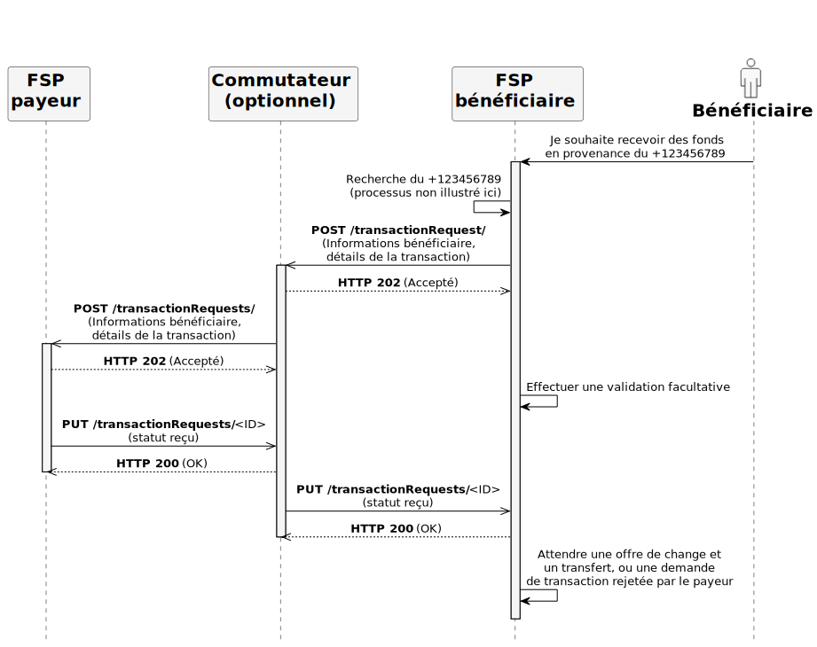

# Service des demandes de transaction

## Diagramme de séquence

* Le **transaction-requests-service** est un service cœur Mojaloop qui permet les cas d’usage initiés par le bénéficiaire, tels que la « demande de paiement marchande » (*Merchant Request to Pay*).
* Il s’agit d’un service de relais qui inclut également les **autorisations**.
