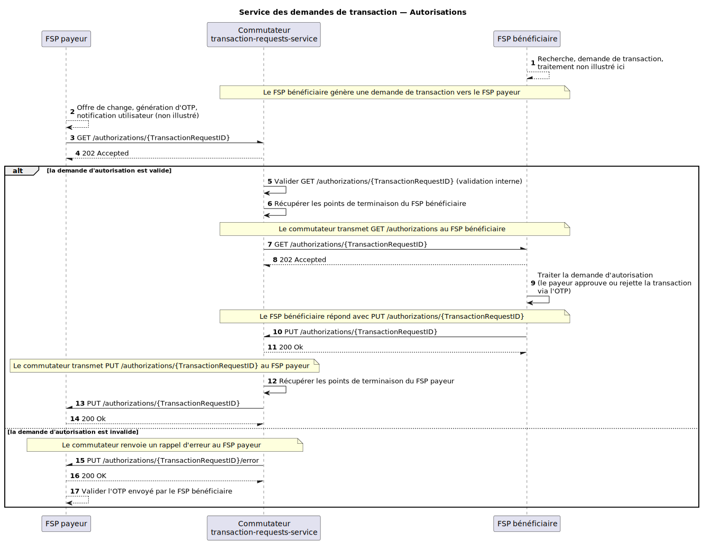

# Demandes de transaction — Autorisations

GET /authorizations/{TransactionRequestID} et PUT /authorizations/{TransactionRequestID} pour prendre en charge les autorisations dans le cadre de la « demande de paiement marchande » (*Merchant Request to Pay*) et d'autres cas d'usage initiés par le bénéficiaire.

## Diagramme de séquence

