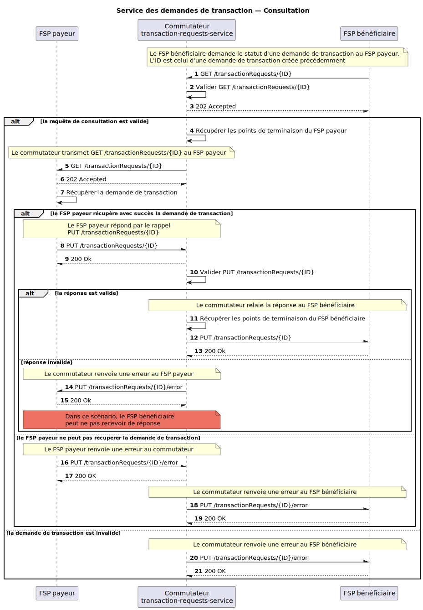

# Demandes de transaction — Consultation

GET /transactionRequests et PUT /transactionRequests pour prendre en charge la « demande de paiement marchande » (*Merchant Request to Pay*).

## Diagramme de séquence

