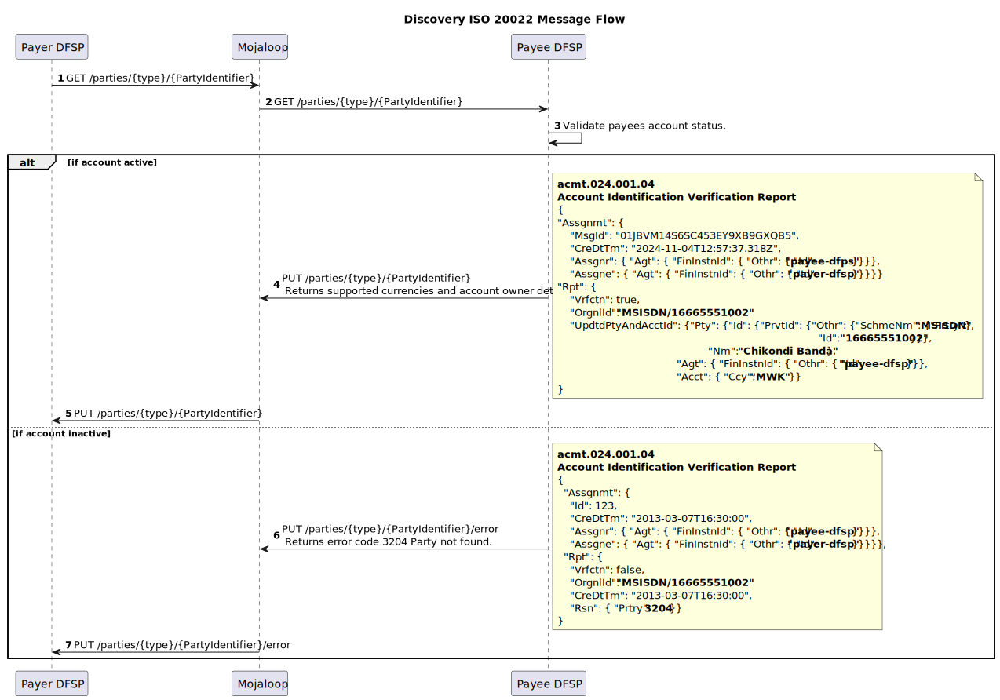
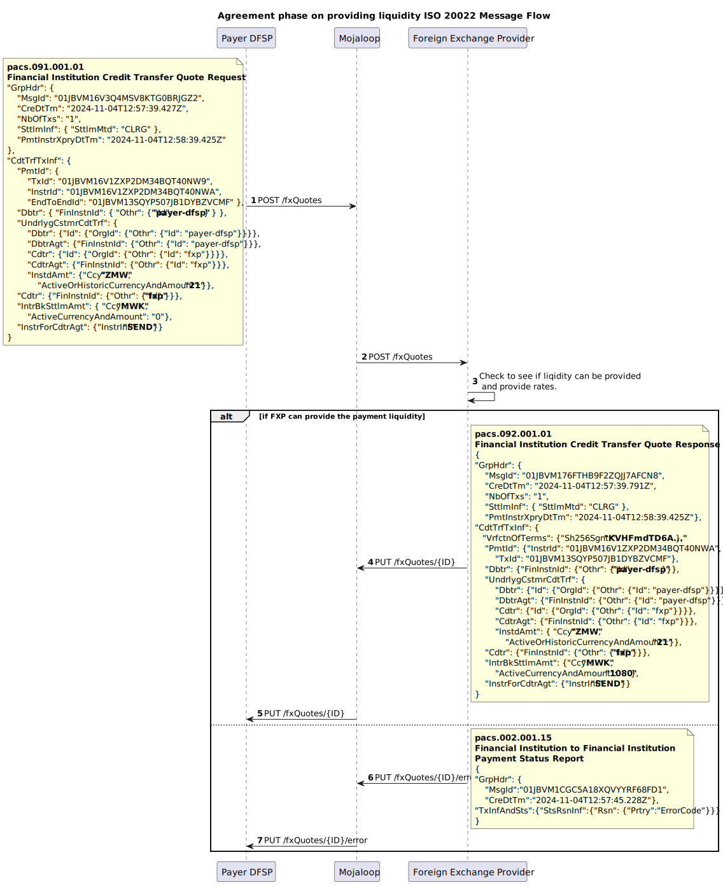
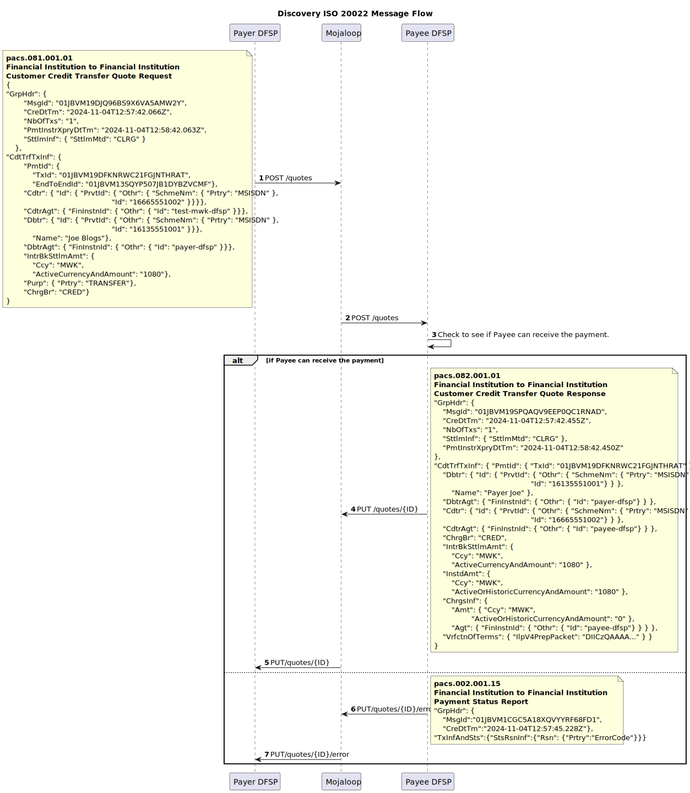
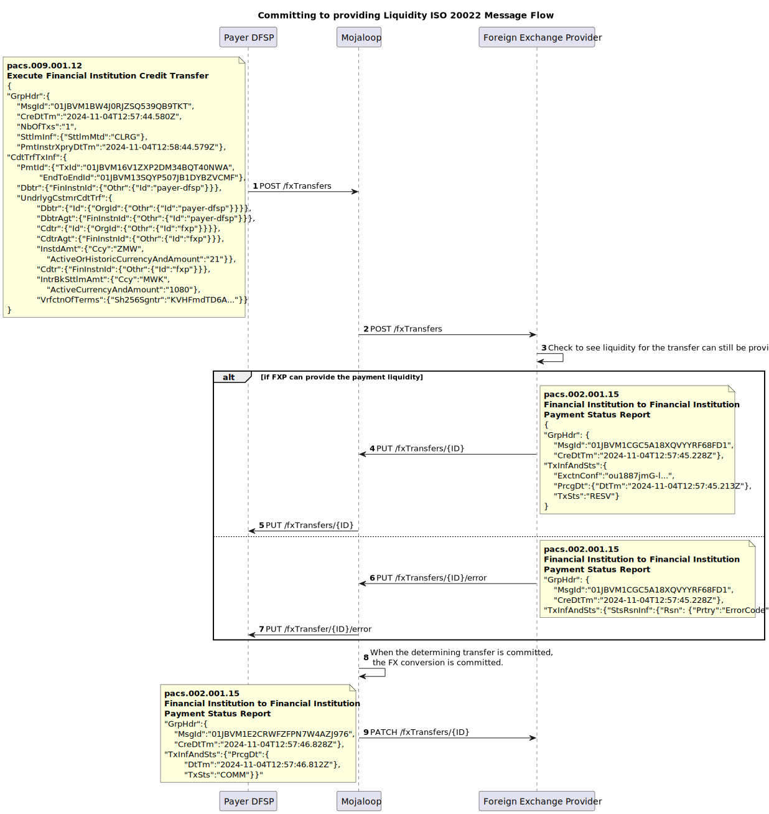
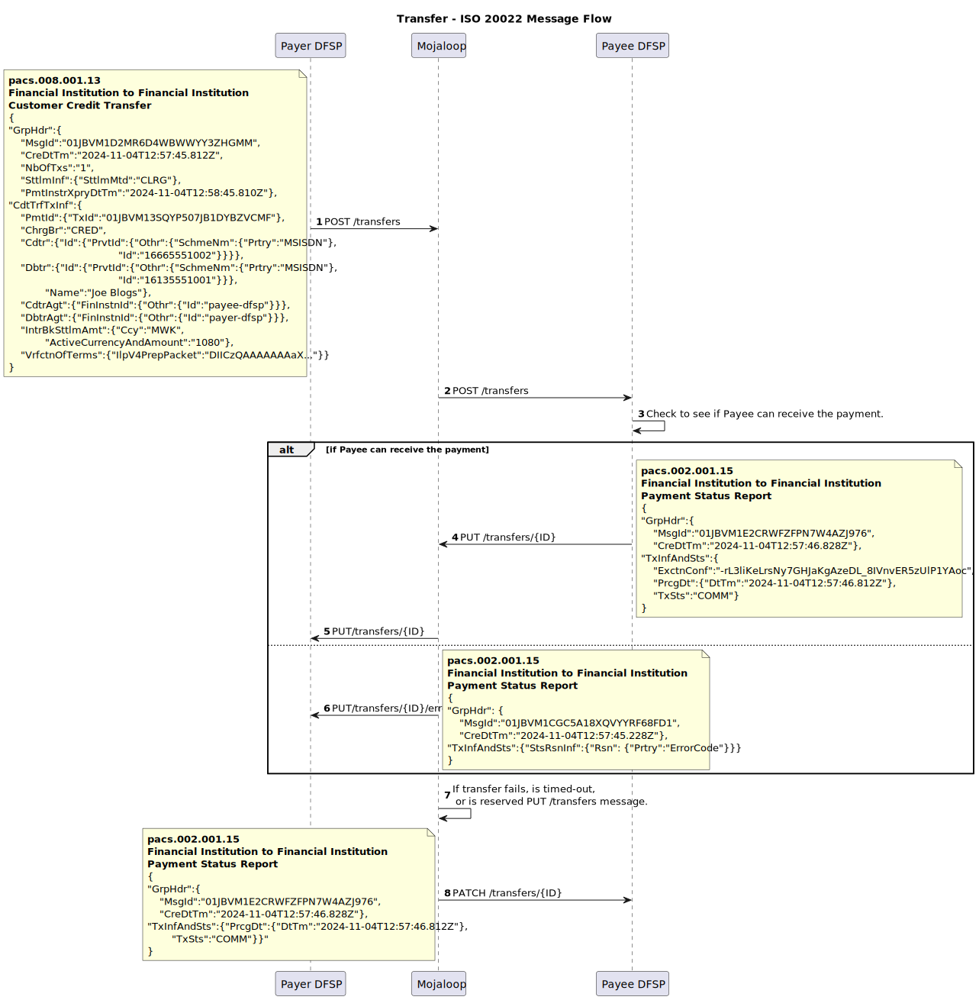

# v1.0: Mojaloop ISO 20022 Market Practice Document
 
<!-- TOC depthfrom:1 depthto:3 orderedlist:true -->

- [1. Mojaloop ISO 20022 Market Practice Document](#_1-mojaloop-iso-20022-market-practice-document)
- [2. Introduction](#_2-introduction)
    - [2.1. How to Use This Document?](#_2-1-how-to-use-this-document)
        - [2.1.1. Relationship with Scheme-Specific Rules Documents](#_2-1-1-relationship-with-scheme-specific-rules-documents)
        - [2.1.2. Distinction Between Generic Practices and Scheme-Specific Requirements](#_2-1-2-distinction-between-generic-practices-and-scheme-specific-requirements)
- [3. Message Expectations, Obligations, and Rules](#_3-message-expectations-obligations-and-rules)
    - [3.1. Currency Conversion](#_3-1-currency-conversion)
    - [3.2. JSON Messages](#_3-2-json-messages)
    - [3.3. APIs](#_3-3-apis)
        - [3.3.1. Header Details](#_3-3-1-header-details)
        - [3.3.2. Supported HTTP Responses](#_3-3-2-supported-http-responses)
        - [3.3.3. Common Error Payload](#_3-3-3-common-error-payload)
    - [3.4. ULIDs as Unique Identifiers](#_3-4-ulids-as-unique-identifiers)
    - [3.5. Inter-ledger Protocol v4 to represent the Cryptographic Terms](#_3-5-inter-ledger-protocol-v4-to-represent-the-cryptographic-terms)
    - [3.6. ISO 20022 Supplementary Data Fields](#_3-6-iso-20022-supplementary-data-fields)
- [4. Discovery Phase](#_4-discovery-phase)
    - [4.1. Message flow](#_4-1-message-flow)
    - [4.2. Parties Resource](#_4-2-parties-resource)
- [5. Agreement Phase](#_5-agreement-phase)
    - [5.1. Currency Conversion Agreement Sub-Phase](#_5-1-currency-conversion-agreement-sub-phase)
        - [5.1.1. Message flow](#_5-1-1-message-flow)
        - [5.1.2. fxQuotes Resource](#_5-1-2-fxquotes-resource)
    - [5.2. Transfer Terms Agreement Sub-Phase](#_5-2-transfer-terms-agreement-sub-phase)
        - [5.2.1. Message flow](#_5-2-1-message-flow)
        - [5.2.2. Quotes Resource](#_5-2-2-quotes-resource)
- [6. Transfer Phase](#_6-transfer-phase)
    - [6.1. Accepting Currency Conversion terms](#_6-1-accepting-currency-conversion-terms)
        - [6.1.1. Message flow](#_6-1-1-message-flow)
        - [6.1.2. fxTransfers Resource](#_6-1-2-fxtransfers-resource)
    - [6.2. Transfer Execution and Clearing](#_6-2-transfer-execution-and-clearing)
        - [6.2.1. Message flow](#_6-2-1-message-flow)
        - [6.2.2. Transfers Resource](#_6-2-2-transfers-resource)

<!-- /TOC -->
# 2. Introduction

By combining the principles of financial inclusion with the robust capabilities of ISO 20022, Mojaloop ensures that DFSPs and other stakeholders can deliver real-time payment solutions that are cost-effective, secure, and scalable to meet the demands of inclusive financial ecosystems. This document outline the version 1.0 of the Mojaloop ISO-20022 market practice.

## 2.1 How to Use This Document?
This document provides a foundational reference for implementing ISO 20022 messaging for IIPS within Mojaloop-based schemes. It outlines general guidelines and practices that apply universally across Mojaloop schemes, focusing on the base-level requirements. However, it is designed to be supplemented by scheme-specific rules documents, which can define additional message fields, validations, and rules necessary to meet the unique regulations and requirements of individual schemes. This layered approach enables each scheme to tailor its implementation details while maintaining consistency with the broader Mojaloop framework.

### 2.1.1 Relationship with Scheme-Specific Rules Documents
This document serves as a foundation for understanding how ISO 20022 is applied in Mojaloop, focusing on core principles and practices. However, it does not prescribe the detailed business requirements, validations, and governance frameworks that are specific to individual schemes. Scheme-specific rules address these details, including mandatory and optional field specifications, tailored compliance protocols, and defined procedures for error handling. They also encompass business rules governing message flows, participant roles, and responsibilities within the scheme. The flexibility of this document allows scheme administrators to adapt and extend its guidance to meet their unique operational needs.

### 2.1.2 Distinction Between Generic Practices and Scheme-Specific Requirements
This document distinctly separates generic practices from scheme-specific requirements to achieve a balance between consistency and adaptability in ISO 20022 implementations within Mojaloop. The generic practices outlined here establish foundational principles, including expectations for message structures, required fields to meet switch requirements, supported fields, and transactional flows. Additionally, they provide a high-level overview of the Mojaloop P2P FX transfer lifecycle.

Scheme-specific requirements, documented separately, delve into additional field mappings, enhanced validations, and precise rules for settlement, reconciliation, and dispute resolution. These requirements also encompass governance policies and compliance obligations tailored to the unique needs of individual schemes.

This distinction enables DFSPs to implement a consistent core messaging framework while granting scheme administrators the flexibility to define operational specifics. The generic practices presented in this document are purposefully designed to be extensible, ensuring seamless integration with scheme-specific rules and supporting adherence to Mojaloop’s ISO 20022 for IIPS standards.

# 3 Message Expectations, Obligations, and Rules
The Mojaloop transfer process is divided into three key phases, each essential to ensuring secure and efficient transactions. These phases use specific resources to enable participant interactions, ensuring clear communication, agreement, and execution. While some phases and resources are optional, the ultimate goal is to ensure every transfer is accurate, secure, and aligns with agreed terms. 
1. [Discovery](#_4-discovery-phase)
2. [Agreement](#_5-agreement-phase)
3. [Transfer](#_6-transfer-phase)

## 3.1 Currency Conversion
Currency conversion is included to support cross-currency transactions. As it is not always required, the associated messages and flows are only used when needed, ensuring flexibility for both single-currency and multi-currency scenarios.

## 3.2 JSON Messages
Mojaloop adopts a JSON variant of ISO 20022 messages, moving away from the traditional XML format to enhance efficiency and compatibility with modern APIs. The ISO 20022 organization is actively developing a canonical JSON representation of its messages, and Mojaloop aims to align with this standard as it evolves.

## 3.3 APIs
ISO 20022 messages are exchanged in Mojaloop via REST-like API calls. This approach enhances interoperability, reduces data overhead through lightweight JSON messages, and supports scalable and modular implementations. By integrating ISO 20022 with REST APIs, Mojaloop delivers a robust, adaptable framework that balances global standards with practical implementation needs. 

### 3.3.1 Header Details 
The API message header should contain the following details. Required headers are specified with an `*` asterisks.

| Name&nbsp;&nbsp;&nbsp;&nbsp;&nbsp;&nbsp;&nbsp;&nbsp;&nbsp;&nbsp;&nbsp;&nbsp;&nbsp;&nbsp;&nbsp;&nbsp;&nbsp;&nbsp;&nbsp;&nbsp;&nbsp;&nbsp;&nbsp;&nbsp;&nbsp;&nbsp;&nbsp;&nbsp;&nbsp;&nbsp;&nbsp;&nbsp;| Description |
|--|--|
|**Content-Length** *integer* (header)|The `Content-Length` header field indicates the anticipated size of the payload body. Only sent if there is a body.**Note:** The API supports a maximum size of 5242880 bytes (5 Megabytes).|
| * **Type** *string* (path)|The type of the party identifier. For example, `MSISDN`, `PERSONAL_ID`.|
| * **ID** *string* (path)| The identifier value.|
| * **Content-Type**  *string* (header)|The `Content-Type` header indicates the specific version of the API used to send the payload body.|
| * **Date** *string* (header)|The `Date` header field indicates the date when the request was sent.|
| **X-Forwarded-For**   *string* (header)|The `X-Forwarded-For` header field is an unofficially accepted standard used for informational purposes of the originating client IP address, as a request might pass multiple proxies, firewalls, and so on. Multiple `X-Forwarded-For` values should be expected and supported by implementers of the API.**Note:** An alternative to `X-Forwarded-For` is defined in [RFC 7239](https://tools.ietf.org/html/rfc7239). However, to this point RFC 7239 is less-used and supported than `X-Forwarded-For`.|
| * **FSPIOP-Source**   *string* (header)|The `FSPIOP-Source` header field is a non-HTTP standard field used by the API for identifying the sender of the HTTP request. The field should be set by the original sender of the request. Required for routing and signature verification (see header field `FSPIOP-Signature`).|
| **FSPIOP-Destination**   *string* (header)|The `FSPIOP-Destination` header field is a non-HTTP standard field used by the API for HTTP header based routing of requests and responses to the destination. The field must be set by the original sender of the request if the destination is known (valid for all services except GET /parties) so that any entities between the client and the server do not need to parse the payload for routing purposes. If the destination is not known (valid for service GET /parties), the field should be left empty.|
| **FSPIOP-Encryption**   *string* (header) | The `FSPIOP-Encryption` header field is a non-HTTP standard field used by the API for applying end-to-end encryption of the request.|
| **FSPIOP-Signature**   *string*   (header)| The `FSPIOP-Signature` header field is a non-HTTP standard field used by the API for applying an end-to-end request signature.|
| **FSPIOP-URI**   *string*   (header) | The `FSPIOP-URI` header field is a non-HTTP standard field used by the API for signature verification, should contain the service URI. Required if signature verification is used, for more information, see [the API Signature document](https://docs.mojaloop.io/technical/api/fspiop/).|
| **FSPIOP-HTTP-Method**   *string*   (header) | The `FSPIOP-HTTP-Method` header field is a non-HTTP standard field used by the API for signature verification, should contain the service HTTP method. Required if signature verification is used, for more information, see [the API Signature document](https://docs.mojaloop.io/technical/api/fspiop/).|

### 3.3.2 Supported HTTP Responses

| **HTTP Error Code** | **Description and Common Causes** |
|---|----|
|**400 Bad Request** | **Description**: The server could not understand the request due to invalid syntax. This response indicates that the request was malformed or contained invalid parameters. **Common Causes**: Missing required fields, invalid field values, or incorrect request format. |
|**401 Unauthorized** | **Description**: The client must authenticate itself to get the requested response. This response indicates that the request lacks valid authentication credentials. **Common Causes**: Missing or invalid authentication token. |
|**403 Forbidden** | **Description**: The client does not have access rights to the content. This response indicates that the server understood the request but refuses to authorize it. **Common Causes**: Insufficient permissions to access the resource. |
|**404 Not Found** | **Description**: The server can not find the requested resource. This response indicates that the specified resource does not exist. **Common Causes**: Incorrect resource identifier or the resource has been deleted. |
|**405 Method Not Allowed** | **Description**: The request method is known by the server but is not supported by the target resource. This response indicates that the HTTP method used is not allowed for the endpoint. **Common Causes**: Using an unsupported HTTP method (e.g., POST instead of PUT). |
|**406 Not Acceptable** | **Description**: The server cannot produce a response matching the list of acceptable values defined in the request's proactive content negotiation headers. This response indicates that the server cannot generate a response that is acceptable according to the Accept headers sent in the request. **Common Causes**: Unsupported media type or format specified in the Accept header. |
|**501 Not Implemented** | **Description**: The server does not support the functionality required to fulfill the request. This response indicates that the server does not recognize the request method or lacks the ability to fulfill the request. **Common Causes**: The requested functionality is not implemented on the server. |
|**503 Service Unavailable** | **Description**: The server is not ready to handle the request. This response indicates that the server is temporarily unable to handle the request due to maintenance or overload. **Common Causes**: Server maintenance, temporary overload, or server downtime. |

### 3.3.3 Common Error Payload

All error responses return a common payload structure that includes a specific message. The payload typically contains the following fields:

- **errorCode**: A code representing the specific error.
- **errorDescription**: A description of the error.
- **extensionList**: An optional list of key-value pairs providing additional information about the error.

This common error payload helps clients understand the nature of the error and take appropriate actions.

## 3.4 ULIDs as Unique Identifiers
Mojaloop employs Universally Unique Lexicographically Sortable Identifiers (ULIDs) as the standard for unique identifiers across its messaging system. ULIDs offer a robust alternative to traditional UUIDs, ensuring globally unique identifiers while also enabling natural ordering by time of creation. This lexicographical sorting simplifies traceability, troubleshooting, and operational analytics.

## 3.5 Inter-ledger Protocol (v4) to represent the Cryptographic Terms
Mojaloop leverages the Inter-ledger Protocol (ILP) version 4 to define and represent cryptographic terms in its transfer processes. ILP v4 provides a standardized framework for secure and interoperable exchange of payment instructions, ensuring integrity and non-repudiation of transactions. By integrating ILP's cryptographic capabilities, Mojaloop supports precise and tamper-proof agreements between participants, enabling secure end-to-end transfer execution while maintaining compatibility with global payment ecosystems.

## 3.6 ISO 20022 Supplementary Data Fields

It is not expected that ISO 20022 supplementary data fields will be required for any of the messages used. If supplementary data is provided, the switch will not reject the message; however, it will ignore its contents and behave as if the supplementary data was not present.

# 4. Discovery Phase
The Discovery Phase is an optional step in the transfer process, necessary only when the payee (end party) must be identified and confirmed before initiating an agreement. This phase utilizes the parties resource, which facilitates the retrieval and validation of the payee’s information to ensure they are eligible to receive the transfer. Key checks performed during this phase include verifying that the payee's account is active, identifying the currencies that can be transferred into the account, and confirming the account owner’s details. This information allows the payer to verify the payee's details accurately, reducing the risk of errors and ensuring a secure foundation for the subsequent phases of the transfer process.

## 4.1 Message flow

The sequence diagram shows the discovery example messages in a Payer initiated P2P transfer.

## 4.2 Parties Resource
The Parties resource provides all the necessary functionality in the discovery phase of a transfer. The functionality is always initiated with a GET /parties call, and responses to this are returned to the originator through a PUT /parties callback. Error messages are returned through the PUT /parties/.../error callback. These endpoints support an optional sub id type.

| Endpoint | Message |
|--- | --- |
|[GET /parties/{type}/{partyIdentifier}[/{subId}]](./script/parties_GET.md) |  |
|[PUT /parties/{type}/{partyIdentifier}[/{subId}]](./script/parties_PUT.md) | acmt.024.001.04 |
|[PUT /parties/{type}/{partyIdentifier}[/{subId}]/error](./script/parties_error_PUT.md) | acmt.024.001.04 |

# 5. Agreement Phase
The **Agreement Phase** is a critical step in the Mojaloop transfer process, ensuring that all parties involved have a shared understanding of the transfer terms before any funds are committed. This phase serves several essential purposes:
1. **Calculation and Agreement of Fees** 
The Agreement Phase provides an opportunity for the calculation and mutual agreement on any applicable fees. This ensures transparency and prevents disputes related to charges after the transfer is initiated.
1. **Pre-Commitment Validation** 
It allows each participating organization to verify whether the transfer can proceed. This step helps identify and address potential issues early, reducing errors during the transfer and minimizing reconciliation discrepancies.
1. **Cryptographic Signing of Terms** 
The terms of the transfer are cryptographically signed during this phase. This mechanism ensures non-repudiation, meaning that parties cannot deny their involvement in or agreement to the transaction. The Interledger Protocol is used to perform this cryptographic signing. Details on how to produce an ILP packet are defined here: [Mojaloop FSPIOP API Documentation](https://docs.mojaloop.io/technical/api/fspiop/).
1. **Promoting Financial Inclusion** 
By presenting all parties with the complete terms of the transfer upfront, the Agreement Phase ensures that participants are fully informed before making any commitments. This transparency supports financial inclusively by enabling fair and informed decision-making for all stakeholders.

The Agreement Phase not only improves the reliability and efficiency of Mojaloop transfers but also aligns with its broader goal of fostering trust and inclusively in digital financial ecosystems.

The agreement phase is further divided into two phases. 

## 5.1 Currency Conversion Agreement Sub-Phase
The Currency Conversion Agreement Sub-Phase is an optional step within the Agreement Phase, activated only when the transfer involves a currency conversion. During this sub-phase, the payer DFSP (Digital Financial Services Provider) coordinates with a foreign exchange (FX) provider to secure cross-currency liquidity required to complete the transaction. This step establishes the FX rates and associated fees, ensuring that both the DFSP and the FXP can rely on transparent and agreed-upon conversion terms. By addressing currency conversion needs before committing to the transfer, this sub-phase helps prevent delays and discrepancies, supporting a seamless cross-border transaction experience.

### 5.1.1 Message flow

The sequence diagram shows the discovery example messages in a Payer initiated P2P transfer.

### 5.1.2 fxQuotes Resource

| Endpoint | Message |
|--- | --- |
|[POST /fxQuotes/{ID}](./script/fxquotes_POST.md) | **pacs.091.001** |
|[PUT /fxQuotes/{ID}](./script/fxquotes_PUT.md) | **pacs.092.001** |
|[PUT /fxQuotes/{ID}/error](./script/fxquotes_error_PUT.md) | **pacs.002.001.15** |

## 5.2 Transfer Terms Agreement Sub-Phase
The End-to-End Terms Agreement Sub-Phase involves the collaborative establishment of the transfer terms between the payer DFSP and the payee DFSP. This process ensures both parties are aligned on critical details such as the amount to be transferred, fees, and timing requirements. This sub-phase also facilitates the cryptographic signing of these terms, providing a robust framework for non-repudiation and accountability. By finalizing the transfer terms in a transparent manner, this sub-phase minimizes the risk of errors or disputes, enhancing the efficiency and trustworthiness of the overall Mojaloop transfer process.

### 5.2.1 Message flow

The sequence diagram shows the discovery example messages in a Payer initiated P2P transfer.

### 5.2.2 Quotes Resource

| Endpoint | Message |
| ------------- | --- |
|[POST /quotes/{ID}](./script/quotes_POST.md) | **pacs.081.001** |
|[PUT /quotes/{ID}](./script/quotes_PUT.md) | **pacs.082.001** |
|[PUT /quotes/{ID}/error](./script/quotes_error_PUT.md) | **pacs.002.001.15** |

# 6. Transfer Phase
Once the agreements have been successfully established during the Agreement Phase, accepting these terms triggers the Transfer Phase, where the actual movement of funds occurs. This phase is executed with precision to ensure that the agreed terms are honored, and all participants fulfill their commitments. The Transfer Phase is divided into two sub-phases: the Currency Conversion Execution Sub-Phase and the Transfer Clearing Sub-Phase, each corresponding to its respective sub-phase in the Agreement Phase.

## 6.1 Accepting Currency Conversion terms
The Currency Conversion Execution Sub-Phase occurs if the transfer involves a currency exchange. In this step, the foreign exchange provider, as agreed during the Agreement Phase, executes the currency conversion. The liquidity required for the cross-currency transfer is provided, and the converted funds are prepared for onward movement to the payee DFSP. This sub-phase is an opportunity for the FXP to ensure that the FX rates and fees agreed upon earlier are adhered to, safeguarding the transaction's financial integrity and transparency.

### 6.1.1 Message flow

The sequence diagram shows the transfer example messages in a Payer initiated P2P transfer.

### 6.1.2 fxTransfers Resource

| Endpoint | Message |
| -------- | --- |
|[POST /fxTransfers/{ID}](./script/fxtransfers_POST.md) | **pacs.009.001** |
|[PUT /fxTransfers/{ID}](./script/fxtransfers_PUT.md) | **pacs.002.001.15** |
|[PUT /fxTransfers/{ID}/error](./script/fxtransfers_error_PUT.md) | **pacs.002.001.15** |
|[PATCH /fxTransfers/{ID}/error](./script/fxtransfers_PATCH.md) | **pacs.002.001.15** |

## 6.2 Transfer Execution and Clearing 
The Funds Settlement Sub-Phase involves the actual transfer of funds between the payer DFSP and the payee DFSP. This step ensures that the amount agreed upon, including any associated fees, is accurately cleared in the appropriate accounts. This sub-phase completes the financial transaction, fulfilling the commitments made during the Agreement Phase. Through secure and efficient fund movement mechanisms, this sub-phase ensures that the transfer is completed smoothly and in compliance with the agreed terms.

### 6.2.1 Message flow

The sequence diagram shows the discovery example messages in a Payer initiated P2P transfer.

### 6.2.2 Transfers Resource

| Endpoint | Message |
| --------- | --- |
|[POST /transfers/{ID}](./script/transfers_POST.md) | **pacs.008.001** |
|[PUT /transfers/{ID}](./script/quotes_PUT.md) | **pacs.002.001.15** |
|[PUT /transfers/{ID}/error](./script/quotes_error_PUT.md) | **pacs.002.001.15** |
|[PATCH /transfers/{ID}/error](./script/transfers_PATCH.md) | **pacs.002.001.15** |

