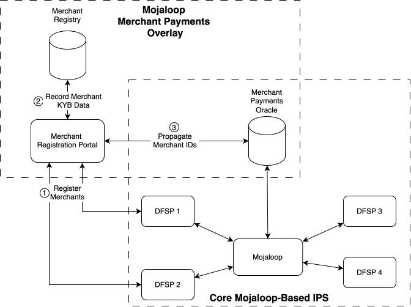
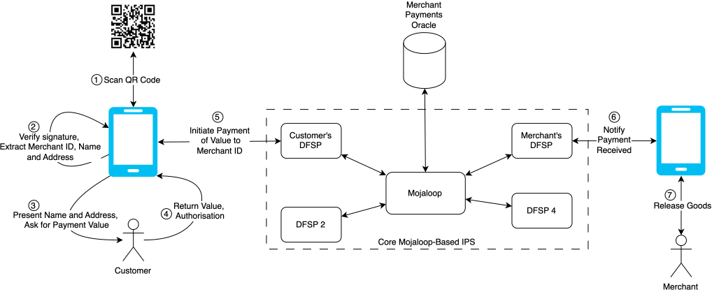
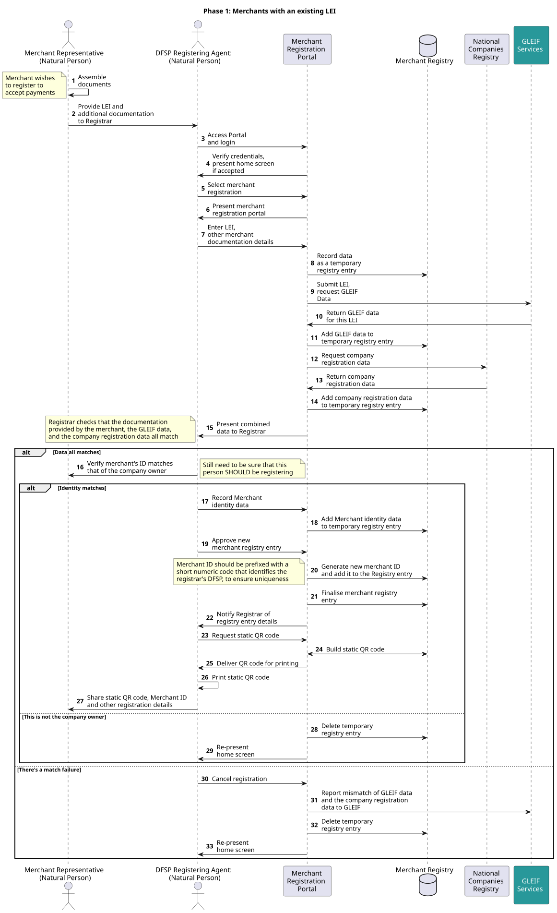
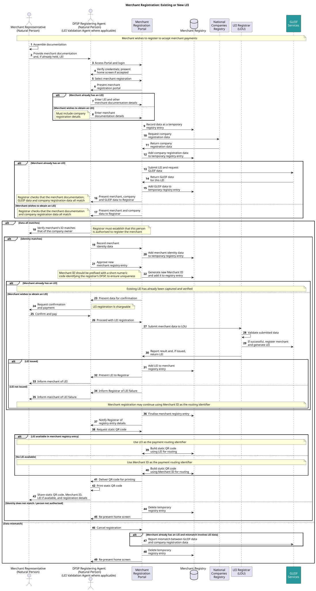

# Mojaloop and Merchant Payments
## An Overlay Service

Within the Mojaloop ecosystem, merchant payments are recognised as an important and supported use case. Merchant payments are delivered as an overlay service – an add on to an existing Mojaloop deployment – rather than being implemented directly within the Hub itself.

This is because, whilst the Hub itself is focussed on executing transactions, merchant payments introduce a set of additional requirements beyond the payment itself. These include merchant registration, merchant ID generation and management, and QR code creation and delivery. These functions extend well beyond the core responsibility of the Hub.

The merchant payments overlay forms part of the broader Mojaloop open-source offering, sitting alongside the Hub and leveraging it for the crucial transfer of funds, while independently handling the merchant-specific functions. In doing so, it enables schemes to meet the operational, regulatory, and risk management requirements associated with merchant transactions (such as fraud mitigation, AML controls, and merchant/customer protection) without adding unnecessary complexity to the core transaction switching layer.

## Operations

In terms of scheme operations, a merchant payments scheme could be offered as part of an overall payments service by the operator of the Mojaloop Hub. It's also possible that a merchant payments scheme could be offered by an entirely separate operator, in partnership or collaboration with the Hub operator.

## Context of the Merchant Payments Overlay 

The Merchant Payments Overlay is designed to implement the merchant payments use case for an existing Mojaloop deployment. It does not replace or replicate the underlying inclusive instant payment switch (IIPS); rather, it leverages the deployed Mojaloop infrastructure to execute the core funds transfer component of merchant payment transactions. Settlement, routing, liquidity management, and scheme-level controls all remain the responsibility of the operator of the underlying/associated Mojaloop-based IIPS.

This architectural approach enables a merchant payments scheme to be delivered without modifying the core Mojaloop switch. The overlay provides merchant-specific functionality, including acceptance flows, merchant onboarding constructs, scheme rules, value-added services, and customer interaction models, while delegating clearing and settlement to the IIPS layer.

From a governance perspective, the overlay may be operated directly by the Mojaloop-based IIPS operator as an extension of the existing scheme. Equally, it may be operated as a distinct merchant payments scheme, established in partnership with the IIPS operator and layered over the IIPS infrastructure. In this latter model, the overlay maintains its own commercial framework, participant agreements, and operating rules, while relying on the Mojaloop deployment for inter-participant funds transfer.

In both configurations, the Merchant Payments Overlay preserves separation of concerns: Mojaloop provides interoperable, real-time account-to-account settlement capability, while the overlay defines and governs the merchant payments use case.

## Merchant Registration
As noted earlier, the operation of a merchant payments scheme extends significantly beyond the execution of a funds transfer, a core prerequisite being the formal registration of each participating merchant, together with the generation and controlled use of a unique (“unique” being a term that is revisited later in this document) Merchant Identifier (Merchant ID) for routing and addressing purposes. The following diagram illustrates the high-level architectural elements of the merchant registration aspects. Note that, as merchant payments is an overlay service, adoption of the merchant payments overlay does not impact on the operation of the Mojaloop-enabled IIPS that executes the associated payments.

**
Figure 1: Merchant Registration and the Mojaloop Ecosystem
**

### Registration Process

#### Merchant Registration and KYB Assurance

Given the inherent risks of fraud, terrorist financing, and money laundering, particularly the well-documented use of fraudulent merchant entities to launder illicit proceeds, the merchant registration process must, at minimum, satisfy applicable Know Your Business (KYB) requirements.

The model assumes that merchant registration will be carried out by authorised representatives of DFSPs already connected to the relevant Mojaloop IIPS, with these DFSPs taking on the well understood role and responsibility of merchant acquirers. Many DFSPs already take on this role for their existing merchant payments schemes.

The registration process provides a registering party with the opportunity to:

- Verify the legal existence of the merchant entity (e.g., through company registries or equivalent authorities).

	  - Note that the overlay implementation also supports the sole-trader model; though in this case it is recommended that strict limits are placed on the merchant’s account and transactions, including maximum value of an individual transaction, maximum total value per day/month, and maximum number of transactions per day. If a sole trader needs higher limits, then they should be encouraged to formally register a legal entity, and so begin transacting as a business.

- Confirm the identity of registering individuals and authorised representatives.

- Identify and verify beneficial owners.

- Screen against relevant sanctions lists, watchlists, and historical fraud or financial crime records.

- Cross-reference submitted information with trusted external data sources.

This is very much business as usual for a merchant acquirer.

Beyond the KYB data, the registering agent of the DFSP also captures operational details of the merchant; number of outlets, geographical location of each outlet (address), details of the “tills”/checkouts in each outlet, etc. This is to facilitate later reconciliation of transactions.

Only once the designated registering agent is satisfied that all required due diligence and screening checks have been completed should the merchant be approved for participation. At that point, a unique Merchant ID is generated.

Note that the Mojaloop merchant payments overlay supports multiple models for the Merchant Registry, including, but not limited to, a centralised registry maintained by the Scheme owner; a centralised registry maintained by an independent body, appointed by the appropriate regulatory authority; or a distributed/virtualised registry, with each merchant acquirer maintaining their own subset (and associated merchant ID range), with oversight by the regulatory authority. It is a matter for the adopter to select the most appropriate model. Merchant ID uniqueness is straightforward, whichever model is adopted; in the case of a distributed registry, by assigning merchant ID ranges to each acquiring DFSP (where there are existing merchant registrations for a DFSP, then these can be made unique scheme-wide by prepending them with a DFSP identifier, for example).

#### Merchant ID Generation and IIPS Integration

Upon creation, the Merchant ID is propagated by the Merchant Registry to a dedicated Merchant ID Oracle connected to the Mojaloop-based IIPS. This enables payments to be addressed using the Merchant ID as a routable alias within the IIPS Discovery process.

The DFSP that maintains the merchant’s account must maintain a definitive association between the Merchant ID and the merchant’s underlying account details. When the IIPS issues a Discovery request referencing the Merchant ID, the DFSP must respond with the appropriate account information to allow the transaction to be executed.

Operationally, this linkage is most effectively maintained where the account-holding DFSP is directly involved in the merchant registration process (meaning the DFSP acquiring the agent also hosts the merchant’s account for receiving payments). In this model, the DFSP captures the required KYB data at onboarding, initiates Merchant ID creation, and ensures alignment between registry records, oracle entries, and account mappings. Other models, including merchant registration by a centralised legal entity, are possible, but risk undermining the merchant-DFSP relationship.

#### Registry Implementation Models

The Merchant Registry may be implemented in multiple configurations, depending on the governance preferences and risk posture of the scheme operator:

1.  **Centralised Registry with Single Registrar**

A single authoritative database, managed by an approved registrar.

- Registering DFSPs submit merchant data to the single, centralised registrar.

- Merchant IDs are generated centrally, by the registrar.

  - Uniqueness of Merchant IDs can therefore be guaranteed.

- Merchant IDs are automatically propagated to the IIPS Merchant ID Oracle.

- Strong central control, and so operationally more dependent on the availability and responsiveness of the centralised registrar.

2.  **Centralised Registry with Distributed Access**

A single authoritative database accessible remotely by participating DFSPs.

- Each registering DFSP remotely enters merchant data directly into a centralised, shared registry.

- Merchant IDs are generated centrally.

	  - Uniqueness can therefore be guaranteed – unless the Merchant IDs themselves are generated using a single, centralised process.

- Merchant IDs are automatically propagated to the IIPS Merchant ID Oracle.

- Preserves the traditional acquirer–merchant relationship.
- Maintains centralised oversight and uniformity of Merchant ID issuance.

3.  **Federated Registry Model**

Each registering DFSP maintains its own merchant database (with a format defined by the scheme) and issues Merchant IDs independently.

- Merchant IDs are generated by the registering DFSP.

	  - Within its own merchant database, a registering DFSP is responsible for guaranteeing the uniqueness of the Merchant IDs that are generated and recorded. It is recommended that this requirement forms part of the scheme rules.

	  - Uniqueness across the ecosystem is achieved by allocating each registering/acquiring DFSP an ID range from which they allocate; this might for example be by allocating each a two- or three-digit prefix, which they prepend to each Merchant ID they generate.

	    - This approach also works for new multi-DFSP schemes, where some of the DFSPs previously operated their own merchant payment scheme. In this case, the pre-existing merchant IDs can then be made unique cross-scheme by adding the prefix.

	    - The prefix assigned to each registering DFSP should be recorded in the scheme rules.

- Merchant IDs are propagated to the IIPS Merchant ID Oracle by the registering DFSP.

Uniqueness of Merchant IDs can therefore be guaranteed either within the centralised registry or across Mojaloop–based IPS

Each of these models preserves the same fundamental architectural principle: merchant identity must be verified before participation, Merchant IDs must be unique and authoritative, and the IIPS must be able to resolve those identifiers deterministically through its Discovery mechanism.
- Where a merchant payment scheme must be interoperable with other national schemes, or to operate in a cross-border environment, then consideration should be given to using the LEI as a merchant ID. This is explored later in this document.

In this way, the Merchant Registry becomes a controlled gateway into the merchant payments overlay, ensuring regulatory compliance, mitigating financial crime risk, and preserving the integrity of merchant addressing within the ecosystem of a Mojaloop deployment.

The open-source Mojaloop Merchant Payments overlay includes a minimum recommended set of data to be captured for every merchant. Adopters are of course free to extend this as they see fit.

## Payment Initiation Modes

Once merchant registration has been completed and the Merchant ID has been generated and propagated to the Merchant ID Oracle attached to the Mojaloop-based IIPS, the merchant becomes eligible to accept payments through the Merchant Payments Overlay.

Making a payment to a merchant is achieved by pushing a payment to the registered merchant ID. This can be done by a customer using USSD (entering the merchant ID into their handset as part of a customer-initiated transaction), or if they have a smartphone by scanning a QR code.

### QR Codes 

#### Static Vs. Dynamic

The Mojaloop Merchant Payments overlay, in its current open-source format, relies on the use of static QR codes. However, this is readily extensible to support dynamic QR codes.

Static QR codes are fixed and apply to multiple transactions; so, the customer must scan a printed QR code displayed in the merchant’s premises using the smartphone app provided by their DFSP, and enter the transaction value as they initiate a payment. The merchant’s acquiring DFSP is required to generate and print the static QR code at the time of registration, and deliver it to the merchant’s premises. This imposes no technological burden on the merchant in the acceptance of QR code-initiated payments.

By contrast, a dynamic QR code is specific to an individual transaction, and includes the transaction value embedded in it, so the customer does not need to enter the value. They simply scan the dynamically generated QR code on the merchant’s display and approve the transaction. The normal process is for the merchant to enter the details of the sale into their point of sale device, which then sends those details to their acquiring DFSP as a request for a dynamic QR code. The acquiring DFSP then generates the QR code (including adding any cryptographic protections) and forwards it to the merchant’s point of sale device, which then displays it for the customer to scan.

A dynamic QR code increases customer convenience and removes a potential source of error. But this comes at the cost of requiring that a new QR code is generated each time by the merchant’s acquiring DFSP, and that a merchant has at his point of sale the capability to display the QR code. However, this is not necessarily a difficult requirement to meet - for small merchants, the point of sale device might be their own smartphone; but any larger merchant is likely to have this functionality built into their normal terminal/point of sale (POS) device.

#### Timing of Generation

The principal difference in the generation of a QR code between static and dynamic codes is when the code is generated.

**For static QR codes**: when merchant registration is complete, as well as propagating the merchant ID to the merchant ID oracle, the acquiring DFSP’s merchant payments overlay will generate a static QR code according to the scheme rules. The open-source implementation of this is based on the EMVCo QR Code Specification for Payment Systems in Merchant-Presented Mode, Version1.1. Other standards are available, but almost all recent implementations use the EMVCo standard, and so this was adopted in the development of the overlay.

Note also that the use of a static QR code also supports the continued use of USSD by customers with feature phones, since a **numeric** merchant ID can be printed alongside the printed QR code, for manual entry by the customer. It should be noted that this is only possible if merchant IDs are numeric, since USSD only supports numeric data entry.

**For dynamic QR codes**: When a merchant needs a QR code, their Point of Sale (POS) device makes a network request to their acquiring DFSP (support for multiple acquiring DFSPs is a matter for the POS supplier – though some merchants may simply use multiple POS devices). If the scheme is using a federated or distributed model for the Merchant Registry, then the acquiring DFSP will generate the QR code in the same way as for static QR codes, with the addition of the transaction value supplied by the merchant, and return it to the merchant. If the scheme is using a centralised registry with a single registrar, then the merchant's request must be forwarded to the registrar, who will generate the dynamic QR code and return it to the DFSP, for forwarding to the merchant.

#### Content

Data required for QR code construction is retrieved from the Merchant Registry and assembled into the EMVCo-defined data structure by a dedicated module within the Mojaloop merchant payments overlay codebase. This module is intentionally self-contained, allowing adopters’ engineering teams to tailor QR payload composition to local scheme requirements without modifying core Mojaloop functionality.

In practice, even for static QR codes, multiple QR codes are generated:

- One QR code per checkout/till at an outlet.

- For merchants operating multiple outlets, one set per outlet.

This granularity enables downstream reconciliation and reporting at outlet and terminal level.

#### Cryptographic Integrity and Scheme Authentication

For commercial deployment, it is strongly recommended that the QR payload be extended to include a cryptographic signature. This is because of the ease of QR code generation by scammers, particularly when static QR codes are used; they can simply print their own QR code, which redirects payments, and paste it over the legitimate QR code. By including a cryptographic signature, which can be verified by a payments app issued by a scheme DFSP (not necessarily an acquiring DFSP), this scam can be nullified.

The signature should be:

- Generated by the acquiring DFSP using its scheme-specific private key.

- Embedded within one of the EMVCo “Unreserved” templates (for example, template ID “80”).

- Constructed over relevant QR payload fields to protect against tampering.

To support this, the merchant payment scheme operator must establish a Public Key Infrastructure (PKI), so that payment apps can recognise and make use of the signature.

The recommended trust model includes the following six key elements:

1.  **Scheme Root Key Pair**

The scheme operator generates its own public/private key pair.

2.  **DFSP Key Pair**

Each acquiring DFSP generates its own public/private key pair.

3.  **DFSP Certification**

The scheme operator uses its private key to sign the public keys of participating DFSPs, issuing each with a Public Key Certificate (PKC), in a secure key signing “ceremony”.

4.  **PKC Availability**

The acquiring DFSP (or the scheme operator) makes its PKC publicly accessible to participants, perhaps via its website.

5.  **DFSP Identification in QR**

**Note the requirement** that the QR code payload must contain sufficient information to identify the acquiring DFSP. Depending on scheme design, this may include the DFSP’s BIC or some other scheme-recognised identifier.

6.  **Signature Validation by the Payer App**

Upon scanning the QR code:

- The customer’s smartphone app identifies the acquiring DFSP from the QR code.

- The app retrieves from a trusted source the acquiring DFSP’s PKC.

  - The trusted source might be the scheme operator, the acquiring DFSP’s website, or indeed a cached copy (if the app has encountered this acquiring DFSP recently and has already retrieved the PKC).

- The app verifies the PKC against the scheme operator’s public key.

- The verified PKC is then used to validate the cryptographic signature embedded in the QR payload.

- Only if these checks are all passed should the app seek to initiate the transaction.

This process ensures that the QR code data is authentic, hasn’t been tampered with, and was issued under the authority of the acquiring DFSP and the scheme operator.

### Customer Authorisation and Payment Initiation

Following successful QR code validation, the customer’s app presents selected merchant details, such as the “trading as” name and the trading location, to allow visual confirmation that the QR code corresponds to the merchant at which the customer is present.

Once the customer is satisfied, the customer then:

- Self-authenticates using the DFSP’s standard mechanism (e.g., PIN or biometrics).

- Enters the payment amount (for static QR implementations).

- Authorises the transaction.

The payer’s DFSP then initiates a transfer addressed to the Merchant ID via the Mojaloop IIPS.

This process is summarised in the following diagram.

**
Figure 2: Payment Processing
**

### Settlement and Merchant Experience

Because the transaction is executed over a Mojaloop-based IIPS, payment to the merchant’s account occurs in near real time. The merchant’s DFSP is able to confirm to the merchant that the payment has been received within seconds of customer authorisation – together with the value of the payment, which is important for a merchant to check in the case of static QR transactions (unlike dynamic QR code transactions, which allow the merchant to specify the value in advance).

Upon receipt of confirmation from their DFSP, the merchant may release goods or services with high confidence that funds have been irrevocably credited.

For larger merchants operating multiple outlets and tills, full transaction data (including terminal identifiers embedded within the QR payload) can be delivered to support reconciliation against a merchant’s internal point-of-sale systems.

## Architectural Separation of Concerns

In summary, the Merchant Payments Overlay:

- Manages merchant identity assignment, QR code generation, and scheme-level authentication.

- Supports optional cryptographic assurance at the acceptance layer.

- Relies on Mojaloop for deterministic routing, liquidity management, and real-time settlement.

This layered approach preserves the integrity of the underlying IIPS while enabling a secure, scheme-governed merchant acceptance framework suitable for commercial deployment.

## Future Extension: LEI Routing

Work continues within the Mojaloop Community to extend the merchant payments overlay. For example, a key partnership has been forged with the Global Legal Entity Identifier Foundation (GLEIF) to embed Legal Entity Identifiers (LEIs) in QR codes as an alternative to merchant IDs, in order to facilitate cross border merchant payments and KYB processing. In cross-border transactions, embedding a validated LEI has significant benefits in managing participating DFSPs’ compliance costs.

By incorporating the LEI into QR codes or payment messages, participating DFSPs can more efficiently meet the FATF Recommendation 16 transparency and traceability requirements. The [**FATF Recommendation 16**](https://www.fatf-gafi.org/en/publications/Fatfrecommendations/update-Recommendation-16-payment-transparency-june-2025.html) (also known as the “Travel Rule”) establishes international standards for identifying and transmitting originator and beneficiary information in cross-border wire transfers and digital payments. This offers significant potential opportunities around pre-validation and verification of payees.

The LEI is a concept that is foundational to establishing trust and transparency within financial ecosystems. It provides a globally standardized digital identity for legal entities, enabling consistent recognition and verification across networks and jurisdictions.

The LEI is a life-long identifier, made up of 20 alphanumeric characters, owned by the respective legal entity. It uniquely identifies legal entities engaging in financial transactions. With reference to services maintained and operated by the GLEIF community, the LEI points to the associated reference data, which answers ‘who is who’ and ‘who owns who’ on a global basis.

The extension to support LEI and LEI-based routing builds on the existing Merchant Payments overlay, described earlier in this document, and so this section should be read in that context.

### First Steps

The first instance of this work, already complete, supports LEI-based routing of a payment, with a Mojaloop oracle created to register LEIs as alternate payment aliases, and an extension to the Merchant Registry structure to include LEIs for uploading to the oracle, for use in payee resolution.

A merchant that already has an LEI will have that LEI embedded in their QR codes, and so will be used to route QR-code based payments to their account. However, because USSD only supports numeric data entry, customers using a feature phone to make USSD payments will not be able to address a payment to an LEI, and consequently a numeric merchant ID should be made available in parallel to the LEI, specifically in print around a static QR code that embeds an LEI.

The LEI capture process will be extended to support KYB checking; so the data supplied by the registering entity (merchant) can be verified against that held for that LEI by GLEIF, and any issues highlighted to the acquiring DFSP.

The draft process flow is set out in the following diagram. 

 This Phase 1 flow covers onboarding a merchant that already has an LEI, and proceeds according to the following steps.

A person representing the merchant shares its existing LEI and onboarding documents with the registering DFSP and the DFSP user logs into the registration portal and starts a “merchant with existing LEI” registration. The LEI and basic details are then entered and saved as a temporary merchant record. The system looks up the LEI via [GLEIF API](https://www.gleif.org/en/lei-data/gleif-api) access to the global LEI database and then pulls matching company data from the national business register. The merchant registration portal system next compares the merchant‑provided data, LEI data, and company‑register data; if they do not match, they clarify with the merchant, possibly cancel the process, or restart.

If the issue is with the LEI reference data itself, the operator raises a challenge (a query) to the GLEIF API, so the LEI record is revalidated and corrected. When everything aligns, the merchant record is approved, a scheme‑specific merchant ID is generated, the final merchant registry entry (including the LEI) is created, and the merchant is notified of successful registration.

The flow in the above diagram concludes with the creation of a static QR code, using the LEI as the payment routing address. The static QR code is then printed by the registering DFSP, and delivered to the merchant. This of course is not the only possible flow; as mentioned earlier in this document, the use of a centralised registry might include the delivery of the QR code by an external agency, for example. Further, the use of dynamic QR codes would require that the codes are created per transaction, on demand from the merchant themself, and are delivered electronically to the merchant’s POS device for display. For reasons of clarity, this has been omitted from the above flow.

### Longer Term

Although the primary goal of the collaboration with GLEIF is to process payments initiated with an LEI in countries where there is a Mojaloop deployment, a secondary goal is to increase the number of registered LEIs, so that in the medium/long term the processing of cross-border payments becomes significantly more straightforward.

In support of this, the merchant registration process developed in the first phase will be further extended, so that those merchants that do not have an LEI – but are registered legal entities in their country – can apply for, and be issued, an LEI as part of the merchant registration process.

The draft process flow, below, extends that set out above for the first phase, to encompass both merchants who already have an LEI, and merchants who wish to apply for an LEI. 

 The process flow diagram has been extended to show how a registered merchant without an LEI is onboarded and is issued an LEI. The process is an extension of the earlier diagram, and proceeds as follows (for merchants that wish to register for an LEI).

The merchant submits registration documents to the registration agent (or DFSP or Validation agent). The agent captures the data, checks it for completeness, and verifies company details against the national business register. If data does not match, the data is cleared and the merchant decides whether to try again; if not, the process ends.

If the data is a match, the agent creates a scheme‑specific merchant ID and prepares extra information needed for LEI registration. The agent validates the LEI application details, asks the merchant to confirm them, and collects payment. After payment, the agent submits the LEI application to the LEI registrar and later shares part of the fee.

The LEI registrar validates the data, registers the company in the LEI registry, and issues an LEI back to the agent.

If LEI issuance is successful, the agent adds the LEI to the merchant’s record in the scheme registry and informs the merchant that registration (with LEI) is complete. If LEI issuance fails, the agent still finalizes merchant onboarding but informs the merchant that registration was completed without an LEI.

The same comments apply as previously with regard to the creation and delivery of QR codes, static or dynamic.

## Background: LEI Concepts

The Legal Entity Identifier (LEI) is a concept that is foundational to establishing trust and transparency within financial ecosystems. It provides a globally standardized digital identity for legal entities, enabling consistent recognition and verification across networks and jurisdictions.

Within the context of the Mojaloop–GLEIF collaboration, the LEI as a concept illustrates how consistent identity structures can support secure participation by institutions, enhance the integrity of transaction data, and simplify processes such as digital onboarding. By adopting the LEI framework into the Mojaloop ecosystem, the initiative seeks to demonstrate how open payment platforms can integrate globally trusted identity standards to strengthen interoperability and compliance.

A practical use case for LEI integration within the Mojaloop ecosystem involves embedding the LEI into QR codes used for merchant payments. By incorporating the LEI within the QR data payload, financial institutions and digital wallets can verify the identity of the merchant beneficiary at the point of payment. This mechanism enhances trust and transparency by allowing participating financial institutions to validate the merchant’s legal identity against the GLEIF database before processing the transaction. Such an approach supports accurate beneficiary verification, reduces the risk of fraud or misdirection, and strengthens compliance with KYC and AML standards—while maintaining the efficiency and user experience of QR-based payments.

Merchants that already have a Legal Entity Identifier (LEI, ISO 17442) can be onboarded in a more digital and automated manner by integrating this global digital identity into the onboarding workflow. The DFSP may integrate the LEI and benefit from automated collection of merchant name, address and local business registration details, with the goal of streamlining KYB checks, reducing manual data collection, and improving data quality, while enabling greater interoperability with other domestic and cross‑border systems that also rely on the LEI. The LEI is supplemental to the local system-generated merchant ID, used for non-QR payments.

## Background: LEI Registration

### Mapping 

An important aspect of the merchant registration is the mapping of LEI data to existing merchant identifier data, already embedded in the Mojaloop ecosystem.

This mapping enables seamless linkage between the Mojaloop system and the GLEIF ecosystem standards, simplifying entity recognition, verification, and compliance across borders. By aligning Mojaloop participant registries and directory services with LEI records, the ecosystem gains a scalable framework that supports trusted payments, regulatory oversight, and automated Know Your Business (KYB) processes.

The following table has been drafted to map the existing Mojaloop merchant ID data fields to the corresponding data fields referenced by the LEI.

|                 | **Mojaloop data** **field** | **Corresponding** **LEI data** **field**               |
|-----------------|-----------------------------|--------------------------------------------------------|
| **Identifier**  | Merchant ID                 | LEI                                                    |
| **Entity name** | registered_name             | Entity.LegalName                                       |
| **Addresses**   | street_name                 | Entity.LegalAddress.FirstAddressLine                   |
|                 | building_number             | Entity.LegalAddress.AddressNumber                      |
|                 | postal_code                 | Entity.LegalAddress.PostalCode                         |
|                 | town_name                   | Entity.LegalAddress.City                               |
|                 | country_subdivision         | Entity.LegalAddress.Region                             |
|                 | country                     | Entity.LegalAddress.Country                            |
|                 | address_line                | Entity.LegalAddress.AdditionalAddressLine              |
| **Geocoding**   | Latitude                    | Extension/Geocoding/lat (only available in xml format) |
|                 | longtitude                  | Extension/Geocoding/lng (only available in xml format) |

**Mapping Notes:**

1.  This mapping table assumes that the addresses in Mojaloop data are physical legal addresses for the legal entity, the merchant. If the addresses are branch addresses or trading desks, then the addresses cannot be mapped.

2.  While the core data elements (entity name and address) are available for mapping, the Mojaloop data can still benefit from the LEI reference data.

3.  Standardized country and subdivision. While the Mojaloop data set country and subdivision to be free text, the LEI data apply the ISO 3166 standard. Mojaloop can utilize the LEI data to obtain standardized country and subdivision codes.

4.  Code lists: the LEI data provides reference data on the legal form and the registration authority of the entity. The code lists follow global standards for entity legal form (ISO 20275) and registration authority. https://www.gleif.org/en/about-lei/code-lists

5.  Entity status: the LEI data also show the status of entity, active or not. If the entity stops operating, in the Entity Status field, it is labelled as “INACTIVE”.

6.  Ownership structure: besides the level 1 data which tell who is who, the LEI reference data also provides level 2 data, which tell who owns whom. Mojaloop could utilize the level 2 data to identify parents/children entities of merchants.

LEI data can be retrieved by utilising the GLEIF API, which is available at https://www.gleif.org/en/lei-data/gleif-api and can be used, as set out in the above mapping notes, to enhance and verify the data held in the Mojaloop Merchant Registry.

### LEI data Validation

An important part of the value of this collaboration is the capacity to verify data collected about a legal entity with the data held by GLEIF. Validating LEIs using the GLEIF API involves two main operational tasks.

- **Verify LEI codes.** Check whether a supplied LEI is valid, active, and correctly registered in the Global LEI Index.

- **Retrieve merchant profile.** Use the LEI to obtain the legal name, registration status, and other reference data needed to build or enrich the merchant profile (e.g., for KYB and routing).

#### GLEIF API (online access to the Global LEI Index)

The GLEIF application programming interface (API) provides real‑time access to the full LEI data search functionality, including validation of individual LEIs and retrieval of associated Level 1 reference data (legal name, legal jurisdiction, entity status, etc.). It supports filtered, full‑text, and single‑field searches and can also return records via LEI or other attributes, which makes it well suited for automated “Is this a real LEI?” checks and merchant lookups in payment workflows.

- Base information: https://www.gleif.org/en/lei-data/gleif-api

- API documentation: https://api.gleif.org/docs

- Demo application: https://api.gleif.org/demo

**Cost and integration:** The API is provided free of charge by GLEIF and can be integrated into DFSP or scheme infrastructure for customized implementations (e.g., validation at onboarding, QR decoding, or payment initiation), as is envisaged in this document.

#### Golden Copy Files (bulk data alternative)

As an alternative or complement to the online API, GLEIF publishes Golden Copy Files, which are authoritative snapshots of the full Global LEI Index, containing all LEIs and their Level 1 reference data with technical duplicates removed. These files are updated several times per day based on incoming data from LEI issuers, allowing local systems to maintain an up‑to‑date replica of the LEI population for high‑volume or offline use cases.

- Golden Copy information and downloads: https://www.gleif.org/en/lei-data/gleif-golden-copy

- Update frequency: database updated up to ten times daily; Golden Copy files made available multiple times per day.

- Formats: available in machine‑readable formats such as CSV, XML, and JSON, enabling flexible ingestion into data warehouses, AML/KYB tools, or payment switch infrastructure.

#### Summary

These two access options—real‑time API queries and periodic Golden Copy file downloads—give payment schemes and DFSPs a scalable toolkit to verify LEIs and retrieve merchant entity data directly within their transaction flows.

### Link to ISO 20022

Building on the LEI data sources, the next consideration is how the LEI can be carried consistently within payment messages. This is where ISO 20022 becomes important.

ISO 20022’s 2016 Release introduced dedicated LEI fields for identifying parties in messages like settlement instructions and payment messages. These fields allow LEIs to be used alongside or instead of other identifiers like BIC, particularly in sections such as Party Identification blocks.

The Mojaloop Foundation and GLEIF are coordinating on the transport of LEIs within transactional messages, with a particular focus on cross-border transactions.

## Applicability

This version of this document relates to Mojaloop Version [17.2.0](https://github.com/mojaloop/helm/releases/tag/v17.2.0)

## Document History
|Version|Date|Author|Detail|
|:--------------:|:--------------:|:--------------:|:--------------:|
|1.0|1st September 2026| Paul Makin (MLF), Ololade Osunsanya (GLEIF), Clare Rowley (GLEIF)|Initial version|