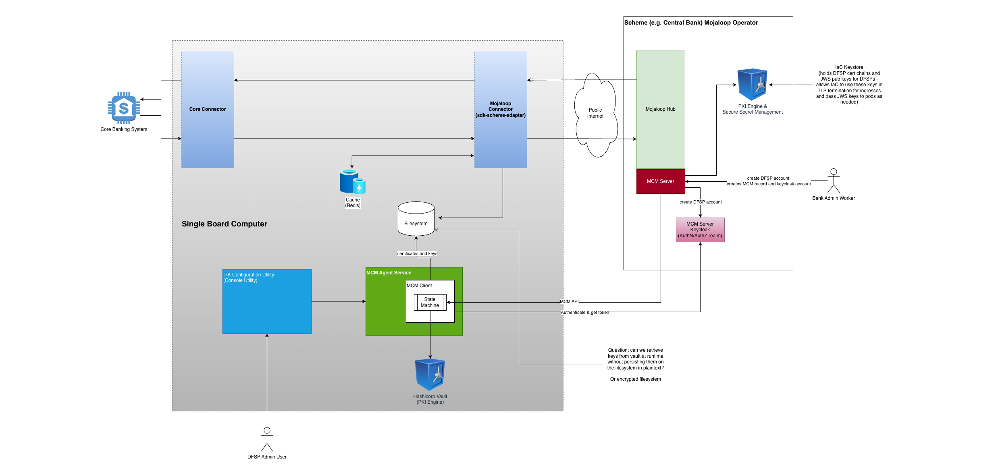

# Guide to the Selection and Use of Participation Tools

# Background

The Mojaloop Community has developed a range of tools for the use of participating DFSPs, which facilitate the connection between a DFSP’s back office and a Mojaloop-based scheme (the Hub). Each acts as an adapter layer that handles the complexities of Mojaloop's APIs and security requirements, allowing a DFSP to more easily connect its back office. This can greatly ease the integration process, reducing both the direct cost (the participation tools are open source, and can be freely downloaded) and the indirect cost (the integration time is greatly reduced, because the complexity is handled within the tool) of integration. Ongoing maintenance cost is also much reduced, as the participation tools are maintained by the Mojaloop Community, and only need to be “personalised” by individual DFSPs.

Unlike the Mojaloop Hub itself, the participation tools are intended to be deployed within the DFSP’s domain, and their implementation and use remains the responsibility of the individual DFSP, though with the support of the Mojaloop Community.

The Community has recognised that different DFSPs have different requirements and constraints that they would place on the participation tools, and that is reflected in the range of offerings.

# Functionality

One of the core purposes of the participation tools is to hide the complexity of the Mojaloop API. As well as all of the security, the tools handle complex, multi-step Mojaloop procedures—such as party lookups, agreement of terms, and transfers—and present them to the DFSP's systems in a more straightforward way. 

To achieve this, the participation tools all offer the following services:

1. Management of the connection between the DFSP and Mojaloop Hub, specifically including the setup and operation of the security, including key certificate exchange.  
2. Full API integration with the Mojaloop Hub, covering:  
   1. Administration, for example, setting up routing/aliases for a DFSP’s customers;  
   2. The participation in transactions as either debtor or creditor institution;  
   3. Support for authorisation (including continuing authorisation) for third-party initiated transactions (for example, fintechs).  
3. A range of open source tools to facilitate the connection between the participation tool and the DFSP’s back office (either directly into the core banking system, or into the payments engine, or into a messaging backplane).

# Common Architectural Elements

The common architecture of all of the participation tools consists of several key components that work together to facilitate the connection and management of transactions.

## Core Connector

This is the central integration component that acts as a "translator" between the DFSP's back office and the participation tool. Templates are provided in both the Apache Camel framework, which provides a declarative, integration-focused language, and TypeScript, a commonly known and understood programming language. System integrators and/or participants may choose to use these templates or create a custom connector in a technology stack of their choosing. The use of templates allows the core connector to be customized to fit the DFSP's existing backend technology rather than forcing the DFSP to change its own systems. 

## Mojaloop Connector

This component communicates directly with the Mojaloop Hub and contains two key sub-components:   
**Mojaloop-SDK:** Provides the necessary security components and handles HTTP header processing in a Mojaloop-compliant manner.

**Simplified API:** Offers a more synchronous and use-case-oriented version of the Mojaloop FSPIOP API, which is easier for the DFSP's backend systems to consume. 

## Mojaloop Connection Manager (MCM) Client

This client automates and simplifies the process of configuring connections to different Mojaloop environments. It handles the creation, signing, and exchange of digital certificates, which is a critical security requirement for the Mojaloop ecosystem. 

# High-level transaction flow

The participation tools all facilitate the transaction process by acting as the DFSP's gateway to the Mojaloop Hub: 

* A transaction is initiated by the DFSP's back office.  
* The back office sends the request to the Core Connector within the participation tool.  
* The Core Connector translates the request for the Mojaloop Connector and its simplified API.  
* The Mojaloop Connector communicates securely with the Mojaloop Switch (Hub) using the Mojaloop-SDK.  
* Payments are routed and orchestrated by the Mojaloop Hub to the destination DFSP.  
* The participation tool provides status updates and reconciliation information to the DFSP via monitoring portals, where these are implemented. 

# Available Participation Tools

There are two broad groups of participation tools; first, Payment Manager, which offers all of the functionality and flexibility a large bank might require; and second, a group of solutions based around Mojaloop’s Integration Toolkit, which can be sized and hosted to meet the varying requirements of a broad range of other DFSPs.

## Payment Manager

Also known as Payment Manager for Mojaloop (PM4ML), Payment Manager is a full-function Mojaloop participation tool that offers all the features a large corporate bank would expect. It can be deployed either in the cloud or in a bank’s data centre, and supports all of the DR options such a bank would expect. It also has comprehensive management and reporting capabilities.  

 

 	
 
 
**Figure 1: Payment Manager Architecture**

The above diagram represents a high level view of the architecture of Payment Manager, and also indicates the elements of a Mojaloop Hub that it interacts with.

### Payment Manager’s Portals

PM4ML’s business and technical Portals provide user-friendly interfaces with dashboards for monitoring critical information:   
- **Transaction monitoring**: Displays real-time and historical transaction statuses.  
- **Service status**: Allows DFSPs to monitor the health and performance of their connections.  
- **Configuration management**: Provides a single point for managing security keys, certificates, and endpoint configurations. 

## Integration Toolkit

The Integration Toolkit set of participation tools is architected to allow significant flexibility in how a DFSP chooses to connect to a Mojaloop Hub, and can be deployed on a variety of environments to meet the needs of everything from the smallest MFI to the largest bank.

### Overview

 

 	
 
 
**Figure 2: ITK Architecture**

As would be expected, and as illustrated in the above diagram, there are common features with Payment Manager:

* Both Core Connector and Mojaloop Connector function as before.  
* The Mojaloop Connection Manager Client (MCM Client) remains responsible for the creation, signing, and exchange of digital certificates, underpinning the security of the connection to the Mojaloop Hub.

However, there are some significant differences. The operation of the MCM Client is now subject to the control of MCM Agent Services, which orchestrates the management of the security using a state machine. Control and configurations of the Agent Services is carried out using the ITK Configuration Utility, which presents a console-type interface to the DFSP’s operational staff. Thai performs the same function as Payment Manager’s Configuration portal.

Questions for reviewers:

1. How is the security of the console ensured? Surely it must be locked down? 

2. Is there any mechanism for some BI tool (for example) to query the local filesystem for transaction monitoring and service status?  

3. Is there a (built in) alternative to the BI tool?

### ITK Deployment Options

The options for deploying ITK are catalogued in the [Participant Feature Matrix](https://docs.mojaloop.io/product/features/connectivity/participant-matrix.html) and can be summarised as follows:

* **A small DFSP**, such as a small MFI or bank, is expected to self-host the ITK. This approach will support all use cases except the initiation of bulk payments (bulk payments can still be received). Low transaction levels are expected (max 10 TPS), and some downtime (potentially a few hours) is acceptable.  
	  * It is recommended that a minimal functionality version of ITK be deployed, with monitoring by some form of BI tool. This should be deployed on a small server, right down to a single board computer such as a Raspberry PI for the smallest DFSPs.  
	  * Deployment is via Docker Compose.  
	  * Need a link to the scripts for this

* **A low-medium sized DFSP**, such as a bank or MFI with one or two branches and their own “broom cupboard” data centre, is expected to self-host the ITK. This approach will support all use cases, including the initiation of small scale bulk payments. Peak transaction levels of around 50 TPS are supported, and some limited downtime (measured in hours) is acceptable.  
	  * It is recommended that a fully functional version of ITK be deployed, with monitoring by some form of BI tool. This should be deployed on a basic server, hosted in the DFSP’s own data centre.  
	  * A Kafka deployment is needed to support bulk payments.   
	  * Deployment is via Docker Compose or Docker Swarm.  
	  * Minimal integration with existing enterprise security platforms.  
	  * Need a link to the scripts for this
* **A medium-large sized DFSP**, such as a medium-sized FI with a few branches and their own self-hosted data centre and some reasonable internal IT skills, is expected to host the ITK. This approach will support all use cases, including the initiation of small/medium scale bulk payments. Peak transaction levels of around 50 TPS are supported, and some limited downtime (measured in minutes) is acceptable.  
	  * In order to achieve the maximum downtime requirements, a multiple server configuration is required, managed using Kubernetes.  
	 * It is recommended that a fully functional version of ITK be deployed, with monitoring by some form of BI tool.    
	 * A Kafka deployment is needed to support bulk payments.   
	 * Deployment is via Kubernetes.  
	 * May need integration with existing enterprise security platforms.  
	 * Need a link to the scripts for this
* **A large DFSP**, such as a mature, multi-branch FI with its own industry-standard data centre and sophisticated internal IT skills, is recommended to use Payment Manager.
