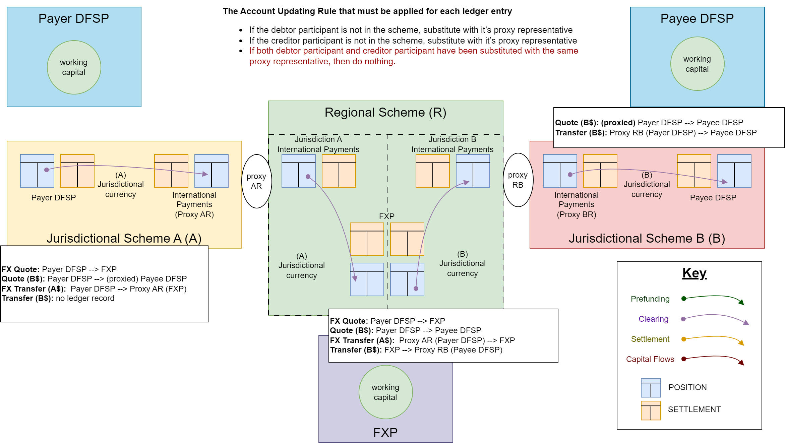

# Interscheme

Interscheme is the approach adopted by the Mojaloop community to connect schemes while preserving the three phases of a Mojaloop transfer and ensuring end-to-end non-repudiation. This means that the agreement reached during a transfer remains between the originating and receiving DFSP/FXP organizations, regardless of the routing path or the number of schemes involved.

:::tip Non-repudiation 
Ensuring non-repudiation across schemes eliminates the need for the cross-network proxy to assume clearing responsibilities, which helps reduce costs.
::: 

The initial implementation of this feature enables the connection of multiple Mojaloop schemes. Over time, this ecosystem is expected to expand as additional national schemes adopt this protocol and new connectors are developed to enhance interoperability.

To support this effort, Mojaloop introduced a new proxy participant organization. The proxy adapter serves as the implementation of the Mojaloop-to-Mojaloop connection component.

## What is a Proxy
Schemes are connected via a proxy participant, which is registered to act as an intermediary within the scheme for adjacent DFSPs/FXPs in other schemes.

## Dynamic Routing of Parties
This implementation makes use of a dynamic routing. This meaning that no initial and ongoing maintenance of party identifiers is required between schemes. The system makes use of a broadcast to scheme discovery that identifier and caches the organisation associated with a party identifier.

## Assumptions
This approach is based off the following assumptions:
1. No two connected participants share the same identifier.
1. Each connected scheme is responsible for routing party identifiers within its own system. (In Mojaloop, this means each scheme maintains the oracles needed to route payments for participant parties in its network.)

## General Patterns
There are certain general patterns that emerge
### Happy Path Patterns

### Error Patterns

## Interscheme On Demand Discovery Design
The discovery flows are summarized as follows:
1. On Demand loading of cross network identifiers - using Oracles for identifier lookups in local scheme
2. On Demand loading for all identifiers

### Using Oracles to Cache Identifiers
- Scheme uses Oracles to map local identifiers to participants of the scheme
- Identifiers for other schemes are discovered via a depth first search, but asking all participants. Proxy participant then forward the request to the connected scheme
- This diagram shows two connected schemes, but this design work for any number of connected schemes.

### On Demand Discover with incorrectly cached results
- When an identifier moved to another dfsp provider, then the store cache for that participant will route to an unsuccessful get \parties call.

Here is a sequence diagram show how that gets updated.
#### Sequence Diagram

## Interscheme - Agreement Phase
This is how the agreement phase is implemented

## Interscheme - Transfer Phase
this is how the transfer phase is implemented

## Interscheme - GET Transfer 
this is how the GET transfers is implemented

## Admin API - defining Proxy Participants

## Clearing Accounts for Inter-scheme FX transfers
This diagram illustrated how the obligations are updated during transaction clearing.

