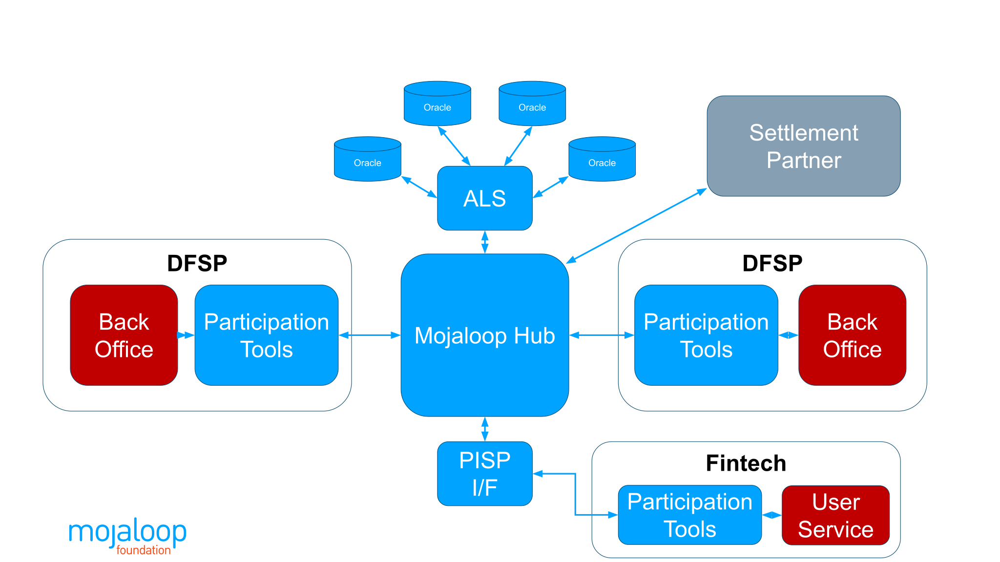

# About Mojaloop 

Mojaloop is open source instant payments software that interconnects
disparate financial institutions in a manner that promotes financial
inclusion and provides robust risk management for all participants. It
is available for use by any body that wishes to use it to implement and
operate an inclusive instant payments scheme.

## Mojaloop's Core Functions

These are the core functions that Mojaloop provides to connected
financial institutions:

  |Alias Resolution|Clearing|Settlement|
|:--------------:|:--------------:|:--------------:|
|Payee address or **alias resolution**, ensuring that the account-holding institution – and thereby the correct payee account - is reliably identified|**Clearing** of payments end to end, with robust measures that remove any element of doubt about the success of a transaction|Orchestration of **Settlement** of cleared transactions between financial institutions using a model agreed between those institutions, and according to a predefined schedule.|

&nbsp;

These core functions are supported by some [unique characteristics](./transaction.html#unique-transaction-characteristics), which
together make Mojaloop a low cost, inclusive instant payments system:

1.  **A Three Phase Transaction Flow**, as follows:
	+  **Discovery,** when the Payer's DFSP works with the Mojaloop Hub to determine where the payment should be sent, so ensuring that transactions are not misdirected. This phase resolves an alias to a specific Payee DFSP and, in collaboration with that DFSP, an individual account.

	 + **Agreement of Terms, or Quotation,** when the two DFSP parties to the transaction both agree that the transaction can go ahead (supporting, for example, restrictions relating to tiered KYC), and on what terms (including fees), **before** either commits to it.

	+  **Transfer,** when the transaction between the two DFSPs (and by proxy their customers' accounts) is cleared, and it is guaranteed that both parties have the same, real-time view of the success or failure of the transaction.
&nbsp;

2.  **End to End Non-Repudiation** guarantees that each party to a message can be assured that the message has not been modified, and that it really was sent by the purported originator. This underlying technology is leveraged by Mojaloop to guarantee that a transaction will only be committed if *both* the Payer *and* the Payee DFSPs accept that it is, and neither party can repudiate the transaction. Naturally, it also guarantees that no third party can modify the transaction.
3.  **The PISP API is made available through the Mojaloop Hub,** not by individual DFSPs. Consequently a fintech can integrate with the Hub and immediately be connected to **all** connected DFSPs. 

**Note** In Mojaloop terms, a DFSP - or Digital Financial Service Provider - is a generic term for any financial institution, of any size or status, that is able to transact digitally. It applies equally to the largest international bank and the smallest Microfinance Institution or mobile wallet operator. "DFSP" is used throughout this document.   
&nbsp;

## The Mojaloop Ecosystem
In reading this document, it is important to understand the terminology used to identify the various actors, and how they interact. The following diagram provides a high level view of the Mojaloop ecosystem.

## Feature List

This document presents a feature list which covers the following aspects
of Mojaloop:

-   [**Use Cases**](./use-cases.md), describing the use cases supported by every Mojaloop deployment.
-   [**Transactions**](./transaction.md), describing the Mojaloop APIs, how a transaction proceeds, and the aspects of a Mojaloop transaction that make it uniquely suited to the   implementation of an inclusive instant payments service.

-   [**Risk Management**](./risk.md), setting out the measures taken to ensure that no DFSP participating in a Mojaloop scheme is exposed to any counterparty risk, and that the integrity of the scheme as a whole is protected.

-  [**Connectivity Support**](./connectivity.md), describing the various tools and options for straightforward onboarding of participating DFSPs.

-  [**Portals and Operational Features**](./product.md), such as portals for user and service management, and the configuration and operation of a Mojaloop Hub.
-  [**Fees and Tariffs**](./tariffs.md) sets out the mechanisms that Mojaloop provides to support a range of different tariff models and the opportunities for participants and hub operators to levy fees.

-  [**Performance**](./performance.md), outlining the transaction processing performance adopters might expect. 
- [**Deployment**](./deployment.md), describing the different ways to deploy Mojaloop for a range of different purposes, and the tools that facilitate these deployment types. 
- [**Security**](./security.md), covering the security of the transactions between connected DFSPs and the Mojaloop Hub, the security of the Hub itself (including the operator portals), and the QA Framework currently being developed to validate the security and quality of a Mojaloop deployment.
- [**Engineering Principles**](./engineering.md), such as algorithmic adherence to the Mojaloop specification, code quality, security practices, scalability and performance patterns (amongst others).

-   [**Invariants**](./invariants.md), setting out the development and operational principles to which any Mojaloop implementation must adhere. This includes the principles which ensure the security and integrity of a Mojaloop deployment.

&nbsp;

# About This Document

## Purpose of This Document

This document catalogues the features of Mojaloop, independent of
implementation. It is intended to both inform potential adopters of the features they can expect and (where appropriate) how those features can be expected to function, and to inform developers of the features they must implement in order for their efforts to be accepted as an official instance of Mojaloop.

The Mojaloop Foundation (MLF) defines an implementation as being an
official instance of Mojaloop if it implements all of the features of
Mojaloop, without exception, and they pass the standard set of Mojaloop tests.

## Applicability

This version of this document relates to Mojaloop Version [17.0.0](https://github.com/mojaloop/helm/releases/tag/v17.0.0)

## Document History
  |Version|Date|Author|Detail|
|:--------------:|:--------------:|:--------------:|:--------------:|
|1.3|23rd June 2025| Paul Makin|Added the ecosystem text and diagram|
|1.2|14th April 2025| Paul Makin|Updates related to the release of V17|