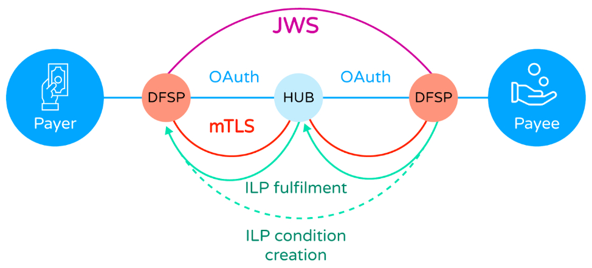

# Security
Mojaloop security is multi-layered, complex, and subject to continuous oversight and review. Broadly, it can be broken down into three areas of scope:

- The security of the connection between the Mojaloop Hub and the Participating DFSPs (this includes both the security of transactions and the security, establishment and maintenance of the underlying connection itself);
- The security of the Hub's operations, as reflected in the activities of the operational staff;
- The quality and security of the Mojaloop Hub deployment.

How Mojaloop approaches each of these areas is explored in the following sections.

## DFSP Connection Security
The connection between a participant DFSP and the Mojaloop Hub benefits from three levels of security which together ensure the integrity, confidentiality, and non-repudiation of messages between a DFSP, the Mojaloop Hub, and (where appropriate) the other DFSP participating in a transaction.

The following diagram illustrates these three levels.

At the lowest level, the security of the point-to-point connection between a DFSP (an authorised participant) and the Mojaloop Hub is assured through the use of mTLS, which ensures that communications are confidential and between known correspondents, and that communications are protected against tampering.

Next, the content of the JSON messages used to communicate between the Hub and the DFSPs is cryptographically signed, according to the method defined in the JWS specification ([see RFC 7515](https://www.rfc-editor.org/rfc/rfc7515.html)). This assures recipients that messages were sent by the party which purported to send them, and simultaneously that that provenance cannot be repudiated by the sender.

Finally, the terms of a transaction/ transfer are secured using the  Interledger Protocol (ILP) between Payer and Payee participants. ILP uses a [Hashed Timelock Contract (HTLC)](./htlc.html) to protect the integrity of the payment condition and its fulfilment. In this way, Mojaloop ensures that a transfer either completes fully across all participating parties, or not at all. It also limits the time within which a transfer instruction is valid.

These three layers are all built into the Mojaloop Hub. On the DFSP side, these can be directly established and managed by the DFSP's own engineering teams. However, the Mojaloop Community also ([makes available a set of tools](./connectivity.html)) which both establish these security layers and maintain them during the lifetime of the connection. The tools also help a DFSP to manage and orchestrate their use of the various communications/APIs with the Mojaloop Hub, handling many of the complexities on behalf of the DFSP, whilst existing entirely within the DFSP's own domain (and so not forming part of the Mojaloop Hub).

## Hub Operational Security
Security at the Mojaloop Hub itself reaches beyond the connections to participating DFSPs (as described in the previous section), and includes the security of operator actions through the use of the various [Hub Portals](.product.html).

Portals are implemented using Mojaloop's Business Operations Framework (BOF), which not only provides the core Mojaloop portals, but also provides a set of APIs to allow a Hub operator to extend these portals, and create new ones, to meet their specific requirements.

In order to facilitate the management of the security of these portals, the BOF channels all activity through a single Identity and Access Management (IAM) framework, which incorporates Role Based Access Controls (RBACs), and intrinsically supports industry-standard Maker/Checker (also known as Four Eyes) controls.

This approach gives a Mojaloop Hub operator granular control of an individual's access to the management capabilities of the Mojaloop Hub, as well as the controls applied to every activity. However, it remains the responsibility of the Hub operator to ensure that their staff are properly screened before recruitment, that they are registered on the IAM to access the portals, that they are assigned appropriate roles, and the the RBAC framework properly assigns roles to patrol management functions (including, where appropriate, maker/checker controls). In particular, policies such as password expiry, lengths and content of passwords, re-use etc are directly supported by the IAM framework, and it also supports the use of Multi-Factor Authentication (MFA) for all operators, as determined by the Hub operator (though the use of SMS or USSD as an MFA channel is strongly discouraged).

In addition, it remains the responsibility of the hub operator to ensure that control points appropriate to the operation of a financial service are put in place (such as, where it applies, physical access to the servers hosting the Mojaloop Hub, control of operator use of mobile phones, video surveillance, supply chain management, visitor management, etc), and that business processes are defined to ensure the correct application of those control points.

## Deployment Quality and Security
Members of the Mojaloop Community are currently developing a Quality Assessment Framework, the purpose of which is to develop a Toolkit that can be used to validate the configuration, functionality, security, interoperability readiness and performance of a deployment. 

This framework might be used by adopters to "self certify", or it might be used by an external reviewer in order to create a higher level of assurance for supervisory authorities and participants.

## Applicability
This document relates to Mojaloop Version 17.0.0
## Document History
  |Version|Date|Author|Detail|
|:--------------:|:--------------:|:--------------:|:--------------:|
|1.0|24th June 2025| Paul Makin|Initial version|