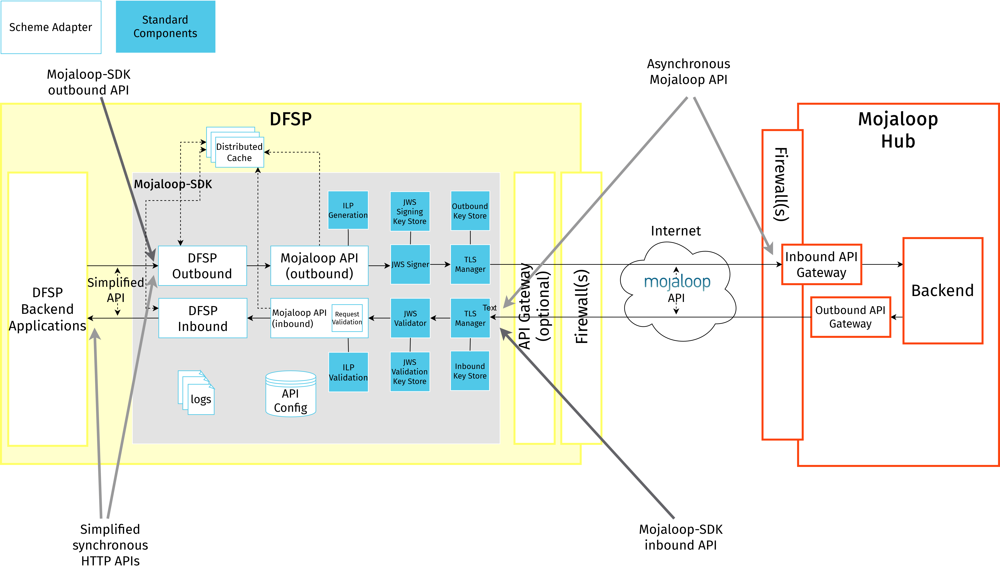
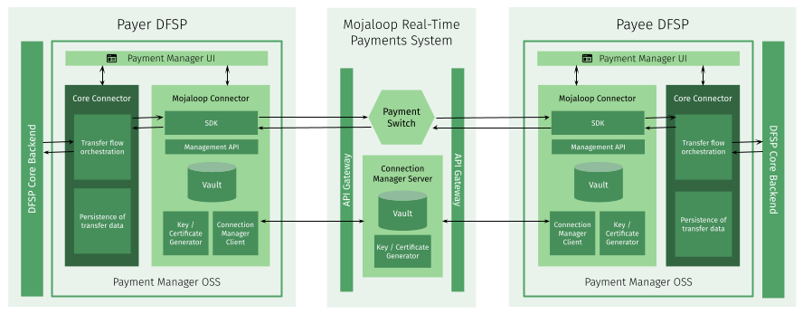
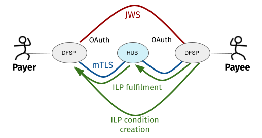
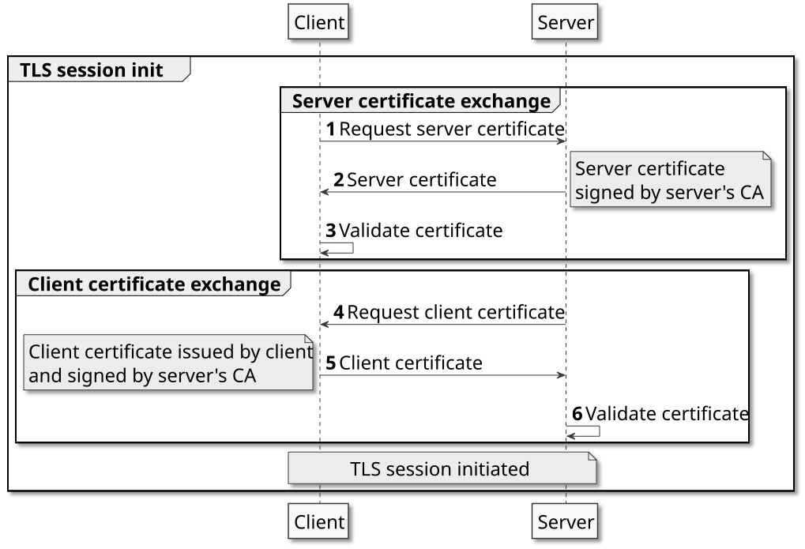

# Onboarding técnico dos DFSP

De forma geral, o onboarding num Hub Mojaloop exige que um DFSP concentre os seus esforços em torno dos seguintes marcos principais:

* [Integração](#integracao-de-api) do seu backend central com o Hub Mojaloop ao nível da API (o que envolve tanto desenvolvimento como testes).
* [Ligação](#ligacao-aos-ambientes-mojaloop) aos ambientes de pré-produção e de produção, cumprindo os rigorosos requisitos de segurança do Mojaloop.

Para além das etapas que exigem o envolvimento do DFSP, o Operador do Hub também tem de realizar algumas atividades de onboarding no seu [backend](#onboarding-no-backend-do-hub), independentemente dos DFSP.

Esta secção apresenta uma visão geral de todos estes marcos.

## Integração de API

No contexto da API de Interoperabilidade entre Prestadores de Serviços Financeiros (FSPIOP) do Mojaloop, uma transferência ocorre em três etapas principais:

1. Identificar o Beneficiário (fase de party lookup ou de descoberta)
1. Acordar a transferência (fase de cotação ou de acordo)
1. Executar a transferência (fase de transferência)

Para mais detalhes sobre cada uma destas fases, consulte o **Module 2 - Static demo: An end-to-end example** do [curso de formação Mojaloop](https://learn.mojaloop.io/) **MOJA-102**.

Estas três fases correspondem aos recursos principais da API FSPIOP do Mojaloop:

* **Party lookup service**: identificar o DFSP que serve o Beneficiário e o próprio Beneficiário (= quem recebe os fundos numa transação) com base num identificador do Beneficiário (habitualmente um MSISDN, ou seja, um número de telemóvel).
* **Quotes service**: solicitar uma cotação e trocar prova criptográfica para preparar e proteger a transferência. Uma cotação é um contrato entre um DFSP Pagador e um DFSP Beneficiário para uma determinada transação financeira, antes de a transação ser realizada. Garante o acordo estabelecido pelos DFSP Pagador e Beneficiário quanto ao Pagador, ao Beneficiário e ao montante da transferência, e é válida durante o período de vigência de uma cotação e transferência de uma transação financeira determinada.
* **Transfers service**: executar a transação de acordo com os detalhes acordados e a prova criptográfica.

Os DFSP podem optar por:

* ligar-se diretamente ao Hub Mojaloop e implementar a versão assíncrona Mojaloop destes serviços de API, ou
* tirar partido de um componente de integração de código aberto (o [Mojaloop-SDK](#mojaloop-sdk) ou o [Payment Manager OSS](#payment-manager-oss)) e implementar uma versão simplificada e síncrona dos serviços da API FSPIOP do Mojaloop

Os DFSP que dispõem de uma equipa de desenvolvimento interna e de experiência com APIs RESTful conseguirão provavelmente gerir o processo internamente e desenvolver uma ligação direta ao Mojaloop. No entanto, recomenda-se que os DFSP utilizem um dos componentes de integração de código aberto, uma vez que uma ligação direta exige desenvolvimento e manutenção de código adicionais. Utilizar o Mojaloop-SDK ou o Payment Manager OSS reduz o tempo necessário para integrar com o Hub Mojaloop e facilita a resolução de problemas por parte do Operador do Hub, reduzindo assim o custo global do sistema.

Enquanto o DFSP realiza o trabalho de desenvolvimento offline, o papel do Operador do Hub consiste em responder a questões pontuais sobre as especificidades da API ou — consoante a ferramenta de código aberto escolhida e o modelo de deployment acordado — pode até estender-se à realização de parte do desenvolvimento.

### Ferramentas de código aberto que facilitam a integração de API

#### Mojaloop-SDK

O [Mojaloop-SDK](https://github.com/mojaloop/sdk-scheme-adapter) apresenta ao sistema de backend de um DFSP uma versão simplificada e síncrona da API FSPIOP do Mojaloop, permitindo aos DFSP implementar internamente uma API simples para comunicar com o Hub Mojaloop, mantendo-se ainda assim em conformidade com a especificação da API FSPIOP do Mojaloop nas comunicações externas interoperáveis.

O padrão assíncrono da API FSPIOP do Mojaloop (apesar das suas muitas vantagens) pode não ser adequado a aplicações cliente que operam em modo síncrono de pedido-resposta. O Mojaloop-SDK ajuda a colmatar esta lacuna ao oferecer uma API simplificada de pedido-resposta, abstraindo dos clientes finais a complexidade da composição de múltiplos pedidos e os detalhes da API assíncrona.

O Mojaloop-SDK tem de ser transferido do [GitHub](https://github.com/mojaloop/sdk-scheme-adapter) para o ambiente do DFSP e integrado no backend do DFSP. É fornecido como imagem de contentor Docker e pode ser alojado na mesma infraestrutura da aplicação de core banking ou numa máquina virtual aprovisionada especificamente para o efeito. A manutenção contínua pode exigir algum apoio especializado de um Integrador de Sistemas com formação no software.

Para além de uma API simplificada, o Mojaloop-SDK fornece também «de origem» os protocolos de segurança exigidos pelo Mojaloop, disponibilizando aos seus utilizadores uma interface de configuração simplificada. Esta característica do Mojaloop-SDK auxilia a [etapa de ligação](#ligacao-aos-ambientes-mojaloop) do onboarding.

#### Payment Manager OSS

O [Payment Manager OSS](https://pm4ml.github.io/documents/payment_manager_oss/latest/core_connector_rest/introduction.html) apresenta ao sistema de backend de um DFSP uma versão simplificada, síncrona e orientada a casos de utilização da API FSPIOP do Mojaloop. O componente de integração principal do Payment Manager chama-se Core Connector e funciona como tradutor entre o backend central de um DFSP (CBS) e um componente do Payment Manager (chamado Mojaloop Connector, que tira partido do Mojaloop-SDK) que comunica diretamente com o Hub Mojaloop.

O Core Connector é construído em Apache Camel, uma linguagem declarativa baseada em Java para engenheiros de integração, que não exige escrever código de raiz. Existe um modelo de Core Connector pronto a usar que simplifica o esforço de desenvolvimento. O modelo fornece uma base de código de partida para os endpoints de API que têm de ser desenvolvidos e tem de ser personalizado para se alinhar com a tecnologia CBS adequada. A flexibilidade proporcionada pelo modelo permite adaptar o Core Connector ao backend de um DFSP, em vez do contrário.

O esforço de personalização de um modelo de Core Connector varia consoante a opção de deployment escolhida. Ao fazer o deployment do Payment Manager, estão disponíveis duas opções:

* **Gerido e alojado por um Integrador de Sistemas**: um Integrador de Sistemas faz o deployment do Payment Manager na cloud e sincroniza o modelo de Core Connector com a implementação do backend central do DFSP.
* **Auto-alojado pelo DFSP**: o DFSP faz o deployment do Payment Manager on-premise ou na cloud, e a personalização do modelo de Core Connector pode ser feita por vários intervenientes (consoante o resultado de uma avaliação inicial das capacidades do DFSP):
    * o Integrador de Sistemas
    * o Integrador de Sistemas e o fornecedor da solução de backend central do DFSP
    * o DFSP e o fornecedor da solução de backend central do DFSP

O Payment Manager é fornecido como um conjunto de imagens de contentor Linux (Docker) e pode ser alojado on-premise, com infraestrutura de servidores corrente, ou em infraestrutura de cloud adequada, onde esteja disponível.

Se o Operador do Hub assim o entender, pode assumir o papel de Integrador de Sistemas.

Dado que o Payment Manager incorpora a funcionalidade do Mojaloop-SDK, implementa também a camada de segurança exigida pelo Mojaloop. Esta característica do Payment Manager auxilia a [etapa de ligação](#ligacao-aos-ambientes-mojaloop) do onboarding.

## Ligação aos ambientes Mojaloop

Depois de o DFSP concluir o desenvolvimento, testa a sua integração contra uma instância de laboratório num ambiente de teste fornecido pelo Hub. É aqui que começa a fase de ligação do percurso de onboarding técnico, com um novo conjunto de responsabilidades para o Operador do Hub.

Os requisitos relativos à ligação são ditados pelos vários protocolos de segurança que qualquer Hub Mojaloop e os DFSP participantes têm de implementar:

* TLS bidirecional com autenticação mútua X.509
* Autenticação OAuth 2.0 para sessões através da gateway de API do Hub
* Inclusão de endereços IP em listas de permissões nas regras de firewall e nas gateways de API
* Assinatura de mensagens com JSON Web Signature (JWS)
* Assinatura e validação de pacotes do Interledger Protocol (ILP)

Para mais detalhes, consulte [Segurança no Mojaloop](#seguranca-no-mojaloop).

Colocar em prática as medidas de segurança acima exige uma partilha extensa de informação e configuração técnica por parte de diferentes equipas, tanto no DFSP como no Hub Mojaloop. Existem ferramentas de código aberto disponíveis para a comunidade que facilitam este processo, tanto para os DFSP como para o Operador do Hub.

### Ferramentas de código aberto que facilitam a ligação aos ambientes Mojaloop

#### Mojaloop-SDK

O Mojaloop-SDK implementa componentes padrão que estabelecem uma forma uniforme de ligar os sistemas dos DFSP a um Hub Mojaloop. Implementa a seguinte funcionalidade de segurança em conformidade com o Mojaloop:

* TLS bidirecional com autenticação mútua X.509
* Assinatura de mensagens com JSON Web Signature (JWS)
* Geração do pacote do Interledger Protocol (ILP), com assinatura e validação

O Mojaloop-SDK pode ser transferido do [GitHub](https://github.com/mojaloop/sdk-standard-components) e alojado na mesma infraestrutura da aplicação de core banking do DFSP ou numa máquina virtual aprovisionada especificamente para o efeito. Após a geração, assinatura e troca dos certificados TLS e JWS, os DFSP têm de configurar no Mojaloop-SDK as variáveis de ambiente relacionadas com TLS e JWS. Por fim, a instalação dos certificados nas firewalls e na gateway de API do DFSP conclui a parte do processo relativa à configuração de certificados.

A obtenção das credenciais da gateway de API do Hub, necessárias para recolher tokens OAuth 2.0, e a sua configuração no Mojaloop-SDK através de variáveis de ambiente têm de ser feitas manualmente.

A troca de detalhes de endpoints com o Hub e a sua configuração no Mojaloop-SDK através de variáveis de ambiente, bem como nas listas de permissões da firewall e da gateway, são também etapas manuais.

#### Payment Manager OSS

O Payment Manager OSS fornece todas as funcionalidades de segurança do Mojaloop-SDK, e ainda mais. O Payment Manager inclui um cliente do Mojaloop Connection Manager (MCM), que simplifica e automatiza a criação, assinatura e troca de certificados, bem como a configuração das ligações necessárias aos diferentes ambientes. O grau de automatização destes processos varia consoante a opção de deployment escolhida. Estão disponíveis duas opções:

* **Gerido e alojado por um Integrador de Sistemas**: um Integrador de Sistemas faz o deployment do Payment Manager na cloud.
* **Auto-alojado pelo DFSP**: o DFSP faz o deployment do Payment Manager on-premise ou na cloud.

Quando um DFSP opta pela **opção gerida e alojada**, o Integrador de Sistemas (papel que pode ser desempenhado pelo Operador do Hub) pode recorrer a Infrastructure-as-Code e a scripts de onboarding para tratar de forma automatizada dos seguintes elementos do processo:

* geração, assinatura, configuração e instalação de certificados TLS
* inclusão de endereços IP em listas de permissões nas firewalls e nas gateways de API
* geração e configuração do segredo/chave de cliente necessário para obter tokens OAuth 2.0

As etapas relativas aos certificados JWS são realizadas através do [portal Connection Wizard](https://pm4ml.github.io/documents/payment_manager_oss/latest/connection_wizard/index.html), um portal de fácil utilização que o Payment Manager disponibiliza para gerir, de forma guiada, os processos relacionados com certificados e endpoints. Os DFSP e o Operador do Hub têm de gerar certificados JWS com a ferramenta que preferirem e depois partilhar as suas chaves públicas através do portal Connection Wizard. A configuração dos certificados JWS no Payment Manager é feita através do portal Connection Wizard, ao passo que a sua instalação nas gateways é uma etapa manual.

Quando um DFSP opta pela **opção auto-alojada**, utiliza o [portal Connection Wizard](https://pm4ml.github.io/documents/payment_manager_oss/latest/connection_wizard/index.html) para gerir de forma semiautomatizada as etapas relacionadas com certificados e endpoints:

* Os DFSP introduzem os detalhes dos seus endpoints e obtêm os endpoints do Hub a partir do portal. Depois, configuram manualmente esta informação no Payment Manager através de variáveis de ambiente, bem como nas listas de permissões da firewall e da gateway.
* Os DFSP geram, assinam e configuram certificados TLS com um clique, através do portal Connection Wizard.
* Os DFSP geram certificados JWS com a ferramenta que preferirem e partilham-nos e configuram-nos no Payment Manager com um clique, no portal Connection Wizard.

A obtenção das credenciais da gateway de API do Hub, necessárias para recolher tokens OAuth 2.0, e a sua configuração no Payment Manager através de variáveis de ambiente têm de ser feitas manualmente.

#### MCM

O produto Mojaloop Connection Manager (MCM) é determinante para simplificar e automatizar grande parte da partilha de informação e da configuração relativas a endpoints e certificados. O MCM tem um componente cliente (MCM Client) e um componente servidor (MCM Server), que comunicam entre si na troca de detalhes de endpoints e de certificados e na assinatura de Pedidos de Assinatura de Certificado.

O MCM Client está incorporado no Payment Manager, ao passo que o MCM Server se situa dentro das fronteiras do Hub. O MCM disponibiliza um portal onde o Operador do Hub pode submeter informação sobre os endpoints e os certificados do Hub e obter os detalhes de endpoints e certificados dos DFSP submetidos por estes através do Payment Manager.

### Segurança no Mojaloop

Para compreender em detalhe o que implica ligar um DFSP a um ambiente Mojaloop, é importante analisar mais de perto os requisitos de segurança do Mojaloop.

Esta secção descreve os protocolos que protegem a comunicação entre os DFSP e o Hub Mojaloop. Para orientações sobre a avaliação do hardware e do ambiente de alojamento no domínio do DFSP, consulte [Orientações de arquitetura de segurança para a infraestrutura dos DFSP (em inglês)](../../../../product/features/dfsp-infrastructure-security.md).

O Mojaloop exige a implementação das seguintes medidas de segurança para proteger os dados trocados entre os DFSP:

* O **Transport Layer Security** é um mecanismo seguro para trocar uma chave simétrica partilhada através de uma rede entre dois pares anónimos, com verificação de identidade (ou seja, certificados de confiança). Proporciona confidencialidade (ninguém leu o conteúdo) e integridade (ninguém alterou o conteúdo). O Mojaloop exige autenticação mútua TLS bidirecional com certificados X.509 para proteger ligações bidirecionais. Os DFSP e o Hub Mojaloop autenticam-se mutuamente, para garantir que ambas as partes envolvidas na comunicação são de confiança. Ambas as partes partilham entre si os seus certificados públicos e a verificação/validação é depois efetuada com base neles.
* Outra medida de segurança oferecida para autenticação são os **tokens OAuth** que os DFSP têm de utilizar ao fazer um pedido de chamada à API. O OAuth 2 é utilizado para fornecer acesso baseado em funções aos endpoints do Hub Mojaloop (autorização de API).
* A **inclusão de endereços IP em listas de permissões** reduz a superfície de ataque do Hub Mojaloop.
* Para proteger o nível aplicacional, o Mojaloop implementa **JSON Web Signature (JWS)**, tal como definido na [RFC 7515 (JSON Web Signature (JWS))](https://tools.ietf.org/html/rfc7515), a norma para integridade e não-repúdio. A assinatura das mensagens garante que o DFSP Pagador e o DFSP Beneficiário podem confiar em que as mensagens partilhadas entre si não foram modificadas por terceiros.
* A API FSPIOP do Mojaloop implementa suporte para o **Interledger Protocol (ILP)**. O ILP assenta no conceito de transferências condicionais, em que as razões gerais envolvidas numa transação financeira do Pagador para o Beneficiário podem primeiro reservar fundos de uma conta do Pagador e depois confirmá-los na conta do Beneficiário. A transferência da conta do Pagador para a do Beneficiário fica condicionada à apresentação de um cumprimento que satisfaça a condição associada ao pedido de transferência original.

As secções seguintes fornecem informação de contexto sobre as etapas envolvidas na ligação a um ambiente Mojaloop. A informação é apresentada de forma a que os DFSP e o Hub possam basear-se nas boas práticas de PKI e em quaisquer ferramentas e tecnologias proprietárias que prefiram ou a que tenham acesso.

::: tip
Como referido acima, utilizando o Payment Manager OSS, o Mojaloop Connection Manager (MCM) e a Infrastructure-as-Code (IaC) que faz o deployment dos componentes que constituem o ecossistema Mojaloop, muitas das etapas dos processos descritos a seguir podem ser realizadas de forma automatizada.
:::

#### Criação e partilha de certificados

##### Certificados TLS

A autenticação TLS bidirecional ou mútua (mTLS) assenta na partilha, por ambas as partes (cliente e servidor), dos respetivos certificados públicos e na verificação/validação efetuada com base neles.

As etapas gerais seguintes descrevem como a ligação é estabelecida e os dados são transferidos entre um cliente e um servidor no caso do mTLS:

1. O cliente solicita um recurso protegido através do protocolo HTTPS e inicia-se o processo de handshake SSL/TLS.
1. O servidor devolve o seu certificado público ao cliente, juntamente com um server hello.
1. O cliente valida/verifica o certificado recebido. No caso de certificados assinados por uma Autoridade de Certificação (CA), o cliente verifica o certificado junto dessa CA.
1. Se o certificado do servidor tiver sido validado com êxito, o servidor solicita o certificado do cliente.
1. O cliente fornece o seu certificado público ao servidor.
1. O servidor valida/verifica o certificado recebido. No caso de certificados assinados por uma Autoridade de Certificação, o servidor verifica o certificado junto dessa CA.

Concluído o processo de handshake, o cliente e o servidor comunicam e transferem dados entre si, cifrados com as chaves secretas partilhadas entre ambos durante o handshake.

O processo acima exige que, antes de se ligarem a qualquer ambiente (pré-produção ou produção), o DFSP e o Hub Mojaloop concluam, cada um, as seguintes etapas.

1. Criar um certificado de servidor assinado pela sua CA.
1. Partilhar o seu certificado de servidor e a sua cadeia de CA com a outra parte.
1. Instalar a cadeia de CA da outra parte na sua firewall de saída (a validação/verificação será feita contra estes certificados instalados).
1. Gerar um Pedido de Assinatura de Certificado (CSR) para o seu certificado de cliente TLS e partilhá-lo com a outra parte.
1. Assinar o CSR da outra parte com a sua CA.
1. Partilhar o certificado de cliente assinado, bem como o certificado de raiz da sua CA, com a outra parte.
1. Instalar na sua gateway de API de saída o seu próprio certificado de cliente assinado pela CA da outra parte.
1. Instalar na sua gateway de API de saída o certificado de raiz da CA da outra parte.

##### Certificados JWS

Sempre que um cliente de API envia uma mensagem de API a uma contraparte, o cliente de API deve assinar a mensagem com a sua chave privada JWS. Depois de receber a mensagem de API, a contraparte tem de validar a assinatura com a chave pública JWS da parte remetente. O JWS é utilizado pela parte recetora para validar que a mensagem veio do remetente esperado e que não foi modificada em trânsito.

O processo acima exige que todos os DFSP e o próprio Hub Mojaloop tenham um certificado JWS e que, antes de se ligarem a qualquer ambiente (pré-produção ou produção), o DFSP e o Hub Mojaloop concluam, cada um, as seguintes etapas.

1. Criar um keystore (para guardar o seu certificado e a sua chave privada), um par de chaves assimétricas (uma chave pública e uma chave privada) e um certificado associado que o identifique.
1. Partilhar a sua chave pública JWS.
1. Instalar na sua gateway de entrada a chave pública JWS das outras partes (o Hub e todos os outros DFSP).
1. Instalar a sua chave privada JWS na sua gateway de saída.

#### Partilha de informação sobre endpoints

O Hub Mojaloop e os DFSP partilham informação sobre endpoints para:

* incluir os endereços IP públicos da outra parte nas listas de permissões das regras de firewall, de modo a permitir o tráfego
* configurar os URL de callback da outra parte nas gateways de API

Habitualmente, o acesso a todo o tráfego de entrada e de saída de um DFSP é controlado pela equipa de Segurança competente. A firewall do DFSP tem de estar devidamente configurada:

* para aceder ao Hub Mojaloop em qualquer ambiente onde o DFSP e o Hub interajam, e
* para que o Hub Mojaloop possa fazer callbacks ao DFSP

Para além do acesso ao Hub instalado num ambiente e a partir dele, todos os restantes acessos públicos devem ser bloqueados, para impedir acessos não autorizados ou indevidos.

Do mesmo modo, o acesso ao Hub Mojaloop é igualmente regulado. Os DFSP têm de partilhar o seu IP ou intervalo de IP a partir do qual serão feitas as chamadas ao Hub, para que a firewall do Hub possa ser devidamente configurada. A equipa de Segurança do DFSP deverá conseguir fornecer essa informação.

#### Obtenção de um token OAuth

O Hub Mojaloop recorre a tecnologias WSO2 para a integração entre o Hub e os DFSP e para fornecer uma gateway aos DFSP. Para se ligarem aos vários ambientes do Hub, os DFSP têm de obter acesso ao WSO2. O WSO2 oferece um portal API Store onde os DFSP podem criar contas na gateway de API para acesso ao nível aplicacional, subscrever APIs e obter tokens OAuth para utilizar na interação com o Hub Mojaloop.

## Onboarding no backend do Hub

O onboarding inclui determinadas etapas que não exigem qualquer ação dos DFSP e são da exclusiva responsabilidade do Operador do Hub. São as seguintes:

1. Configurar as gateways de API do Hub que tratam dos fluxos de dados de entrada e de saída de e para os DFSP. O Mojaloop recorre a tecnologias WSO2 para o acesso à gateway, bem como para a autorização e autenticação dos DFSP na passagem de mensagens pelas gateways. O conjunto de produtos WSO2 pode ser instalado a partir de código com uma solução de integração e deployment contínuos (CI/CD); o aprovisionamento pode ser feito através de scripts de automatização.
1. Criar utilizadores e contas, configurar o controlo de acesso baseado em funções.
1. Preparar o Hub para gerir os casos de utilização suportados pelo Scheme:
    - Configurar as razões gerais do Hub.
    - Configurar os e-mails de notificação do Hub.
    - Configurar o modelo de liquidação.
    - Fazer o onboarding dos oráculos. \
    O Mojaloop fornece um [script de aprovisionamento](https://github.com/mojaloop/testing-toolkit-test-cases/tree/master/collections/hub/provisioning/MojaloopHub_Setup) para realizar todas as etapas acima de forma automatizada, utilizando o [Mojaloop Testing Toolkit (TTK)](https://github.com/mojaloop/ml-testing-toolkit).
1. Preparar DFSP simuladores para as atividades iniciais de validação. \
   O Mojaloop fornece [scripts de aprovisionamento](https://github.com/mojaloop/testing-toolkit-test-cases/tree/master/collections/hub/provisioning/MojaloopSims_Onboarding) para realizar esta etapa de forma automatizada, utilizando o Mojaloop Testing Toolkit (TTK).
1. Configurar os DFSP no backend do Hub. Para cada DFSP:
    - Adicionar o DFSP e criar uma moeda para ele.
    - Adicionar os URL de callback de todos os serviços de API.
    - Adicionar um Net Debit Cap e definir a Posição inicial a 0.
    - Configurar os e-mails de notificação do DFSP. \
    À semelhança das etapas anteriores, a configuração dos detalhes do DFSP também pode ser feita através de um script de aprovisionamento.

## Testes e validação

À medida que os DFSP avançam no seu percurso de onboarding, têm de realizar testes em cada ambiente. Nos testes, é necessário cumprir tanto a validação de negócio como os requisitos técnicos. Os detalhes da validação de negócio estão definidos nas Regras do Scheme.

Eis alguns exemplos das atividades de teste que se espera que os DFSP realizem nos vários ambientes de pré-produção:

* validação de integração e da camada aplicacional ponta a ponta contra simuladores
* validação de integração e da camada aplicacional ponta a ponta contra DFSP reais e colaborantes
* validação do processo de liquidação
* validação da configuração de segurança
* validação dos Acordos de Nível de Serviço (SLA) de tempo de resposta
* testes de desempenho
