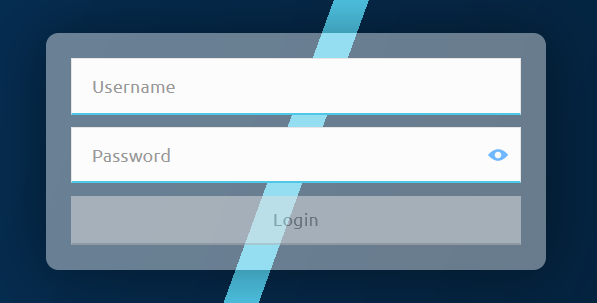

# Aceder ao portal

Ao aceder ao portal, é apresentado um pedido de autenticação. Introduza as suas credenciais na página de início de sessão.

O portal implementa controlo de acesso baseado em funções, o que significa que a função atribuída determina o conjunto de funcionalidades do portal disponíveis. Atualmente, existem as seguintes funções:

* `portaladmin`: tem acesso total a todas as funcionalidades do portal
* `portaluser`: tem acesso limitado às funcionalidades do portal

A tabela seguinte enumera todas as funcionalidades disponíveis, os caminhos de navegação onde é possível aceder-lhes e as permissões das funções aplicáveis.

<table>
<caption><strong>Funcionalidades do portal e caminhos de navegação</strong></caption>
<colgroup>
<col style="width: 30%" />
<col style="width: 30%" />
<col style="width: 20%" />
<col style="width: 20%" />
</colgroup>
<thead>
<tr class="header">
<th>Funcionalidade</th>
<th>Caminho de navegação</th>
<th>portaladmin</th>
<th>portaluser</th>
</tr>
</thead>
<tbody>
<tr class="odd">
<td>
<a href="managing-windows.html">Consultar os detalhes das janelas de liquidação</a>
</td>
<td>
<strong>Settlement</strong> &gt; <strong>Settlement Windows</strong>
</td>
<td>
✓
</td>
<td>
✓
</td>
</tr>
<tr class="even">
<td>
<a href="settling.html#fechar-uma-janela-de-liquidacao">Fechar janelas de liquidação</a>
</td>
<td>
<strong>Settlement</strong> &gt; <strong>Settlement Windows</strong>
</td>
<td>
✓
</td>
<td>
✓
</td>
</tr>
<tr class="even">
<td>
<a href="settling.html#liquidar-uma-janela-de-liquidacao-fechada">Liquidar janelas de liquidação</a>
</td>
<td>
<strong>Settlement</strong> &gt; <strong>Settlement Windows</strong>
</td>
<td>
✓
</td>
<td>
✓
</td>
</tr>
<tr class="even">
<td>
<a href="settling.html#finalizar-uma-liquidacao">Finalizar a liquidação</a>
</td>
<td>
<strong>Settlement</strong> &gt; <strong>Settlement Windows</strong>
</td>
<td>
✓
</td>
<td>
✓
</td>
</tr>
<tr class="odd">
<td>
<a href="checking-settlement-details.html">Consultar os detalhes da liquidação</a>
</td>
<td>
<strong>Settlement</strong> &gt; <strong>Settlements</strong>
</td>
<td>
✓
</td>
<td>
✓
</td>
</tr>
<tr class="odd">
<td>
<a href="monitoring-dfsp-financial-details.html">Consultar os detalhes financeiros dos DFSP</a>
</td>
<td>
<strong>Participants</strong> &gt; <strong>DFSP Financial Positions</strong>
</td>
<td>
✓
</td>
<td>
✓
</td>
</tr>
<tr class="even">
<td>
<a href="enabling-disabling-transactions.html">Desativar e reativar transações de um DFSP</a>
</td>
<td>
<strong>Participants</strong> &gt; <strong>DFSP Financial Positions</strong>
</td>
<td>
✓
</td>
<td>
✓
</td>
</tr>
<tr class="odd">
<td>
<a href="recording-funds-in-out.html">Registar depósitos ou levantamentos nas contas de liquidez dos DFSP</a>
</td>
<td>
<strong>Participants</strong> &gt; <strong>DFSP Financial Positions</strong>
</td>
<td>
✓
</td>
<td>
✓
</td>
</tr>
<tr class="even">
<td>
<a href="updating-ndc.html">Atualizar o Net Debit Cap de um DFSP</a>
</td>
<td>
<strong>Participants</strong> &gt; <strong>DFSP Financial Positions</strong>
</td>
<td>
✓
</td>
<td>
x
</td>
</tr>
<tr class="odd">
<td>
<a href="searching-for-transfer-data.html">Pesquisar dados de transferências</a>
</td>
<td>
<strong>Transfers</strong> &gt; <strong>Find Transfers</strong>
</td>
<td>
✓
</td>
<td>
✓
</td>
</tr>
</tbody>
</table>
