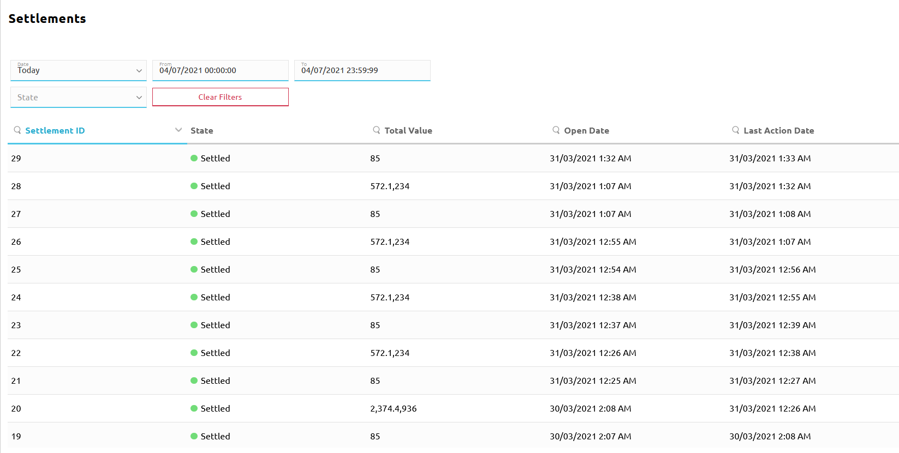
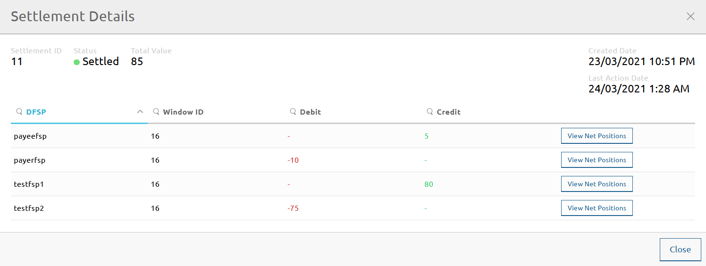

# Consultar os detalhes da liquidação

A página **Settlement > Settlements** permite consultar determinados detalhes das liquidações, tais como:

* o identificador da liquidação
* o estado da liquidação
* o valor total das transações
* os identificadores dos DFSP envolvidos nas transações, bem como a Posição Líquida de Liquidação Multilateral associada no período escolhido

A página **Settlements** apresenta uma lista de liquidações que é possível filtrar através de vários critérios de pesquisa:

* **Date**: disponibiliza uma lista pendente de intervalos de tempo. O valor predefinido é **Today**. \
\
A opção **Clear** permite remover quaisquer filtros de data já aplicados.
* **From** e **To**: apresentam a hora de início e a hora de fim do intervalo de tempo selecionado no campo **Date**. Quando **Date** está definido como **Custom Range**, a data e a hora têm de ser definidas manualmente nos campos **From** e **To**.
* **State**: disponibiliza uma lista pendente de estados da liquidação.
    * **Pending Settlement**: foi criada uma nova liquidação composta por uma ou mais janelas de liquidação. Foi calculada a Posição Líquida de Liquidação Multilateral devida a cada participante ou por cada participante.
    * **Ps Transfers Recorded**: o Hub marcou as transferências afetadas como `RECEIVED_PREPARE` nos seus registos internos.
    * **Ps Transfers Reserved**: o Hub marcou as transferências afetadas como `RESERVED` nos seus registos internos.
    * **Ps Transfers Committed**: o Hub marcou as transferências afetadas como `COMMITTED` nos seus registos internos.
    * **Settling**: a liquidação está em curso.
    * **Settled**: a liquidação foi concluída.
    * **Aborted**: a liquidação não pôde ser concluída e deve ser objeto de rollback.
* Botão **Clear Filters**: permite remover todos os filtros aplicados.

À medida que os critérios de pesquisa são aplicados, a lista de resultados (liquidações) é continuamente atualizada.

São apresentados os seguintes detalhes:

* **Settlement ID**: o identificador único da liquidação.
* **State**: o estado da liquidação.
* **Total Value**: o valor total das transações incluídas no lote de liquidação.
* **Open Date**: a data e a hora em que a liquidação foi criada no Hub.
* **Last Action Date**: a data e a hora em que foi realizada a última ação sobre a liquidação no Hub (por exemplo, os fundos foram reservados, os fundos foram confirmados).
* **Action**: botão **Finalize**. Permite finalizar uma liquidação. Este botão só é apresentado para liquidações no estado Pending Settlement. Para mais detalhes sobre a finalização de uma liquidação, consulte [Liquidar](settling.md#finalizar-uma-liquidacao).

Para consultar os detalhes de uma liquidação específica, clique na liquidação na lista de resultados. É apresentada a janela **Settlement Details**.

São apresentados os seguintes detalhes adicionais:

* **DFSP**: o identificador único do DFSP.
* **Window ID**: o identificador único da janela de liquidação a liquidar.
* **Debit**: montante agregado a débito resultante das transferências em que o DFSP participou.
* **Credit**: montante agregado a crédito resultante das transferências em que o DFSP participou.

::: tip NOTA
À data de redação deste documento, a informação que o botão **View Net Positions** deveria apresentar não está disponível. Será acrescentada numa versão futura do portal.
:::
