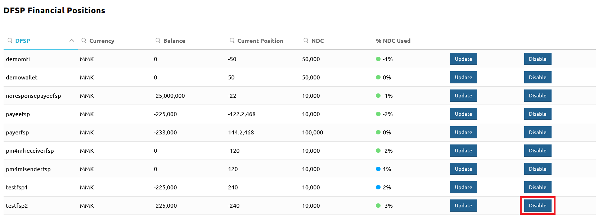
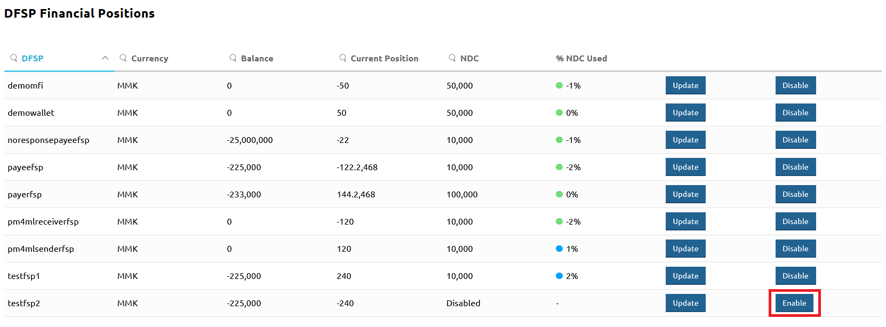

# Desativar e reativar as transações de um DFSP

Em certos casos, pode ser necessário tornar um DFSP inativo, temporária ou definitivamente. Um cenário exemplificativo é a observação de comportamento altamente suspeito cuja causa real necessita de investigação, sendo demasiado elevado o risco de perda de fundos.

A página **Participants** > **DFSP Financial Positions** disponibiliza uma opção para interromper o envio e a receção de transferências de um determinado DFSP, desativando a respetiva Razão Geral de Posição com um clique.

(O Hub mantém uma Razão Geral de Posição para cada DFSP. A Razão Geral de Posição regista quanto um DFSP deve ou lhe é devido. Sempre que uma transferência é processada, a Posição no Hub é ajustada em tempo real.)

Para desativar as transações de um determinado DFSP, execute as seguintes etapas:

::: warning
Desativar um DFSP interrompe todas as transações de entrada e de saída desse DFSP, pelo que esta opção deve ser aplicada com cuidado. Uma vez afastado o risco, não se esqueça de retomar os serviços do DFSP.
:::

1. Vá à página **Participants** > **DFSP Financial Positions**.
1. Localize a entrada do DFSP que pretende desativar.
1. Clique no botão **Disable**.

Para retomar os serviços de um DFSP previamente desativado, execute as seguintes etapas:

1. Vá à página **Participants** > **DFSP Financial Positions**.
1. Localize a entrada do DFSP que pretende ativar.
1. Clique no botão **Enable**.

