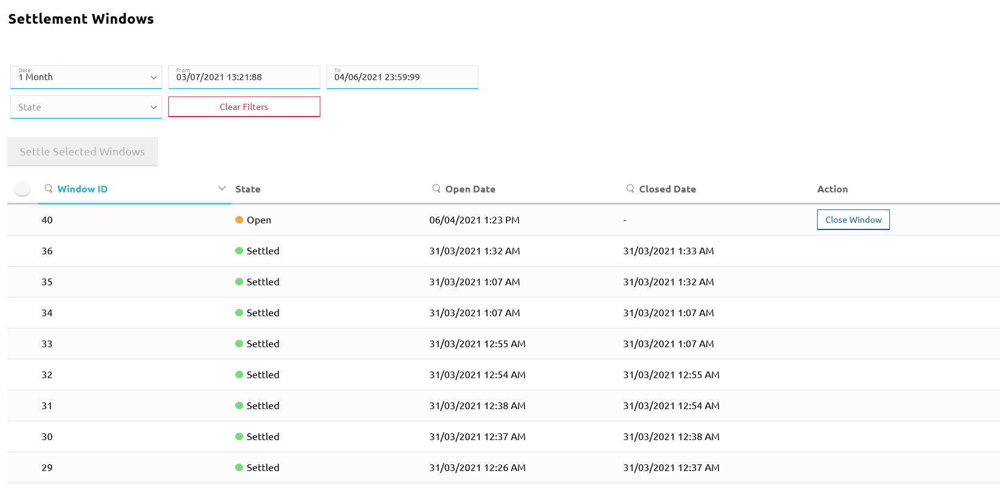

# Consultar os detalhes das janelas de liquidação

A página **Settlement Windows** permite:

* pesquisar janelas de liquidação com base em múltiplos critérios de pesquisa
* fechar uma janela de liquidação aberta
* liquidar uma única janela ou liquidar várias janelas de uma só vez

::: tip NOTA
Recorde-se que a liquidação tem de seguir este procedimento:

* Fechar a janela de liquidação que se pretende liquidar.
* Liquidar a(s) janela(s) fechada(s) à escolha. Isto cria uma nova liquidação.
* Enviar os relatórios de liquidação aos DFSP e ao banco de liquidação e obter do banco a confirmação de que movimentou os fundos em conformidade com o relatório.
* Finalizar a nova liquidação criada na Etapa 2.

Uma vez que fechar uma janela e iniciar a liquidação através da liquidação de janelas selecionadas são parte integrante do processo de liquidação, estas operações são descritas numa secção dedicada à [liquidação](settling.md).
:::

Uma janela de liquidação é um período de tempo entre duas liquidações sucessivas. Tem uma hora de início e uma hora de fim, e quaisquer transferências que ocorram (e atinjam o estado `"COMMITTED"`) enquanto a janela de liquidação está aberta serão liquidadas em conjunto depois de a janela de liquidação fechar.

As transferências que ocorrem na mesma janela de liquidação são liquidadas em lote após o fim da janela de liquidação.

Para aceder à página **Settlement Windows**, vá a **Settlement** > **Settlement Windows**.

A página **Settlement Windows** apresenta uma lista de janelas de liquidação que é possível filtrar através de vários critérios de pesquisa:

* **Date**: disponibiliza uma lista pendente de intervalos de tempo. O valor predefinido é **Today**. \
\
A opção **Clear** permite remover quaisquer filtros de data já aplicados.
* **From** e **To**: apresentam a hora de início e a hora de fim do intervalo de tempo selecionado no campo **Date**. Quando **Date** está definido como **Custom Range**, a data e a hora têm de ser definidas manualmente nos campos **From** e **To**.
* **State**: disponibiliza uma lista pendente de estados da janela de liquidação:
    * **Open**: a janela de liquidação está aberta, estão a ser aceites transferências na janela aberta atual.
    * **Closed**: a janela de liquidação está fechada. Não está a aceitar transferências adicionais e todas as novas transferências estão a ser alocadas a uma nova janela de liquidação aberta.
    * **Pending**: a janela de liquidação está fechada, mas ainda tem de ser liquidada. Uma janela só pode ser liquidada depois de o banco de liquidação ter confirmado que todos os DFSP participantes que efetuaram transferências na janela de liquidação liquidaram os seus pagamentos.
    * **Settled**: o banco de liquidação confirmou que todos os DFSP afetados liquidaram as suas obrigações entre si. Após a confirmação, o Operador do Hub liquidou a janela de liquidação.
    * **Aborted**: a janela de liquidação fazia parte de uma liquidação que foi abortada. É possível adicionar a janela abortada a uma nova liquidação.
    * **Clear**: permite remover quaisquer filtros de estado da janela já aplicados.
* Botão **Clear Filters**: permite remover todos os filtros aplicados.

À medida que os critérios de pesquisa são aplicados, a lista de resultados (janelas de liquidação) é continuamente atualizada. A lista de resultados da pesquisa apresenta os seguintes detalhes:

* Seletor de janela: apresentado apenas para janelas de liquidação no estado **Pending**. Clicar no seletor de janela ativa o botão **Settle Selected Windows**. Para mais detalhes sobre a liquidação de uma janela de liquidação, consulte [Liquidar](settling.md#liquidar-uma-janela-de-liquidacao-fechada).
* **Window ID**: o identificador único da janela de liquidação.
* **State**: o estado da janela de liquidação.
* **Opened Date**: a data e a hora em que a janela de liquidação foi aberta.
* **Closed Date**: a data e a hora em que a janela de liquidação foi fechada.
* **Action**: botão **Close Window**. Permite fechar uma janela de liquidação. Este botão só é apresentado para janelas de liquidação no estado **Open**, uma vez que apenas as janelas abertas podem ser fechadas. Para mais detalhes sobre o fecho de uma janela de liquidação, consulte [Liquidar](settling.md#fechar-uma-janela-de-liquidacao).
