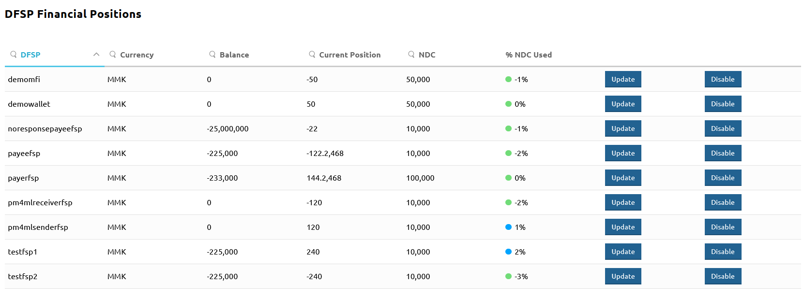

# Monitorizar os detalhes financeiros dos DFSP

A página **DFSP Financial Positions** permite monitorizar os detalhes financeiros dos DFSP, tais como o Saldo, a [Posição](settlement-basic-concepts#position) atual, o [Net Debit Cap](settlement-basic-concepts#liquidity-management-net-debit-cap) e a percentagem de NDC utilizada.

Para aceder à página **DFSP Financial Positions**, vá a **Participants** > **DFSP Financial Positions**.

São apresentados os seguintes detalhes para cada DFSP:

* **Balance**: reflete o saldo da conta de liquidez do DFSP no banco de liquidação.
* **Current Position**: a Posição atual do DFSP. \
\
A Posição de um DFSP reflete – num dado momento – o somatório dos montantes de transferência enviados e recebidos pelo DFSP. A Posição é a soma de todas as transações de saída menos as transações de entrada desde o início da janela de liquidação, bem como quaisquer transferências provisórias que ainda não tenham sido liquidadas. \
\
Cada tentativa de transferência de saída leva a que a Posição seja recalculada em tempo real pelo Hub Mojaloop e, por sua vez, comparada com o Net Debit Cap. \
\
Depois de a janela de liquidação fechar, as Posições são ajustadas com base na liquidação – a Posição passa a corresponder ao montante líquido das transferências que não tinham sido iniciadas ou que ainda não tinham sido cumpridas quando a janela de liquidação fechou.
* **NDC**: o Net Debit Cap definido para o DFSP. \
\
Ao pré-financiarem a sua conta de liquidez, os DFSP definem o montante máximo que podem «dever» a outros DFSP; é a isto que se chama Net Debit Cap (NDC). O NDC funciona como um limite ou um teto imposto aos fundos de um DFSP disponíveis para transacionar, e nunca pode exceder o saldo da conta de liquidez. Isto é necessário para assegurar que as responsabilidades de um DFSP podem ser satisfeitas com fundos imediatamente disponíveis para o banco de liquidação. \
\
A Posição é continuamente verificada face ao Net Debit Cap ((TransferAmount + Position) < = NDC) e, se uma transferência fizer com que o montante da Posição exceda o montante do NDC, a transferência é bloqueada.
* **% NDC Used**: um indicador Posição/NDC que apresenta a percentagem de NDC utilizada.
