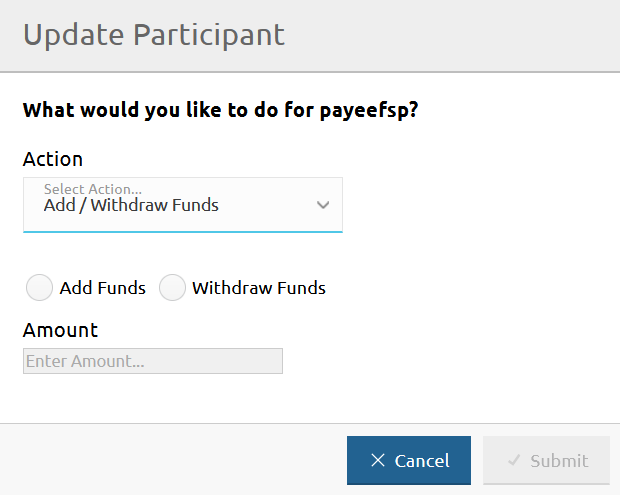
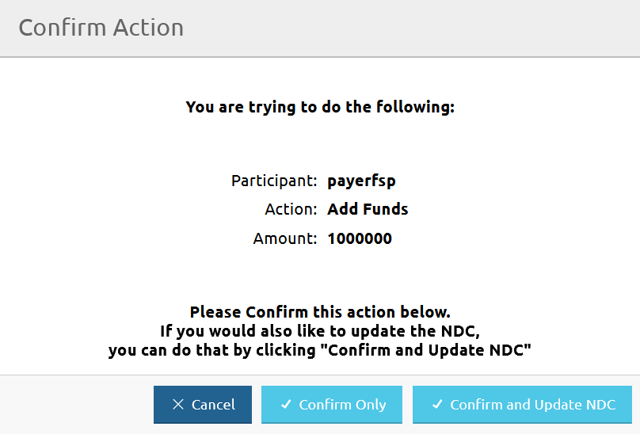
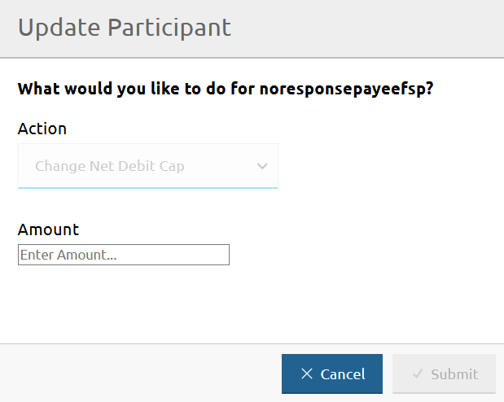

# Registar entradas ou saídas de fundos de um DFSP

A página **DFSP Financial Positions** permite registar entradas ou saídas de fundos nas razões gerais do Hub, no caso de movimentos de fundos iniciados pelo DFSP: um DFSP deposita fundos na sua conta de liquidez ou levanta fundos da sua conta de liquidez.

Para aceder à página **DFSP Financial Positions**, vá a **Participants** > **DFSP Financial Positions**.

Para registar entradas ou saídas de fundos de um DFSP, execute as seguintes etapas:

1. Clique no botão **Update** junto ao DFSP para o qual pretende registar entradas ou saídas de fundos. \
 \
Abre-se a janela **Update Participant**.
1. Selecione **Add / Withdraw Funds** no menu pendente **Action**. \

1. Selecione a opção **Add Funds** ou **Withdraw Funds**, consoante a ação pretendida. \
Para registar um depósito, utilize **Add Funds**. \
Para registar um levantamento, utilize **Withdraw Funds**. \

1. Introduza o montante depositado ou levantado pelo DFSP no campo **Amount**. \
Não indique um sinal de mais ou de menos ao introduzir o montante. Em vez disso, certifique-se de que selecionou a ação correta na etapa anterior.
1. Clique em **Submit**.
1. Ao clicar em **Submit**, abre-se uma janela de confirmação que pede para confirmar a ação, ou para confirmar e atualizar também o Net Debit Cap do DFSP. \

1. Clique em **Confirm Only** ou em **Confirm and Update NDC**. \
\
Ao clicar em **Confirm Only**, o valor **Balance** na página **DFSP Financial Positions** é atualizado e o Hub ajusta as razões gerais. \
\
Ao clicar em **Confirm and Update NDC**, a janela **Update Participant** muda e permite atualizar o Net Debit Cap (NDC). \

