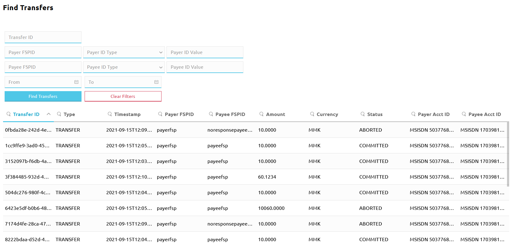
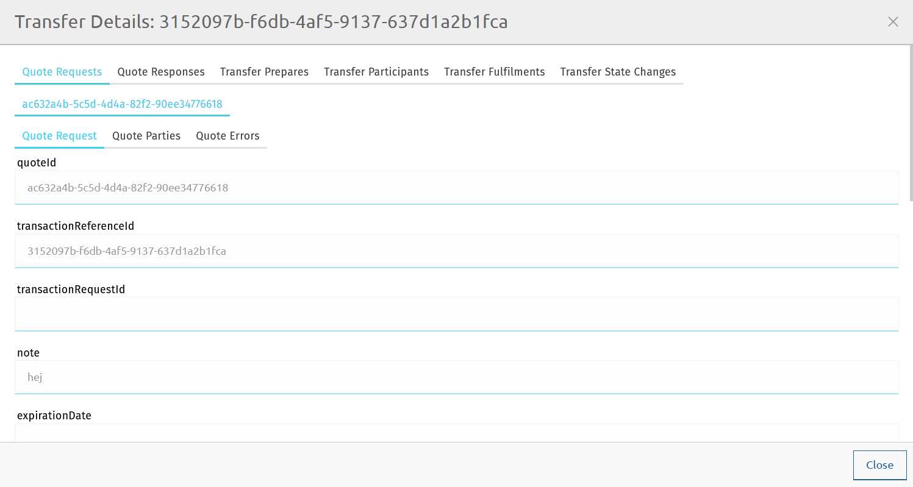
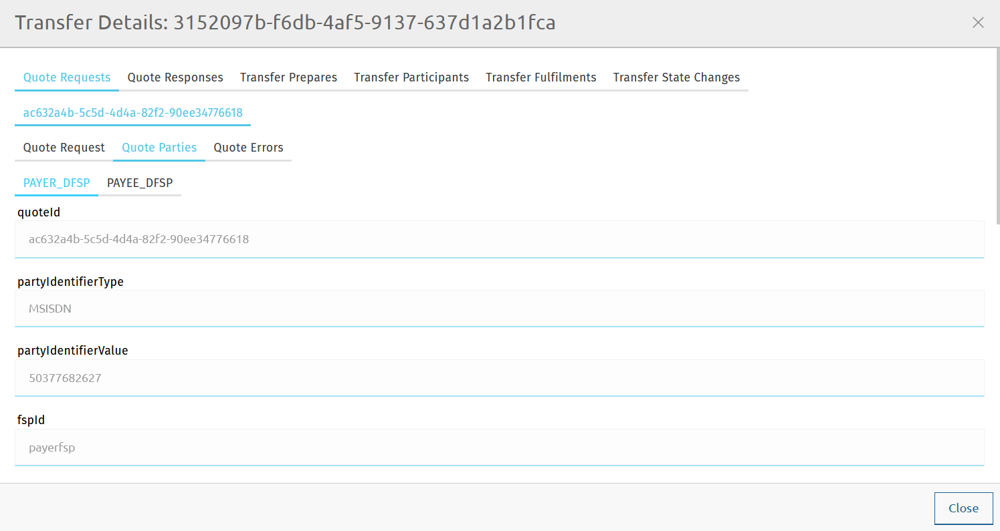
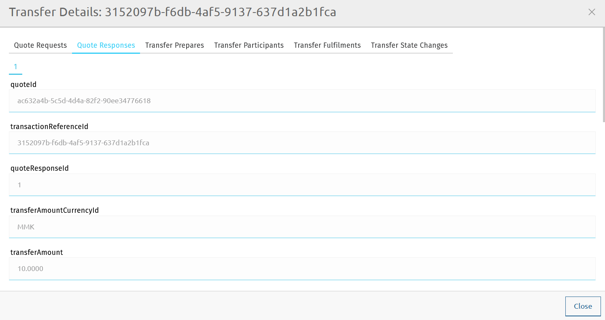
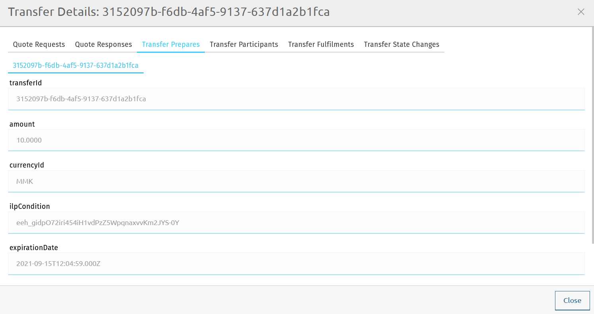
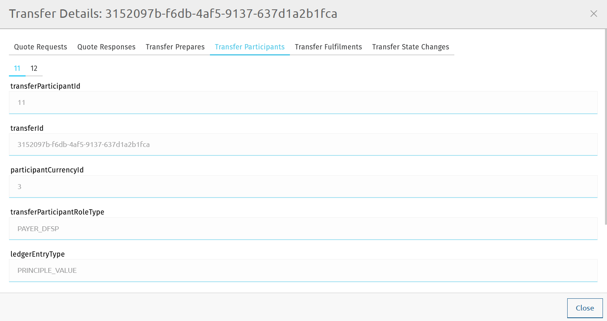
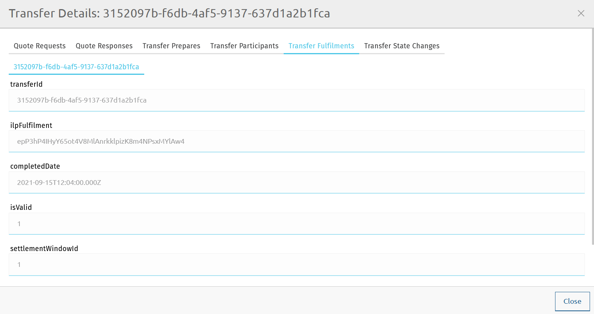
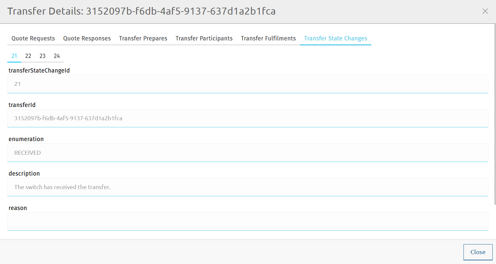

# Pesquisar dados de transferências

O Finance Portal disponibiliza uma página de pesquisa de transferências, que permite localizar dados de transferências com base em identificadores de DFSP, identificadores de utilizadores finais ou identificadores de transferência. É útil na resolução de problemas.

::: tip NOTA
Os valores apresentados na página **Find Transfers** são obtidos a partir da base de dados `central-ledger` do Hub.
:::

## Localizar transferências

Para localizar transferências, execute as seguintes etapas:

1. Vá a **Transfers** > **Find Transfers**. É apresentada a página **Find Transfers**. \

1. Utilize os filtros de pesquisa para especificar o que pretende localizar. É possível preencher qualquer número de campos de pesquisa, em qualquer combinação.
    * **Transfer ID**: introduza um `transferId` completo ou um fragmento de um `transferId`.
    * **Payer FSP ID**: introduza o `fspId` completo ou um fragmento do `fspId` do DFSP Pagador.
    * **Payer ID Type**: na lista pendente, selecione o tipo de identificador utilizado para identificar o Pagador (por exemplo, **MSISDN** ou **ACCOUNT_ID**).
    * **Payer ID Value**: introduza o identificador completo ou um fragmento do identificador utilizado para identificar o Pagador (por exemplo, um número de telefone ou um número de conta bancária).
    * **Payee FSPID**: introduza o `fspId` completo ou um fragmento do `fspId` do DFSP Beneficiário.
    * **Payee ID Type**: na lista pendente, selecione o tipo de identificador utilizado para identificar o Beneficiário.
    * **Payee ID Value**: introduza o identificador completo ou um fragmento do identificador utilizado para identificar o Beneficiário.
    * **From** e **To**: introduza a hora de início e a hora de fim do intervalo de tempo em que ocorreu(ocorreram) a(s) transferência(s) pretendida(s).
1. Depois de definidos os filtros de pesquisa, clique em **Find Transfers**. É apresentada a lista de resultados que satisfazem os critérios de pesquisa.

Utilize os botões de navegação de páginas no fundo do ecrã para navegar entre as páginas de resultados da pesquisa.

É possível remover todos os filtros aplicados e recomeçar a pesquisa de raiz clicando em **Clear Filters**.

Os resultados da pesquisa são apresentados em colunas. Todas as colunas são ordenáveis:

* Clique no cabeçalho de uma coluna para alterar a ordenação dos valores apresentados na coluna.
* Clique no ícone da lupa no cabeçalho da coluna e introduza o valor pretendido.

::: tip
O número total de transferências devolvidas está limitado a mil (1000) (para não sobrecarregar o backend). Se não for possível encontrar a transferência pretendida nos primeiros mil resultados, restrinja a pesquisa através dos filtros de pesquisa. \
 \
Se a pesquisa devolver mais de quinhentos (500) resultados, a página apresenta uma mensagem informativa, para dar a saber que não são necessariamente visíveis todos os resultados que satisfazem os critérios de pesquisa originais e que é preciso detalhar mais a pesquisa.
:::

São apresentados os seguintes detalhes de uma transferência:

::: tip NOTA
As transferências sem cotações (ou seja, as transferências de «add/withdraw funds» e as transferências de liquidação) apresentam apenas detalhes dos seguintes campos: **Transfer ID**, **Timestamp**, **Amount**, **Currency**, **Status**.
:::

* **Transfer ID**: o identificador único da transferência (corresponde a `transferId`).
* **Type**: o tipo da transferência (corresponde a `transactionType` no Payment Manager e a `transactionScenario` na API FSPIOP do Mojaloop).
* **Timestamp**: a data e a hora em que o pedido de transferência foi criado, sob a forma de um carimbo temporal no formato [ISO-8601](https://www.iso.org/iso-8601-date-and-time-format.html).
* **Payer FSPID**: o `fspId` do DFSP Pagador.
* **Payee FSPID**: o `fspId` do DFSP Beneficiário.
* **Amount**: o montante da transferência.
* **Currency**: a moeda da transferência.
* **Status**: o estado da transferência (corresponde a `transferState` no Payment Manager e na API FSPIOP do Mojaloop).
* **Payer Acct ID**: o tipo de identificador e o valor do identificador da conta do Pagador.
* **Payee Acct ID**: o tipo de identificador e o valor do identificador da conta do Beneficiário.

## Detalhes da transferência

Para obter mais detalhes sobre um resultado de pesquisa específico, clique na respetiva entrada na lista de resultados. Abre-se a janela **Transfer Details**. Esta secção fornece informação sobre os detalhes apresentados para uma transferência.

### Quote Requests

O separador **Quote Requests** apresenta o `quoteId` e informação adicional em subseparadores.

#### Subseparador Quote Request

O subseparador **Quote Request** apresenta os seguintes detalhes sobre o pedido de cotação:

* **quoteId**: o identificador único da cotação, decidido pelo DFSP Pagador.
* **transactionReferenceId**: corresponde ao `transactionId` especificado no pedido de cotação.
* **transactionRequestId**: opcional. ID comum entre os DFSP para o objeto de pedido de transação, decidido pelo DFSP Beneficiário.
* **note**: um memorando opcional associado à transferência.
* **expirationDate**: uma data de expiração opcional do pedido de cotação, sob a forma de um carimbo temporal no formato [ISO-8601](https://www.iso.org/iso-8601-date-and-time-format.html).
* **amount**: o montante para o qual a cotação está a ser pedida.
* **createdDate**: a data e a hora em que o pedido de cotação foi criado, sob a forma de um carimbo temporal no formato [ISO-8601](https://www.iso.org/iso-8601-date-and-time-format.html).
* **transactionInitiator**: especifica se quem inicia a transferência é o **PAYER** ou o **PAYEE**.
* **transactionInitiatorType**: especifica o tipo de iniciador:
    * **CONSUMER**: o consumidor é quem inicia a transação. Por exemplo: transferência entre pares ou reembolso de empréstimo a partir da carteira.
    * **AGENT**: o agente é quem inicia a transação. Por exemplo: reembolso de empréstimo através de um agente.
    * **BUSINESS**: a empresa é quem inicia a transação. Por exemplo: desembolso de empréstimo.
    * **DEVICE**: o dispositivo é quem inicia a transação. Por exemplo: pagamento a comerciante iniciado pelo comerciante e autorizado no POS.
* **transactionScenario**: especifica o cenário da transação (corresponde a `transactionType` no Payment Manager).
* **transactionSubScenario**: especifica o subcenário da transação definido pelo scheme.
* **balanceOfPaymentsType**: o código BoP tal como definido no [Sistema de Codificação da Balança de Pagamentos do FMI](https://www.imf.org/external/np/sta/bopcode/).
* **amountType**: **SEND** para montante enviado, **RECEIVE** para montante recebido.
* **currency**: a moeda do montante para o qual a cotação está a ser pedida. Um código alfabético de três letras em conformidade com a [ISO 4217](https://www.iso.org/iso-4217-currency-codes.html).

#### Subseparador Quote Parties

O subseparador **Quote Parties** apresenta os seguintes detalhes sobre o DFSP Pagador e o DFSP Beneficiário:

* **quoteId**: o identificador único da cotação, decidido pelo DFSP Pagador.
* **partyIdentifierType**: o tipo de identificador utilizado para identificar a parte (por exemplo, **MSISDN** ou **ACCOUNT_ID**).
* **partyIdentifierValue**: o valor do identificador utilizado para identificar a parte (por exemplo, um número de telefone ou um número de conta bancária).
* **fspId**: o identificador único do DFSP registado no Hub (corresponde a `fspId`) — tal como fornecido na cotação.
* **merchantClassificationCode**: utilizado quando o Beneficiário é um comerciante que aceita pagamentos a comerciantes.
* **partyName**: o nome apresentado da parte.
* **transferParticipantRoleType**: o papel que o DFSP desempenha na transferência.
* **ledgerEntryType**: o tipo de lançamento financeiro que esta parte apresenta — valor principal (ou seja, o montante que o Pagador quer que o Beneficiário receba) ou comissão de intercâmbio.
* **amount**: o montante para o qual a cotação está a ser pedida.
* **currency**: a moeda do montante para o qual a cotação está a ser pedida. Um código alfabético de três letras em conformidade com a [ISO 4217](https://www.iso.org/iso-4217-currency-codes.html).
* **createdDate**: a data e a hora em que o pedido de cotação foi criado, sob a forma de um carimbo temporal no formato [ISO-8601](https://www.iso.org/iso-8601-date-and-time-format.html).
* **partySubIdOrTypeId**: um subidentificador ou subtipo da parte.
* **participant**: referência ao `fspId` resolvido (se fornecido/conhecido).

#### Subseparador Quote Errors

O subseparador **Quote Errors** só apresenta informação se tiver ocorrido um erro na fase das cotações.

### Quote Responses

O separador **Quote Responses** apresenta detalhes sobre a resposta à cotação:

* **quoteId**: o identificador único da cotação, decidido pelo DFSP Pagador.
* **transactionReferenceId**: corresponde ao `transactionId` especificado no pedido de cotação.
* **quoteResponseId**: o identificador único da resposta à cotação.
* **transferAmountCurrencyId**: a moeda do montante da transferência. Um código alfabético de três letras em conformidade com a [ISO 4217](https://www.iso.org/iso-4217-currency-codes.html).
* **transferAmount**: o montante que o DFSP Pagador deve transferir para o DFSP Beneficiário.
* **payeeReceiveAmountCurrencyId**: a moeda do montante que o Beneficiário deve receber na transação ponta a ponta.
* **payeeReceiveAmount**: o montante que o Beneficiário deve receber na transação ponta a ponta.
* **payeeFspFeeCurrencyId**: a moeda da parte do DFSP Beneficiário na comissão da transação (se aplicável). Um código alfabético de três letras em conformidade com a [ISO 4217](https://www.iso.org/iso-4217-currency-codes.html).
* **payeeFspFeeAmount**: a parte do DFSP Beneficiário na comissão da transação (se aplicável).
* **payeeFspCommissionCurrencyId**: a moeda da comissão da transação proveniente do DFSP Beneficiário (se aplicável). Um código alfabético de três letras em conformidade com a [ISO 4217](https://www.iso.org/iso-4217-currency-codes.html).
* **payeeFspCommissionAmount**: a comissão da transação proveniente do DFSP Beneficiário (se aplicável).
* **ilpCondition**: a condição ILP que tem de ser associada à transferência pelo lado do Pagador.
* **responseExpirationDate**: a data de expiração da cotação, sob a forma de um carimbo temporal no formato [ISO-8601](https://www.iso.org/iso-8601-date-and-time-format.html).
* **isValid**: um indicador de se a resposta à cotação passou ou não a validação do pedido e as verificações de duplicação.
* **createdDate**: a data e a hora em que o pedido de cotação foi criado, sob a forma de um carimbo temporal no formato [ISO-8601](https://www.iso.org/iso-8601-date-and-time-format.html).
* **ilpPacket**: o pacote ILP devolvido pelo lado do Beneficiário em resposta ao pedido de cotação.

### Transfer Prepares

O separador **Transfer Prepares** apresenta detalhes sobre o pedido de transferência:

* **transferId**: o identificador único da transferência.
* **amount**: o montante que o DFSP Pagador deve transferir para o DFSP Beneficiário.
* **currencyId**: a moeda do montante da transferência. Um código alfabético de três letras em conformidade com a [ISO 4217](https://www.iso.org/iso-4217-currency-codes.html).
* **ilpCondition**: a condição ILP que tem de ser cumprida para confirmar a transferência.
* **expirationDate**: a data de expiração da transferência, sob a forma de um carimbo temporal no formato [ISO-8601](https://www.iso.org/iso-8601-date-and-time-format.html).
* **createdDate**: a data e a hora em que o pedido de transferência foi criado, sob a forma de um carimbo temporal no formato [ISO-8601](https://www.iso.org/iso-8601-date-and-time-format.html).

### Transfer Participants

O separador **Transfer Participants** apresenta os seguintes detalhes sobre os participantes da transferência:

* **transferParticipantId**: o identificador interno do participante do scheme (DFSP) para o qual o relatório é pedido; corresponde ao `participantId` tal como registado no Hub.
* **transferId**: o identificador único da transferência.
* **participantCurrencyId**: a moeda em que o participante (DFSP) transaciona. Um código alfabético de três letras em conformidade com a [ISO 4217](https://www.iso.org/iso-4217-currency-codes.html).
* **transferParticipantRoleType**: o papel que o DFSP desempenha na transferência.
* **ledgerEntryType**: o tipo de lançamento financeiro que esta parte apresenta — valor principal (ou seja, o montante que o Pagador quer que o Beneficiário receba) ou comissão de intercâmbio.
* **amount**: o montante da transferência.
* **createdDate**: a data e a hora em que o pedido de transferência foi criado, sob a forma de um carimbo temporal no formato [ISO-8601](https://www.iso.org/iso-8601-date-and-time-format.html).

### Transfer Fulfilments

O separador **Transfer Fulfilments** apresenta os seguintes detalhes sobre a resposta à transferência:

* **transferId**: o identificador único da transferência.
* **ilpFulfilment**: o cumprimento da condição ILP especificada no pedido de transferência.
* **completedDate**: a data e a hora em que a transferência foi concluída, sob a forma de um carimbo temporal no formato [ISO-8601](https://www.iso.org/iso-8601-date-and-time-format.html).
* **isValid**: um indicador de se o cumprimento da transferência é ou não válido.
* **settlementWindowId**: o identificador da janela de liquidação à qual esta transferência foi atribuída.
* **createdDate**: a data e a hora em que a resposta à transferência foi criada, sob a forma de um carimbo temporal no formato [ISO-8601](https://www.iso.org/iso-8601-date-and-time-format.html).

### Transfer State Changes

O separador **Transfer State Changes** apresenta os seguintes detalhes sobre os estados por que passa uma transferência:

* **transferStateChangeId**: o identificador único do estado da transferência.
* **transferId**: o identificador único da transferência.
* **enumeration**: o estado da transferência (corresponde a `transferState` no Payment Manager e na API FSPIOP do Mojaloop).
* **description**: a descrição do significado do estado.
* **reason**: a razão pela qual a transferência passou a um determinado estado.
* **createdDate**: a data e a hora em que a transferência atingiu um determinado estado, sob a forma de um carimbo temporal no formato [ISO-8601](https://www.iso.org/iso-8601-date-and-time-format.html).
