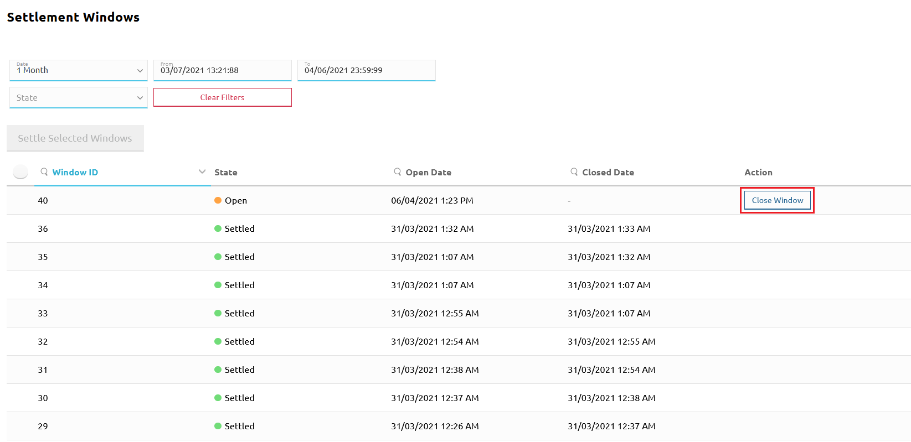
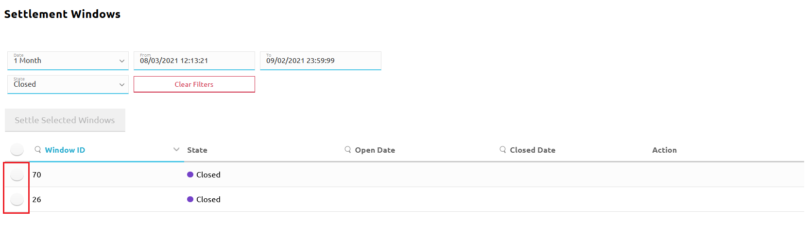
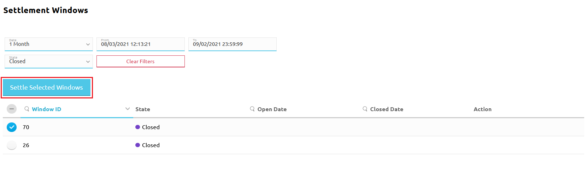
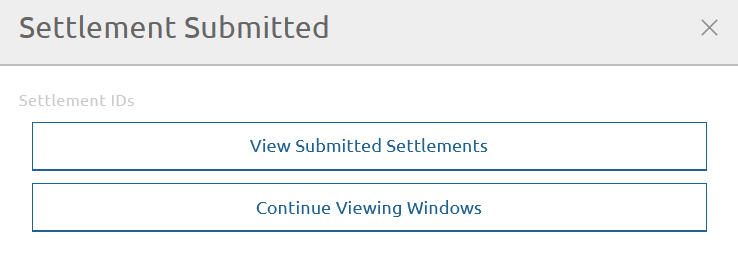
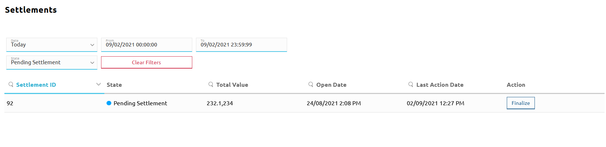
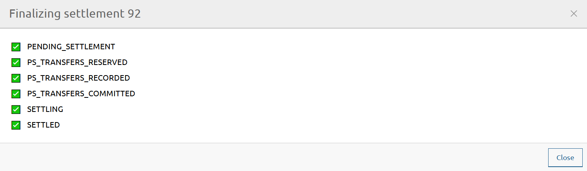

# Liquidar

1. [Fechar a janela de liquidação](#fechar-uma-janela-de-liquidacao) que se pretende liquidar.
1. [Liquidar a(s) janela(s) fechada(s) à escolha](#liquidar-uma-janela-de-liquidacao-fechada). Isto cria uma nova liquidação.
1. Enviar os relatórios de liquidação aos DFSP e ao banco de liquidação e obter do banco a confirmação de que movimentou os fundos em conformidade com o relatório.
1. [Finalizar a nova liquidação](#finalizar-uma-liquidacao) criada na Etapa 2.

Esta secção descreve as etapas do processo (Etapas 1, 2 e 4) que são realizadas através do portal.

## Fechar uma janela de liquidação

Para fechar uma janela de liquidação aberta, execute as seguintes etapas:

1. Vá a **Settlement** > **Settlement Windows**. É apresentada a página **Settlement Windows**.
1. Localize a janela de liquidação pretendida, [utilizando os filtros de pesquisa](managing-windows.md).
1. A janela aberta terá um botão **Close Window** apresentado junto a si, na coluna **Action**. Clique no botão **Close Window**.

Fechar uma janela abre automaticamente uma nova janela no estado **Open**.

## Liquidar uma janela de liquidação fechada

Para liquidar uma ou mais janelas de liquidação, execute as seguintes etapas:

1. Vá a **Settlement** > **Settlement Windows**. É apresentada a página **Settlement Windows**.
1. Localize a janela de liquidação pretendida, [utilizando os filtros de pesquisa](managing-windows.md). A janela de liquidação tem de estar no estado **Closed**.
1. Clique no seletor de janela junto à(s) janela(s) de liquidação que pretende liquidar. \
\
 \
\
Isto ativa o botão **Settle Selected Windows**. Clique no botão **Settle Selected Windows**. \
\

1. Abre-se a janela **Settlement Submitted**, onde estão disponíveis as seguintes opções:

* Ver as liquidações submetidas
* Continuar a ver as janelas \
\
 \
\
Para ver a nova liquidação acabada de criar, clique no botão **View Submitted Settlements**. Isto conduz à página **Settlements**, onde é possível pesquisar a nova liquidação, [utilizando os filtros de pesquisa](checking-settlement-details.md). A liquidação estará no estado **Pending Settlement**.

## Finalizar uma liquidação

Para finalizar a liquidação, execute as seguintes etapas:

**Pré-requisitos:**

* O banco de liquidação confirmou que todas as Posições MLNS dos DFSP foram liquidadas.

**Etapas:**

1. Vá a **Settlement** > **Settlements**. É apresentada a página **Settlements**.
1. Localize a liquidação pretendida, utilizando os [filtros de pesquisa](checking-settlement-details.md). A liquidação tem de estar no estado **Pending Settlement**. \
\

1. Clique no botão **Finalize** junto à liquidação. Abre-se uma janela de estado que apresenta os estados da liquidação, sendo acrescentadas marcas de verificação à medida que o processo de liquidação avança. \
\
Quando a liquidação estiver finalizada, todos os estados serão apresentados com marcas de verificação ao lado. O último estado indicará **State: SETTLED.** Além disso, o botão **Close** ficará ativo, permitindo regressar à página **Settlements**. \
\

1. De volta à página **Settlements**, ao procurar a liquidação, o estado da liquidação deverá agora ser apresentado como **Settled**.

::: tip
Caso o estado da liquidação seja diferente de **Settled**, significa que a liquidação não terminou por alguma razão. Clique novamente em **Finalize** para concluir o processo de liquidação inacabado.
:::
