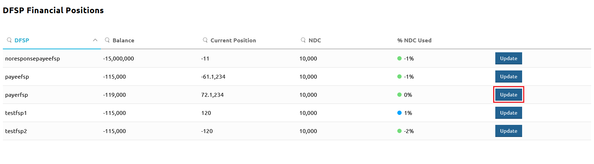
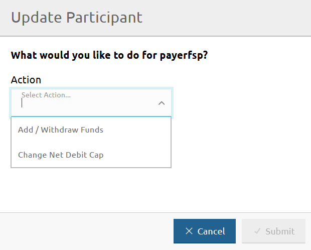
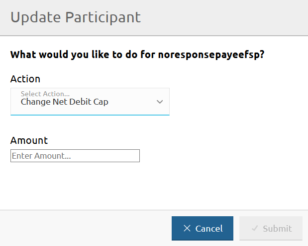
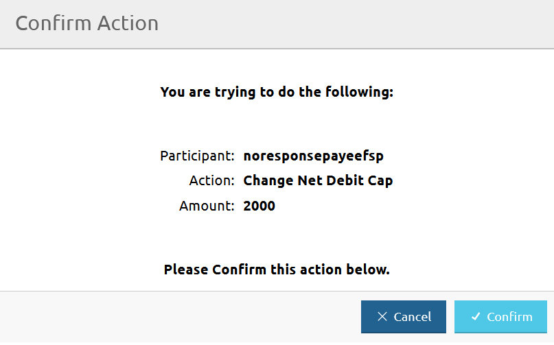

# Atualizar o Net Debit Cap de um DFSP

A página **DFSP Financial Positions** permite atualizar o Net Debit Cap (NDC) de um DFSP.

Para aceder à página **DFSP Financial Positions**, vá a **Participants** > **DFSP Financial Positions**.

Para atualizar o Net Debit Cap de um DFSP, execute as seguintes etapas:

1. Clique no botão **Update** junto ao DFSP para o qual pretende atualizar o NDC. \

Abre-se a janela **Update Participant**.
1. Selecione **Change Net Debit Cap** no menu pendente **Action**. \

1. Introduza o novo montante do NDC no campo **Amount**. \

1. Clique em **Submit**.
1. Ao clicar em **Submit**, abre-se uma janela de confirmação que pede para confirmar a ação. \

1. Clique em **Confirm**. \
Ao clicar em **Confirm**, o valor **NDC** na página **DFSP Financial Positions** é atualizado e apresenta o novo montante do NDC.
