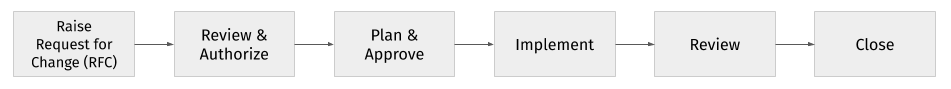
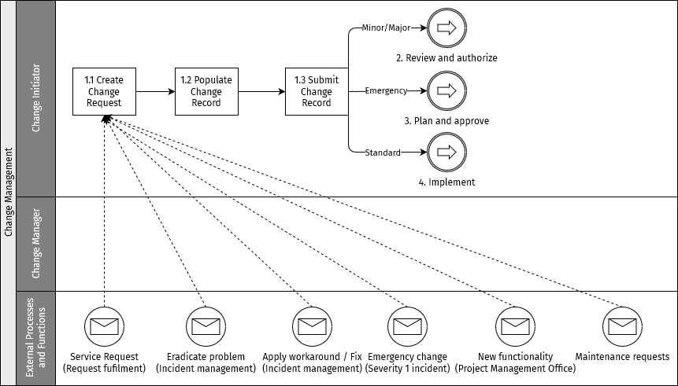
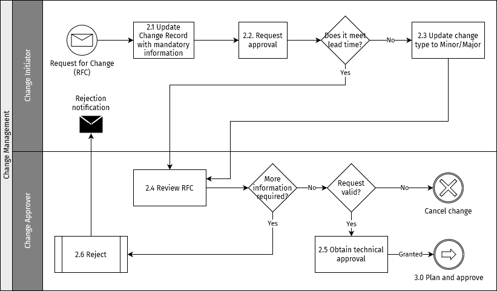
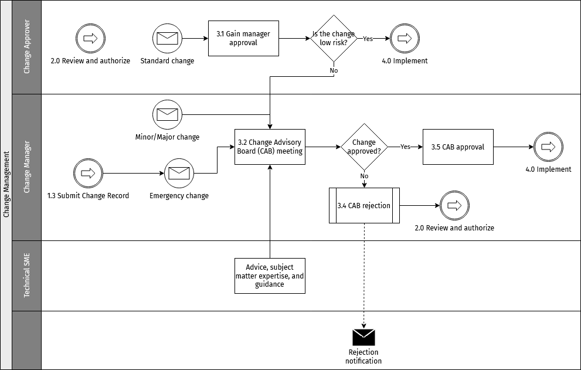
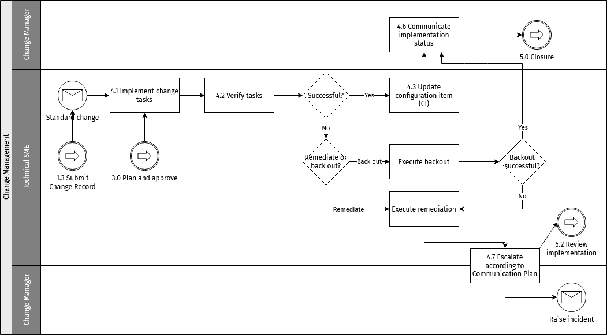
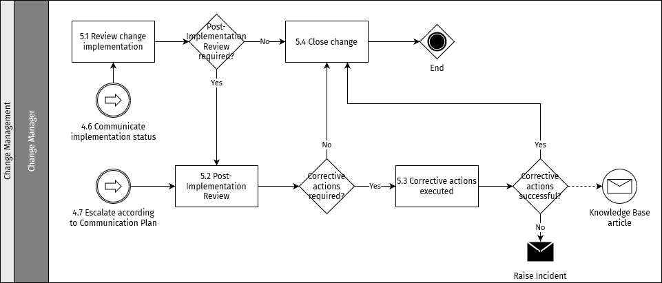

# Gestão da mudança

O objetivo do processo de gestão da mudança é controlar o ciclo de vida de todas as alterações, permitindo que estas sejam efetuadas com a mínima perturbação dos serviços de TI.

::: tip NOTA
Os processos descritos nesta secção representam boas práticas e funcionam como recomendações para as organizações que desempenham o papel de Operador do Hub.
:::

## Objetivos

Os objetivos da gestão da mudança são:

* Responder a requisitos de negócio em evolução, maximizando o valor e reduzindo os incidentes e o retrabalho
* Responder aos Pedidos de Alteração (RFC) que alinharão os serviços com as necessidades do negócio
* Assegurar que as alterações são registadas e avaliadas e que as alterações autorizadas são geridas de forma controlada
* Otimizar o risco global do negócio

## Âmbito

O âmbito da gestão da mudança deve incluir alterações a todas as arquiteturas, processos, ferramentas, métricas e documentação, bem como alterações a todos os itens de configuração (CI) ao longo de todo o ciclo de vida do serviço.

Todas as alterações têm de ser registadas e geridas num ambiente controlado, em todos os CI. Estes podem ser ativos físicos, como servidores ou redes, ativos virtuais, como servidores virtuais ou armazenamento, ou outros tipos de ativos, como acordos ou contratos.

A gestão da mudança não é responsável por coordenar todos os processos de gestão de serviço para assegurar a implementação harmoniosa dos projetos.

## Funções e responsabilidades

As funções indicadas abaixo apontam algumas das partes interessadas cruciais para tornar eficaz o processo de gestão da mudança.

### Gestor da Mudança

O Gestor da Mudança atua como líder, sendo responsável pelo processo global de gestão da mudança.

As principais responsabilidades do Gestor da Mudança são:

* Promover a eficiência e a eficácia do processo de gestão da mudança
* Produzir informação de gestão
* Monitorizar a eficácia da gestão da mudança e formular recomendações de melhoria
* Cumprir o processo de gestão da mudança
* Planear e gerir o suporte às ferramentas e aos processos de gestão da mudança
* Verificar se os RFC estão corretamente preenchidos e atribuídos às autoridades de mudança (se aplicável)
* Comunicar às partes afetadas as decisões das autoridades de mudança
* Monitorizar e rever as atividades
* Publicar o calendário de alterações e a indisponibilidade de serviço prevista
* Realizar revisões pós-implementação para validar os resultados dos pedidos de alteração
* Determinar a satisfação do negócio com os pedidos de alteração

### Coordenador da Mudança

Os Coordenadores da Mudança são membros da equipa de Suporte que tratam dos detalhes de um pedido de alteração.

As responsabilidades de um Coordenador da Mudança incluem:

* Reunir a informação adequada em função do tipo de alteração em análise
* Associar ao pedido de alteração os itens de configuração, incidentes e serviços relacionados
* Fornecer atualizações de estado a quem solicitou
* Rever os planos e os calendários das alterações. As atividades de planeamento incluem calendarizar o pedido de alteração, avaliar o risco e o impacto, criar planos, definir e sequenciar as tarefas necessárias para concretizar o pedido de alteração e alocar pessoas e recursos a cada tarefa.
* Rever todas as tarefas concluídas. Na fase de [Implementar](#passo-4-implementar), pelo menos uma tarefa relativa ao pedido de alteração está em curso.
* Realizar revisões pós-implementação para validar os resultados do pedido de alteração
* Determinar a satisfação de quem solicitou com o pedido de alteração

### Iniciador da Mudança

Um Iniciador da Mudança é uma pessoa que inicia ou solicita uma alteração, a partir de um papel de negócio ou técnico. Várias pessoas podem iniciar uma alteração; esta função não é exclusiva de uma única pessoa. Quem inicia/solicita a alteração tem de fornecer toda a informação e justificação necessárias para a alteração.

Outras responsabilidades de um Iniciador da Mudança incluem:

* Preencher e submeter uma proposta de alteração (se necessário)
* Preencher e submeter um Pedido de Alteração (RFC)
* Participar nas reuniões do Change Advisory Board (CAB) para prestar informação adicional
* Rever as alterações quando solicitado pela Gestão da Mudança

### Implementador da Mudança

É a pessoa considerada responsável pelo pedido de alteração ao longo de todo o ciclo de vida do pedido. Implementar uma alteração exige aprovação maker/checker, ou seja, todas as alterações exigem que uma pessoa execute a alteração e outra a valide.

As responsabilidades de um Implementador da Mudança incluem:

* Articular-se com quem solicitou a alteração quanto a questões e problemas de negócio e técnicos, caso existam
* Criar um RFC e atualizar o seu estado sempre que necessário
* Verificar e decidir uma data de implementação, assegurando que não entra em conflito com outras atividades, por exemplo, prazos de antecedência, janelas de alteração, e assim por diante
* Avaliar e gerir o risco envolvido ao longo do ciclo de vida do pedido de alteração
* Testar e implementar a alteração
* Coordenar e comunicar com qualquer outra equipa afetada antes de submeter a alteração (na ausência do Coordenador da Mudança)
* Uma vez aprovada a alteração, criar um caso de remediação para a alteração calendarizada
* Executar a alteração na data e hora calendarizadas
* Fornecer o estado de encerramento após a conclusão bem-sucedida
* Documentar o procedimento da alteração após a sua implementação

### Aprovador da Mudança

É a pessoa que dá a aprovação de primeiro nível a um Pedido de Alteração antes de este seguir para revisão pelo Change Advisory Board. Os Aprovadores da Mudança são delimitados por diferentes alterações do Hub, o que significa que esta função pode ser ocupada por diferentes pessoas em vários níveis hierárquicos do quadro de gestão da mudança, cada uma com a sua área onde atua como aprovador.

As responsabilidades de um Aprovador da Mudança incluem:

* Rever todos os RFC submetidos por quem inicia/solicita a alteração
* Assegurar que o pedido de alteração atingiu o nível de preparação necessário para justificar uma decisão do Gestor da Mudança e do CAB
* Rever e comentar o conteúdo do Registo de Alteração, a saber: Plano da Alteração, Plano de Implementação, Testes e Remediação, e Calendário
* Conceder a aprovação uma vez satisfeito de que todos os critérios pertinentes foram cumpridos e as preocupações endereçadas, OU recusar a aprovação, expondo com clareza as preocupações e reservas quanto ao conteúdo do Registo de Alteração
* O desfecho das alterações falhadas em que o resultado negativo decorre de uma aprovação mal determinada

### Especialista Técnico

O Especialista Técnico (SME) é uma pessoa que é uma autoridade numa determinada área ou tema técnico. Em relação à gestão da mudança, o SME é responsável por:

* Fornecer os Planos detalhados de Implementação, Testes e Remediação
* Participar na reunião do CAB para responder a perguntas e preocupações sobre a alteração dos aprovadores e da Gestão da Mudança (se convidado)
* A implementação das tarefas de alteração e a atualização dos registos pertinentes na ferramenta de gestão da mudança quanto ao estado da implementação
* Rever e refazer uma alteração quando solicitado, e contribuir para a revisão de uma alteração após a implementação

### Membro do CAB

O Change Advisory Board (CAB) envolve membros de diferentes domínios, incluindo segurança da informação, operações, desenvolvimento, redes, Service Desk e relações de negócio, entre outros. Um membro do CAB tem as seguintes responsabilidades:

* Divulgar os RFC dentro da sua área de responsabilidade e coordenar o retorno
* Rever os RFC e recomendar se devem ser autorizados
* Rever as alterações bem-sucedidas, falhadas e não autorizadas
* Rever o calendário de alterações e a indisponibilidade de serviço prevista

### Presidente do CAB

O Presidente do CAB é responsável por:

* Convocar e presidir às reuniões do CAB
* Supervisionar o processo global de gestão da mudança
* Assegurar que o CAB cumpre o mandato quanto às políticas e procedimentos relativos às alterações

## Tipos de alteração

O processo de gestão da mudança trata dos seguintes tipos de alteração.

### Alterações padrão

Uma alteração padrão é uma alteração a um serviço ou a outro item de configuração que foi previamente autorizada e que, por isso, não necessita de passar pelo processo de aprovação. Para ser considerada candidata a tornar-se uma alteração padrão, têm de ter sido implementadas com êxito pelo menos três alterações menores. Um pedido de alteração padrão tem então de ser submetido ao Change Advisory Board para aprovação.

O risco de uma alteração padrão tem de ser baixo e bem compreendido, as tarefas têm de ser bem conhecidas, documentadas e comprovadas, e tem de existir um desencadeador definido para a iniciar, como um evento ou um pedido de serviço.

Exemplos de alterações padrão incluem: atualização do sistema operativo (SO), instalação de patches, e assim por diante.

### Alterações menores

Uma alteração menor é uma alteração não trivial com baixo impacto e baixo risco. São alterações não triviais que não ocorrem com frequência, mas que percorrem ainda assim todas as fases do ciclo de vida da mudança, incluindo a aprovação do CAB. É importante documentar a informação pertinente para referência futura. Com o tempo, uma alteração menor pode ser convertida em alteração padrão.

Exemplos de alterações menores incluem: alterações a sítios web, melhorias de desempenho.

Para que uma alteração seja classificada como alteração menor, tem de ter um prazo de antecedência inferior a 3 dias.

### Alterações maiores

Uma alteração maior é uma alteração de risco elevado e impacto elevado que pode interromper ambientes de produção em funcionamento se não for devidamente planeada. A avaliação da alteração é crucial para determinar o calendário e o fluxo de aprovação. Uma alteração maior exige a aprovação da direção, além da aprovação do CAB. O Pedido de Alteração (RFC) de uma alteração maior tem de conter uma proposta detalhada sobre custo-benefício, análise de risco-impacto e implicações financeiras, caso existam.

Na prática, todas as alterações que impliquem indisponibilidade, em especial a indisponibilidade que afete as atividades de onboarding e de teste dos DFSP em ambientes inferiores, devem ser classificadas como alterações maiores e devem ser revistas pelo CAB. Estas alterações devem ser implementadas em coordenação com o Gestor de Projeto Técnico.

Para que uma alteração seja classificada como alteração maior, tem de ter um prazo de antecedência de 5 dias ou mais.

### Alterações de emergência

Uma alteração de emergência é uma alteração que tem de ser concluída o mais rapidamente possível. Uma alteração de emergência só será aceite se estiver associada a um Incidente de Severidade 1, que tenha um ticket S1 correspondente na ferramenta de Service Desk. O Gestor de Serviço desencadeará a abertura de uma alteração de emergência e instruirá o Especialista Técnico a criá-la.

### Resumo dos prazos de antecedência e matriz de aprovação

<table>
<colgroup>
<col style="width: 33%" />
<col style="width: 33%" />
<col style="width: 33%" />
</colgroup>
<thead>
<tr class="header">
<th>Tipo de alteração</th>
<th>Prazo de antecedência para implementar</th>
<th>Revisão e aprovação</th>
</tr>
</thead>
<tbody>
<tr class="odd">
<td>
Alteração padrão
</td>
<td>
3 dias úteis
</td>
<td>
Previamente aprovada
</td>
</tr>
<tr class="even">
<td>
Alteração menor
</td>
<td>
3 dias úteis
</td>
<td><ol type="1">
<li>
CAB
</li>
<li>
Aprovadores de Negócio (quando aplicável)
</li>
</ol></td>
</tr>
<tr class="odd">
<td>
Alteração maior
</td>
<td>
5 dias úteis
</td>
<td><ol type="1">
<li>
CAB
</li>
<li>
Aprovadores de Negócio (quando aplicável)
</li>
</ol></td>
</tr>
<tr class="even">
<td>
Alteração de emergência
</td>
<td>
Logo que possível
</td>
<td>
CAB de emergência ou Business Owner
</td>
</tr>
</tbody>
</table>

## Change Advisory Board

O Change Advisory Board (CAB) apoia a gestão da mudança na avaliação, priorização e calendarização das alterações. O CAB tem de ter visibilidade total de todas as alterações que possam representar risco moderado ou superior para os serviços e os itens de configuração. É importante que, dentro do CAB, existam membros capazes de fornecer conhecimentos adequados para avaliar todas as alterações tanto do ponto de vista do negócio como do ponto de vista técnico.

Há membros permanentes do CAB que são convidados para todas as reuniões, mas, para assegurar uma compreensão clara de todas as necessidades das partes interessadas, será pedida a participação de outras pessoas em razão dos seus conhecimentos sobre uma alteração a discutir. Se aplicável, o fornecedor externo pode também ser convidado.

### Reunião do CAB

A reunião do CAB pode realizar-se presencialmente ou por via eletrónica. Pode ser mais conveniente realizar reuniões eletrónicas, embora possa ser mais difícil lidar com as perguntas dessa forma. Caberá ao Presidente do CAB decidir, consoante a situação. Prevê-se que as reuniões do CAB sejam eletrónicas, dadas as limitações de prazos.

A reunião do CAB é uma reunião formal com uma estrutura definida. Antes de qualquer reunião do CAB, as alterações a discutir têm de ser divulgadas a todos os membros. O Presidente do CAB é responsável por assegurar que isto é feito, mas pode delegar a tarefa no Vice-Presidente do CAB ou em qualquer Membro do CAB.

Todos os representantes das alterações têm de comparecer ou enviar um delegado. Se não houver comparência, a alteração não será discutida e, por conseguinte, não será aprovada. Todos os participantes no CAB têm de comparecer à reunião preparados para discutir as alterações que representam e para exprimir pontos de vista e opiniões com base na área específica que representam.

A reunião do CAB é o fórum para discutir as alterações anteriores, bem-sucedidas e falhadas, e rever as lições aprendidas.

Antes da reunião, tem de ser divulgada uma ordem de trabalhos da reunião do CAB. O Presidente do CAB é responsável por assegurar que a estrutura é seguida, que é elaborada a ata e que são reunidos os pontos de ação a distribuir após a reunião.

## Processo de gestão da mudança

Esta secção apresenta um resumo das atividades principais do processo de gestão da mudança. As instruções específicas sobre como executar as atividades do processo no contexto de um Serviço ou Função podem ser fornecidas por procedimentos operacionais locais num manual de procedimentos.

Todas as alterações têm de ser criadas na ferramenta de Service Desk.

A figura seguinte apresenta um resumo geral do processo de gestão da mudança com as atividades principais:

### Passo 1: criar o Pedido de Alteração (RFC)

#### Objetivo

O objetivo desta atividade é assegurar que os tipos de pedidos de alteração são respeitados, para que o processo possa responder ao ambiente e geri-lo, protegendo simultaneamente o negócio.

A figura seguinte apresenta um resumo do primeiro passo do processo de gestão da mudança.

#### Pré-requisitos

Os pré-requisitos das alterações devem estar em linha com os requisitos das versões, conforme descrito no [processo de gestão de versões](release-management.md). O seguinte deve ficar claramente registado na ferramenta de Service Desk ao preparar o Registo de Alteração:

* Transferência da equipa competente para a equipa de Operações, incluindo a revisão completa do seguinte:
    * Ticket de Alteração ou Registo de Alteração: motivo da alteração, incluindo impacto, riscos e limitações. A matriz de categorização da alteração pode ser a mesma dos incidentes. Para mais detalhes sobre a matriz de categorização de incidentes, consulte [Matriz de categorização de incidentes](incident-management.md#matriz-de-categorizacao-de-incidentes).
    * Runbook da alteração: etapas necessárias para efetuar a alteração e para fazer o rollback da alteração, se necessário
    * Resultados dos testes em ambiente inferior: evidência de que a alteração foi testada com êxito e não provoca regressão
    * Plano de testes para o ambiente superior: que testes específicos têm de ser executados para validar a alteração
    * Toda a documentação relacionada, incluindo arquitetura, fluxogramas, informação de instalação/configuração, e assim por diante, foi atualizada
* Testes antes da alteração: verificar a estabilidade do ambiente revendo os últimos resultados dos testes Golden Path (GP)
* Testes após a alteração: execução dos testes acordados para validar a alteração e execução dos testes GP completos para confirmar que não há regressão no ambiente

#### Entradas

As entradas do RFC são:

* Pedidos de Serviço
* Pedidos da [Gestão de Incidentes](incident-management.md) para aplicar soluções de contorno/correções
* Pedidos da [Gestão de Incidentes](incident-management.md) para efetuar alterações de emergência que resolvam incidentes de Severidade 1
* Pedidos de novas funcionalidades do Gabinete de Gestão de Projetos
* Pedidos de alteração para manutenção

#### Saídas

Registos de Alteração com os detalhes dos RFC para revisão.

### Passo 2: rever e autorizar

#### Objetivo

As alterações são revistas e uma fase de aprovação técnica determina se está registada a informação mínima obrigatória necessária para permitir uma fase eficaz de planeamento e calendarização.

A figura seguinte apresenta um resumo do passo «rever e autorizar» do processo de gestão da mudança.

#### Entradas

Registo de Alteração para revisão.

#### Saídas

Registo de Alteração com aprovação técnica.

### Passo 3: planear e aprovar

#### Objetivo

Os Registos de Alteração qualificados que passaram uma avaliação inicial nos passos anteriores do processo são planeados e aprovados. O nível de risco da alteração orientará o percurso de aprovação.

A figura seguinte apresenta um resumo do passo «planear e aprovar» do processo de gestão da mudança.

#### Entradas

Registo de Alteração inicialmente autorizado.

#### Saídas

Registo de Alteração plenamente planeado e aprovado.

### Passo 4: implementar

#### Objetivo

Os Especialistas Técnicos competentes executam as atividades planeadas, registando quaisquer desvios e realizando atividades de remediação, quando aplicável, em conformidade com os planos da alteração, para implementar as alterações pedidas.

A figura seguinte apresenta um resumo do passo «implementar» do processo de gestão da mudança.

#### Entradas

Registo de Alteração aprovado.

#### Saídas

Alteração implementada, alteração falhada, alteração revertida, alteração falhada remediada.

### Passo 5: encerrar

A atividade final do processo assegura que as alterações sujeitas a uma revisão pós-implementação recebem a atenção necessária e que as atividades de remediação são compreendidas e executadas.

A figura seguinte apresenta um resumo do passo «encerrar» do processo de gestão da mudança.

#### Entradas

Alterações bem-sucedidas, alterações falhadas, alterações falhadas com remediação.

#### Saídas

Alterações encerradas.

## Governação

**Nome da reunião:** reunião do Change Advisory Board

**Frequência da reunião:** semanal

**Finalidade da reunião:**

* Rever e aprovar/recusar as alterações propostas num contexto de negócio e técnico
* Priorizar as alterações propostas de acordo com as necessidades do negócio
* Realizar a revisão pós-implementação das alterações concluídas e determinar/documentar as lições aprendidas
* Rever as alterações previamente aprovadas mas não implementadas na janela de alteração anterior e recomendar ações de seguimento

**Presidência da reunião (função no processo):** Presidente do CAB

**Participantes recomendados (funções no processo):**

* Membros permanentes do CAB
* Representantes do negócio
* Iniciador/Implementador da Mudança

**Entradas:**

* Calendário de Alterações
* Registo de Alteração

**Saídas:**

* Aprovação/recusa
* Registos de Alteração atualizados
* Pontos de ação

### Governação da comunicação das alterações

Aplicam-se as seguintes orientações à comunicação das alterações:

* As alterações padrão serão comunicadas às partes interessadas internas.
* As alterações maiores, menores e de emergência devem ser comunicadas a todas as partes interessadas pertinentes, de negócio e técnicas.
* As alterações serão comunicadas após as aprovações do CAB.
* No início da janela de alteração aprovada, deve ser enviada uma atualização por e-mail e uma notificação no Slack (ou equivalente) às partes interessadas pertinentes.
* No fim da janela de alteração aprovada, deve ser enviada uma atualização por e-mail e uma notificação no Slack (ou equivalente) às partes interessadas pertinentes.
* A comunicação externa aos clientes (DFSP) e aos parceiros do Hub será feita pelo Gestor de Serviço.

A notificação tem de incluir os seguintes detalhes:

* Título e descrição da alteração
* Impacto no negócio
* Janela de alteração
* Contactos/Coordenador da Mudança
