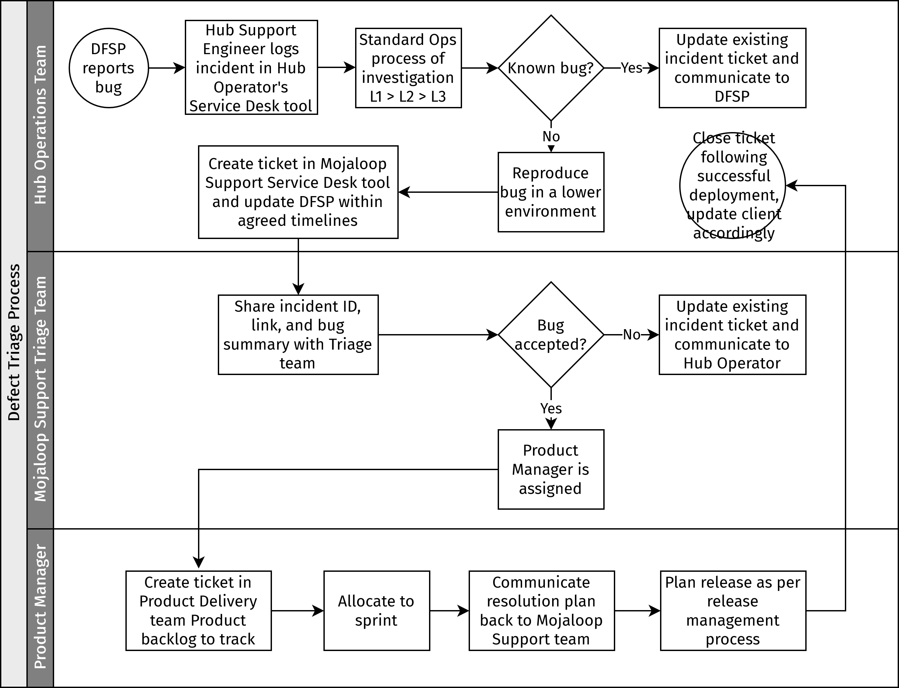

# Triagem de defeitos

O objetivo do processo de triagem de defeitos é assegurar que todos os bugs identificados no ambiente de Produção do Operador do Hub são registados, avaliados e submetidos a uma equipa de Suporte Mojaloop, uma equipa dedicada à prestação de serviços de Suporte às operações técnicas de um Hub Mojaloop. Esta equipa pode ser interna ou externa (ou mesmo em parte interna e em parte externa), consoante o nível de especialização ou a capacidade existente na organização que aloja o scheme. Se for decidido externalizar esta função, existem organizações na comunidade Mojaloop que prestam diferentes níveis de suporte como serviço. (Para mais informação e indicações, contacte a Mojaloop Foundation.)

::: tip NOTA
Os processos descritos nesta secção representam boas práticas e funcionam como recomendações para as organizações que desempenham o papel de Operador do Hub.
:::

::: tip NOTA
O processo aqui proposto aplica-se a bugs identificados no ambiente de Produção do Operador do Hub, ficando as novas funcionalidades ou melhorias fora do seu âmbito. No entanto, para facilitar as conversas de negócio, os Operadores do Hub podem submeter pedidos de novas funcionalidades ou melhorias, que serão encaminhados para as equipas de Produto na comunidade.
:::

É necessário que exista uma equipa específica responsável pela avaliação e pelo planeamento da resolução de cada bug reportado nos vários ambientes (Produção, Staging, QA, Dev, e assim por diante). Pode ser uma equipa de Suporte ou uma equipa de QA/Desenvolvimento. No resto desta secção, esta equipa é designada por «equipa de Triagem do Suporte Mojaloop».

A equipa de Triagem tem os seguintes membros:

* Product Manager do Mojaloop (Mojaloop core)
* Product Manager de extensões ou de outros componentes implementados no Hub — Payment Manager, PortX, e assim por diante
* Especialista Técnico do Hub (Product Delivery, ou seja, Desenvolvimento e QA)
* Representante das Operações (Operações Técnicas e Infraestrutura)

## Bugs identificados num ambiente de Produção do Operador do Hub

*Etapas do Operador do Hub:*

1. É aberto um ticket de incidente na ferramenta de [Service Desk](key-terms-kpis.md#termos-chave) do Operador do Hub por um Engenheiro de Suporte L1 do Hub, de acordo com o [processo de gestão de incidentes](incident-management.md).
1. O ticket é escalado para a equipa L2/L3 do Hub para investigação e análise aprofundadas, conforme necessário.
1. A equipa L2/L3 do Hub avalia se o comportamento é um bug novo ou um problema conhecido, e se já existe um ticket/registo de bug. Se for um bug conhecido e já existir um ticket de Suporte Mojaloop, o engenheiro L1 tem de atualizar o ticket existente com novos detalhes e informação, podendo a prioridade e o impacto/severidade (nível de impacto no Hub ou nos seus utilizadores) ser ajustados em conformidade. O engenheiro L1 tem de comunicar isto de volta a quem reportou/ao DFSP cliente (conforme referido no ponto 6). Os bugs novos seguem o restante processo abaixo.
1. A equipa L2/L3 do Hub confirma que o problema de Produção pode ser reproduzido em ambientes inferiores que executem a mesma versão do ambiente de Produção (PRD). Ou seja, que o bug não é um erro do utilizador nem um problema do ambiente.
1. A equipa L3 do Hub pode escalar para o Gestor de Operações Técnicas do Hub e reportar o bug através da ferramenta de Service Desk do Suporte Mojaloop, acrescentando todos os detalhes da sua análise (incluindo etapas claras para reproduzir o bug, o comportamento esperado, o comportamento efetivo e quaisquer ficheiros de registo e detalhes das investigações L2/L3), para além do identificador do ticket de incidente criado na Etapa 1, para facilitar o acompanhamento.
1. É enviada resposta/confirmação/comunicação ao DFSP cliente dentro dos prazos acordados.

*Etapas da equipa de Suporte Mojaloop:*

1. A equipa de Suporte Mojaloop analisa o bug, atribui um membro da equipa como responsável e confirma a sua receção.
1. Após uma análise inicial do problema reportado, o membro da equipa de Suporte Mojaloop encaminha o problema para a equipa de Triagem para avaliação adicional. \
A análise do ticket é realizada para a) obter uma boa compreensão do problema reportado, incluindo o nível de severidade e a prioridade definidos pelo Operador do Hub; b) confirmar a integralidade da informação fornecida, incluindo ficheiros de registo, descrição clara, etapas para reproduzir, capturas de ecrã, e assim por diante.
1. A equipa de Triagem avalia o bug: as melhorias e os pedidos de novas funcionalidades são encaminhados para as equipas de Produto da comunidade. O impacto operacional, a severidade e a prioridade são analisados e a resolução do bug é atribuída ao Product Manager competente. Para mais detalhes sobre a priorização, consulte [Priorização de bugs](#priorizacao-de-bugs).
1. O Product Manager clona o bug para o backlog de produto da sua equipa de Product Delivery, o que associa ambos os registos para referência e acompanhamento do progresso. O Product Manager analisa também e define a prioridade face aos outros itens do seu backlog de produto.
1. O Engenheiro de Suporte Mojaloop atribuído ao ticket de bug do Suporte Mojaloop acompanha o ticket clonado e trata de toda a comunicação entre o Product Manager e o Operador do Hub sobre o progresso dos bugs, incluindo a partilha de eventuais etapas de mitigação (por exemplo, soluções de contorno ou formas alternativas de utilizar a funcionalidade afetada). Cada atualização subsequente da equipa de Product Delivery deve também ser partilhada no ticket de bug do Product Manager, para visibilidade do Operador do Hub. A pessoa do Product Manager a quem foi atribuído tem de permanecer responsável pelo ticket de bug do Product Manager até o bug estar resolvido.
1. O Product Manager comunica o plano de resolução e os prazos à equipa de Suporte através do ticket de bug original do Product Manager. O plano de resolução é depois comunicado ao Operador do Hub. \
\
Para mais detalhes sobre o que acontece se o Operador do Hub não concordar com a priorização e o plano de resolução propostos, consulte [Processo de escalamento](#processo-de-escalamento).
1. O bug é resolvido segundo o processo de desenvolvimento padrão da equipa de Product Delivery designada e é incluído numa versão, que será disponibilizada ao Operador do Hub ou pode ser oferecida como versão pontual (patch), se necessário.
1. O ticket de Suporte Mojaloop é encerrado assim que a versão com a correção do bug estiver instalada e validada no ambiente do Operador do Hub.

## Bugs identificados durante uma janela de deployment/alteração num ambiente do Hub

Os deployments nos ambientes do Hub são da responsabilidade da equipa do Operador do Hub, e os bugs identificados durante o deployment devem ser reportados através do processo padrão (ou seja, é aberto um ticket segundo o processo de gestão de incidentes do Hub e depois escalado para a equipa de Suporte Mojaloop, se necessário). Além disso:

* A equipa do Hub avalia se o comportamento é um problema conhecido ou um defeito novo. No caso de problemas conhecidos, a versão deve prosseguir e ser concluída conforme planeado, com o bug conhecido reportado no relatório pós-deployment.
* No caso de novos defeitos identificados, a versão/alteração pode ser objeto de rollback, consoante a severidade. Esta decisão cabe à equipa de deployment. Em caso de rollback, têm de ser executados testes de regressão para confirmar que a versão anterior em funcionamento está estável no ambiente, sendo o bug reportado no relatório pós-deployment.
* O bug é registado através da ferramenta de Service Desk do Suporte Mojaloop e será tratado segundo o processo descrito acima.

## Processo de escalamento

Se existir qualquer discrepância entre a prioridade atribuída ou as expetativas do cliente (o Operador do Hub) e o plano de resolução apresentado pela equipa de Suporte Mojaloop, a [matriz de escalamento da gestão de incidentes](incident-management-escalation-matrix.md) determina o que acontece a seguir. Em conformidade, o incidente será definido como prioridade P1 ou qualquer outro tipo de prioridade inferior e as partes interessadas serão informadas.

O Líder da Equipa de Suporte Mojaloop e o Gestor de Programa do Operador do Hub têm de ser informados de imediato. O Gestor de Programa do Operador do Hub é um gestor na organização do Hub responsável por traduzir as necessidades de negócio do Scheme em diretivas de operações técnicas.

## Titularidade e responsabilidade

Quem cria o ticket de Service Desk (o Engenheiro de Suporte do Operador do Hub) mantém-se responsável até o ticket estar resolvido.

A prioridade e a severidade têm de ser alinhadas, discutidas e negociadas entre a equipa de Triagem do Suporte Mojaloop e a equipa de Operações do Operador do Hub.

A informação proveniente das discussões de triagem e da equipa de Product Delivery tem de ser partilhada no ticket de Service Desk pelo Engenheiro de Suporte Mojaloop.

O Product Manager a quem o bug é atribuído tem de assegurar que existem referências cruzadas e acompanhamento, de modo a garantir o fluxo de informação exigida ou produzida pela avaliação da equipa de Product Delivery.

O Product Manager a quem o bug é atribuído tem de determinar e comunicar o plano de resolução à equipa/ao engenheiro de Suporte Mojaloop, exclusivamente através do ticket.

### Priorização de bugs

A priorização dos bugs é da responsabilidade dos Especialistas (SME) da equipa de Triagem do Suporte Mojaloop.

Todos os bugs são avaliados com base no comportamento esperado do sistema e no comportamento efetivamente observado (e reproduzido). O impacto operacional e a urgência do bug têm de ser registados pela equipa de Operações do Operador do Hub, para que sejam tidos em conta pela equipa de Triagem na priorização.

Cada bug é avaliado face ao roadmap e ao backlog de Produto.

As novas funcionalidades ou os pedidos de melhoria são canalizados para a equipa de Produto e não são tratados por este processo. Isto é comunicado a quem fez o pedido através da equipa de Operações.

::: tip
A prioridade é a ordem pela qual o bug será corrigido. Quanto maior a prioridade, mais cedo o bug será resolvido. \
\
A severidade é o nível de impacto no Hub ou nos seus utilizadores. \
\
Estes dois fatores funcionam em conjunto. Por exemplo, um bug cosmético como uma gralha numa página web será provavelmente classificado com severidade baixa, mas pode ser uma correção rápida e fácil e ser classificado com prioridade alta. Por isso, é importante definir estes valores com a devida ponderação.
:::

## Fluxograma do processo

