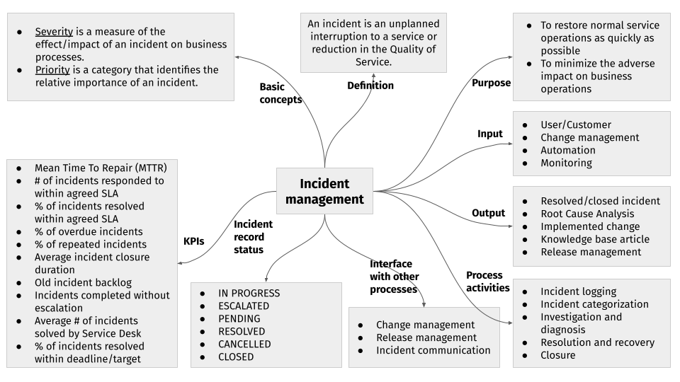
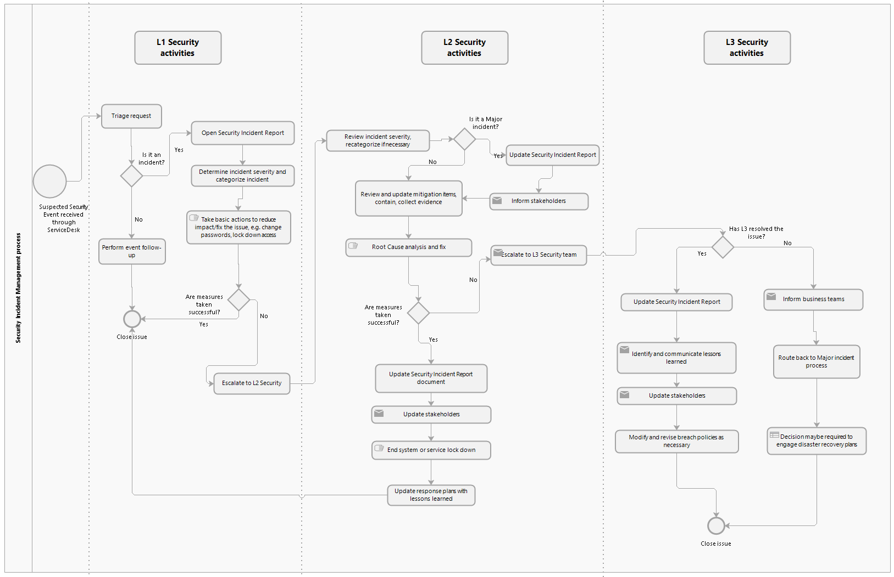

# Gestão de incidentes

O principal objetivo da gestão de incidentes é restabelecer o funcionamento normal do serviço o mais rapidamente possível e minimizar o impacto nas operações de negócio, assegurando assim a manutenção dos melhores níveis possíveis de qualidade e de disponibilidade do serviço. Entende-se aqui por «funcionamento normal do serviço» o funcionamento do serviço dentro dos [acordos de nível de serviço (SLA)](service-level-agreements.md).

Isto é conseguido através de um processo de gestão de incidentes robusto e bem alinhado, orientado por um sistema de Service Desk que ajuda a registar todos os problemas e a acompanhar o turnaround time (TAT) desde o momento em que um problema é comunicado até à sua resolução e encerramento.

O processo de gestão de incidentes envolve detetar um incidente, registá-lo com toda a informação adequada, analisar o problema, corrigir os defeitos e repor o serviço em conformidade com o TAT estipulado.

Esta secção reúne os principais processos, conceitos e princípios relativos à gestão de incidentes.

::: tip NOTA
Os processos descritos nesta secção representam boas práticas e funcionam como recomendações para as organizações que desempenham o papel de Operador do Hub.
:::

::: tip NOTA
Ao longo desta secção, os termos «cliente», «consumidor», «utilizador final» e «utilizador» designam todos um colaborador de um DFSP. Quando estas palavras são utilizadas noutro sentido, esse significado é assinalado e explicado em detalhe.
:::

## A gestão de incidentes numa única imagem

A figura seguinte define o fluxo do processo e os conceitos-chave da gestão de incidentes numa única imagem.

<!---->

## Fronteiras do processo

O processo de gestão de incidentes começa quando:

* um incidente é despoletado por uma chamada telefónica/e-mail/interação no Service Desk por parte de utilizadores ou clientes
* um incidente é detetado através de um processo ou ferramenta interna, por exemplo, existe um alerta de evento de uma das ferramentas de alerta ou dos sistemas de monitorização
* os elementos de Suporte de qualquer nível (Engenheiros de Suporte L1, L2, L3) ou o Gestor de Serviço criam diretamente um incidente

O processo de gestão de incidentes termina:

* para o cliente: quando o estado do ticket na ferramenta de Service Desk é alterado para «Closed»
* para a equipa de Service Desk: quando o incidente está resolvido e é enviada ao cliente a validação para encerramento

As fronteiras da gestão de incidentes estipulam que o processo tem em conta os seguintes pré-requisitos:

* Existe um Acordo de Nível de Serviço (SLA) entre a Comunidade (por exemplo, o Mojaloop), as entidades detentoras (por exemplo, o Hub) e os Digital Financial Service Providers (DFSP).
* Existe um SLA entre o Parceiro de Implementação (o Hub) e os Fornecedores de Software terceiros (por exemplo, Microsoft, Oracle, e assim por diante).
* Existe um acordo de nível operacional (OLA). Este acordo descreve as responsabilidades de cada grupo interno de Suporte perante os outros grupos de Suporte, incluindo o processo e o prazo de prestação dos seus serviços.

## A gestão de incidentes passo a passo

Esta secção fornece uma descrição detalhada do processo de gestão de incidentes. Todos os incidentes criados passam pelos seguintes passos principais.

### Passo 1: comunicar e registar o incidente, o pedido de alteração ou a questão

Os problemas, pedidos de alteração ou questões podem ser comunicados e registados através da ferramenta de Service Desk assim que ocorram. A ferramenta de Service Desk é o canal principal para receber pedidos relacionados com incidentes. O e-mail, as chamadas telefónicas e as mensagens instantâneas podem ser utilizados como canais secundários.

O estado dos tickets, tal como registado no sistema de Service Desk, pode assumir os seguintes valores:

* **In Progress**: um incidente que foi recebido através do Service Desk e atribuído a um Engenheiro de Suporte. Os esforços de resolução começaram.
* **Escalated**: um incidente que foi escalado para qualquer entidade fora da equipa de Operações, incluindo a equipa de Product Delivery ou prestadores de serviços L4 externos.
* **Pending**: um incidente que foi temporariamente suspenso ou que aguarda retorno do utilizador ou de outro ticket que tem de ser resolvido antes de este poder ser resolvido. \
\
Tendo presente que utilizar o estado «Pending» faz parar o cronómetro do SLA, a única razão que justifica a utilização de «Pending» é quando é necessária uma ação do cliente. Tem de ser uma ação da responsabilidade do cliente/consumidor ou do seu fornecedor e que constitua pré-requisito para a continuação do processo; por exemplo, pedir informação essencial ou aprovação para resolver o pedido. Os tickets com Severidade 1 e 2 não podem ser colocados no estado «Pending». Repor um serviço ou uma função de um serviço raramente depende de uma ação do cliente. A única exceção é quando o cliente interrompe a investigação ou a implementação de uma solução ou recusa uma aprovação necessária. Em qualquer caso, a decisão do cliente tem de ser documentada.
* **Cancelled**: um incidente que foi cancelado. Um incidente só pode ser cancelado por iniciativa do cliente.
* **Resolved**: um incidente que foi tratado por um Engenheiro de Suporte e foi corrigido, tendo sido despoletado um alerta ao utilizador para o reabrir se não estiver satisfeito.
* **Closed**: um incidente que foi encerrado assim que a resolução foi aceite pelo utilizador final.

Toda a informação pertinente relativa aos incidentes tem de ser registada, de modo a manter um registo histórico completo. Ao manter registos de incidentes exatos e completos, o pessoal dos grupos de Suporte designados no futuro fica mais habilitado a resolver os incidentes registados.

### Passo 2: categorizar e priorizar

É atribuído ao utilizador final/requerente um número de ticket para referência e facilidade de acesso quando o problema é aceite e tratado pela Equipa de Suporte. O ticket deve estar visível para o requerente (o colaborador do DFSP que reportou o problema) em todos os níveis de Suporte.

O requerente será automaticamente notificado por e-mail de quaisquer alterações, atualizações de estado, pedidos de mais informação, disponibilidade para testes ou resolução final relativos ao ticket.

Em geral, classificamos os pedidos de suporte em:

* Incidente
* Pedido de Serviço
* Pedido de Alteração ou Request for Change (RFC, tais como funcionalidades e melhorias)

Os incidentes são categorizados e subcategorizados com base no serviço de TI ou na área de negócio cuja atividade o incidente está a perturbar.

Seguem-se algumas categorias de serviço a título de exemplo:

* Infraestrutura
* Mojaloop
* Segurança
* Liquidações
* Onboarding

A severidade de um incidente pode ser determinada através de uma [matriz de categorização](#matriz-de-categorizacao-de-incidentes). Com base na sua severidade, os incidentes podem ser categorizados como:

* Crítico = S1
* Grave = S2
* Médio = S3
* Menor = S4

Uma vez categorizado o incidente, este é automaticamente encaminhado para um Engenheiro de Suporte L1 com os conhecimentos adequados.

### Passo 3: investigar e resolver

O recurso de Suporte designado ficará encarregado de investigar o problema, bem como de preparar o registo do incidente e de comunicar ao cliente como resolver o problema.

A investigação de um incidente pode incluir qualquer uma das seguintes ações:

* Recolha e análise de informação
* Pesquisa, incluindo a reprodução do problema
* Obtenção de informação adicional de outras fontes

A resolução de um incidente pode incluir qualquer uma das seguintes ações:

* Apresentação de uma resolução ou de etapas conducentes a uma resolução
* Alterações de configuração

Consoante a complexidade do incidente, este pode ter de ser decomposto em subtarefas ou tarefas. As tarefas são normalmente criadas quando a resolução de um incidente exige o contributo de vários técnicos de diferentes departamentos.

Enquanto o incidente é processado, o Engenheiro de Suporte tem de assegurar que o Acordo de Nível de Serviço não é incumprido. Um SLA é o tempo aceitável dentro do qual um incidente carece de resposta (SLA de resposta) ou de resolução (SLA de resolução). Os SLA podem ser atribuídos aos incidentes com base nos seus parâmetros, como a categoria de serviço, o requerente, o impacto, a urgência, e assim por diante. Nos casos em que um SLA está prestes a ser incumprido ou já o foi, o incidente pode ser escalado funcional ou hierarquicamente, para assegurar que é resolvido o mais depressa possível.

Um incidente é considerado resolvido quando a Equipa de Suporte L1/L2/L3 chegou a uma solução de contorno temporária ou a uma solução permanente para o problema. As soluções de contorno podem ser:

* instruções fornecidas ao cliente sobre como concluir o seu trabalho por um método alternativo
* correções temporárias que ajudam um sistema a funcionar como esperado, mas que não resolvem o problema de forma permanente

As soluções de contorno têm de ser documentadas e comunicadas ao Service Desk, para poderem ser acrescentadas à Base de Conhecimento. (É boa prática manter um repositório de artigos da Base de Conhecimento que descrevam as etapas de contorno ou de resolução dos incidentes ocorridos no passado.) Isto assegura que as soluções de contorno estão acessíveis ao Service Desk, facilitando a resolução em futuras recorrências do incidente.

### Passo 4: escalar

O escalamento de um incidente é o reconhecimento de que existe a possibilidade de um incidente exceder os prazos de resolução acordados em cada nível de Suporte. Uma gestão clara do escalamento permite à Equipa de Suporte identificar, acompanhar, monitorizar e gerir as situações que exigem maior atenção e uma ação célere.

Existem dois tipos de escalamento:

* **Escalamento funcional**: este tipo de escalamento entra em ação quando uma equipa de um nível de Suporte (por exemplo, L1) não consegue resolver o problema ou manter-se dentro do prazo acordado (ou seja, o tempo previsto para a resolução é excedido). Por conseguinte, o caso é proativamente atribuído ao nível de serviço seguinte (por exemplo, L2).
* **Escalamento hierárquico**: este tipo de escalamento funciona como meio de informar todas as partes envolvidas, de forma proativa, de um potencial incumprimento do SLA. Ajuda a trazer ordem, estrutura, responsabilidade, titularidade, gestão focada e mobilização de recursos com vista à prestação de serviços eficazes e eficientes.

### Passo 5: encerrar o incidente

Um incidente pode ser encerrado assim que o problema estiver resolvido e o utilizador aceitar a resolução e estiver satisfeito com ela.

## Matriz de categorização de incidentes

Uma das fases mais importantes da gestão de incidentes é a categorização dos incidentes. Esta não só ajuda a organizar os tickets recebidos, como também assegura que os tickets são encaminhados para os Engenheiros de Suporte mais qualificados para trabalhar no problema. A categorização dos incidentes ajuda também o sistema de Service Desk a aplicar os SLA mais adequados aos incidentes e a comunicar essas prioridades aos utilizadores finais. Uma vez categorizado um incidente, os Engenheiros de Suporte podem diagnosticá-lo e fornecer uma resolução ao utilizador final.

A tabela seguinte fornece orientações sobre como classificar a severidade de um incidente.

<table>
<caption><strong>Matriz de categorização de incidentes</strong></caption>
<colgroup>
<col style="width: 16%" />
<col style="width: 83%" />
</colgroup>
<thead>
<tr class="header">
<th>Código de severidade</th>
<th>Critérios</th>
</tr>
</thead>
<tbody>
<tr class="odd">
<td>
Severidade 1
</td>
<td><ul>
<li>
Impacto extenso no negócio, indisponibilidade do sistema de Produção, funcionamento normal impossível.
</li>
<li>
Qualquer incidente que tenha resultado numa indisponibilidade grave do Hub, incluindo a conetividade de vários parceiros/DFSP.
</li>
<li>
Qualquer incidente que apresente riscos financeiros graves e tenha implicações contratuais.
</li>
<li>
Um incidente de segurança com impacto grave na privacidade ou na disponibilidade do Hub, dos parceiros/DFSP ou dos dados dos clientes.
</li>
</ul></td>
</tr>
<tr class="even">
<td>
Severidade 2
</td>
<td><ul>
<li>
Indisponibilidade parcial do Hub.
</li>
<li>
Funcionalidade essencial comprometida, sem solução de contorno disponível.
</li>
</ul></td>
</tr>
<tr class="odd">
<td>
Severidade 3
</td>
<td><ul>
<li>
Impacto funcional menor/moderado num único utilizador ou num pequeno grupo de utilizadores. Existe uma solução de contorno.
</li>
</ul></td>
</tr>
<tr class="even">
<td>
Severidade 4
</td>
<td><ul>
<li>
Um incidente menor, com (quase) nenhum impacto ou prejuízo para a funcionalidade do sistema, mas ainda assim um bug válido.
</li>
</ul></td>
</tr>
</tbody>
</table>

Legenda:

* Severidade 1 = Crítico
* Severidade 2 = Grave
* Severidade 3 = Médio
* Severidade 4 = Menor

O código de severidade atribuído a um incidente determinará o tempo de solução e será utilizado pelo Service Desk para afetar recursos ao pedido.

Para além da severidade, em alguns casos pode ser necessário considerar também a prioridade de um incidente. A prioridade é atribuída pelo Operador do Hub (e não pelo cliente) e é a ordem pela qual o incidente será corrigido. Quanto maior a prioridade, mais cedo o incidente será resolvido. Considere-se o exemplo seguinte: um bug cosmético como uma gralha numa página web será provavelmente classificado com severidade baixa, mas pode ser uma correção rápida e fácil e ser classificado com prioridade alta. Por isso, é importante ponderar devidamente a severidade e a prioridade.

A tabela seguinte fornece orientações sobre como atribuir prioridade a um incidente.

<table>
<caption><strong>Matriz de prioridade</strong></caption>
<colgroup>
<col style="width: 16%" />
<col style="width: 83%" />
</colgroup>
<thead>
<tr class="header">
<th>Código de prioridade</th>
<th>Critérios</th>
</tr>
</thead>
<tbody>
<tr class="odd">
<td>
Prioridade 1
</td>
<td>Ocorreu um problema grave que afeta vários utilizadores de um destinatário do serviço (&gt;50% dos utilizadores do destinatário do serviço), ao ponto de estes ficarem impossibilitados de desempenhar as funções que lhes foram atribuídas, OU o destinatário do serviço ou áreas exteriores ao destinatário do serviço são afetados.</td>
</tr>
<tr class="even">
<td>
Prioridade 2
</td>
<td>Ocorreu um problema que afeta vários utilizadores (afeta &gt;10, mas não mais de 50% da totalidade dos utilizadores do destinatário do serviço) OU um utilizador avançado identificado do serviço, ao ponto de ficarem impossibilitados de desempenhar as funções que lhes foram atribuídas, sendo afetada uma unidade de negócio.</td>
</tr>
<tr class="odd">
<td>
Prioridade 3
</td>
<td>Ocorreu um problema que afeta um único utilizador OU (afeta &lt;10 utilizadores OU não mais de 25% da totalidade dos utilizadores), ao ponto de ficarem impossibilitados de desempenhar as funções que lhes foram atribuídas.</td>
</tr>
<tr class="even">
<td>
Prioridade 4
</td>
<td>Ocorreu um problema que afeta um único utilizador, causando funcionalidade reduzida numa única aplicação. Existe uma solução de contorno para o utilizador desempenhar as funções que lhe foram atribuídas, mas a indisponibilidade provoca uma redução da sua produtividade.</td>
</tr>
</tbody>
</table>

## Incidentes de segurança

Esta secção descreve o procedimento que se recomenda a um Operador do Hub implementar para o tratamento de eventos/incidentes de segurança. Os incidentes de segurança podem ser classificados como incidentes de Severidade 1, Severidade 2, Severidade 3 ou Severidade 4. Independentemente da sua categorização, siga as etapas indicadas na tabela abaixo se um incidente estiver relacionado com segurança.

<table>
<caption><strong>Gestão de incidentes de segurança</strong></caption>
<colgroup>
<col style="width: 25%" />
<col style="width: 25%" />
<col style="width: 25%" />
<col style="width: 25%" />
</colgroup>
<thead>
<tr class="header">
<th colspan="2">Passo</th>
<th>Ação ou informação adicional</th>
<th>Função</th>
</tr>
</thead>
<tbody>
<tr class="odd">
<td>
<strong>Passo 1</strong>: é recebido um evento/incidente de segurança suspeito através do Service Desk, num ticket atribuído à equipa de segurança (L1) para revisão e triagem iniciais.
</td>
<td></td>
<td></td>
<td></td>
</tr>
<tr class="even">
<td>
<strong>Passo 2</strong>: desencadear o processo de triagem.
</td>
<td>
<strong>Passo 2a</strong>:

<ul>
<li>
Identificar os artefactos do incidente.
</li>
<li>
Identificar os dispositivos, sistemas ou utilizadores afetados.
</li>
</ul></td>
<td><ul>
<li>
Reunir os principais indicadores de uma ameaça.
</li>
<li>
Obter os registos.
</li>
<li>
Consultar os artefactos (endereços IP, nomes de utilizador, URL, nomes de anfitrião, e assim por diante).
</li>
<li>
Rever os registos para apurar se existe alguma lei/regulamento que esteja a ser violado pelo incidente (se for um incidente grave, pode prejudicar a reputação da organização).
</li>
</ul></td>
<td>
Responsável pela Segurança da Informação (ISO) L1
</td>
</tr>
<tr class="odd">
<td>

</td>
<td>
<strong>Passo 2b</strong>:

<ul>
<li>
Avaliar a situação: avaliação de impacto.
</li>
<li>
Estimar o efeito potencial do evento ou incidente.
</li>
</ul></td>
<td><ul>
<li>
Rever os indicadores de compromisso disponíveis.
</li>
<li>
Avaliar o impacto com base na criticidade do sistema afetado.
</li>
<li>
Rever os registos de auditoria.
</li>
<li>
Traçar uma cronologia dos eventos.
</li>
</ul></td>
<td>
ISO L1
</td>
</tr>
<tr class="even">
<td>

</td>
<td>
<strong>Passo 2c</strong>:

Recolher provas.
</td>
<td><ul>
<li>
Recolher e compilar toda a informação disponível para permitir a categorização.
</li>
</ul></td>
<td>
ISO L1
</td>
</tr>
<tr class="odd">
<td>

</td>
<td>
<strong>Passo 2d</strong>:

Determinar a categorização.
</td>
<td><ul>
<li>
Com base na informação recolhida, atribuir uma categoria ao ticket.
</li>
<li>
A segurança L1 atualizará as categorizações conforme adequado.
</li>
</ul>

Exemplos de categorias:

<ul>
<li>
Negação de Serviço (DOS)
</li>
<li>
Código malicioso
</li>
<li>
Acesso não autorizado
</li>
<li>
Fuga/perda de dados
</li>
<li>
Violação de dados (violação de regulamentação relativa à proteção de dados)
</li>
<li>
Utilização indevida
</li>
</ul></td>
<td>
ISO L1
</td>
</tr>
<tr class="even">
<td>

</td>
<td>
<strong>Passo 2e</strong>:

Executar as etapas básicas para mitigar o efeito no ambiente.
</td>
<td>As etapas básicas podem incluir tarefas como:
<ul>
<li>
Bloquear um endpoint.
</li>
<li>
Instalar anti-malware onde for necessário.
</li>
<li>
Rever os Procedimentos Operacionais Padrão (SOP) de segurança (se aplicável) quanto a eventuais etapas adicionais necessárias.
</li>
</ul>

Se as etapas de mitigação executadas resolverem o problema comunicado, a Segurança L1 atualizará o ticket e passará ao Passo 8 (Encerrar o problema).
</td>
<td>
ISO L1/L2
</td>
</tr>
<tr class="odd">
<td>
<strong>Passo 3</strong>: avaliar se o problema comunicado é um evento ou um incidente.
</td>
<td>

</td>
<td>
A decisão da avaliação é tomada pela equipa de Segurança L1 em colaboração com a Segurança L2.
</td>
<td>
ISO L1/L2
</td>
</tr>
<tr class="even">
<td>
<strong>Passo 4.1</strong>: se o problema comunicado for categorizado como «evento», siga estas etapas:
</td>
<td>
<strong>Passo 4.1a</strong>:

Realizar o seguimento do evento.
</td>
<td>Exemplos de seguimento de eventos:
<ul>
<li>
Verificar e instalar anti-malware em todos os anfitriões.
</li>
<li>
Abrir tickets a pedir a instalação de patches nos sistemas e/ou a revisão do evento pela equipa de Operações.
</li>
</ul></td>
<td>
ISO L1/L2
</td>
</tr>
<tr class="odd">
<td>

</td>
<td>
<strong>Passo 4.1b</strong>:

Passar ao Passo 8.
</td>
<td></td>
<td>
ISO L1
</td>
</tr>
<tr class="even">
<td>
<strong>Passo 4.2</strong>: se o problema comunicado for categorizado como «incidente», siga estas etapas:
</td>
<td>
<strong>Passo 4.2a</strong>:

O ISO L1 escala para o ISO L2 para investigação adicional, reatribuindo o ticket ao grupo de Segurança L2 para seguimento.
</td>
<td></td>
<td>
ISO L1
</td>
</tr>
<tr class="odd">
<td>

</td>
<td>
<strong>Passo 4.2b</strong>:

O ISO L2 confirma a receção do ticket do L1 e passa a abrir o Relatório de Incidente de Segurança.
</td>
<td></td>
<td>
ISO L2
</td>
</tr>
<tr class="even">
<td>

</td>
<td>
<strong>Passo 4.2c</strong>:

O ISO L2 revê e verifica a severidade e a categorização do incidente.
</td>
<td><ul>
<li>
Para as definições de severidade dos incidentes, consulte a <a href="incident-management.html#matriz-de-categorizacao-de-incidentes">matriz de categorização</a>.
</li>
<li>
Passar ao Passo 5.
</li>
</ul></td>
<td>
ISO L2
</td>
</tr>
<tr class="odd">
<td>
<strong>Passo 5.1</strong>: se o incidente comunicado for categorizado como incidente «S1», siga estas etapas:
</td>
<td>
<strong>Passo 5.1a</strong>:

Atualizar o Relatório de Incidente de Segurança.
</td>
<td></td>
<td>
ISO L2
</td>
</tr>
<tr class="even">
<td></td>
<td>
<strong>Passo 5.1b</strong>:

Informar as partes interessadas por e-mail seguro.
</td>
<td>
As partes interessadas estão documentadas no <a href="incident-management-escalation-matrix.html">Anexo A: Matriz de escalamento da gestão de incidentes</a>.
</td>
<td>
ISO L2
</td>
</tr>
<tr class="odd">
<td></td>
<td>
<strong>Passo 5.1c</strong>:

Passar ao Passo 6.
</td>
<td></td>
<td>
ISO L2
</td>
</tr>
<tr class="even">
<td>
<strong>Passo 5.2</strong>: se o incidente comunicado for categorizado como incidente «S4», siga estas etapas:
</td>
<td>
<strong>Passo 5.2a</strong>:

Passar ao Passo 6.
</td>
<td></td>
<td>
ISO L2
</td>
</tr>
<tr class="odd">
<td>
<strong>Passo 6</strong>: conter e erradicar.
</td>
<td>
<strong>Passo 6a</strong>:

Rever e atualizar as ações de mitigação para reduzir o impacto.
</td>
<td>
Exemplos de ações de mitigação:

<ul>
<li>
Alterar palavras-passe.
</li>
<li>
Bloquear acessos.
</li>
</ul></td>
<td>
ISO L2
</td>
</tr>
<tr class="even">
<td></td>
<td>
<strong>Passo 6b</strong>:

Recolher provas.
</td>
<td></td>
<td>
ISO L2
</td>
</tr>
<tr class="odd">
<td></td>
<td>
<strong>Passo 6c</strong>:

Realizar a análise da causa raiz e identificar/implementar uma correção.
</td>
<td></td>
<td>
ISO L2
</td>
</tr>
<tr class="even">
<td></td>
<td>
<strong>Passo 6d</strong>:

Atualizar os Procedimentos Operacionais Padrão (SOP) de incidentes conforme necessário.
</td>
<td>
As atualizações dos SOP são revistas pelo L3 antes da adoção.
</td>
<td>
ISO L2
</td>
</tr>
<tr class="odd">
<td>
<strong>Passo 6.1</strong>: se o Passo 6 for bem-sucedido, siga estas etapas:
</td>
<td>
<strong>Passo 6.1a</strong>:

Atualizar o Relatório de Incidente de Segurança e o ticket.
</td>
<td>
Assegurar que o ticket não contém informação de segurança sensível.
</td>
<td>
ISO L2
</td>
</tr>
<tr class="even">
<td></td>
<td>
<strong>Passo 6.1b</strong>:

Comunicar com as partes interessadas por e-mail seguro.
</td>
<td>
As partes interessadas estão documentadas no <a href="incident-management-escalation-matrix.html">Anexo A: Matriz de escalamento da gestão de incidentes</a>.
</td>
<td>
ISO L2
</td>
</tr>
<tr class="odd">
<td></td>
<td>
<strong>Passo 6.1c</strong>:

Terminar o bloqueio do sistema ou do serviço.
</td>
<td></td>
<td>
ISO L2
</td>
</tr>
<tr class="even">
<td></td>
<td>
<strong>Passo 6.1d</strong>:

Passar ao Passo 8.
</td>
<td></td>
<td>
ISO L2
</td>
</tr>
<tr class="odd">
<td>
<strong>Passo 6.2</strong>: se o Passo 6 não for bem-sucedido, siga estas etapas:
</td>
<td>
<strong>Passo 6.2a</strong>:

Escalar para a equipa de Segurança L3.
</td>
<td></td>
<td>
ISO L2
</td>
</tr>
<tr class="even">
<td></td>
<td>
Passo <strong>6.2b</strong>:

Informar a equipa de negócio.
</td>
<td></td>
<td>
ISO L2
</td>
</tr>
<tr class="odd">
<td></td>
<td>
<strong>Passo 6.2c</strong>:

O L3 prossegue com o Passo 7.
</td>
<td></td>
<td>
ISO L3
</td>
</tr>
<tr class="even">
<td>
<strong>Passo 7</strong>: o L3 revê e resolve o problema.
</td>
<td>
<strong>Passo 7a</strong>:

Rever as atividades e o historial do incidente documentados pelo L1 e pelo L2.
</td>
<td></td>
<td>
ISO L3
</td>
</tr>
<tr class="odd">
<td></td>
<td>
<strong>Passo 7b</strong>:

Fornecer orientações para ações de contenção adicionais.
</td>
<td></td>
<td>
ISO L3
</td>
</tr>
<tr class="even">
<td></td>
<td>
<strong>Passo 7c</strong>:

Se o L3 resolver o problema, passar ao Passo 8.
</td>
<td></td>
<td>
ISO L3
</td>
</tr>
<tr class="odd">
<td></td>
<td>
<strong>Passo 7d</strong>:

Se o L3 não conseguir resolver o problema, pode escalar para o OEM do sistema/software ou contratar serviços especializados (mediante aprovação) para obter apoio.
</td>
<td>
Se o L3 não conseguir resolver o problema, pode escalar para o OEM do sistema/software ou contratar serviços especializados (mediante aprovação) para obter apoio. Pode ser necessária uma decisão sobre o acionamento do plano de recuperação de desastres, incluindo a constituição de uma «war room».

Um plano de recuperação de desastres (DRP) é uma solução à medida, baseada nas capacidades técnicas do Operador do Hub, bem como na sua apetência pelo risco. Faz parte das políticas de Segurança de TI de um Operador do Hub. É necessário avaliar em detalhe a política e as expetativas de DRP do Operador do Hub e afinar a sua concretização em função das suas necessidades. Os detalhes têm de ser definidos durante a implementação (de preferência durante a fase de conceção), uma vez que as várias opções disponíveis podem ter implicações de custo.
</td>
<td>
ISO L3
</td>
</tr>
<tr class="even">
<td>
<strong>Passo 8</strong>: encerrar o problema.
</td>
<td>
<strong>Passo 8a</strong>:

Repor os sistemas afetados.
</td>
<td></td>
<td>
ISO L1 / L2 / L3
</td>
</tr>
<tr class="odd">
<td></td>
<td>
<strong>Passo 8b</strong>:

Atualizar o Relatório de Incidente de Segurança.
</td>
<td></td>
<td>
ISO L2 / L3
</td>
</tr>
<tr class="even">
<td></td>
<td>
<strong>Passo 8c</strong>:

Identificar e comunicar as lições aprendidas.
</td>
<td></td>
<td>
ISO L2 / L3
</td>
</tr>
<tr class="odd">
<td></td>
<td>
<strong>Passo 8d</strong>:

A equipa de resposta a incidentes revê as recomendações pertinentes para eventual adoção.
</td>
<td>
Esta sessão de revisão pode incluir as equipas de Operações Técnicas e de Gestão de Serviço, consoante a severidade.
</td>
<td>
ISO L1 / L2 / L3
</td>
</tr>
<tr class="even">
<td></td>
<td>
<strong>Passo 8e</strong>:

Atualizar as partes interessadas.
</td>
<td></td>
<td>
ISO L2 / L3
</td>
</tr>
<tr class="odd">
<td></td>
<td>
<strong>Passo 8f</strong>:

Encerrar o problema.
</td>
<td></td>
<td>
ISO L1 / L2 / L3
</td>
</tr>
<tr class="even">
<td>
<strong>Passo 9</strong>: o ISO L3 altera e revê as políticas e os procedimentos relativos a violações.
</td>
<td></td>
<td></td>
<td>
ISO L3
</td>
</tr>
</tbody>
</table>

A figura seguinte apresenta um resumo do processo descrito acima.

### Modelo de Relatório de Incidente de Segurança

Ao redigir um Relatório de Incidente de Segurança, é boa prática utilizar um modelo criado para o efeito.

## Funções e responsabilidades

Esta secção fornece orientações genéricas sobre as funções e responsabilidades propostas no âmbito do processo de gestão de incidentes.

::: tip NOTA
É conveniente descrever o suporte corrente às operações técnicas do Hub Mojaloop em níveis. Este documento descreve quatro níveis. Os níveis são convenientes porque cada nível de suporte exige um grau diferente de conhecimento do sistema e de acesso ao mesmo. Por outras palavras, os níveis referem-se a diferentes funções/equipas de Suporte dentro de cada organização.

Algumas destas equipas podem, opcionalmente, ser externalizadas, consoante o nível de especialização ou a capacidade existente em cada organização. Caso se decida externalizar as funções de Suporte, existem organizações na comunidade Mojaloop que prestam diferentes níveis de Suporte como serviço. (Para mais informação e indicações, contacte a Mojaloop Foundation.)
:::

### Utilizador final/utilizador/requerente/L0

*Função*

É a parte interessada que sofre uma perturbação do serviço e cria um ticket de incidente para iniciar o processo de gestão de incidentes.

*Responsabilidades*

* Contactar o Service Desk para criar um novo pedido de incidente.
* Acompanhar um pedido existente.
* Monitorizar o canal de comunicação quanto a qualquer retorno dos Engenheiros de Suporte.
* Comunicar com clareza aos Engenheiros de Suporte toda a informação necessária ou solicitada.
* Confirmar a reposição do serviço e a conclusão do ticket.
* Responder aos inquéritos de seguimento após a resolução do ticket, fechando o ciclo de retorno.

### Equipa de Nível 1/Service Desk

*Função*

É o primeiro ponto de contacto (Suporte de Nível 1) dos requerentes ou utilizadores finais quando pretendem criar um pedido ou um incidente. Esta função é responsável pela resolução básica no Service Desk, pelo diagnóstico inicial e pela investigação dos tickets de Service Desk.

*Responsabilidades*

* Registar todos os pedidos de incidente recebidos com os parâmetros adequados, tais como a severidade e a prioridade (quando esta última for aplicável).
* Atribuir tickets aos Engenheiros de Suporte com base nos parâmetros acima (severidade e prioridade).
* Analisar e resolver o incidente para repor o serviço.
* Escalar os incidentes por resolver para a Equipa de Nível 2.
* Reunir toda a informação necessária junto dos requerentes e enviar-lhes atualizações periódicas sobre o estado do seu pedido.
* Atuar como ponto de contacto dos requerentes e, se necessário, coordenar entre a Equipa de Nível 2 e os utilizadores finais.
* Verificar a resolução com o utilizador final e recolher retorno, atualizando os tickets.
* Monitorizar o retorno e os inquéritos relativos às ações que o L1 tomou para resolver o problema, para efeitos de análise da qualidade do serviço prestado.

### Equipa de Nível 2 (Suporte L2 de Aplicações, Infraestrutura, Segurança e Operações de Negócio) (Equipa de Apoio ao Cliente)

*Funções*

Esta função de suporte é composta por engenheiros ou Especialistas (SME) de Operações de Negócio com conhecimento avançado do Hub. Espera-se que a Equipa L2 preste resolução de problemas aprofundada, análise técnica, análise de transações e apoio à resolução dos incidentes comunicados. Habitualmente, recebe pedidos mais complexos dos utilizadores finais; recebe também pedidos sob a forma de escalamentos da Equipa L1.

*Responsabilidades*

* Realizar o diagnóstico do incidente.
* Documentar as etapas seguidas para resolver o incidente e submeter artigos para a Base de Conhecimento. (Em cada incidente, a Equipa de Suporte atualiza a Base de Conhecimento. A finalidade dos artigos da Base de Conhecimento é permitir que os utilizadores finais e o pessoal de Suporte resolvam problemas autonomamente.)
* Tratar incidentes intermédios, por exemplo, incidentes relacionados com Aplicações, Infraestrutura, Análise de Registos, Análise de Transações, e assim por diante.
* Se o incidente for resolvido, confirmar a resolução com o utilizador final.
* Apoiar o onboarding dos DFSP.

### Equipa de Nível 3 (Suporte L3 de Aplicações, Infraestrutura e Segurança) (Equipa de Suporte Técnico)

*Funções*

Este nível é habitualmente composto por Engenheiros Especialistas com conhecimento avançado de determinados domínios do Hub – por exemplo, conhecimento de componentes de infraestrutura ou de aplicações de sistema, ou especialização em engenharia de segurança.

*Responsabilidades*

* Realizar análises profundas e/ou reproduzir o problema num ambiente de teste, para o diagnosticar corretamente e testar a solução.
* Interpretar e analisar o código e os dados, utilizando a informação triada pelo L1 e pelo L2.
* Se não for resolvido, escalar o incidente para os parceiros de suporte «L4», para identificar o problema subjacente, ou para fornecedores externos, DFSP ou o Banco de Liquidação (consultas de transações ou relatórios de transferências), conforme aplicável.
* Prestar conhecimento especializado.
* Documentar o incidente e atualizar a Base de Conhecimento. (Em cada incidente, a Equipa de Suporte atualiza a Base de Conhecimento. A finalidade dos artigos da Base de Conhecimento é permitir que os utilizadores finais e o pessoal de Suporte resolvam problemas autonomamente.)

### Gestor de Incidentes/Gestor de Serviço

*Função*

O Gestor de Serviço monitoriza a eficácia do processo. O Gestor de Serviço gere o processo para restabelecer o funcionamento normal do serviço o mais rapidamente possível e minimizar o impacto nas operações de negócio.

*Responsabilidades*

* Servir de ponto de contacto para todos os incidentes S1 comunicados.
* Planear e facilitar todas as atividades envolvidas no processo de gestão de incidentes.
* Assegurar que é seguido o processo correto em todos os tickets e corrigir eventuais desvios.
* Coordenar e comunicar com o Responsável pelo Processo.
* Alinhar as expetativas dos clientes com os SLA, funcionando como interface entre os clientes e a equipa de Operações.
* Identificar os incidentes que necessitam de revisão e realizar essa revisão.

### Responsável pelo Processo: Gestor de Operações Técnicas

*Função*

É o responsável pelo processo seguido na gestão de incidentes. Esta função atua também como coordenador entre equipas e organizações. O Gestor de Operações Técnicas analisa, altera e melhora o processo para assegurar que este serve da melhor forma os interesses da organização.

*Responsabilidades*

* Responde pela qualidade global do processo. Supervisiona a gestão e o cumprimento dos procedimentos, modelos de dados, políticas e tecnologias associados ao processo.
* É responsável pelo processo e pela documentação de apoio ao processo numa perspetiva estratégica e tática.
* Assegura que o processo de gestão de incidentes está alinhado com as demais políticas da organização, por exemplo, a Política de RH, a Política de Segurança, os Level One Guiding Principles, e assim por diante.
* Define os [indicadores-chave de desempenho (KPI)](key-terms-kpis.md) e alinha-os com os fatores críticos de sucesso (CSF), assegurando que estes objetivos são concretizados.
* Concebe, documenta, revê e melhora os processos.
* Institui a melhoria contínua do serviço (CSI) e assegura que os procedimentos, políticas, funções, tecnologia e demais aspetos do processo de gestão de incidentes são revistos e melhorados.
* Mantém-se informado sobre as boas práticas do setor e incorpora-as no processo de gestão de incidentes.

## Saídas do processo de gestão de incidentes

O processo de gestão de incidentes produz as seguintes saídas. Note-se que a única saída obrigatória para os incidentes de Segurança ou S1 é a Análise da Causa Raiz (RCA), podendo todas as outras saídas indicadas abaixo alimentar a RCA.

* Incidentes resolvidos ou encerrados. É o resultado mais desejado do processo de gestão de incidentes. O registo de incidente encerrado contém detalhes exatos dos atributos do incidente e das etapas seguidas para a resolução ou a solução de contorno.
* Pedidos de Alteração (RFC).
* Métricas de resolução (Mean Time Between Failures, Mean Time To Repair, Mean Time To Acknowledge e Mean Time To Failure). Para mais detalhes sobre os KPI, consulte o [Glossário](key-terms-kpis.md).
* Alteração implementada com êxito através do processo de gestão da mudança.
* Documento de RCA em conformidade com o modelo de RCA.
* Serviço reposto.
* Base de dados da Base de Conhecimento atualizada.
* Notificação através de vários canais (Service Desk, e-mail, chamada, e assim por diante) sobre o início, a resolução e o encerramento de um incidente S1 às várias partes interessadas.
* Relatório Diário de Operação e relatório de gestão atualizados, para fundamentar as decisões tomadas quanto a melhorias do serviço e à afetação/reafetação de recursos.
* Detalhes da indisponibilidade do serviço e/ou de componentes registados com exatidão (por exemplo, início, fim, duração, classificação da indisponibilidade, e assim por diante).

## Impacto noutros processos

O processo de gestão de incidentes articula-se com vários outros processos, alimentando-se e influenciando-se mutuamente:

* **Processo de Gestão da Mudança**: o objetivo do processo de gestão da mudança é assegurar a utilização de métodos e procedimentos normalizados no tratamento eficiente e célere de todas as alterações, de modo a minimizar o impacto dos incidentes relacionados com alterações na disponibilidade ou na qualidade do serviço e, por conseguinte, melhorar as operações diárias da organização.
* **Processo de Gestão de Versões**: a gestão de versões e de deployment define-se como o processo de gerir, planear e calendarizar a disponibilização de serviços, atualizações e versões de TI no ambiente de produção. O objetivo principal deste processo é assegurar que a integridade do ambiente em produção é protegida e que são lançados os componentes corretos e as funcionalidades validadas para utilização pelos clientes.
* **Processo de Comunicação de Incidentes**: a comunicação de incidentes é o processo de alertar os utilizadores de que um serviço está a sofrer algum tipo de indisponibilidade ou degradação de desempenho. É particularmente importante nos serviços em que se espera disponibilidade permanente. A comunicação de incidentes é importante para todos os parceiros, clientes e clientes destes.
