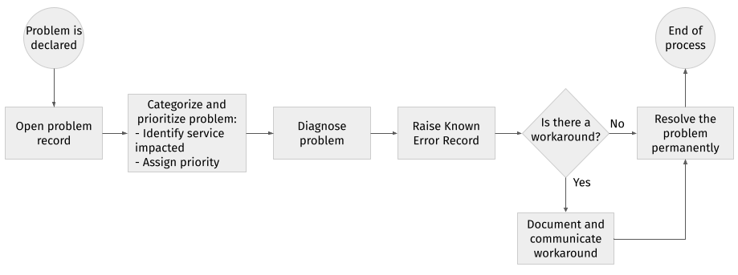

# Gestão de problemas

O objetivo geral da gestão de problemas é chegar à causa raiz dos incidentes (incidentes de Severidade 1 ou incidentes que ocorreram mais do que uma vez) ou às causas potenciais de incidentes, e desencadear depois ações para melhorar ou corrigir a situação de imediato.

O procedimento de gestão de problemas assegura que:

* os problemas são devidamente registados
* os problemas são devidamente encaminhados
* o estado dos problemas é comunicado com exatidão
* a fila de problemas por resolver está visível e é comunicada
* os problemas são devidamente priorizados e tratados pela sequência adequada
* a resolução apresentada cumpre os requisitos do acordo de nível de serviço (SLA) acordado
* é feita a resolução dos problemas ou das questões que estão na causa raiz

## Identificar problemas

Um problema é declarado pela parte interessada competente da gestão de serviço nas seguintes situações:

* quando existe um incidente cuja causa o responsável pelo incidente não consegue determinar dentro do acordo de nível de serviço estabelecido
* quando existem ocorrências repetidas de um incidente com impacto considerável no negócio
* quando existe uma degradação do serviço ou um desvio face ao comportamento esperado que é suscetível de afetar o negócio no futuro se não for mitigado, e cuja mitigação não está bem estabelecida

Em qualquer dos cenários acima, ou em qualquer outro cenário que o Gestor de Problemas considere aplicável, será aberto um registo de problema e iniciado o processo de gestão de problemas.

Se se verificar que um problema é causado por um defeito no produto, é aberto um bug de acordo com o [processo de triagem de defeitos](defect-triage.md).

## Categorizar e priorizar problemas

Para determinar se os SLA são cumpridos, é necessário categorizar e priorizar os problemas de forma rápida e correta.

O objetivo de uma categorização adequada é:

* identificar o serviço afetado
* associar os problemas aos incidentes relacionados
* indicar que grupos de Suporte têm de ser envolvidos
* fornecer métricas significativas sobre a fiabilidade do sistema

Para cada problema, será identificado o serviço específico.

A prioridade atribuída a um problema determinará com que rapidez este é calendarizado para resolução. A prioridade é definida com base numa combinação da severidade e do impacto dos incidentes relacionados.

A tabela abaixo fornece orientações sobre como classificar um problema. Para orientações sobre como ler esta tabela, veja os exemplos seguintes:

* Um problema com severidade Alta e impacto Baixo será classificado como um problema de prioridade Média (verifique a célula no cruzamento de severidade Alta com impacto Baixo).
* Um problema com severidade Média e impacto Alto será classificado como um problema de prioridade Alta (verifique a célula no cruzamento de severidade Média com impacto Alto).

<table>
<caption><strong>Matriz de prioridade dos problemas</strong></caption>
<colgroup>
<col style="width: 20%" />
<col style="width: 20%" />
<col style="width: 20%" />
<col style="width: 20%" />
<col style="width: 20%" />
</colgroup>
<thead>
<tr class="header">
<th></th>
<th colspan="4"><strong>SEVERIDADE</strong></th>
</tr>
</thead>
<tbody>
<tr class="odd">
<td></td>
<td></td>
<td>
<strong>Baixa</strong> 
 
O problema impede o utilizador de desempenhar uma parte das suas funções.
</td>
<td>
<strong>Média</strong> 
 
O problema impede o utilizador de desempenhar funções críticas com prazos apertados.
</td>
<td>
<strong>Alta</strong> 
 
Um serviço, ou uma parte substancial de um serviço, está indisponível.
</td>
</tr>
<tr class="even">
<td rowspan="3">
<strong>IMPACTO</strong>
</td>
<td>
<strong>Baixo</strong> 
 
O problema afeta um ou dois membros do pessoal.

Níveis de serviço degradados, mas ainda com processamento dentro dos SLA.
</td>
<td>
Baixa
</td>
<td>
Baixa
</td>
<td>
Média
</td>
</tr>
<tr class="odd">
<td>
<strong>Médio</strong> 
 
Níveis de serviço degradados, mas sem processamento dentro dos limites do SLA, ou capacidade de prestar apenas o nível mínimo de serviço.

A causa do problema parece afetar múltiplas áreas funcionais.
</td>
<td>
Média
</td>
<td>
Média
</td>
<td>
Alta
</td>
</tr>
<tr class="even">
<td>
<strong>Alto</strong> 
 
Todos os utilizadores de um serviço específico são afetados.

Um serviço voltado para o cliente está indisponível.
</td>
<td>
Alta
</td>
<td>
Alta
</td>
<td>
Alta
</td>
</tr>
</tbody>
</table>

## Documentar soluções de contorno

Uma solução de contorno define uma forma temporária de ultrapassar os efeitos adversos de um problema. As soluções de contorno podem ser:

* instruções fornecidas ao cliente sobre como concluir o seu trabalho por um método alternativo
* correções temporárias que ajudam um sistema a funcionar como esperado, mas que não resolvem o problema de forma permanente

As soluções de contorno têm de ser documentadas e comunicadas ao Service Desk, para poderem ser acrescentadas à Base de Conhecimento. Isto assegura que as soluções de contorno estão acessíveis ao Service Desk, facilitando a resolução em futuras recorrências do incidente.

Nos casos em que é encontrada uma solução de contorno, é importante documentar todos os detalhes dessa solução no Registo de Problema e que o Registo de Problema permaneça aberto.

## Documentar erros conhecidos

Quando é feito um diagnóstico que identifica um problema e os seus sintomas, tem de ser criado um Registo de Erro Conhecido e colocado na documentação de Erros Conhecidos. Se surgirem incidentes ou problemas repetidos, podem ser identificados e o serviço reposto mais rapidamente. Quaisquer soluções de contorno ou soluções definitivas devem também ser documentadas no Registo de Erro Conhecido do problema em causa.

Em alguns casos, pode ser vantajoso criar um Registo de Erro Conhecido ainda mais cedo no processo global – apenas para efeitos de informação, por exemplo – mesmo que o diagnóstico possa não estar concluído ou que ainda não tenha sido encontrada uma solução de contorno.

O Registo de Erro Conhecido tem de conter todos os sintomas conhecidos, para que, quando ocorrer um novo incidente, seja possível fazer uma pesquisa nos erros conhecidos e encontrar a correspondência adequada.

## Processo

A figura seguinte apresenta um resumo do processo descrito acima.

