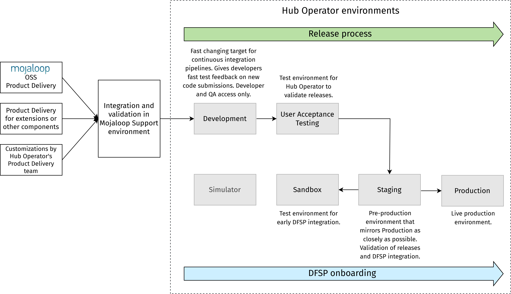
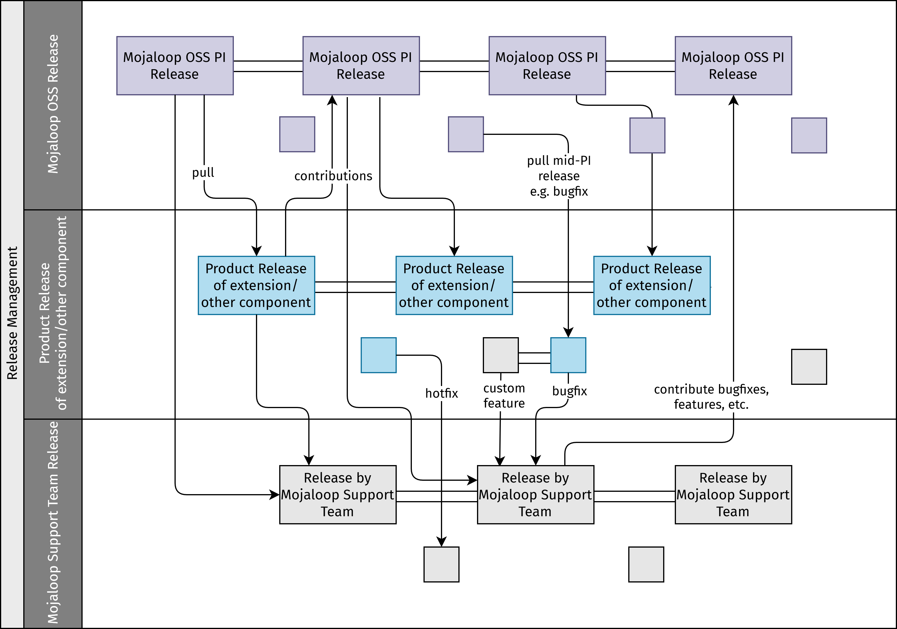
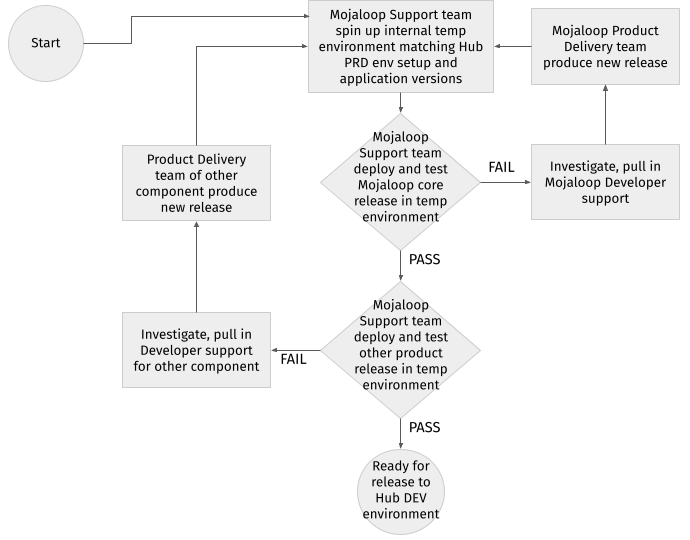

# Gestão de versões

A gestão de versões trata dos processos de gerir, planear, calendarizar e controlar uma alteração de software ao longo do deployment e dos testes nos vários ambientes.

::: tip NOTA
Os processos descritos nesta secção representam boas práticas e funcionam como recomendações para as organizações que desempenham o papel de Operador do Hub.
:::

::: tip NOTA
Esta secção refere uma «equipa de Suporte Mojaloop»: uma equipa dedicada à prestação de serviços de Suporte às operações técnicas de um Hub Mojaloop. Note-se que esta equipa pode ser uma unidade interna ou externa, consoante o nível de especialização ou a capacidade existente em cada organização. Caso se decida externalizar as funções de Suporte, existem organizações na comunidade Mojaloop que prestam diferentes níveis de Suporte como serviço. (Para mais informação e indicações, contacte a Mojaloop Foundation.)
:::

## Componentes das versões e ambientes

Ao aceitar novas versões do Mojaloop Open Source para os serviços do Switch e outros componentes necessários, as versões passam por uma série de atividades de teste em ambientes progressivamente superiores, começando pelos ambientes de desenvolvimento/QA e terminando em testes ao nível da produção.

A configuração de ambientes recomendada é composta por vários ambientes, todos com finalidades diferentes, conforme representado no diagrama abaixo.

Uma implementação Mojaloop específica de um Hub assenta em vários componentes de serviço (Mojaloop OSS, extensões ou outros componentes, eventuais personalizações), e as versões incluirão novas funcionalidades, melhorias ou correções de bugs de todos estes componentes.

## Desenvolvimento e testes (Definition of Done)

As práticas padrão de desenvolvimento e de QA – seguidas pela equipa de Desenvolvimento/Product Delivery do Mojaloop – incluem o seguinte como parte da Definition of Done. A recomendação é que o Operador do Hub adote uma estratégia semelhante.

* Testes unitários desenvolvidos para cada porção de código escrita.
* O código, os testes unitários e a documentação foram objeto de revisão por pares.
* Os testes de integração foram desenvolvidos e executados.
* Os testes de regressão completos foram executados com êxito no commit (merge para a branch master).
* As notas de versão foram criadas com os seguintes detalhes:
    * Descrição das alterações
    * Lista dos componentes/serviços alterados
    * Lista das user stories e dos bugs incluídos na versão
    * Destaque de quaisquer alterações fundamentais (breaking) com impacto em qualquer funcionalidade, solução de API ou arquitetura de sistema
* Runbook de deployment criado, com instruções de deployment e de rollback, incluindo variáveis de ambiente, scripts de atualização da base de dados e pré-requisitos de deployment.
* Manutenção das definições dos testes de regressão, dos resultados de referência dos testes do Mojaloop OSS e dos critérios de validação (testes) específicos do Scheme acrescentados sobre eles.
* Manutenção de uma base de conhecimento sobre quaisquer alterações novas ou significativas de funcionalidades, produtos, arquitetura, e assim por diante, relativas ao Mojaloop OSS e a outros componentes, bem como às personalizações efetuadas para o Scheme. A base de conhecimento serve de base à transferência de conhecimento para a equipa de Operações. Essa transferência inclui a revisão completa do runbook de deployment e de outros artefactos da versão, tais como os pacotes de versão e os scripts de base de dados, que ajudarão muito a equipa de Operações nas operações diárias, na validação, na depuração de problemas e na manutenção.

## Versões do Mojaloop

A prática padrão para as versões do Mojaloop é a seguinte:

* Todas as novas versões das aplicações, dos componentes e dos microsserviços individuais que compõem o Mojaloop estão disponíveis através de Helm charts nos repositórios públicos aqui: <https://github.com/mojaloop/helm/releases>
* São produzidos testes unitários e alguns testes de integração funcional com cada versão de componente.
* A versão do Mojaloop inclui também testes de regressão ponta a ponta automatizados. As suítes de teste são versionadas, correspondendo o número de versão ao número de versão da versão do Mojaloop.
* É produzido um pacote de versão, uma vez em cada Program Increment (PI), para as novas versões do Mojaloop. Isto inclui atualizações das aplicações, dos componentes e dos microsserviços individuais dentro do Mojaloop. \
\
Um Program Increment é um intervalo com duração fixa durante o qual uma equipa Agile entrega valor incremental.
* Todas as atualizações de manutenção, novas funcionalidades e correções de bugs do Mojaloop são disponibilizadas aos utilizadores do Mojaloop no âmbito dos ciclos de versão, uma vez em cada período de PI.

## Versões de produto de extensões/componentes adicionais

Recomenda-se que a prática padrão para as versões de produto de extensões/componentes adicionais esteja em linha com o processo de versões do Mojaloop [acima](release-management.md#versoes-do-mojaloop):

* Todas as novas versões de produto são disponibilizadas através de pacotes de versão e descritas nas notas de versão.
* Um pacote de versão inclui testes ponta a ponta automatizados para cada versão de produto. As suítes de teste são versionadas, correspondendo o número de versão ao número de versão da versão do produto.
* As versões de produto estão em linha com a cadência de versões do Mojaloop, uma vez em cada período de PI.
* Todas as atualizações de manutenção, novas funcionalidades e correções de bugs dos produtos são disponibilizadas aos DFSP clientes das extensões/produtos adicionais no âmbito do ciclo de versões, uma vez em cada período de PI.

## Bugs e hotfixes

Os bugs e os hotfixes são tratados da seguinte forma:

* Todas as correções de bugs (tanto do Mojaloop como de outros produtos) são incluídas nos pacotes de versão.
* Do mesmo modo, os hotfixes são igualmente disponibilizados através de uma versão. Não se recomenda instalar hotfixes diretamente a partir das versões de pacotes de aplicações específicas, uma vez que instalar apenas um componente de uma versão (em vez de instalar a versão que inclui o componente atualizado) pode fazer com que o Hub fique dessincronizado da versão do pacote da aplicação.
* Os bugs são acompanhados, geridos e priorizados conforme definido no [processo de triagem de defeitos](defect-triage.md):
    * A ferramenta de Service Desk é utilizada para gerir todos os bugs.
    * Uma equipa de Triagem do Suporte Mojaloop, com representantes tanto do Mojaloop como das outras equipas de Product Delivery e de Product Management, participa na análise da urgência e do impacto para determinar a priorização dos bugs, incluindo o planeamento/calendarização da resolução e a comunicação ao Operador do Hub.

## Ambientes e estratégia de QA

Para validar o deployment de uma versão recém-lançada do Mojaloop face às versões mais recentes dos outros produtos (extensões/componentes adicionais), o Scheme deve criar um ambiente com todos os componentes necessários, juntamente com a configuração específica que o Scheme utiliza. Isto permite às equipas de QA/validação e/ou de Suporte Mojaloop (uma equipa dedicada à prestação de serviços de Suporte às operações técnicas de um Hub Mojaloop) realizar o deployment e os testes das versões do Mojaloop face às versões mais recentes dos outros produtos.

::: tip NOTA
O ambiente criado pela equipa de Suporte Mojaloop para validação deve seguir uma infraestrutura padrão, replicando ou simulando tanto quanto possível uma configuração de produção correspondente, para que quaisquer problemas ou bugs possam ser identificados cedo no processo. Uma configuração de produção inclui habitualmente gateways de API, DMZ, configuração de clusters com base em zonas de segurança, juntamente com todos os componentes e personalizações necessários (incluindo as Regras do Scheme) efetuados pelo Scheme. O Operador do Hub tem de assegurar que a sua infraestrutura de produção está plenamente sincronizada com as normas de infraestrutura da equipa de Suporte Mojaloop.
:::

Após o deployment e a validação bem-sucedidos de uma versão na infraestrutura e na arquitetura padrão, e depois de executada com êxito a versão mais recente do Mojaloop e dos outros produtos, a versão é aprovada e pode ser partilhada/disponibilizada (através do servidor/repositório de clientes da Equipa de Suporte). A equipa do Hub pode então calendarizar o deployment no ambiente (eventualmente à medida) do Operador do Hub.

A estratégia de QA adotada pelas equipas de Product Delivery do Mojaloop e dos produtos de extensão assegura que o código novo de cada um dos componentes de serviço foi submetido a testes exaustivos antes de ser lançado. A estratégia de QA da equipa de Suporte Mojaloop, por seu turno, deve centrar-se em validar a capacidade de deployment dos componentes de serviço integrados e a interoperabilidade dos produtos, garantindo que existe um Switch Mojaloop funcional, que pode depois ser instalado no ambiente de um Operador do Hub.

## Processo de versões

A recomendação para as implementações de Hub é manterem-se alinhadas com a cadência de versões do Mojaloop de uma versão por período de PI e evitarem instalar alterações individuais diretamente a partir da branch master de aplicações, componentes ou serviços específicos dentro do Mojaloop. Esta recomendação assegura que a integridade das aplicações se mantém mais limpa e alinhada com os repositórios de origem.

Para cada versão, recomenda-se que a equipa de Suporte Mojaloop execute as seguintes etapas:

::: tip NOTA
Os Operadores do Hub têm de ser informados da data prevista da versão com bastante antecedência.
:::

1. A equipa de Suporte Mojaloop analisa todos os artefactos da versão, incluindo as notas de versão e a documentação associada, e cria ou melhora o runbook de deployment assim que a versão é disponibilizada.
1. A equipa de Suporte Mojaloop realiza o deployment e a validação das versões planeadas do Mojaloop e dos outros produtos num ambiente temporário de Suporte Mojaloop (utilizando a infraestrutura padrão de Suporte Mojaloop, mas correspondendo às versões das aplicações do cliente — ou seja, do Operador do Hub).
1. Após o deployment e a validação bem-sucedidos de uma versão na infraestrutura e na arquitetura padrão de Suporte Mojaloop, e depois de testada com êxito a versão mais recente do Mojaloop e dos outros produtos, a versão é aprovada e disponibilizada ao Operador do Hub.
1. A equipa do Operador do Hub confirma que está preparada (e, opcionalmente, a janela de deployment prevista) para o deployment no ambiente de Development do Operador do Hub. \
\
É da responsabilidade do Operador do Hub realizar o deployment no ambiente de Development e a subsequente validação. Em alternativa, pode solicitar ao Suporte Mojaloop que execute estas atividades em seu nome.

### Deployments pela equipa de Suporte Mojaloop

Se o Operador do Hub solicitar à equipa de Suporte Mojaloop que realize o deployment no ambiente de Development do Operador do Hub, a equipa de Suporte Mojaloop envia um e-mail (ou qualquer outra forma de comunicação, consoante as preferências do Operador do Hub) com informação sobre a data prevista da versão, o conjunto de funcionalidades incluídas na versão e a janela de deployment. Após o deployment, é enviada nova comunicação a confirmar que o deployment foi realizado e validado e que a janela de deployment foi encerrada.

## Fluxograma do processo

