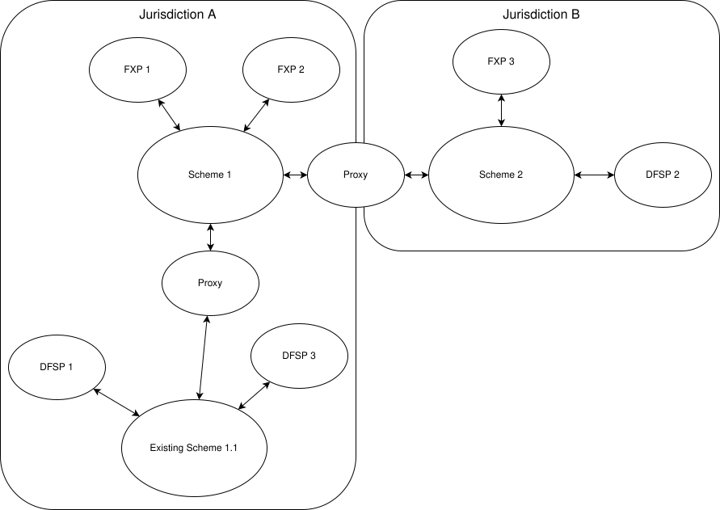

# Transações transfronteiriças

*Esta página pressupõe que o leitor está familiarizado tanto com as [**capacidades inter-scheme**](./InterconnectingSchemes.md) do Mojaloop como com o funcionamento do [**câmbio (FX)**](./ForeignExchange.md).*

A versão atual do Mojaloop trata uma transação transfronteiriça como uma transação que sai de um scheme de pagamentos (o conjunto de regras do sistema de pagamentos) e é passada a outro numa jurisdição regulamentar diferente. É, portanto, em termos Mojaloop, uma transação inter-scheme que inclui uma operação de câmbio.

O diagrama seguinte ilustra como o Mojaloop implementa esta funcionalidade.

Neste contexto, um Proxy atua como elo de ligação entre dois schemes Mojaloop que operam em países (jurisdições regulamentares) diferentes, facilitando as transações e garantindo o seu não repúdio ponta a ponta. São ilustrados vários FXPs, dois na jurisdição A e um na jurisdição B, para que os vários modelos de negócio propostos para transações de câmbio possam ser acomodados.

Este modelo pode ser alargado ainda mais, de modo a que países com sistemas domésticos de pagamentos instantâneos já existentes possam ser interligados, da seguinte forma: 

## Aplicabilidade

Esta versão deste documento diz respeito à versão [17.0.0](https://github.com/mojaloop/helm/releases/tag/v17.0.0) do Mojaloop

## Histórico do documento
  |Versão|Data|Autor|Detalhe|
|:--------------:|:--------------:|:--------------:|:--------------:|
|1.1|22 de abril de 2025| Paul Makin|Adicionado histórico de versões; clarificada alguma redação|
|1.0|14 de abril de 2025| Paul Makin|Versão inicial|