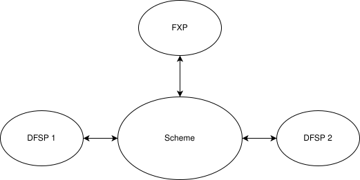

# Câmbio

Um aspeto importante de um sistema de pagamentos moderno é a capacidade de permitir transações em mais do que uma moeda; e o Mojaloop não é exceção, sendo compatível de raiz com várias moedas de transação. É um preceito importante que estas moedas funcionem de forma independente, de modo que uma transação debitada ao devedor na moeda X seja sempre creditada ao credor na moeda X.

Por vezes, contudo, é necessário estabelecer uma «ponte» entre estas moedas. Isto é facilitado por uma função habitualmente conhecida como câmbio (foreign exchange) e envolve um terceiro designado, na terminologia do Mojaloop, por fornecedor de câmbio (Foreign Exchange Provider, FXP). 

Note-se que esta função não está necessariamente relacionada com o envio transfronteiriço de fundos, uma vez que existem razões legítimas para que uma pessoa numa única jurisdição queira deter fundos denominados em várias moedas, até porque há países onde circulam habitualmente várias moedas.

O diagrama seguinte mostra como o Mojaloop implementa esta funcionalidade.

Atualmente, o Mojaloop só permite um único modelo de negócio para a implementação de uma transação de câmbio. Este modelo implementa o modelo «O pagador decide» descrito a seguir.

### O pagador decide

1. Um cliente do DFSP1 pretende enviar 10 unidades da moeda X ao beneficiário.
2. A descoberta mostra que a conta do beneficiário está alojada no DFSP 2.
3. O DFSP 1 propõe a transação ao DFSP 2, que indica que o pagamento tem de ser encaminhado na moeda Y.
4. O DFSP 1 envia 10 X ao FXP, que encaminha o valor equivalente na moeda Y para o DFSP 2 e paga ao beneficiário (deduzidas as comissões, o spread cambial, etc.). 

Podem encontrar-se mais detalhes sobre a implementação desta capacidade de câmbio (FX) na [**documentação de FX**](./fx.md).

Outros modelos de negócio, mais complexos, serão disponibilizados num release futuro. Atualmente, está planeado que incluam:

### Vários FXP

1. Um cliente do DFSP1 pretende enviar 10 unidades da moeda X ao beneficiário.
2. A descoberta mostra que a conta do beneficiário está alojada no DFSP 2.
3. O DFSP 1 propõe a transação ao DFSP 2, que indica que o pagamento tem de ser encaminhado na moeda Y.
4. O DFSP 1 propõe a transação a vários FXPs, seleciona aquele com os termos mais vantajosos e envia 10 X a esse FXP, que encaminha o valor equivalente na moeda Y para o DFSP 2 e paga ao beneficiário (deduzidas as comissões, o spread cambial, etc.). 

### O beneficiário decide

1. Um cliente do DFSP1 pretende enviar 10 unidades da moeda X ao beneficiário.
2. A descoberta mostra que a conta do beneficiário está alojada no DFSP 2.
3. O DFSP 1 propõe a transação ao DFSP 2, que indica que o pagamento deve ser encaminhado na moeda do pagador, X.
4. O DFSP 1 envia 10 X ao DFSP 2
5. O DFSP 2 propõe a transação a vários FXPs, seleciona aquele com os termos mais vantajosos e envia 10 X a esse FXP, que devolve o valor equivalente na moeda Y ao DFSP 2, que por sua vez paga ao beneficiário (deduzidas as comissões, o spread cambial, etc.). 

A página seguinte será de interesse para quem pretenda analisar como as capacidades inter-scheme e de câmbio se relacionam com as  [**transações transfronteiriças**](./CrossBorder.md).

## Aplicabilidade

Esta versão deste documento diz respeito à versão [17.0.0](https://github.com/mojaloop/helm/releases/tag/v17.0.0) do Mojaloop

## Histórico do documento
  |Versão|Data|Autor|Detalhe|
|:--------------:|:--------------:|:--------------:|:--------------:|
|1.1|22 de abril de 2025| Paul Makin|Adicionado o histórico de versões|
|1.0|13 de março de 2025| Paul Makin|Versão inicial|
