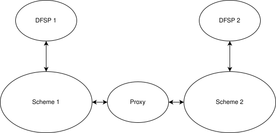

# Interligação de schemes de pagamento

O Mojaloop, enquanto deployment único, destina-se a ser utilizado para operar um (ou mais) schemes de pagamento (o scheme é o conjunto de regras do sistema de pagamentos), a funcionar numa única plataforma. Naturalmente, é bastante comum um país albergar vários schemes de pagamento a funcionar em plataformas separadas, construídos em torno de requisitos diferentes para setores diferentes. 

Em última análise, porém, à medida que um scheme de pagamento cresce, cresce também a necessidade de estar interligado  ou ser interoperável com outros schemes de pagamento do país. O Mojaloop acomoda esta necessidade através de um mecanismo a que chamamos «Interscheme».

A abordagem Interscheme do Mojaloop utiliza um tipo especializado de participante DFSP, a que chamamos Proxy. Um Proxy é um DFSP leve que existe em ambos os schemes interligados e tem as seguintes características:
- O Proxy não faz qualquer processamento de mensagens; limita-se a passar mensagens (transações) entre os schemes ligados;
- Garantir o não repúdio entre schemes significa que o proxy não participa no acordo de termos, o que ajuda a reduzir custos;
- Não desempenha qualquer papel na compensação das transações.

A consequência disto é que um Proxy preserva as três fases de uma transferência Mojaloop, além de garantir o não repúdio de ponta a ponta. Consequentemente, o acordo alcançado durante uma transferência permanece entre os DFSPs de origem e de destino, independentemente do scheme a que estejam ligados.

Além disso, o modelo de interligação de schemes do Mojaloop permite a descoberta entre schemes; por outras palavras, um alias utilizado num scheme pode ser utilizado para encaminhar um pagamento a partir de outro.

A versão atual do Mojaloop só permite a interligação de schemes baseados em Mojaloop. Prossegue o trabalho para alargar esta capacidade a outros schemes de pagamento, ligados a um scheme baseado em Mojaloop.

Podem encontrar-se mais detalhes sobre a implementação desta capacidade de interligação de schemes na [**documentação do Interscheme**](./interscheme.md).

As páginas seguintes serão de interesse para quem pretenda analisar como as capacidades inter-scheme se relacionam com o [**câmbio**](./ForeignExchange.md) e com as [**transações transfronteiriças**](./CrossBorder.md).

## Aplicabilidade

Esta versão deste documento diz respeito à versão [17.0.0](https://github.com/mojaloop/helm/releases/tag/v17.0.0) do Mojaloop

## Histórico do documento
  |Versão|Data|Autor|Detalhe|
|:--------------:|:--------------:|:--------------:|:--------------:|
|1.1|22 de abril de 2025| Paul Makin|Adicionado o histórico de versões; clarificada alguma redação|
|1.0|14 de abril de 2025| Paul Makin|Versão inicial|
