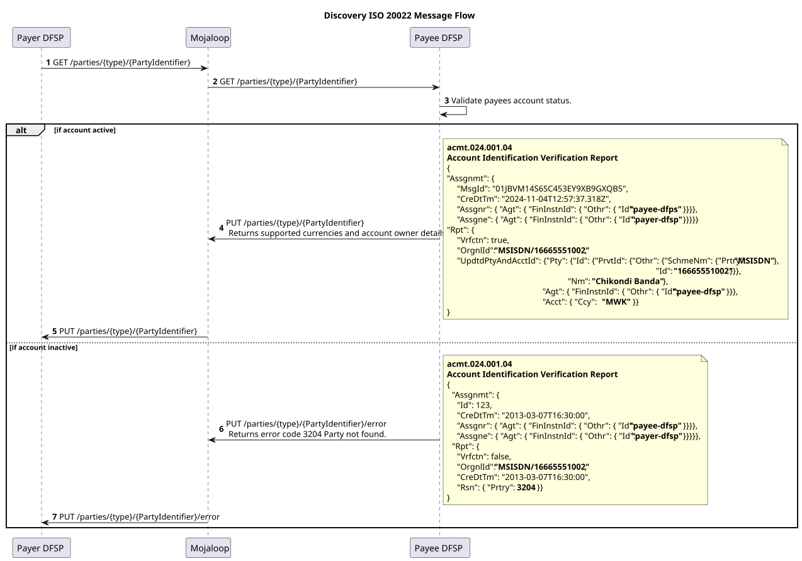
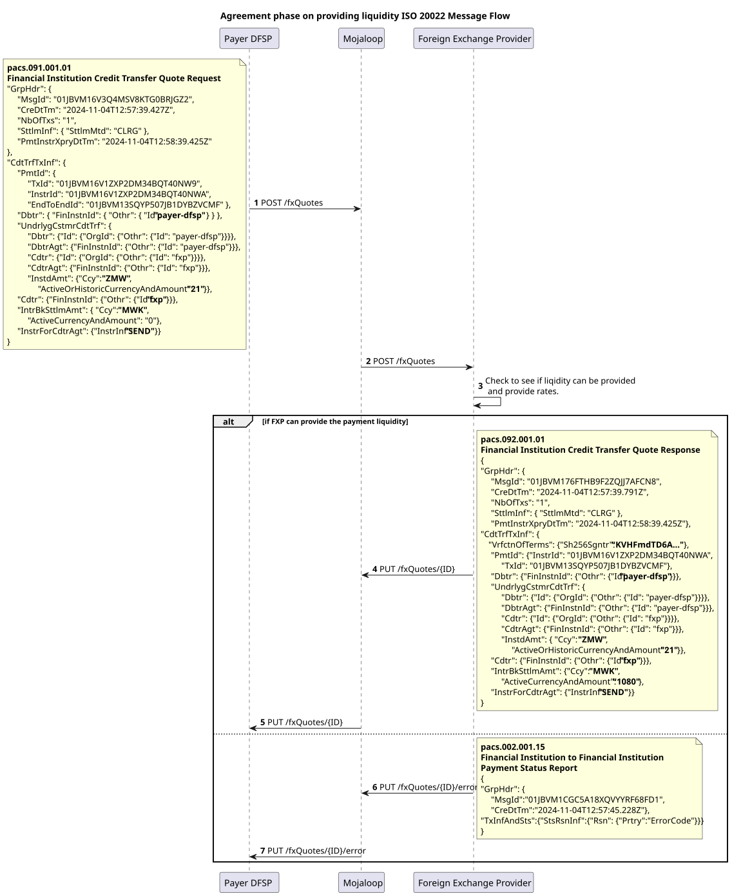
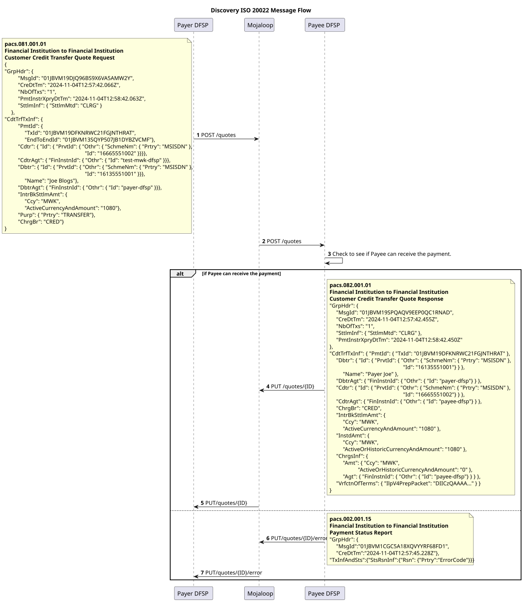
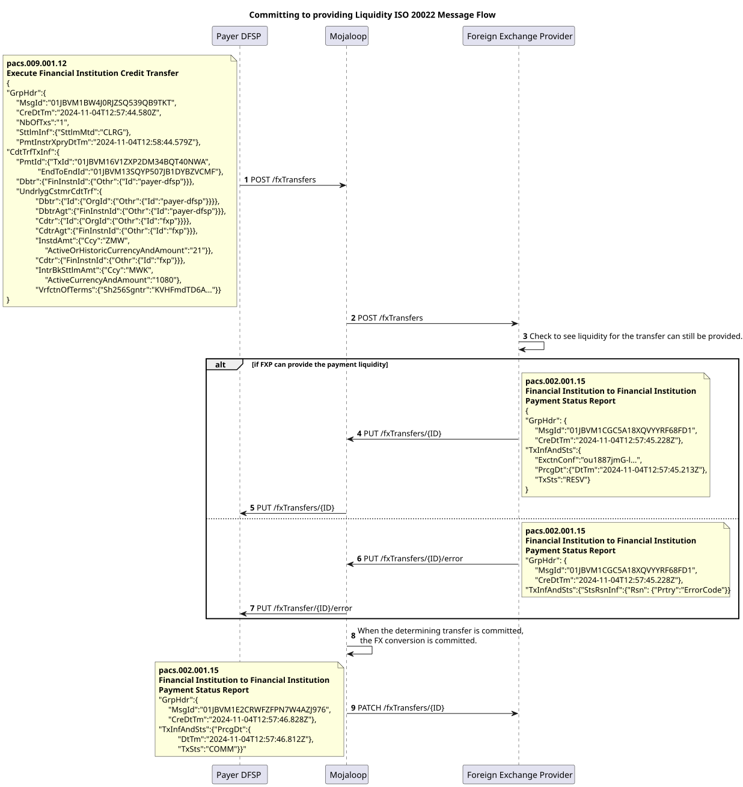
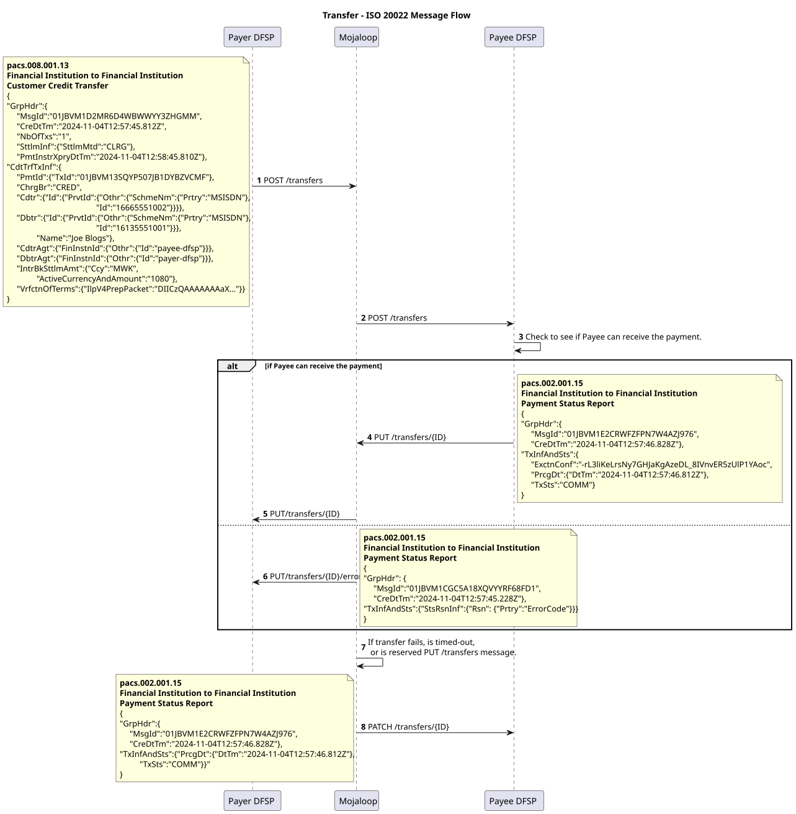

# v1.0: Documento de práticas de mercado ISO 20022 do Mojaloop
 
<!-- TOC depthfrom:1 depthto:3 orderedlist:true -->

- [1. Documento de práticas de mercado ISO 20022 do Mojaloop](#_1-documento-de-praticas-de-mercado-iso-20022-do-mojaloop)
- [2. Introdução](#_2-introducao)
    - [2.1. Como utilizar este documento?](#_2-1-como-utilizar-este-documento)
        - [2.1.1. Relação com os documentos de regras específicas do scheme](#_2-1-1-relacao-com-os-documentos-de-regras-especificas-do-scheme)
        - [2.1.2. Distinção entre práticas genéricas e requisitos específicos do scheme](#_2-1-2-distincao-entre-praticas-genericas-e-requisitos-especificos-do-scheme)
- [3. Expectativas, obrigações e regras das mensagens](#_3-expectativas-obrigacoes-e-regras-das-mensagens)
    - [3.1. Conversão cambial](#_3-1-conversao-cambial)
    - [3.2. Mensagens JSON](#_3-2-mensagens-json)
    - [3.3. APIs](#_3-3-apis)
        - [3.3.1. Detalhes do cabeçalho](#_3-3-1-detalhes-do-cabecalho)
        - [3.3.2. Respostas HTTP permitidas](#_3-3-2-respostas-http-permitidas)
        - [3.3.3. Payload de erro comum](#_3-3-3-payload-de-erro-comum)
    - [3.4. ULIDs como identificadores únicos](#_3-4-ulids-como-identificadores-unicos)
    - [3.5. Inter-ledger Protocol v4 para representar os termos criptográficos](#_3-5-inter-ledger-protocol-v4-para-representar-os-termos-criptograficos)
    - [3.6. Campos de dados suplementares ISO 20022](#_3-6-campos-de-dados-suplementares-iso-20022)
- [4. Fase de descoberta](#_4-fase-de-descoberta)
    - [4.1. Fluxo de mensagens](#_4-1-fluxo-de-mensagens)
    - [4.2. Recurso Parties](#_4-2-recurso-parties)
- [5. Fase de acordo](#_5-fase-de-acordo)
    - [5.1. Subfase de acordo de conversão cambial](#_5-1-subfase-de-acordo-de-conversao-cambial)
        - [5.1.1. Fluxo de mensagens](#_5-1-1-fluxo-de-mensagens)
        - [5.1.2. Recurso fxQuotes](#_5-1-2-recurso-fxquotes)
    - [5.2. Subfase de acordo dos termos da transferência](#_5-2-subfase-de-acordo-dos-termos-da-transferencia)
        - [5.2.1. Fluxo de mensagens](#_5-2-1-fluxo-de-mensagens)
        - [5.2.2. Recurso Quotes](#_5-2-2-recurso-quotes)
- [6. Fase de transferência](#_6-fase-de-transferencia)
    - [6.1. Aceitação dos termos de conversão cambial](#_6-1-aceitacao-dos-termos-de-conversao-cambial)
        - [6.1.1. Fluxo de mensagens](#_6-1-1-fluxo-de-mensagens)
        - [6.1.2. Recurso fxTransfers](#_6-1-2-recurso-fxtransfers)
    - [6.2. Execução e compensação da transferência](#_6-2-execucao-e-compensacao-da-transferencia)
        - [6.2.1. Fluxo de mensagens](#_6-2-1-fluxo-de-mensagens)
        - [6.2.2. Recurso Transfers](#_6-2-2-recurso-transfers)

<!-- /TOC -->
# 2. Introdução

Ao combinar os princípios da inclusão financeira com as capacidades robustas da ISO 20022, o Mojaloop garante que os DFSPs (Digital Financial Services Providers) e outras partes interessadas podem disponibilizar soluções de pagamento em tempo real que são económicas, seguras e escaláveis para responder às exigências de ecossistemas financeiros inclusivos. Este documento é a versão 1.0 da prática de mercado ISO-20022 do Mojaloop.

## 2.1 Como utilizar este documento?
Este documento constitui uma referência de base para a implementação de mensagens ISO 20022 para IIPS no âmbito de schemes baseados no Mojaloop (o scheme é o conjunto de regras do sistema de pagamentos). Descreve as orientações e práticas gerais que se aplicam universalmente a todos os schemes Mojaloop, centrando-se nos requisitos de nível base. No entanto, foi concebido para ser complementado por documentos de regras específicas do scheme, que podem definir campos de mensagem, validações e regras adicionais necessários para cumprir a regulamentação e os requisitos próprios de cada scheme. Esta abordagem por camadas permite que cada scheme adapte os seus detalhes de implementação, mantendo ao mesmo tempo a consistência com o quadro mais amplo do Mojaloop.

### 2.1.1 Relação com os documentos de regras específicas do scheme
Este documento serve de base para compreender como a ISO 20022 é aplicada no Mojaloop, centrando-se nos princípios e práticas fundamentais. No entanto, não prescreve os requisitos de negócio detalhados, as validações e os quadros de governação que são específicos de cada scheme. As regras específicas do scheme tratam destes detalhes, incluindo as especificações de campos obrigatórios e opcionais, protocolos de conformidade adaptados e procedimentos definidos para o tratamento de erros. Abrangem também as regras de negócio que regem os fluxos de mensagens, os papéis dos participantes e as responsabilidades no âmbito do scheme. A flexibilidade deste documento permite aos administradores do scheme adaptar e alargar as suas orientações para responder às suas necessidades operacionais próprias.

### 2.1.2 Distinção entre práticas genéricas e requisitos específicos do scheme
Este documento separa claramente as práticas genéricas dos requisitos específicos do scheme, de modo a alcançar um equilíbrio entre consistência e adaptabilidade nas implementações da ISO 20022 no Mojaloop. As práticas genéricas aqui descritas estabelecem princípios fundamentais, incluindo as expectativas quanto às estruturas das mensagens, os campos obrigatórios para cumprir os requisitos do switch, os campos permitidos e os fluxos transacionais. Além disso, fornecem uma visão geral de alto nível do ciclo de vida de uma transferência P2P com câmbio (FX) no Mojaloop.

Os requisitos específicos do scheme, documentados separadamente, aprofundam mapeamentos de campos adicionais, validações reforçadas e regras precisas para a liquidação, a reconciliação e a resolução de litígios. Estes requisitos abrangem também políticas de governação e obrigações de conformidade adaptadas às necessidades próprias de cada scheme.

Esta distinção permite aos DFSPs implementar um quadro de mensagens central consistente, ao mesmo tempo que concede aos administradores do scheme a flexibilidade de definir as especificidades operacionais. As práticas genéricas apresentadas neste documento foram deliberadamente concebidas para serem extensíveis, garantindo uma integração harmoniosa com as regras específicas do scheme e favorecendo a adesão às normas ISO 20022 para IIPS do Mojaloop.

# 3 Expectativas, obrigações e regras das mensagens
O processo de transferência do Mojaloop está dividido em três fases principais, cada uma essencial para garantir transações seguras e eficientes. Estas fases utilizam recursos específicos para possibilitar as interações entre participantes, assegurando uma comunicação, um acordo e uma execução claros. Embora algumas fases e recursos sejam opcionais, o objetivo final é garantir que cada transferência é exata, segura e está alinhada com os termos acordados. 
1. [Descoberta](#_4-fase-de-descoberta)
2. [Acordo](#_5-fase-de-acordo)
3. [Transferência](#_6-fase-de-transferencia)

## 3.1 Conversão cambial
A conversão cambial é incluída para permitir transações entre moedas diferentes. Como nem sempre é necessária, as mensagens e os fluxos associados só são utilizados quando necessário, garantindo flexibilidade tanto para cenários de moeda única como para cenários multimoeda.

## 3.2 Mensagens JSON
O Mojaloop adota uma variante JSON das mensagens ISO 20022, afastando-se do formato XML tradicional para melhorar a eficiência e a compatibilidade com as APIs modernas. A organização ISO 20022 está a desenvolver ativamente uma representação JSON canónica das suas mensagens, e o Mojaloop pretende alinhar-se com essa norma à medida que esta evolui.

## 3.3 APIs
No Mojaloop, as mensagens ISO 20022 são trocadas através de chamadas de API de tipo REST. Esta abordagem melhora a interoperabilidade, reduz a sobrecarga de dados graças a mensagens JSON leves e permite implementações escaláveis e modulares. Ao integrar a ISO 20022 com APIs REST, o Mojaloop disponibiliza um quadro robusto e adaptável que equilibra as normas globais com as necessidades práticas de implementação. 

### 3.3.1 Detalhes do cabeçalho 
O cabeçalho da mensagem da API deverá conter os detalhes seguintes. Os cabeçalhos obrigatórios são assinalados com um asterisco `*`.

| Nome&nbsp;&nbsp;&nbsp;&nbsp;&nbsp;&nbsp;&nbsp;&nbsp;&nbsp;&nbsp;&nbsp;&nbsp;&nbsp;&nbsp;&nbsp;&nbsp;&nbsp;&nbsp;&nbsp;&nbsp;&nbsp;&nbsp;&nbsp;&nbsp;&nbsp;&nbsp;&nbsp;&nbsp;&nbsp;&nbsp;&nbsp;&nbsp;| Descrição |
|--|--|
|**Content-Length** *integer* (header)|O campo de cabeçalho `Content-Length` indica o tamanho previsto do corpo do payload. Só é enviado se existir um corpo.**Nota:** A API permite um tamanho máximo de 5242880 bytes (5 megabytes).|
| * **Type** *string* (path)|O tipo do identificador da parte. Por exemplo, `MSISDN`, `PERSONAL_ID`.|
| * **ID** *string* (path)| O valor do identificador.|
| * **Content-Type**  *string* (header)|O cabeçalho `Content-Type` indica a versão específica da API utilizada para enviar o corpo do payload.|
| * **Date** *string* (header)|O campo de cabeçalho `Date` indica a data em que o pedido foi enviado.|
| **X-Forwarded-For**   *string* (header)|O campo de cabeçalho `X-Forwarded-For` é uma norma aceite de forma não oficial, utilizada para fins informativos relativos ao endereço IP do cliente de origem, dado que um pedido pode passar por vários proxies, firewalls, etc. Os implementadores da API deverão prever e permitir vários valores de `X-Forwarded-For`.**Nota:** Uma alternativa a `X-Forwarded-For` está definida na [RFC 7239](https://tools.ietf.org/html/rfc7239). No entanto, até ao momento, a RFC 7239 é menos utilizada e menos adotada do que `X-Forwarded-For`.|
| * **FSPIOP-Source**   *string* (header)|O campo de cabeçalho `FSPIOP-Source` é um campo não normalizado em HTTP, utilizado pela API para identificar o remetente do pedido HTTP. O campo deverá ser definido pelo remetente original do pedido. Obrigatório para o encaminhamento e para a verificação da assinatura (ver o campo de cabeçalho `FSPIOP-Signature`).|
| **FSPIOP-Destination**   *string* (header)|O campo de cabeçalho `FSPIOP-Destination` é um campo não normalizado em HTTP, utilizado pela API para o encaminhamento de pedidos e respostas até ao destino com base nos cabeçalhos HTTP. O campo tem de ser definido pelo remetente original do pedido se o destino for conhecido (válido para todos os serviços exceto GET /parties), para que as entidades situadas entre o cliente e o servidor não precisem de analisar o payload para fins de encaminhamento. Se o destino não for conhecido (válido para o serviço GET /parties), o campo deverá ser deixado vazio.|
| **FSPIOP-Encryption**   *string* (header) | O campo de cabeçalho `FSPIOP-Encryption` é um campo não normalizado em HTTP, utilizado pela API para aplicar a encriptação de ponta a ponta do pedido.|
| **FSPIOP-Signature**   *string*   (header)| O campo de cabeçalho `FSPIOP-Signature` é um campo não normalizado em HTTP, utilizado pela API para aplicar uma assinatura de ponta a ponta ao pedido.|
| **FSPIOP-URI**   *string*   (header) | O campo de cabeçalho `FSPIOP-URI` é um campo não normalizado em HTTP, utilizado pela API para a verificação da assinatura; deverá conter o URI do serviço. Obrigatório se a verificação da assinatura for utilizada; para mais informações, consulte [o documento de assinatura da API (em inglês)](https://docs.mojaloop.io/technical/api/fspiop/).|
| **FSPIOP-HTTP-Method**   *string*   (header) | O campo de cabeçalho `FSPIOP-HTTP-Method` é um campo não normalizado em HTTP, utilizado pela API para a verificação da assinatura; deverá conter o método HTTP do serviço. Obrigatório se a verificação da assinatura for utilizada; para mais informações, consulte [o documento de assinatura da API (em inglês)](https://docs.mojaloop.io/technical/api/fspiop/).|

### 3.3.2 Respostas HTTP permitidas

| **Código de erro HTTP** | **Descrição e causas comuns** |
|---|----|
|**400 Bad Request** | **Descrição**: O servidor não conseguiu compreender o pedido devido a sintaxe inválida. Esta resposta indica que o pedido estava mal formado ou continha parâmetros inválidos. **Causas comuns**: Campos obrigatórios em falta, valores de campo inválidos ou formato de pedido incorreto. |
|**401 Unauthorized** | **Descrição**: O cliente tem de se autenticar para obter a resposta pedida. Esta resposta indica que o pedido não contém credenciais de autenticação válidas. **Causas comuns**: Token de autenticação em falta ou inválido. |
|**403 Forbidden** | **Descrição**: O cliente não tem direitos de acesso ao conteúdo. Esta resposta indica que o servidor compreendeu o pedido, mas recusa autorizá-lo. **Causas comuns**: Permissões insuficientes para aceder ao recurso. |
|**404 Not Found** | **Descrição**: O servidor não consegue encontrar o recurso pedido. Esta resposta indica que o recurso especificado não existe. **Causas comuns**: Identificador de recurso incorreto ou recurso eliminado. |
|**405 Method Not Allowed** | **Descrição**: O método do pedido é conhecido pelo servidor, mas não é permitido pelo recurso de destino. Esta resposta indica que o método HTTP utilizado não é permitido para o endpoint. **Causas comuns**: Utilização de um método HTTP não permitido (por exemplo, POST em vez de PUT). |
|**406 Not Acceptable** | **Descrição**: O servidor não consegue produzir uma resposta que corresponda à lista de valores aceitáveis definida nos cabeçalhos de negociação proativa de conteúdo do pedido. Esta resposta indica que o servidor não consegue gerar uma resposta aceitável de acordo com os cabeçalhos Accept enviados no pedido. **Causas comuns**: Tipo de media ou formato não permitido especificado no cabeçalho Accept. |
|**501 Not Implemented** | **Descrição**: O servidor não disponibiliza a funcionalidade necessária para satisfazer o pedido. Esta resposta indica que o servidor não reconhece o método do pedido ou não tem capacidade para satisfazer o pedido. **Causas comuns**: A funcionalidade pedida não está implementada no servidor. |
|**503 Service Unavailable** | **Descrição**: O servidor não está pronto para processar o pedido. Esta resposta indica que o servidor está temporariamente incapaz de processar o pedido devido a manutenção ou sobrecarga. **Causas comuns**: Manutenção do servidor, sobrecarga temporária ou indisponibilidade do servidor. |

### 3.3.3 Payload de erro comum

Todas as respostas de erro devolvem uma estrutura de payload comum que inclui uma mensagem específica. O payload contém tipicamente os campos seguintes:

- **errorCode**: Um código que representa o erro específico.
- **errorDescription**: Uma descrição do erro.
- **extensionList**: Uma lista opcional de pares chave-valor que fornece informações adicionais sobre o erro.

Este payload de erro comum ajuda os clientes a compreender a natureza do erro e a tomar as medidas adequadas.

## 3.4 ULIDs como identificadores únicos
O Mojaloop utiliza identificadores universalmente únicos e ordenáveis lexicograficamente (Universally Unique Lexicographically Sortable Identifiers, ULIDs) como norma para os identificadores únicos em todo o seu sistema de mensagens. Os ULIDs oferecem uma alternativa robusta aos UUIDs tradicionais, garantindo identificadores globalmente únicos e permitindo simultaneamente uma ordenação natural pela hora de criação. Esta ordenação lexicográfica simplifica a rastreabilidade, a resolução de problemas e a análise operacional.

## 3.5 Inter-ledger Protocol (v4) para representar os termos criptográficos
O Mojaloop tira partido do Inter-ledger Protocol (ILP) versão 4 para definir e representar os termos criptográficos nos seus processos de transferência. O ILP v4 fornece um quadro normalizado para a troca segura e interoperável de instruções de pagamento, garantindo a integridade e o não repúdio das transações. Ao integrar as capacidades criptográficas do ILP, o Mojaloop possibilita acordos precisos e invioláveis entre participantes, permitindo uma execução segura das transferências de ponta a ponta e mantendo ao mesmo tempo a compatibilidade com os ecossistemas de pagamento globais.

## 3.6 Campos de dados suplementares ISO 20022

Não se prevê que os campos de dados suplementares ISO 20022 venham a ser necessários para qualquer das mensagens utilizadas. Se forem fornecidos dados suplementares, o switch não rejeitará a mensagem; no entanto, ignorará o seu conteúdo e comportar-se-á como se os dados suplementares não estivessem presentes.

# 4. Fase de descoberta
A fase de descoberta é um passo opcional do processo de transferência, necessário apenas quando o beneficiário (parte final) tem de ser identificado e confirmado antes de iniciar um acordo. Esta fase utiliza o recurso parties, que facilita a obtenção e a validação das informações do beneficiário para garantir que este é elegível para receber a transferência. As verificações principais realizadas durante esta fase incluem confirmar que a conta do beneficiário está ativa, identificar as moedas que podem ser transferidas para a conta e confirmar os dados do titular da conta. Estas informações permitem ao pagador verificar com exatidão os dados do beneficiário, reduzindo o risco de erros e garantindo uma base segura para as fases subsequentes do processo de transferência.

## 4.1 Fluxo de mensagens

O diagrama de sequência mostra as mensagens de exemplo da descoberta numa transferência P2P iniciada pelo pagador.

## 4.2 Recurso Parties
O recurso Parties fornece toda a funcionalidade necessária na fase de descoberta de uma transferência. A funcionalidade é sempre iniciada com uma chamada GET /parties, e as respostas a esta são devolvidas ao originador através de um callback PUT /parties. As mensagens de erro são devolvidas através do callback PUT /parties/.../error. Estes endpoints permitem um tipo de subidentificador opcional.

| Endpoint | Mensagem |
|--- | --- |
|[GET /parties/{type}/{partyIdentifier}[/{subId}]](./script/parties_GET.md) |  |
|[PUT /parties/{type}/{partyIdentifier}[/{subId}]](./script/parties_PUT.md) | acmt.024.001.04 |
|[PUT /parties/{type}/{partyIdentifier}[/{subId}]/error](./script/parties_error_PUT.md) | acmt.024.001.04 |

# 5. Fase de acordo
A **fase de acordo** é um passo crítico do processo de transferência do Mojaloop, garantindo que todas as partes envolvidas têm um entendimento comum dos termos da transferência antes de quaisquer fundos serem comprometidos. Esta fase serve vários propósitos essenciais:
1. **Cálculo e acordo das comissões** 
A fase de acordo proporciona a oportunidade de calcular e acordar mutuamente quaisquer comissões aplicáveis. Isto garante transparência e evita litígios relacionados com encargos depois de a transferência ser iniciada.
1. **Validação prévia ao compromisso** 
Permite a cada organização participante verificar se a transferência pode prosseguir. Este passo ajuda a identificar e a resolver potenciais problemas numa fase inicial, reduzindo os erros durante a transferência e minimizando as discrepâncias de reconciliação.
1. **Assinatura criptográfica dos termos** 
Os termos da transferência são assinados criptograficamente durante esta fase. Este mecanismo garante o não repúdio, o que significa que as partes não podem negar o seu envolvimento na transação nem o seu acordo com a mesma. O Interledger Protocol é utilizado para realizar esta assinatura criptográfica. Os detalhes sobre como produzir um pacote ILP estão definidos aqui: [Documentação da API FSPIOP do Mojaloop (em inglês)](https://docs.mojaloop.io/technical/api/fspiop/).
1. **Promoção da inclusão financeira** 
Ao apresentar antecipadamente a todas as partes os termos completos da transferência, a fase de acordo garante que os participantes estão plenamente informados antes de assumirem quaisquer compromissos. Esta transparência favorece a inclusão financeira ao permitir uma tomada de decisão justa e informada por parte de todas as partes interessadas.

A fase de acordo não só melhora a fiabilidade e a eficiência das transferências Mojaloop, como também se alinha com o seu objetivo mais amplo de promover a confiança e a inclusão nos ecossistemas financeiros digitais.

A fase de acordo divide-se ainda em duas fases. 

## 5.1 Subfase de acordo de conversão cambial
A subfase de acordo de conversão cambial é um passo opcional dentro da fase de acordo, ativado apenas quando a transferência envolve uma conversão cambial. Durante esta subfase, o DFSP pagador (Digital Financial Services Provider) coordena-se com um fornecedor de câmbio (FX) para assegurar a liquidez entre moedas necessária para concluir a transação. Este passo estabelece as taxas de câmbio e as comissões associadas, garantindo que tanto o DFSP como o FXP podem confiar em termos de conversão transparentes e acordados. Ao tratar das necessidades de conversão cambial antes de se comprometer com a transferência, esta subfase ajuda a evitar atrasos e discrepâncias, favorecendo uma experiência de transação transfronteiriça sem fricções.

### 5.1.1 Fluxo de mensagens

O diagrama de sequência mostra as mensagens de exemplo da descoberta numa transferência P2P iniciada pelo pagador.

### 5.1.2 Recurso fxQuotes

| Endpoint | Mensagem |
|--- | --- |
|[POST /fxQuotes/{ID}](./script/fxquotes_POST.md) | **pacs.091.001** |
|[PUT /fxQuotes/{ID}](./script/fxquotes_PUT.md) | **pacs.092.001** |
|[PUT /fxQuotes/{ID}/error](./script/fxquotes_error_PUT.md) | **pacs.002.001.15** |

## 5.2 Subfase de acordo dos termos da transferência
A subfase de acordo dos termos de ponta a ponta envolve o estabelecimento colaborativo dos termos da transferência entre o DFSP pagador e o DFSP beneficiário. Este processo garante que ambas as partes estão alinhadas quanto a detalhes críticos, como o montante a transferir, as comissões e os requisitos de prazos. Esta subfase facilita também a assinatura criptográfica destes termos, fornecendo um quadro robusto para o não repúdio e a responsabilização. Ao finalizar os termos da transferência de forma transparente, esta subfase minimiza o risco de erros ou litígios, melhorando a eficiência e a fiabilidade do processo global de transferência do Mojaloop.

### 5.2.1 Fluxo de mensagens

O diagrama de sequência mostra as mensagens de exemplo da descoberta numa transferência P2P iniciada pelo pagador.

### 5.2.2 Recurso Quotes

| Endpoint | Mensagem |
| ------------- | --- |
|[POST /quotes/{ID}](./script/quotes_POST.md) | **pacs.081.001** |
|[PUT /quotes/{ID}](./script/quotes_PUT.md) | **pacs.082.001** |
|[PUT /quotes/{ID}/error](./script/quotes_error_PUT.md) | **pacs.002.001.15** |

# 6. Fase de transferência
Uma vez estabelecidos com sucesso os acordos durante a fase de acordo, a aceitação destes termos desencadeia a fase de transferência, na qual ocorre o movimento efetivo dos fundos. Esta fase é executada com precisão para garantir que os termos acordados são respeitados e que todos os participantes cumprem os seus compromissos. A fase de transferência divide-se em duas subfases: a subfase de execução da conversão cambial e a subfase de compensação da transferência, cada uma correspondendo à respetiva subfase da fase de acordo.

## 6.1 Aceitação dos termos de conversão cambial
A subfase de execução da conversão cambial ocorre se a transferência envolver uma operação de câmbio. Neste passo, o fornecedor de câmbio, conforme acordado durante a fase de acordo, executa a conversão cambial. A liquidez necessária para a transferência entre moedas é disponibilizada e os fundos convertidos são preparados para o movimento subsequente até ao DFSP beneficiário. Esta subfase é uma oportunidade para o FXP garantir que as taxas de câmbio e as comissões acordadas anteriormente são respeitadas, salvaguardando a integridade financeira e a transparência da transação.

### 6.1.1 Fluxo de mensagens

O diagrama de sequência mostra as mensagens de exemplo da transferência numa transferência P2P iniciada pelo pagador.

### 6.1.2 Recurso fxTransfers

| Endpoint | Mensagem |
| -------- | --- |
|[POST /fxTransfers/{ID}](./script/fxtransfers_POST.md) | **pacs.009.001** |
|[PUT /fxTransfers/{ID}](./script/fxtransfers_PUT.md) | **pacs.002.001.15** |
|[PUT /fxTransfers/{ID}/error](./script/fxtransfers_error_PUT.md) | **pacs.002.001.15** |
|[PATCH /fxTransfers/{ID}/error](./script/fxtransfers_PATCH.md) | **pacs.002.001.15** |

## 6.2 Execução e compensação da transferência 
A subfase de liquidação dos fundos envolve a transferência efetiva de fundos entre o DFSP pagador e o DFSP beneficiário. Este passo garante que o montante acordado, incluindo quaisquer comissões associadas, é corretamente compensado nas contas adequadas. Esta subfase conclui a transação financeira, cumprindo os compromissos assumidos durante a fase de acordo. Através de mecanismos seguros e eficientes de movimentação de fundos, esta subfase garante que a transferência é concluída sem sobressaltos e em conformidade com os termos acordados.

### 6.2.1 Fluxo de mensagens

O diagrama de sequência mostra as mensagens de exemplo da descoberta numa transferência P2P iniciada pelo pagador.

### 6.2.2 Recurso Transfers

| Endpoint | Mensagem |
| --------- | --- |
|[POST /transfers/{ID}](./script/transfers_POST.md) | **pacs.008.001** |
|[PUT /transfers/{ID}](./script/quotes_PUT.md) | **pacs.002.001.15** |
|[PUT /transfers/{ID}/error](./script/quotes_error_PUT.md) | **pacs.002.001.15** |
|[PATCH /transfers/{ID}/error](./script/transfers_PATCH.md) | **pacs.002.001.15** |

