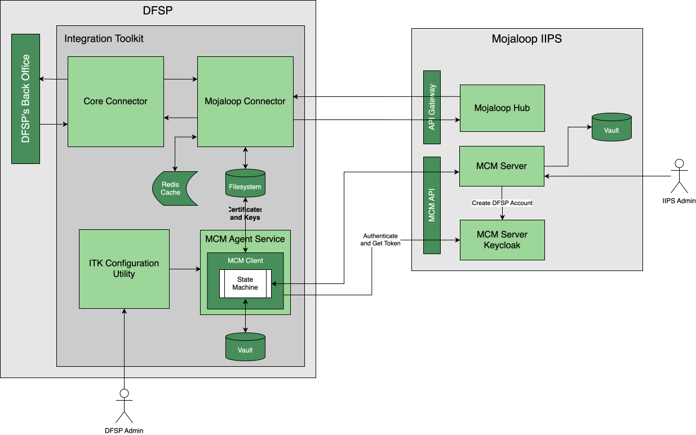

# Guia de seleção e utilização das ferramentas de participação

# Contexto

A Comunidade Mojaloop desenvolveu um conjunto de ferramentas para utilização pelos DFSPs (Digital Financial Services Providers) participantes, que facilitam a ligação entre o back office de um DFSP e um scheme (o conjunto de regras do sistema de pagamentos) baseado em Mojaloop (o Hub). Cada uma atua como uma camada adaptadora que trata das complexidades das APIs e dos requisitos de segurança do Mojaloop, permitindo que um DFSP ligue o seu back office com mais facilidade. Isto pode simplificar muito o processo de integração, reduzindo tanto o custo direto (as ferramentas de participação são de código aberto (open source) e podem ser descarregadas gratuitamente) como o custo indireto (o tempo de integração é muito reduzido, porque a complexidade é tratada dentro da ferramenta) da integração. O custo de manutenção contínua também é muito reduzido, uma vez que as ferramentas de participação são mantidas pela Comunidade Mojaloop e apenas precisam de ser «personalizadas» por cada DFSP.

Ao contrário do próprio Hub Mojaloop, as ferramentas de participação destinam-se a ter o deployment feito dentro do domínio do DFSP, e a sua implementação e utilização permanecem da responsabilidade de cada DFSP, embora com o apoio da Comunidade Mojaloop.

A Comunidade reconheceu que diferentes DFSPs têm diferentes requisitos e restrições que imporiam às ferramentas de participação, e isso reflete-se na gama de ofertas.

# Funcionalidades

Um dos objetivos centrais das ferramentas de participação é ocultar a complexidade da API Mojaloop. Para além de toda a segurança, as ferramentas tratam dos procedimentos Mojaloop complexos e com múltiplos passos — como a pesquisa de partes (party lookup), o acordo de termos e as transferências — e apresentam-nos aos sistemas do DFSP de uma forma mais direta. 

Para o conseguir, todas as ferramentas de participação oferecem os seguintes serviços:

1. Gestão da ligação entre o DFSP e o Hub Mojaloop, incluindo especificamente a configuração e a operação da segurança, incluindo a troca de certificados de chaves.  
2. Integração completa da API com o Hub Mojaloop, abrangendo:  
   1. Administração, por exemplo, a configuração de encaminhamento/alias para os clientes de um DFSP;  
   2. A participação em transações como instituição devedora ou credora;  
   3. A possibilidade de autorização (incluindo autorização contínua) para transações iniciadas por terceiros (por exemplo, fintechs).  
3. Um conjunto de ferramentas de código aberto para facilitar a ligação entre a ferramenta de participação e o back office do DFSP (diretamente ao sistema de core banking, ao motor de pagamentos ou a um backplane de mensagens).

# Elementos arquitetónicos comuns

A arquitetura comum de todas as ferramentas de participação consiste em vários componentes-chave que trabalham em conjunto para facilitar a ligação e a gestão das transações.

## Core Connector

Este é o componente central de integração que atua como «tradutor» entre o back office do DFSP e a ferramenta de participação. São fornecidos modelos tanto na framework Apache Camel, que disponibiliza uma linguagem declarativa orientada para a integração, como em TypeScript, uma linguagem de programação amplamente conhecida e compreendida. Os integradores de sistemas e/ou os participantes podem optar por utilizar estes modelos ou criar um conector personalizado numa stack tecnológica à sua escolha. A utilização de modelos permite que o core connector seja personalizado para se adequar à tecnologia de backend existente do DFSP, em vez de forçar o DFSP a alterar os seus próprios sistemas. 

## Mojaloop Connector

Este componente comunica diretamente com o Hub Mojaloop e contém dois subcomponentes-chave:   
**Mojaloop-SDK:** fornece os componentes de segurança necessários e trata do processamento dos cabeçalhos HTTP de forma conforme com o Mojaloop.

**Simplified API:** oferece uma versão mais síncrona e orientada para casos de uso da API FSPIOP do Mojaloop, mais fácil de consumir pelos sistemas de backend do DFSP. 

## Mojaloop Connection Manager (MCM) Client

Este cliente automatiza e simplifica o processo de configuração das ligações a diferentes ambientes Mojaloop. Trata da criação, assinatura e troca de certificados digitais, que é um requisito de segurança crítico para o ecossistema Mojaloop. 

# Fluxo de transação de alto nível

Todas as ferramentas de participação facilitam o processo de transação atuando como gateway do DFSP para o Hub Mojaloop: 

* Uma transação é iniciada pelo back office do DFSP.  
* O back office envia o pedido ao Core Connector dentro da ferramenta de participação.  
* O Core Connector traduz o pedido para o Mojaloop Connector e a sua API simplificada.  
* O Mojaloop Connector comunica de forma segura com o switch Mojaloop (Hub) utilizando o Mojaloop-SDK.  
* Os pagamentos são encaminhados e orquestrados pelo Hub Mojaloop até ao DFSP de destino.  
* A ferramenta de participação fornece atualizações de estado e informação de reconciliação ao DFSP através de portais de monitorização, quando estes estão implementados. 

# Ferramentas de participação disponíveis

Existem dois grandes grupos de ferramentas de participação: em primeiro lugar, o Payment Manager, que oferece toda a funcionalidade e flexibilidade de que um grande banco possa necessitar; e, em segundo lugar, um grupo de soluções baseadas no Integration Toolkit do Mojaloop, que podem ser dimensionadas e alojadas para satisfazer os requisitos variáveis de uma vasta gama de outros DFSPs.

## Payment Manager

Também conhecido como Payment Manager for Mojaloop (PM4ML), o Payment Manager é uma ferramenta de participação Mojaloop com funcionalidade completa, que oferece todas as funcionalidades que um grande banco empresarial esperaria. O seu deployment pode ser feito na cloud ou no centro de dados de um banco, e é compatível com todas as opções de recuperação de desastres (DR) que um banco desse tipo esperaria. Dispõe também de capacidades abrangentes de gestão e de reporting.  

 

 	
 
 
**Figura 1: Arquitetura do Payment Manager**

O diagrama acima representa uma visão de alto nível da arquitetura do Payment Manager e indica também os elementos de um Hub Mojaloop com os quais interage.

### Portais do Payment Manager

Os portais de negócio e técnico do PM4ML disponibilizam interfaces de fácil utilização, com dashboards para a monitorização de informação crítica:   
- **Monitorização de transações**: apresenta o estado das transações em tempo real e o histórico.  
- **Estado do serviço**: permite aos DFSPs monitorizar a saúde e o desempenho das suas ligações.  
- **Gestão da configuração**: fornece um ponto único para gerir chaves de segurança, certificados e configurações de endpoints. 

## Integration Toolkit

O conjunto de ferramentas de participação Integration Toolkit está arquitetado para permitir uma flexibilidade significativa na forma como um DFSP opta por se ligar a um Hub Mojaloop, e o seu deployment pode ser feito numa variedade de ambientes para satisfazer as necessidades de todos, desde a IMF (instituição de microfinanças) mais pequena até ao maior banco.

### Visão geral

 

 	
 
 
**Figura 2: Arquitetura do ITK**

Como seria de esperar, e como ilustrado no diagrama acima, existem funcionalidades comuns com o Payment Manager:

* Tanto o Core Connector como o Mojaloop Connector funcionam como anteriormente.  
* O Mojaloop Connection Manager Client (MCM Client) continua responsável pela criação, assinatura e troca de certificados digitais, sustentando a segurança da ligação ao Hub Mojaloop.

Existem, no entanto, algumas diferenças significativas. A operação do MCM Client passa a estar sujeita ao controlo dos MCM Agent Services, que orquestram a gestão da segurança utilizando uma máquina de estados. O controlo e as configurações dos Agent Services são efetuados através do ITK Configuration Utility, que apresenta uma interface do tipo consola ao pessoal operacional do DFSP. Este desempenha a mesma função que o portal de configuração do Payment Manager.

A segurança do ITK Configuration Utility/consola está sujeita à segurança da infraestrutura do próprio DFSP. O servidor (ou a máquina virtual (VM)) em que os componentes do ITK são executados deve ser protegido como qualquer outra infraestrutura de servidores dentro do perímetro administrativo do DFSP.

Ao contrário do Payment Manager, o ITK não inclui portais para a monitorização de transações (que se espera que seja tratada pelos sistemas de back office existentes do DFSP) nem do estado do serviço, enquanto o ITK Configuration Utility desempenha o mesmo papel que o portal de gestão da configuração do Payment Manager.

### Opções de deployment do ITK

As opções de deployment do ITK estão catalogadas na [Matriz de funcionalidades dos participantes (em inglês)](https://docs.mojaloop.io/product/features/connectivity/participant-matrix.html) e podem ser resumidas da seguinte forma:

* **Um DFSP de pequena dimensão**, como uma pequena IMF ou um pequeno banco, deverá alojar o ITK por si próprio. Esta abordagem permitirá todos os casos de uso, exceto a iniciação de pagamentos em lote (os pagamentos em lote podem continuar a ser recebidos). Esperam-se níveis de transações baixos (máx. 10 TPS), e algum tempo de indisponibilidade (potencialmente algumas horas) é aceitável.  
	  * Recomenda-se que o deployment de uma versão de funcionalidade mínima do ITK seja feito num servidor pequeno, até um computador de placa única, como um Raspberry PI, para os DFSPs mais pequenos. 
	  * A monitorização de transações deveria ser efetuada através do back office existente do DFSP.  
	  * O deployment é feito através de Docker Compose.  

* **Um DFSP de dimensão média-baixa**, como um banco ou uma IMF com uma ou duas agências e o seu próprio centro de dados «armário de vassouras», deverá alojar o ITK por si próprio. Esta abordagem permitirá todos os casos de uso, incluindo a iniciação de pagamentos em lote de pequena escala. São permitidos níveis de pico de transações de cerca de 50 TPS, e algum tempo de indisponibilidade limitado (medido em horas) é aceitável.  
	  * Recomenda-se que o deployment de uma versão totalmente funcional do ITK seja feito num servidor básico, alojado no centro de dados do próprio DFSP.  
	  * É necessário um deployment de Kafka para permitir pagamentos em lote.   
	  * O deployment é feito através de Docker Compose ou Docker Swarm.  
	  * Integração mínima com plataformas de segurança empresariais existentes.
	  * A monitorização de transações deveria ser efetuada através do back office existente do DFSP.   

* **Um DFSP de dimensão média-grande**, como uma IF (instituição financeira) de média dimensão com algumas agências, o seu próprio centro de dados com alojamento próprio e competências internas de TI razoáveis, deverá alojar o ITK. Esta abordagem permitirá todos os casos de uso, incluindo a iniciação de pagamentos em lote de pequena/média escala. São permitidos níveis de pico de transações de cerca de 50 TPS, e algum tempo de indisponibilidade limitado (medido em minutos) é aceitável.  
	  * Para cumprir os requisitos máximos de tempo de indisponibilidade, é necessária uma configuração de múltiplos servidores, gerida com Kubernetes.  
	 * Recomenda-se que seja feito o deployment de uma versão totalmente funcional do ITK, com a monitorização de transações efetuada através do back office existente do DFSP.    
	 * É necessário um deployment de Kafka para permitir pagamentos em lote.   
	 * O deployment é feito através de Kubernetes.  
	 * Pode necessitar de integração com plataformas de segurança empresariais existentes. 
* **Um DFSP de grande dimensão**, como uma IF madura, com várias agências, o seu próprio centro de dados de nível industrial e competências internas de TI sofisticadas, é aconselhado a utilizar o Payment Manager.

## Aplicabilidade

Esta versão deste documento diz respeito à versão [17.1.0](https://github.com/mojaloop/helm/releases/tag/v17.1.0) do Mojaloop

## Histórico do documento
  |Versão|Data|Autor|Detalhe|
|:--------------:|:--------------:|:--------------:|:--------------:|
|1.0|17 de dezembro de 2025| Paul Makin |Versão inicial|
