# Câmbio - conversão cambial

A funcionalidade de conversão cambial do Mojaloop permite transações de câmbio (FX), sendo compatível com várias abordagens de conversão cambial dentro do ecossistema. Atualmente, o sistema implementa a **conversão cambial pelo DFSP pagador**, em que o DFSP (Digital Financial Services Provider) pagador se coordena com um fornecedor de câmbio (FXP) para obter liquidez noutra moeda e assim facilitar uma transferência.

As melhorias futuras ao design da conversão cambial incluem:
1. **Conversão pelo DFSP beneficiário**  O DFSP beneficiário trata da conversão cambial.
1. **Conversão através de uma moeda de referência**  Tanto o DFSP pagador como o DFSP beneficiário recorrem a FXP para converter os fundos através de uma moeda de referência.
1. **Conversão em lote**  Os DFSP podem adquirir liquidez em moeda a um FXP em lote.

## Papel do fornecedor de câmbio (FXP)

Uma característica central da capacidade de conversão cambial do Mojaloop é o facto de permitir um mercado de câmbio competitivo, no qual vários FXPs podem fornecer cotações de taxas de câmbio em tempo real. Este design promove um ambiente aberto e dinâmico para as transações de câmbio.

O processo de conversão cambial segue um fluxo de trabalho em três passos:
1. **Pedido de cotação**  O DFSP pagador pede uma cotação a um FXP. Por exemplo, um DFSP zambiano pode obter uma cotação de conversão para uma transferência específica.
1. **Acordo da cotação**  O DFSP pagador analisa a taxa de câmbio e os termos fornecidos pelo FXP. Uma vez aceites, o FXP fixa a taxa.
1. **Finalização da transferência**  Após a notificação do scheme Mojaloop (o scheme é o conjunto de regras do sistema de pagamentos) de que a transferência dependente foi concluída, o processo de conversão é finalizado.

Esta abordagem simplificada garante transparência e competitividade nas transações de câmbio, beneficiando tanto os DFSPs como os utilizadores finais.

## Impacto do tipo de montante na conversão cambial

A implementação da conversão pelo DFSP pagador permite dois cenários distintos, consoante o tipo de montante especificado na transação:
1. **Envio de fundos na moeda de origem (local)**
1. **Realização de um pagamento na moeda de destino (uma moeda estrangeira)**

### Envio de fundos para uma conta noutra moeda
Neste caso de uso, o **DFSP pagador** inicia uma transferência com o tipo de montante **SEND**, especificando o montante da transferência na moeda local do pagador (moeda de origem). Este método é habitualmente utilizado em transferências de **remessas P2P**, em que o remetente transfere fundos na sua moeda local e o destinatário recebe o montante equivalente na respetiva moeda após a conversão.

### Transferência com conversão cambial (moeda de origem)
Abaixo apresenta-se um diagrama de sequência simplificado que mostra os fluxos entre as organizações participantes, os fornecedores de câmbio e o switch Mojaloop numa transferência com conversão cambial especificada na moeda de origem. 

O fluxo divide-se em:
1. [Fase de descoberta](#fase-de-descoberta)
1. [Fase de acordo - conversão cambial](#fase-de-acordo-conversao-cambial)
1. [Fase de acordo](#fase-de-acordo)
1. [O DFSP pagador apresenta os termos ao pagador](#o-dfsp-pagador-apresenta-os-termos-ao-pagador)
1. [Fase de transferência](#fase-de-transferencia)

#### Fase de descoberta
O DFSP pagador identifica a organização do DFSP beneficiário e confirma a validade e a moeda da conta.

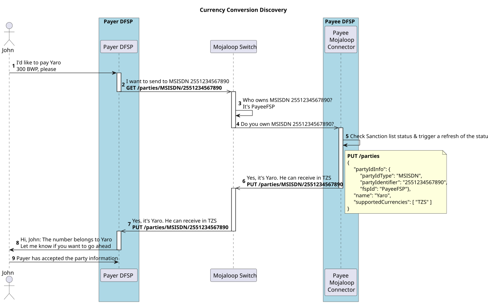

#### Fase de acordo - conversão cambial
O DFSP pagador faz um pedido ao FXP de cobertura de liquidez para a transferência. São devolvidos os termos da conversão cambial.
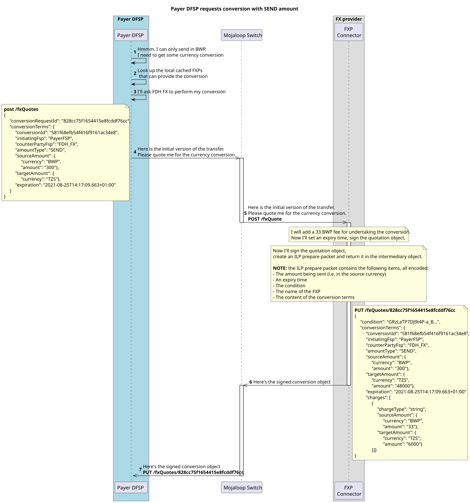

#### Fase de acordo 
O DFSP pagador faz um pedido ao DFSP beneficiário dos termos da transferência.
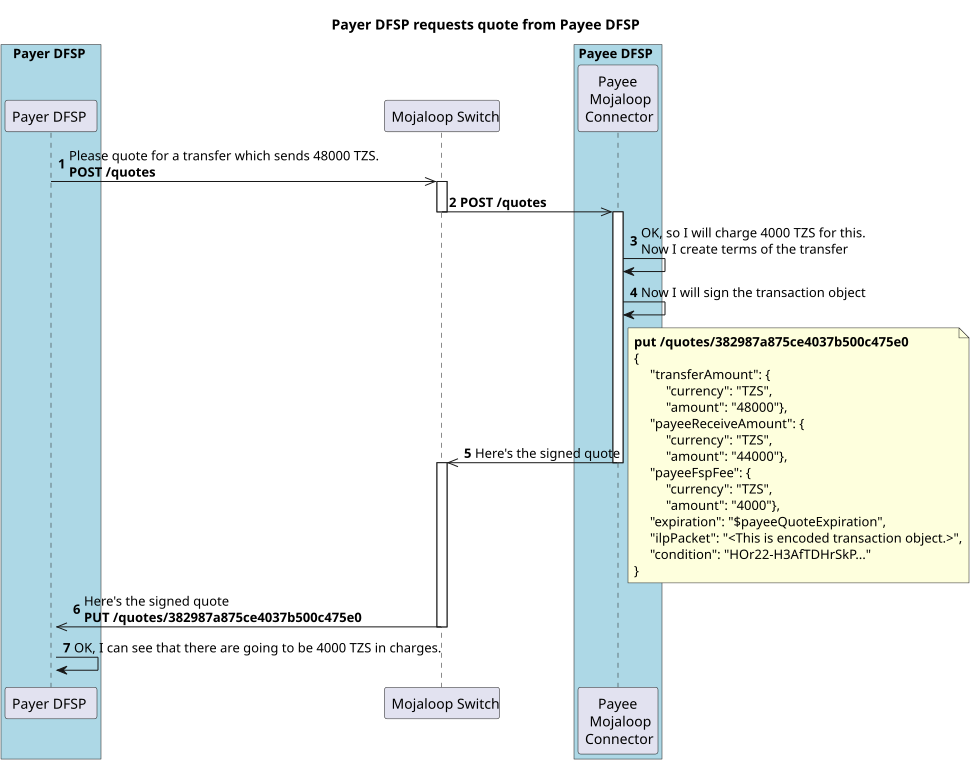

#### O DFSP pagador apresenta os termos ao pagador
Neste ponto, as informações da parte, os termos da conversão e os termos da transferência já foram fornecidos ao DFSP pagador. O DFSP pagador apresenta estes termos ao pagador e pergunta se deve ou não prosseguir.
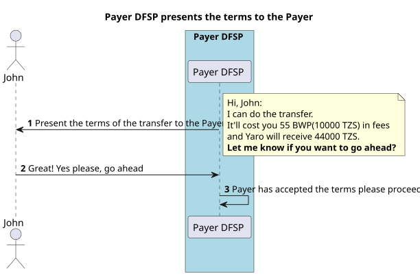

#### Fase de transferência
Agora que os termos da transferência foram acordados, a transferência pode prosseguir.
Tanto a conversão como os termos da transferência são confirmados (commit) em conjunto.
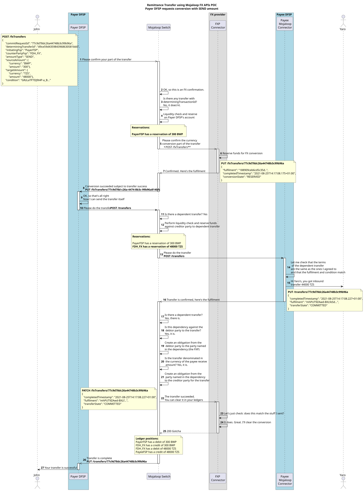

### Integração do Mojaloop Connector para a conversão cambial

Abaixo apresenta-se um diagrama de sequência detalhado que mostra o fluxo completo e inclui o **Mojaloop Connector** e as APIs de integração de todas as organizações participantes. (Esta é uma vista útil para quem está a construir integrações enquanto organização participante.)

#### Fase de descoberta - Mojaloop Connector
O Mojaloop recorre a um Oracle para identificar a organização DFSP associada ao identificador da parte. O DFSP beneficiário tem de responder ao GET /parties para confirmar que a conta existe e está ativa para esse identificador da parte. São devolvidas as moedas permitidas para essa conta.
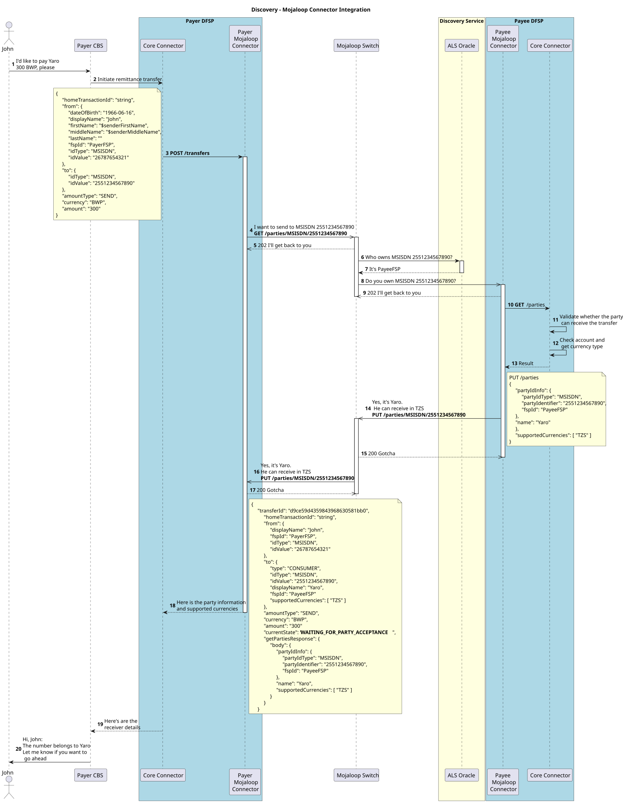

#### Fase de acordo com conversão cambial - Mojaloop Connector
O DFSP pagador não transaciona em nenhuma das moedas permitidas pelo DFSP beneficiário. Isto desencadeia a necessidade de conversão cambial no interior do Mojaloop Connector. O DFSP pagador utiliza a sua cache local de FXP para selecionar um e faz um pedido ao fornecedor de câmbio de cobertura de liquidez e de uma taxa de conversão.
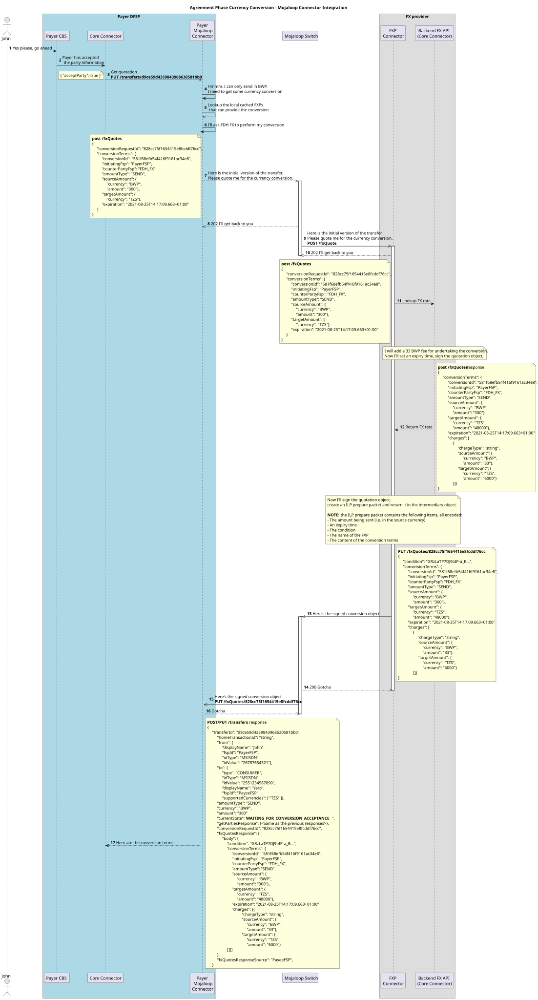

#### Fase de acordo - Mojaloop Connector
A liquidez na moeda de destino foi garantida. O DFSP pagador pode agora prosseguir e pedir um acordo de termos ao DFSP beneficiário. Estes termos estão na moeda de destino.
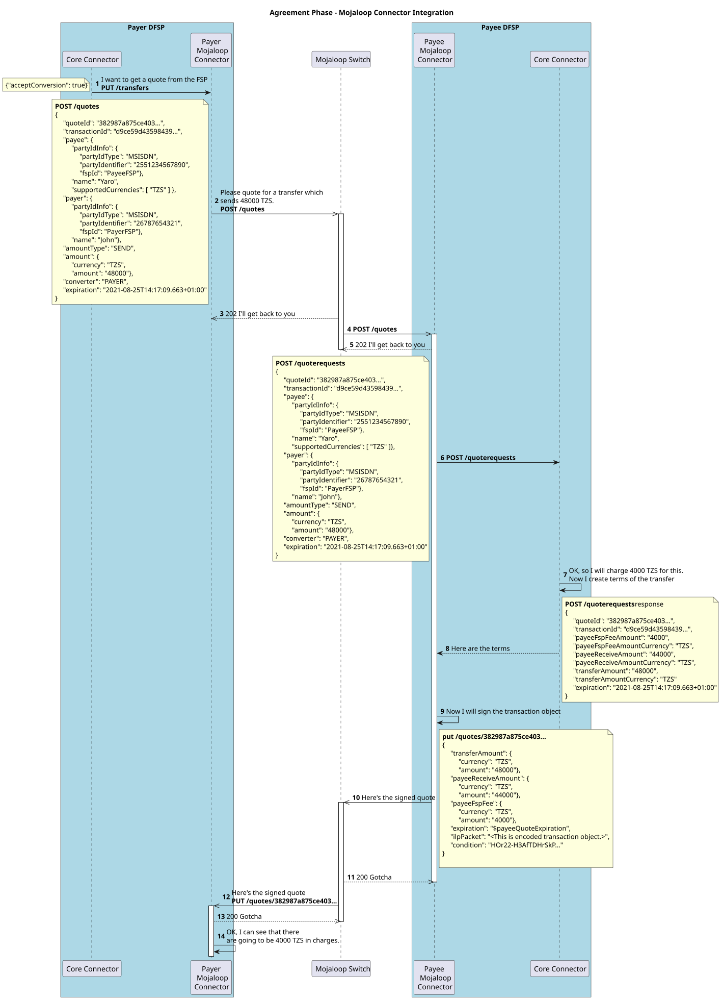

#### Confirmação do remetente
Todos os termos da conversão cambial e da transferência foram obtidos pelo DFSP pagador e pelo FXP. É agora o momento de reunir esses termos e apresentá-los ao pagador para confirmação.
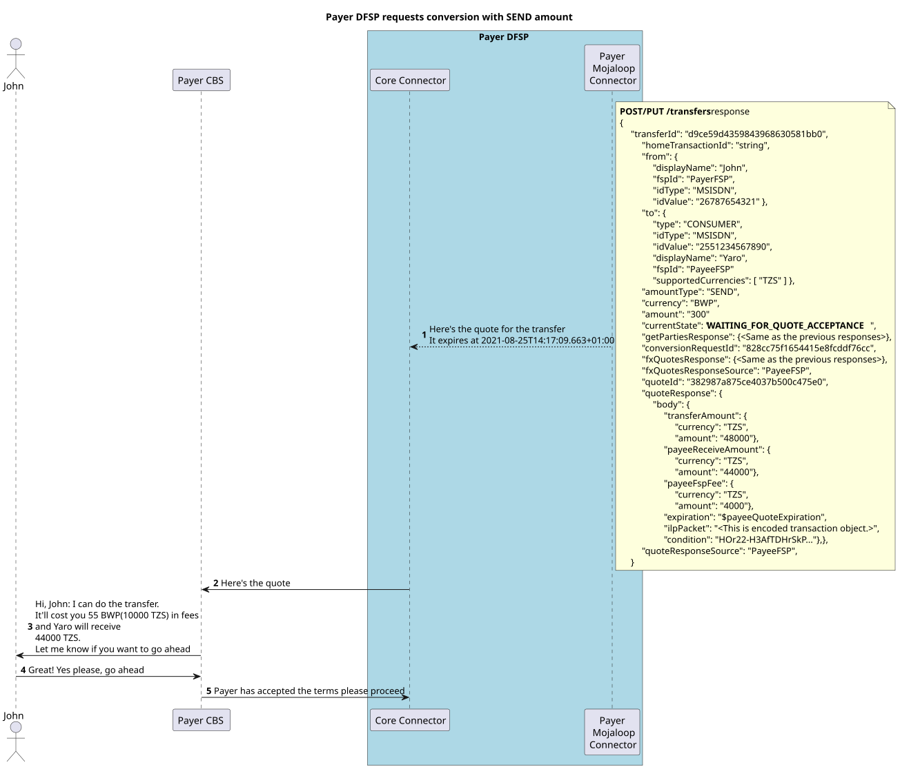

#### Fase de transferência
Os termos da transferência foram aceites. A fase de transferência pode agora começar. 
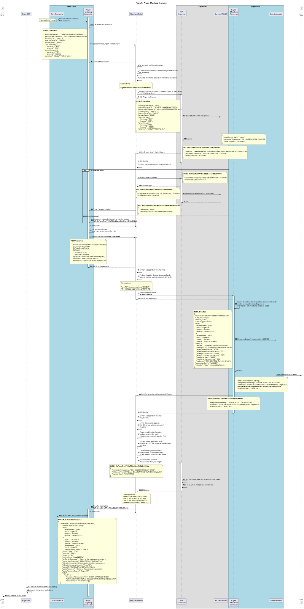

## Transferência com conversão cambial (moeda de destino)
Neste caso de uso, o DFSP pagador especifica a transferência com o tipo de montante **RECEIVE** e define o montante da transferência na **moeda local do beneficiário** (a moeda de destino).
Um exemplo de caso de uso secundário é um pagamento a comerciantes transfronteiriço.

Abaixo apresenta-se um diagrama de sequência detalhado que mostra o fluxo completo e inclui o Mojaloop Connector e as APIs de integração de todas as organizações participantes.

#### Descoberta 
O Mojaloop recorre a um Oracle para identificar a organização DFSP associada ao identificador da parte. O DFSP beneficiário tem de responder ao GET /parties para confirmar que a conta existe e está ativa para esse identificador da parte. São devolvidas as moedas permitidas para essa conta.
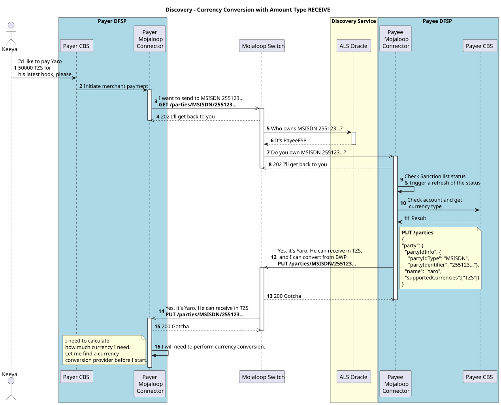

#### Acordo
O DFSP pagador não aceita nenhuma das moedas do DFSP beneficiário, o que exige conversão cambial no Mojaloop Connector. Como o pedido de pagamento está na moeda de destino, tem de ser estabelecido um acordo com o DFSP beneficiário antes de iniciar um pedido de liquidez ao fornecedor de câmbio. O DFSP pagador negoceia primeiro os termos da transferência com o DFSP beneficiário e, em seguida, utiliza a sua cache local de fornecedores de câmbio para selecionar um e pedir cobertura de liquidez e uma taxa de conversão.
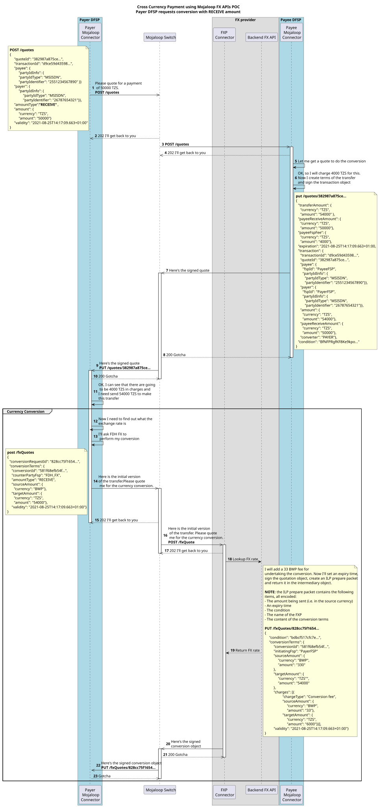

#### Confirmação do remetente
Todos os termos da conversão cambial e da transferência foram obtidos pelo DFSP pagador e pelo FXP. É agora o momento de reunir esses termos e apresentá-los ao pagador para confirmação.
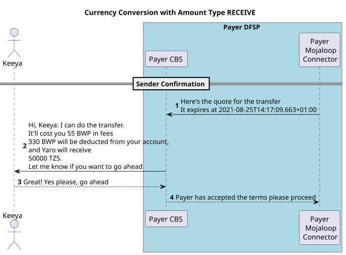

#### Transferência 
Os termos da transferência foram aceites. A fase de transferência pode agora começar. 
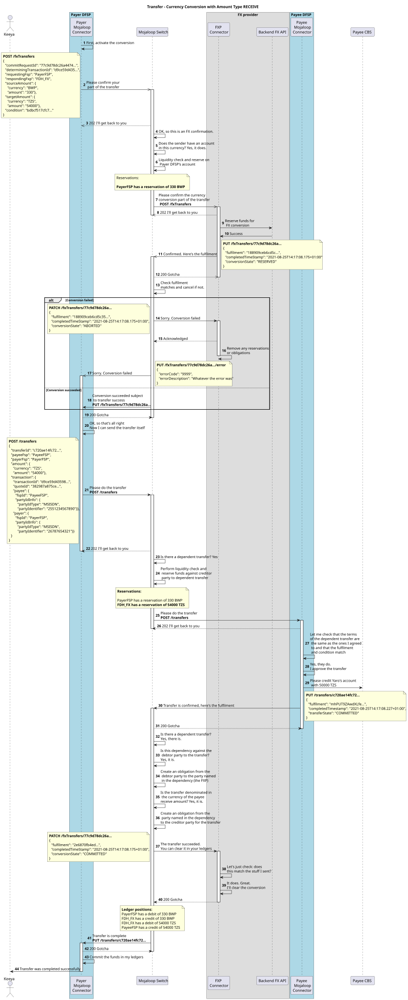

## Fluxos de abort
Este diagrama de sequência mostra como o design implementa as mensagens de abort durante a fase de transferência da conversão cambial.

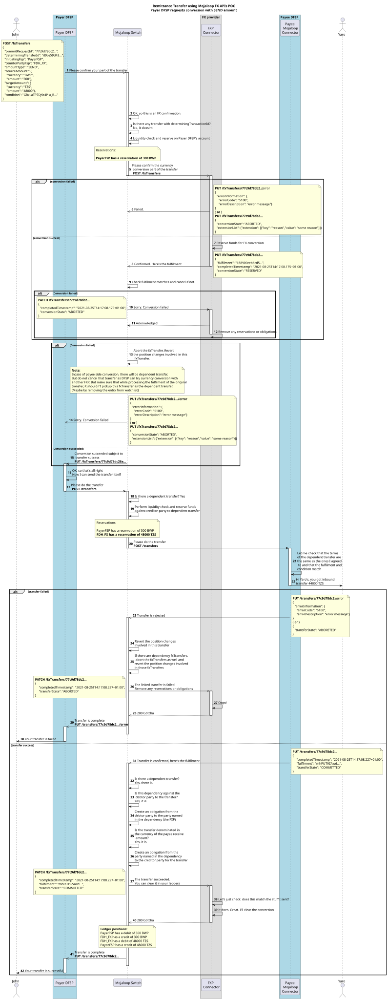

## Referências Open API
Estas referências Open API foram concebidas para serem legíveis tanto por software como por um revisor humano. Mostram os requisitos e as implementações detalhados do design da API.

- [Especificação FSPIOP v2.0](https://mojaloop.github.io/api-snippets/?urls.primaryName=v2.0) - [Definição Open Api](https://github.com/mojaloop/mojaloop-specification/blob/master/fspiop-api/documents/v2.0-document-set/fspiop-v2.0-openapi3-implementation-draft.yaml).
- [Especificação FSPIOP v2.0 ISO 20022](https://mojaloop.github.io/api-snippets/?urls.primaryName=v2.0_ISO20022) - [Definição Open Api](https://github.com/mojaloop/api-snippets/blob/main/docs/fspiop-rest-v2.0-ISO20022-openapi3-snippets.yaml).
- [Definição Open Api dos API Snippets](https://github.com/mojaloop/api-snippets/blob/main/docs/fspiop-rest-v2.0-openapi3-snippets.yaml)
- [Backend do Mojaloop Connector](https://mojaloop.github.io/api-snippets/?urls.primaryName=SDK%20Backend%20v2.1.0) - [Definição Open Api](https://github.com/mojaloop/api-snippets/blob/main/docs/sdk-scheme-adapter-backend-v2_1_0-openapi3-snippets.yaml)
- [Outbound do Mojaloop Connector](https://mojaloop.github.io/api-snippets/?urls.primaryName=SDK%20Outbound%20v2.1.0) - [Definição Open Api](https://github.com/mojaloop/api-snippets/blob/main/docs/sdk-scheme-adapter-outbound-v2_1_0-openapi3-snippets.yaml)

