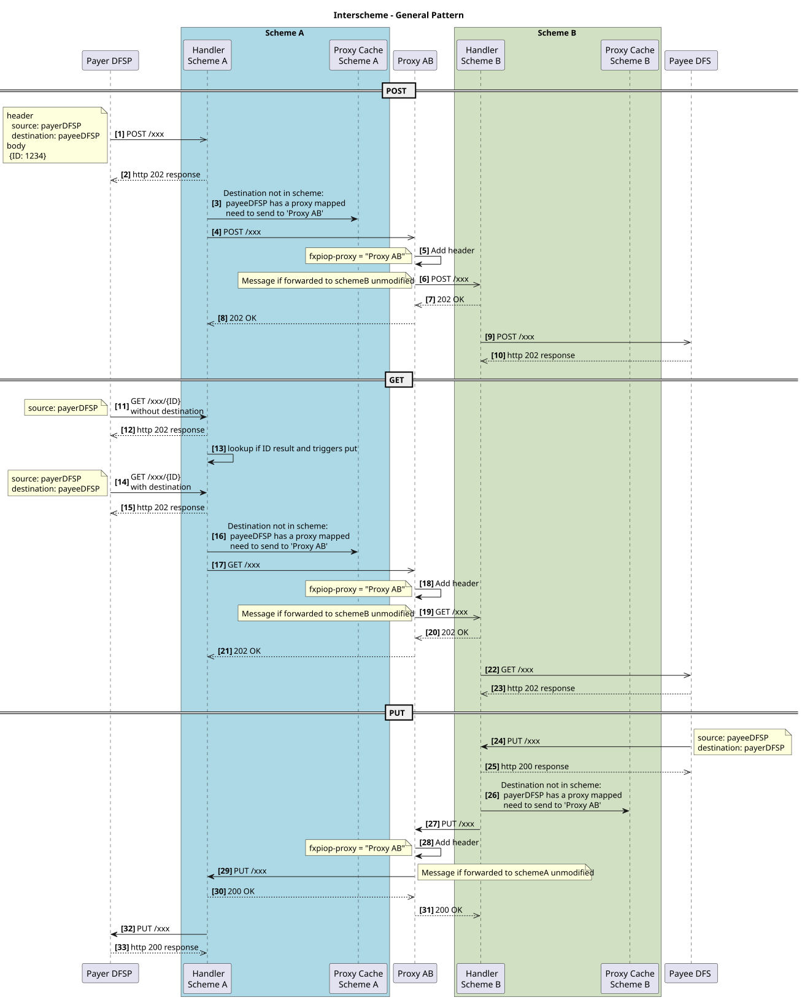
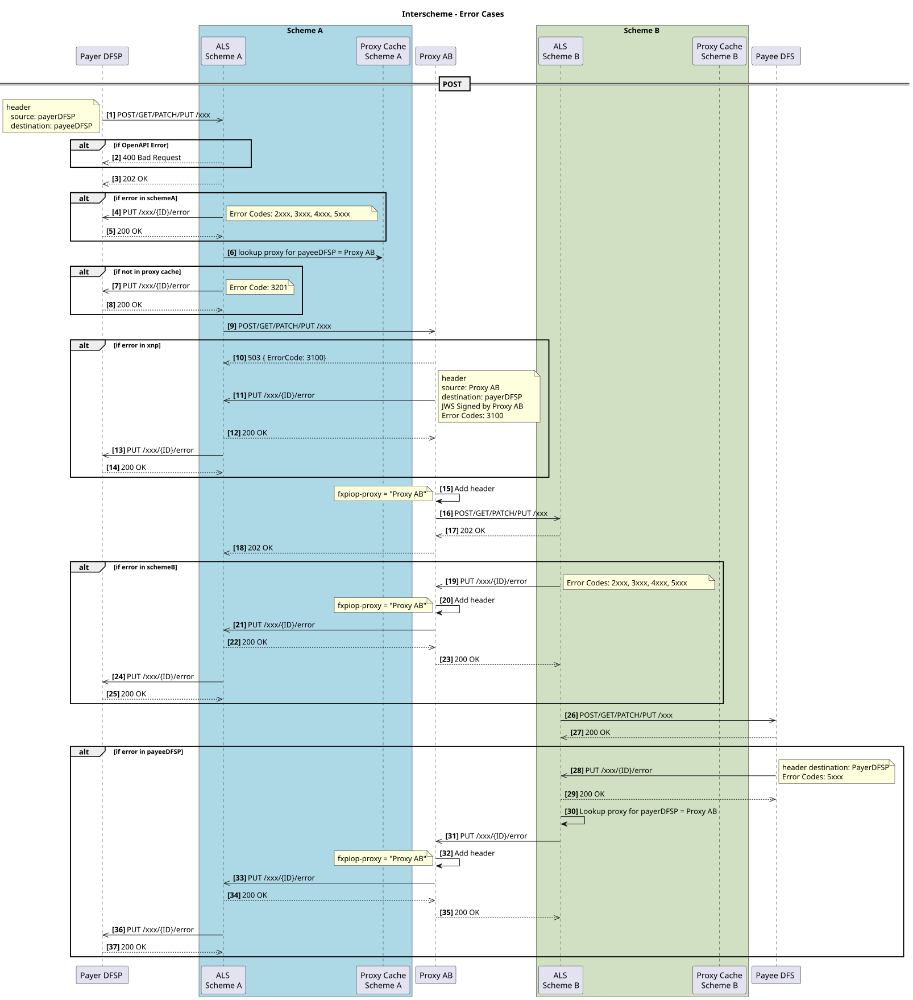
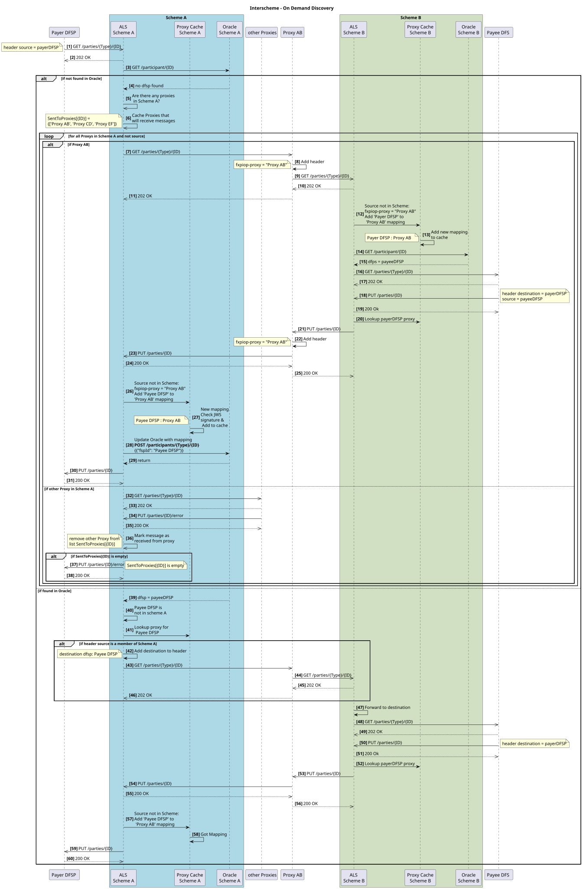
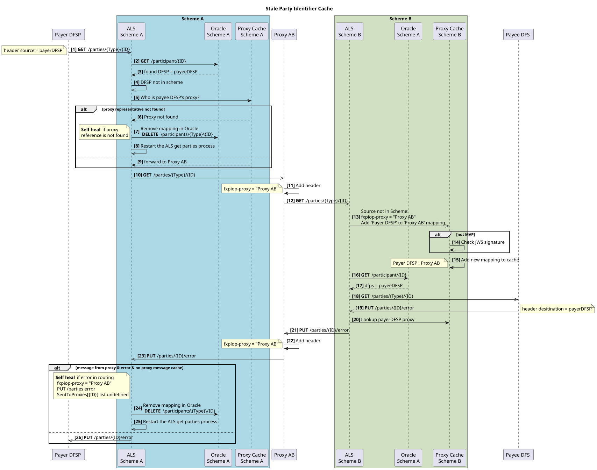
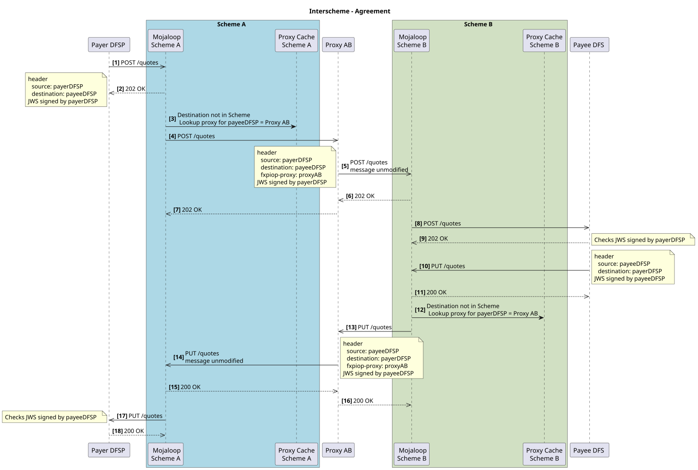
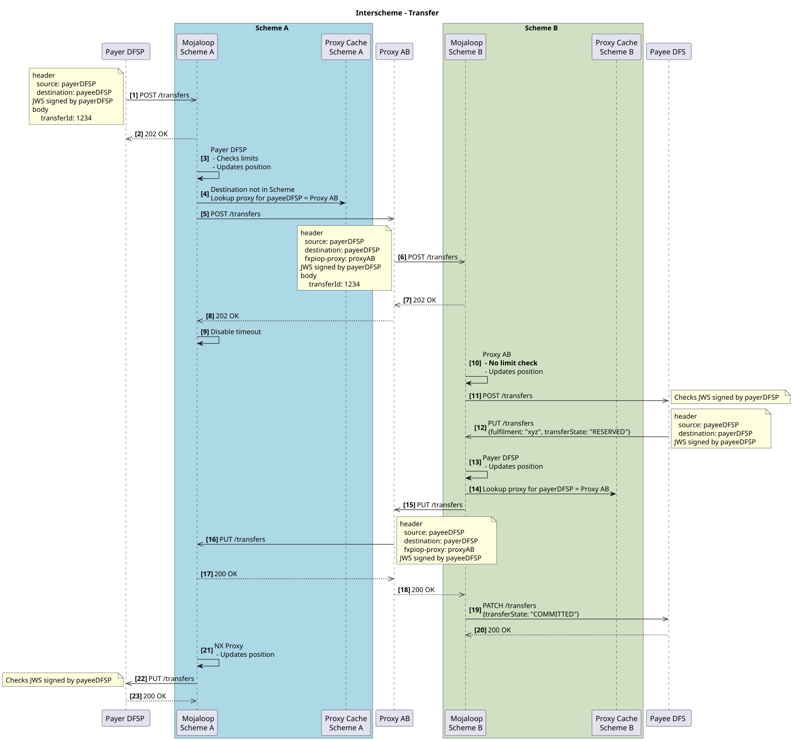
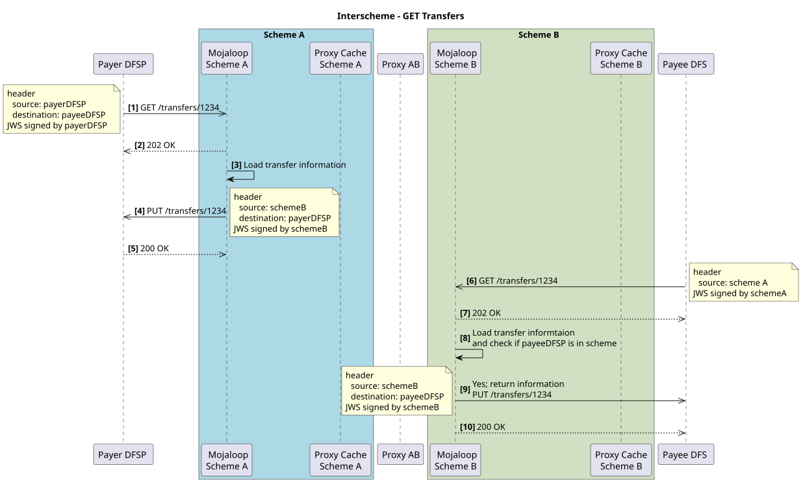
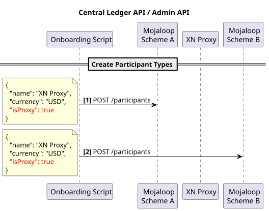

# Interscheme

Interscheme é a abordagem adotada pela comunidade Mojaloop para ligar schemes (o scheme é o conjunto de regras do sistema de pagamentos), preservando as três fases de uma transferência Mojaloop e garantindo o não repúdio de ponta a ponta. Isto significa que o acordo alcançado durante uma transferência permanece entre as organizações DFSP/FXP de origem e de destino, independentemente do percurso de encaminhamento ou do número de schemes envolvidos.

:::tip Não repúdio 
Garantir o não repúdio entre schemes significa que o proxy não participa no acordo de termos, o que ajuda a reduzir custos.
::: 

A implementação inicial desta funcionalidade permite a ligação de vários schemes Mojaloop. Com o tempo, espera-se que este ecossistema se expanda à medida que mais schemes nacionais adotem este protocolo e sejam desenvolvidos novos conectores para melhorar a interoperabilidade.

Para apoiar este esforço, o Mojaloop introduziu uma nova organização participante do tipo proxy. O adaptador proxy constitui a implementação do componente de ligação Mojaloop-para-Mojaloop.

## O que é um proxy
Os schemes são ligados através de um participante proxy, que está registado para atuar como intermediário dentro do scheme em nome dos DFSPs/FXP adjacentes noutros schemes.

## Encaminhamento dinâmico de partes
Esta implementação recorre a um encaminhamento dinâmico. Isto significa que não é necessária qualquer manutenção inicial e contínua de identificadores de partes entre schemes. O sistema recorre a uma difusão (broadcast) ao scheme para descobrir esse identificador e guarda em cache a organização associada a um identificador de parte.

## Pressupostos
Esta abordagem baseia-se nos seguintes pressupostos:
1. Não há dois participantes ligados que partilhem o mesmo identificador.
1. Cada scheme ligado é responsável pelo encaminhamento dos identificadores de partes dentro do seu próprio sistema. (No Mojaloop, isto significa que cada scheme mantém os oráculos necessários para encaminhar pagamentos para as partes participantes na sua rede.)

## Padrões gerais
Há certos padrões gerais que emergem
### Padrões do caminho feliz

### Padrões de erro

## Design da descoberta a pedido do Interscheme
Os fluxos de descoberta resumem-se da seguinte forma:
1. Carregamento a pedido de identificadores de outras redes - utilizando Oracles para a consulta de identificadores no scheme local
2. Carregamento a pedido de todos os identificadores

### Utilização de Oracles para guardar identificadores em cache
- O scheme utiliza Oracles para mapear identificadores locais para participantes do scheme
- Os identificadores de outros schemes são descobertos através de uma pesquisa em profundidade, perguntando a todos os participantes. O participante proxy encaminha então o pedido para o scheme ligado
- Este diagrama mostra dois schemes ligados, mas este design funciona para qualquer número de schemes ligados.

### Descoberta a pedido com resultados incorretamente guardados em cache
- Quando um identificador é movido para outro fornecedor DFSP, a cache guardada para esse participante encaminhará para uma chamada get \parties sem sucesso.
- Autorreparação se houver um erro no encaminhamento do pagamento ou se a referência da cache do proxy se perder

Eis um diagrama de sequência que mostra como essa cache é atualizada.
#### Diagrama de sequência

## Interscheme - fase de acordo
A fase de acordo recorre à cache do proxy para encaminhar as mensagens.
Eis os detalhes da implementação.

## Interscheme - fase de transferência
A fase de transferência recorre à cache do proxy para encaminhar as mensagens.
Eis os detalhes da implementação.

## Interscheme - GET Transfer 
O GET Transfer é resolvido localmente para devolver o estado da transferência no scheme local.
Eis os detalhes da implementação.

## Admin API - definição de participantes proxy
É assim que os proxies são definidos.

## Contas de compensação para transferências FX inter-scheme
Este diagrama ilustra como as obrigações são atualizadas durante a compensação das transações.

