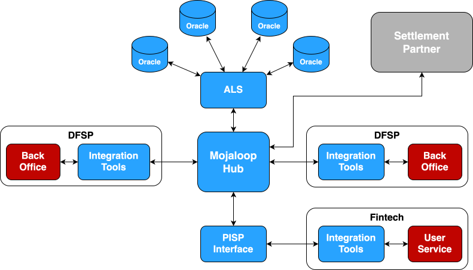

# Introdução ao Mojaloop

O Mojaloop é um software de pagamentos instantâneos de código aberto (open source) que interliga
instituições financeiras díspares de uma forma que promove a inclusão
financeira e proporciona uma gestão de risco robusta para todos os participantes. Está disponível para utilização por qualquer entidade que o pretenda usar para implementar e operar um scheme (o conjunto de regras do sistema de pagamentos) de pagamentos instantâneos inclusivo (IIPS).

## Perspetiva dos reguladores e dos operadores
O Mojaloop fornece a base para que um operador estabeleça um Sistema de Pagamentos Instantâneos Inclusivo (IIPS) e destina-se a ser integrado com um parceiro de liquidação. O parceiro pode ser o RTGS nacional, embora outros mecanismos de liquidação sejam também permitidos. Desta forma, o Mojaloop permite a prestação de um serviço abrangente de interoperabilidade de pagamentos às instituições financeiras (IFs) participantes.

Uma vez feito o deployment, o Mojaloop permite ao operador do scheme:
- Fazer o onboarding, suspender ou reativar IFs participantes, conforme necessário;
- Definir limites líquidos de débito (Net Debit Cap, NDC) para cada participante, de modo a gerir tanto o risco como a liquidez;
- Selecionar e operar o modelo de liquidação mais alinhado com os requisitos do scheme e nacionais;
- Definir vários períodos de liquidação ao longo do dia operacional, gerando o fecho de cada período um ficheiro de liquidação (de acordo com o modelo escolhido) para ação do parceiro de liquidação.

O Hub Mojaloop sustenta estas funções ao:
- Processar pagamentos entre IFs devedoras e credoras de forma contínua, 24/7;
- Atualizar a posição de cada participante em tempo real à medida que os débitos e os créditos ocorrem;
- Validar cada pagamento para garantir liquidez suficiente e a conformidade com o NDC do participante, rejeitando as transações se estas condições não forem cumpridas;
- Atualizar as posições dos participantes no final de cada janela de liquidação para refletir o valor dos fundos liquidados.

Além disso, o Mojaloop permite um **modelo de participação indireta**, concebido para alargar o acesso a instituições financeiras mais pequenas — em particular entidades não bancárias, como as instituições de microfinanças (IMFs) — que não são elegíveis para participar diretamente no RTGS nacional. Isto garante uma inclusão ampla no ecossistema de pagamentos, mantendo simultaneamente a estabilidade financeira.

## Perspetiva técnica

Para prestar o IIPS acima descrito, o Mojaloop implementa um conjunto de funções principais:

  |Resolução de alias|Compensação|Liquidação|
|:--------------:|:--------------:|:--------------:|
|**Resolução de alias** ou do endereço do beneficiário, garantindo que a instituição que detém a conta – e, por conseguinte, a conta correta do beneficiário - é identificada de forma fiável|**Compensação** de pagamentos de ponta a ponta, com medidas robustas que eliminam qualquer elemento de dúvida sobre o sucesso de uma transação|Orquestração da **liquidação** das transações compensadas entre instituições financeiras, utilizando um modelo acordado entre essas instituições e de acordo com um calendário predefinido.|

&nbsp;

Estas funções principais são apoiadas por algumas [características únicas](./transaction.html#caracteristicas-unicas-das-transacoes), que,
em conjunto, fazem do Mojaloop um sistema de pagamentos instantâneos inclusivo e de baixo custo:

1.  **Um fluxo de transação em três fases**, como se segue:
	+  **Descoberta,** quando o DFSP pagador trabalha com o Hub Mojaloop para determinar para onde o pagamento deve ser enviado, garantindo assim que as transações não são mal direcionadas. Esta fase resolve um alias para um DFSP beneficiário específico e, em colaboração com esse DFSP, para uma conta individual.

	 + **Acordo de termos, ou cotação,** quando as duas partes DFSP na transação acordam ambas que a transação pode avançar (permitindo, por exemplo, restrições relacionadas com KYC por níveis) e em que termos (incluindo comissões), **antes** de qualquer uma delas se comprometer com ela.

	+  **Transferência,** quando a transação entre os dois DFSPs (e, por procuração, as contas dos seus clientes) é compensada e é garantido que ambas as partes têm a mesma visão, em tempo real, do sucesso ou do insucesso da transação.
&nbsp;

2.  **Não repúdio de ponta a ponta** garante que cada parte numa mensagem pode ter a certeza de que a mensagem não foi modificada e de que foi realmente enviada pelo alegado remetente. Esta tecnologia subjacente é aproveitada pelo Mojaloop para garantir que uma transação só será confirmada se *tanto* o DFSP pagador *como* o DFSP beneficiário aceitarem que o é, e nenhuma das partes pode repudiar a transação. Naturalmente, garante também que nenhum terceiro pode modificar a transação.
3.  **A API PISP é disponibilizada através do Hub Mojaloop,** e não pelos DFSPs individuais. Consequentemente, uma fintech pode integrar-se com o Hub e ficar imediatamente ligada a **todos** os DFSPs ligados.

**Nota** Em termos de Mojaloop, um DFSP - ou Digital Financial Service Provider (prestador de serviços financeiros digitais) - é um termo genérico para qualquer instituição financeira, de qualquer dimensão ou estatuto, que seja capaz de transacionar digitalmente. Aplica-se igualmente ao maior banco internacional e à mais pequena instituição de microfinanças ou operador de carteira móvel. «DFSP» é utilizado ao longo deste documento.
&nbsp;

# O ecossistema Mojaloop
## O núcleo
Na leitura deste documento, é importante compreender a terminologia utilizada para identificar os vários atores e a forma como interagem. O diagrama seguinte fornece uma visão de alto nível do ecossistema Mojaloop.

## Serviços overlay
Em torno do núcleo ilustrado no diagrama acima existe um conjunto de serviços overlay (overlay services), que também fazem parte do pacote completo de código aberto do Mojaloop. São eles:
- O **Account Lookup Service** (ALS) e vários oráculos que são utilizados pelo ALS na resolução de alias;
- Um conjunto de **portais**, construídos para utilizar o Business Operations Framework, que permitem a um operador de hub interagir com/gerir o Hub Mojaloop;
- Um módulo de **pagamentos a comerciantes**, que permite o registo de comerciantes e a emissão de IDs de comerciante, incluindo a geração de códigos QR que podem ser lidos para iniciar uma transação com um comerciante;
- O **Testing Toolkit** (TTK), que permite aos engenheiros simular qualquer aspeto do ecossistema principal do Mojaloop, para facilitar os seus esforços de desenvolvimento, integração e teste;
- Um **Integration Toolkit** (ITK), parte da biblioteca de [apoio à conectividade](./connectivity.md), que facilita a ligação entre um DFSP e um Hub Mojaloop;
- **Integração ISO 8583**, que permite integrar ATMs (ou um switch de ATMs) com um Hub Mojaloop, para levantamentos de numerário;
- [**Integração MOSIP**](https://www.mosip.io), que permite encaminhar pagamentos para uma identidade digital baseada em MOSIP, em vez de (por exemplo) um número de telemóvel.

## Lista de funcionalidades

Este documento apresenta uma lista de funcionalidades que abrange os seguintes aspetos do Mojaloop:

-   [**Casos de uso**](./use-cases.md), descrevendo os casos de uso que todos os deployments do Mojaloop permitem.
-   [**Transações**](./transaction.md), descrevendo as APIs Mojaloop, como decorre uma transação e os aspetos de uma transação Mojaloop que a tornam singularmente adequada à implementação de um serviço de pagamentos instantâneos inclusivo.

-   [**Gestão de risco**](./risk.md), apresentando as medidas tomadas para garantir que nenhum DFSP que participe num scheme Mojaloop fica exposto a qualquer risco de contraparte e que a integridade do scheme como um todo é protegida.

-  [**Apoio à conectividade**](./connectivity.md), descrevendo as várias ferramentas e opções para um onboarding simples dos DFSPs participantes.

-  [**Portais e funcionalidades operacionais**](./product.md), como portais para gestão de utilizadores e de serviços, e a configuração e operação de um Hub Mojaloop.
-  [**Comissões e tarifas**](./tariffs.md) apresenta os mecanismos que o Mojaloop fornece para permitir uma variedade de modelos tarifários diferentes e as oportunidades para os participantes e os operadores de hub cobrarem comissões.

-  [**Desempenho**](./performance.md), descrevendo em linhas gerais o desempenho de processamento de transações que os adotantes podem esperar.
- [**Deployment**](./deployment.md), descrevendo as diferentes formas de fazer o deploy do Mojaloop para uma variedade de finalidades diferentes, e as ferramentas que facilitam estes tipos de deployment.
- [**Segurança**](./security.md), abrangendo a segurança das transações entre os DFSPs ligados e o Hub Mojaloop, a segurança do próprio Hub (incluindo os portais do operador) e o QA Framework atualmente em desenvolvimento para validar a segurança e a qualidade de um deployment do Mojaloop.
- [**Segurança da infraestrutura dos DFSPs**](./dfsp-infrastructure-security.md), fornecendo orientações para os schemes que avaliam o hardware e os ambientes de alojamento em que os DFSPs executam cargas de trabalho de conectividade, assinatura e gestão de certificados.
- [**Princípios de engenharia**](./engineering.md), como a adesão algorítmica à especificação do Mojaloop, a qualidade do código, as práticas de segurança, os padrões de escalabilidade e desempenho (entre outros).

-   [**Invariantes**](./invariants.md), apresentando os princípios de desenvolvimento e operacionais a que qualquer implementação do Mojaloop deve aderir. Isto inclui os princípios que garantem a segurança e a integridade de um deployment do Mojaloop.

&nbsp;
## Desenvolvimento contínuo
Nenhum software está alguma vez terminado, e o Mojaloop não é exceção. Há sempre novas funcionalidades a considerar, novas APIs a implementar, novos portais a adicionar e, claro, há sempre manutenção em curso, e a segurança exige vigilância constante.

O Roadmap do Mojaloop aborda e prioriza estas necessidades, colocando-as numa linha temporal, e define-as como um conjunto de workstreams. Cada um destes workstreams tem um responsável de workstream (workstream lead), encarregado de definir, gerir e entregar o workstream à Comunidade Mojaloop. O responsável de workstream é apoiado por vários contribuidores, que podem ser engenheiros que ajudam a implementar uma funcionalidade, pessoas que podem documentar a funcionalidade ou pessoas que ajudam a definir os requisitos.

É possível consultar o conjunto atual de workstreams e os seus relatórios de estado mais recentes na [secção **Desenvolvimento contínuo**](./development.md).

# Sobre este documento

## Finalidade deste documento

Este documento cataloga as funcionalidades do Mojaloop, independentemente da
implementação. Destina-se tanto a informar os potenciais adotantes sobre as funcionalidades que podem esperar e (quando apropriado) sobre como se pode esperar que essas funcionalidades funcionem, como a informar os programadores sobre as funcionalidades que devem implementar para que os seus esforços sejam aceites como uma instância oficial do Mojaloop.

A Mojaloop Foundation (MLF) define uma implementação como sendo uma
instância oficial do Mojaloop se esta implementar todas as funcionalidades do
Mojaloop, sem exceção, e se estas passarem o conjunto padrão de testes do Mojaloop.

## Aplicabilidade

Esta versão deste documento diz respeito à versão [17.0.0](https://github.com/mojaloop/helm/releases/tag/v17.0.0) do Mojaloop

## Histórico do documento
  |Versão|Data|Autor|Detalhe|
|:--------------:|:--------------:|:--------------:|:--------------:|
|1.6|21 de agosto de 2026| Yevhen Kyriukha|Adicionadas orientações sobre a segurança da infraestrutura dos DFSPs|
|1.5|4 de dezembro de 2025| Paul Makin|Adicionada a subsecção «Desenvolvimento contínuo»|
|1.4|28 de agosto de 2025| Paul Makin|Adicionada a «Perspetiva dos reguladores e dos operadores»|
|1.3|23 de junho de 2025| Paul Makin|Adicionados o texto e o diagrama do ecossistema|
|1.2|14 de abril de 2025| Paul Makin|Atualizações relacionadas com o release da V17|
