# MCM User Guide for the Hub Operator

## Table of contents

- [Introduction](#introduction)
- [What is MCM?](#what-is-mcm)
- [Features of MCM](#features-of-mcm)
- [Creating a DFSP account](#creating-a-dfsp-account)
- [Configuring and processing endpoints](#configuring-and-processing-endpoints)
    - [Configuring Hub outbound and inbound endpoints](#configuring-hub-outbound-and-inbound-endpoints)
        - [Configuring Hub outbound endpoints](#configuring-hub-outbound-endpoints)
        - [Configuring Hub inbound endpoints](#configuring-hub-inbound-endpoints)
    - [Processing DFSPs' outbound and inbound endpoints](#processing-dfsps-outbound-and-inbound-endpoints)
- [Managing Certificate Authority details](#managing-certificate-authority-details)
    - [Setting up a Hub Certificate Authority (CA)](#setting-up-a-hub-certificate-authority-ca)
    - [Retrieving the certificates of a DFSP's CA](#retrieving-the-certificates-of-a-dfsps-ca)
- [Managing TLS client certificates](#managing-tls-client-certificates)
    - [Creating a Hub certificate signing request](#creating-a-hub-certificate-signing-request)
    - [Retrieving the Hub's TLS client certificate CSR signed by a DFSP](#retrieving-the-hubs-tls-client-certificate-csr-signed-by-a-dfsp)
    - [Signing a DFSP's TLS client certificate CSR](#signing-a-dfsps-tls-client-certificate-csr)
- [Managing TLS server certificates](#managing-tls-server-certificates)
    - [Uploading the Hub's TLS server certificate chain](#uploading-the-hubs-tls-server-certificate-chain)
    - [Retrieving a DFSP's TLS server certificate chain](#retrieving-a-dfsps-tls-server-certificate-chain)
- [Uploading a Hub JWS certificate](#uploading-a-hub-jws-certificate)

## Introduction

The Mojaloop Connection Manager (MCM) tool is a portal that allows a Hub Operator to manage information sharing around endpoints and certificate-related processes.

This document provides step-by-step guidance about how to use the MCM portal.

## What is MCM?

Setting up Public Key Infrastructure (PKI) for a new Mojaloop environment and onboarding Digital Financial Service Providers (DFSPs) involves a number of steps around the generation, signing, and sharing of certificates, as well as identifying the various endpoints required to establish connections.

DFSPs and the Hub communicate over TLSv1.2 with mutually authenticated X.509 certificates, which are signed by a trusted Certificate Authority (CA). The use of digital certificates is necessary to verify the identity of the parties exchanging data with each other and to ensure secure communications. In addition to TLS client and server certificates, all DFSPs and the Hub itself must have a JSON Web Signature (JWS) certificate, which they share among themselves.

To reduce the probability of mistakes and miscommunication, a connectivity management tool, Mojaloop Connection Manager (MCM), is provided, which allows the Hub Operator to exchange endpoint data and certificates with DFSPs through an easy-to-use portal.

The following diagram provides an illustration of MCM components on the Hub side and the DFSP side.

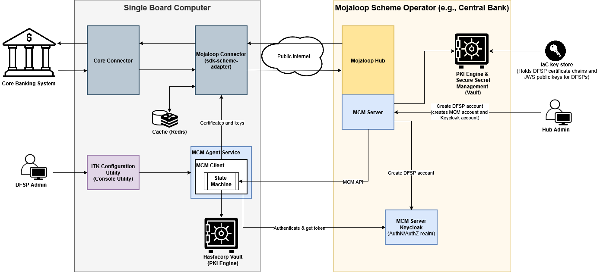
<!-- Diagram source file: https://drive.google.com/file/d/13M6tc_jDG7hlQQhFv14IuDwvRcOqno3z/view?usp=drive_link-->

| Component | Description |
| --------- | ------- |
| Core Banking System | The DFSP's Core Backend |
| Core Connector | Integrates a DFSP's Core Backend to Mojaloop Connector as an "adapter" for both parts so communication is possible between them |
| Mojaloop Connector | A Mojaloop SDK to manage transactions. It provides: Mojaloop-compliant security components, HTTP header processing capabilities, a simplified use-case-oriented version of the Mojaloop FSPIOP API. |
| ITK Configuration Utility | A command line interface for configuring Mojaloop Connector and Core Connector settings and for monitoring the status of the connection to the Hub and backend |
| MCM Agent Service | Responsible for ensuring that communication with the Mojaloop Hub is secure and up-to-date |
| MCM Client | Manages the onboarding process of the DFSP from the DFSP side. It automates certificate creation, signing and exchange, as well as the configuration of the connections required to different environments. |
| Hashicorp Vault | Once onboarding between the MCM Client and the MCM Server is done, all the certificates and keys are stored in the Hashicorp Vault. |
| DFSP Admin | DFSP personnel responsible for handling the onboarding to the Hub |
| Mojaloop Hub | Payment Switch for transfers between accounts managed by different Digital Financial Services Providers (DFSPs) |
| MCM Server | Manages the onboarding process of the DFSP from the Hub side |
| MCM Server Keycloak | Identity Provider (IdP), which enables applications to authenticate end users and obtain information about them |
| PKI Engine & Secure Secret Management | Issues certificates |
| IaC key store | Holds DFSP certificate chains and JWS public keys for DFSPs. Allows IaC to use these keys in TLS termination for ingresses and pass JWS keys to pods as needed. |
| Hub Admin | Hub personnel responsible for managing DFSP onboarding |

## Features of MCM

MCM has functionality to support the following:

- [Create DFSP account](#creating-a-dfsp-account)

- [Provide endpoint information to DFSPs](#configuring-hub-outbound-and-inbound-endpoints):

    - IP addresses from which the Hub will initiate connections to DFSPs
    - Hub URLs / IP addresses that DFSPs will initiate connections to

- [Collect outbound / inbound endpoint information from DFSPs](#processing-dfsps-outbound-and-inbound-endpoints):

    - IP addresses from which the DFSP will initiate connections to the Hub
    - DFSP callback URLs / IP addresses that the Hub will initiate connections to

- [Set up a Certificate Authority](#setting-up-a-hub-certificate-authority-ca) to sign TLS client and server certificates, and to create Hub client CSRs (to send to DFSPs)

- [Obtain DFSPs' CA root certificates](#retrieving-the-certificates-of-a-dfsps-ca) for importing into the Hub trust store

- [Create a CSR](#creating-a-hub-certificate-signing-request) for the Hub TLS client certificate and send it to the DFSPs for signing

- [Retrieve the TLS client certificate signed by the DFSP's CA](#retrieving-the-hubs-tls-client-certificate-csr-signed-by-a-dfsp)

- [Sign and return the DFSP's TLS client certificate](#signing-a-dfsps-tls-client-certificate-csr) together with the Hub CA root certificate for installation by the DFSP

- [Share the Hub's TLS server certificate chain](#uploading-the-hubs-tls-server-certificate-chain)

- [Retrieve the root and intermediate certificates of the DFSP's CA](#retrieving-a-dfsps-tls-server-certificate-chain) that signed the DFSP TLS server certificate

- [Set up a JWS certificate](#uploading-a-hub-jws-certificate) for sharing with DFSPs

## Creating a DFSP account

Adding a new DFSP in the MCM portal enables you to authorise user account(s) for the DFSP. An authorised DFSP user account, in turn, can perform tasks such as uploading a new certificate, viewing existing certificates, and so on, for the added DFSP. In addition, when a new user account for that DFSP is onboarded, the new account can be associated with the relevant DFSP.

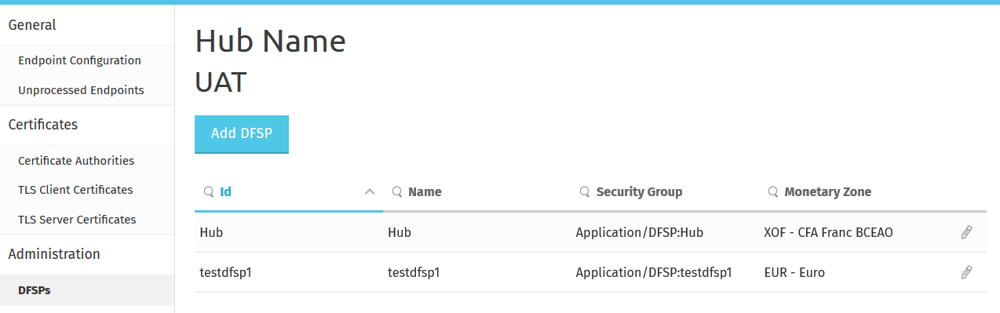

To add a DFSP to an environment, perform the following steps:

1. Go to **Administration > DFSPs**.
1. Click **Add DFSP**.
1. In the **Add DFSP** pop-up window:
    1. Enter a **Name**. This is the name of the DFSP that will be created within the environment.
    1. The **ID** is the unique identifier of the DFSP. This field will be auto-filled for you as both the name and the ID must be the same as the `fspId` registered in the Hub.
    1. In the **Email** field, enter the email address of the DFSP Operator, where an invitation will be sent.
    1. Add a monetary zone by selecting one from the **Monetary Zone** drop-down list.
1. Click **Submit**.
1. Click **Close**.

On submitting the **Add DFSP** form, MCM:

- creates a DFSP in the MCM database
- creates a Keycloak user account for the DFSP Operator
- creates an OAuth client for PM4ML integration
- sets up DFSP permissions in Keto
- sends an automated invitation email to the DFSP Operator

## Configuring and processing endpoints

To exchange endpoint information with the DFSP, access the **General** menu in the left-hand pane:

- **Endpoint Configuration**: Record your outbound and inbound endpoints for sharing with DFSPs.
- **Unprocessed Endpoints**: Retrieve endpoint information submitted by DFSPs.

### Configuring Hub outbound and inbound endpoints

The **Endpoint Configuration** page allows you to specify:

- **Egress Endpoints** tab: Outbound endpoints, that is, the IP addresses from which the Hub will initiate connections to DFSPs.
- **Ingress Endpoints** tab: Inbound endpoints, that is, the Hub URLs / IP addresses that DFSPs will initiate connections to.

As you are entering data, it is being validated. If invalid data is entered, a tooltip is displayed to help you resolve the issue.

If you wish to clear all data in one click, click the **Undo Changes** button.

#### Configuring Hub outbound endpoints

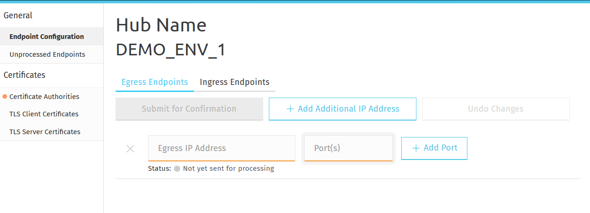

To configure outbound endpoints for the Hub:

1. On the **Egress Endpoints** tab, in the **Egress IP Address** field, enter the IP address from which you will make API calls to DFSPs.
1. In the **Port(s)** field, you can specify a specific port or a range.
1. To add further ports, click the **Add Port** button. There is no limit on the number of ports that can be specified.
1. To add further IP addresses or hostnames, click the **Add Additional IP Address** button.
1. Once you are done entering your data, click **Submit for Confirmation**. This will send the data to DFSPs for processing.

    The **Status** indicator tells you whether or not you have sent your data for processing to DFSPs, and whether or not your data has been processed:

    - **Not yet sent for processing** (with a grey dot): You have not yet clicked **Submit for Confirmation** and not yet sent your endpoint data to DFSPs.
    - **Awaiting Processing** (with a yellow dot): You have clicked **Submit for Confirmation** and sent your endpoint data to DFSPs.

**NOTE:** If you do not click **Submit for Confirmation** and switch to another tab or page, the data you have entered will be lost.

#### Configuring Hub inbound endpoints

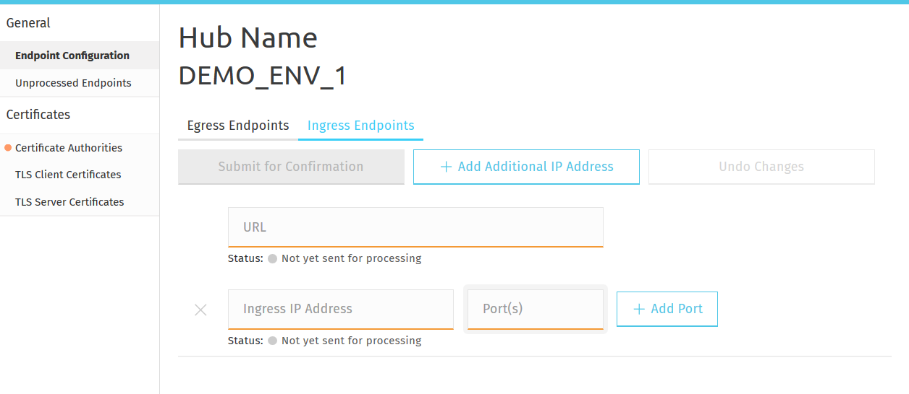

To configure inbound endpoints for the Hub:

1. On the **Ingress Endpoints** tab, in the **URL** field, enter the URL that DFSPs will connect to in order to make API calls to you.
    You must provide a full URL with protocol information (`http://` or `https://`) included.
    You can provide a port number and path information too.
    For example: `https://inbound.hub.io:9876/example`
1. In the **Ingress IP Address** field, enter the IP address that the DFSP will connect to in order to make API calls to you.
1. In the **Port(s)** field, you can specify a specific port or a range.
1. To add further ports, click the **Add Port** button. There is no limit on the number of ports that can be specified.
1. To add further IP addresses or hostnames, click the **Add Additional IP Address** button.
1. Once you are done entering your data, click **Submit for Confirmation**. This will send the data to DFSPs for processing.

    The **Status** indicator tells you whether or not you have sent your data for processing to DFSPs:
    - **Not yet sent for processing** (with a grey dot): You have not yet clicked **Submit for Confirmation** and sent your endpoint data to DFSPs.
    - **Awaiting Processing** (with a yellow dot): You have clicked **Submit for Confirmation** and sent your endpoint data to DFSPs.

**NOTE:** If you do not click **Submit for Confirmation** and switch to another tab or page, the data you have entered will be lost.

### Processing DFSPs' outbound and inbound endpoints

To retrieve endpoint information submitted by DFSPs, access the **Unprocessed Endpoints** page. The page displays all the DFSP outbound and inbound endpoints waiting to be whitelisted in firewall rules or configured in the backend.

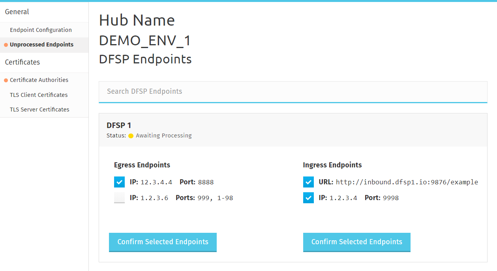

To search for the data of one particular DFSP, type the name of the DFSP in the **Search DFSP Endpoints** search box and press **Enter**.

Once you have updated Hub firewall rules and configured the backend to allow traffic from the DFSP's environment:

1. Use the checkboxes to select the endpoint that you wish to mark as "processed".
1. Click **Confirm Selected Endpoints** to notify the DFSP that their data has been successfully processed.

## Managing Certificate Authority details

To exchange certificates with the DFSP, access the **Certificates** menu > **Certificate Authorities** page in the left-hand pane:

The **Certificate Authorities** page allows you to:

- **HUB Certificate Authority** tab: Create your own CA or upload the root certificate of a trusted third-party CA.
- **DFSP Certificate Authority** tab: Retrieve the root and intermediate certificates of DFSPs' CAs for importing into your trust store.

### Setting up a Hub Certificate Authority (CA)

The **Certificate Authorities** page allows you to:

- **HUB Certificate Authority** tab: Set up an embedded CA for the Hub.
- **HUB External Certificate Authority** tab: Upload the root and intermediate certificates of a trusted third-party CA.

A Hub CA is required so that you can create client certificate signing requests (CSRs) using the parameters provided in the MCM portal.

#### Setting up an embedded CA

The **Certificate Authorities** page > **HUB Certificate Authority** tab lets you set up an embedded CA for the Hub.

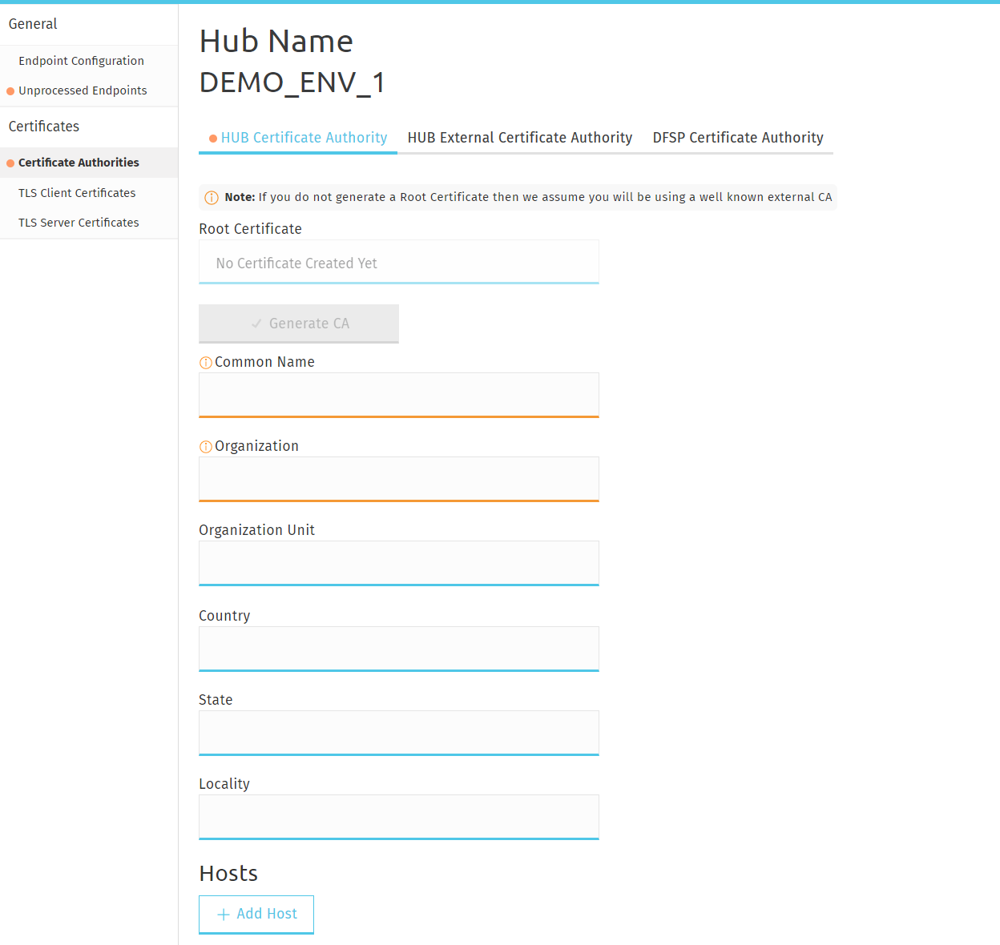

**NOTE:** Once a Certificate Authority has been entered, there is currently no possibility to delete it.

To create an embedded CA:

1. Enter the required parameters in the following fields to create the root certificate for the CA:
    1. **Common Name**
    1. **Organization**
    1. **Organization Unit**
    1. **Country**
    1. **State**
    1. **Locality**
1. Optionally, click **Add Hosts** to add hostnames for information sharing.
1. Click **Generate CA**.
    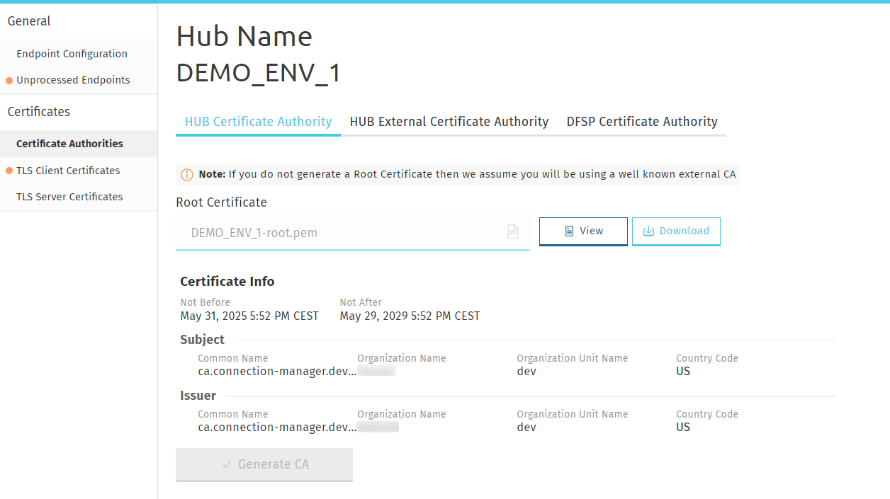

    Click **View** to view details of the certificate. Click **Download** to download the certificate for manual handover to DFSPs (if required).

#### Uploading the certificates of a trusted third-party CA

The **Certificate Authorities** page > **HUB External Certificate Authority** tab lets you upload the root and intermediate certificates of a trusted third-party CA.

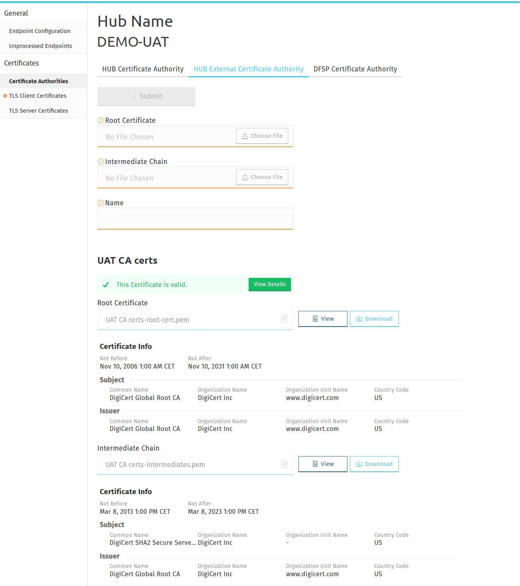

To upload the root certificate and intermediate chain of an external CA, complete the following steps:

1. To upload the root certificate of your external CA, click **Choose File** in the **Root Certificate** field, and select the root certificate of your CA saved on your computer.
1. To upload the intermediate certificate of your external CA, click **Choose File** in the **Intermediate Chain** field, and select the intermediate certificate of your CA saved on your computer.

    **NOTE:** The intermediate chain must be presented as a single file. If your intermediate chain is made up of multiple files, combine them into one file in the following order: host certificate first, then the certificate that signs it, then the certificate that signs the previous certificate, and so on. Go from the most specific certificate to the least specific certificate, with each certificate verifying the previous one.

1. In the **Name** field, type a meaningful name for your external CA.
1. Click **Submit**. On submitting the certificates, they are validated. The following details are validated:
    - The root certificate is a root certificate indeed. It can be self-signed or signed by a global root.
    - The root certificate has the CA basic contraint extension (`CA = true`).
    - The intermediate chain is made up of valid CAs and the top of the chain is signed by the root.
    - The certificate and its chain must form a valid trust chain.
1. The certificates are displayed at the bottom of the page. To view or download them, click **View** or **Download**.

**NOTE:** If you have accidentally uploaded the wrong certificate, you can re-upload a new certificate and that will replace the old one.

### Retrieving the certificates of a DFSP's CA

The **Certificate Authorities** page > **DFSP Certificate Authority** tab gives you access to the root and intermediate certificates of DFSPs' CAs for importing into your trust store after they have uploaded it.

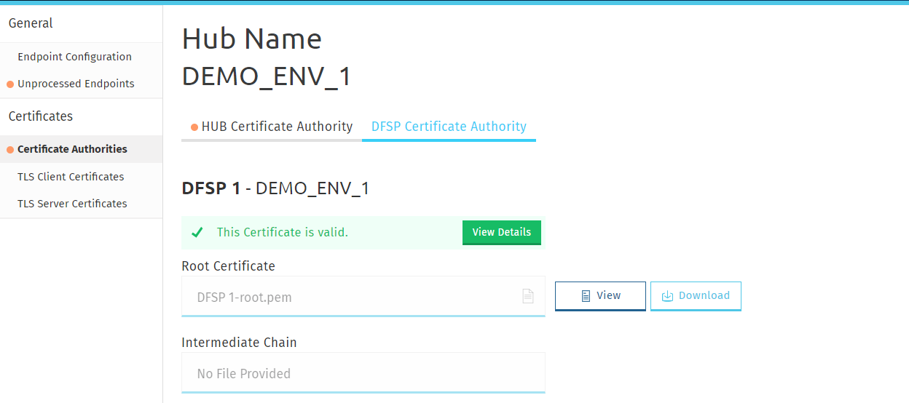

Click **View** to view details of the certificate, or click **Download** to download the certificate.

Information about the validity of the certificate is also displayed. Click **View Details** for details on validation. The following details are validated:

- The root certificate is a root certificate indeed. It can be self-signed or signed by a global root.
- The root and intermediate CA certificates must have the CA basic constraint extension (`CA = true`) and the `keyCertSign` key usage extension.
- The intermediate chain is made of valid CAs and the top of the chain is signed by the root.

## Managing TLS client certificates

The **TLS Client Certificates** page allows you to:

- **CSR** tab: Submit a certificate signing request (CSR) to a DFSP to request that your TLS client certificate be signed by a DFSP's CA.
- **Sent CSRs** tab: View the status of sent CSRs and view or download the CSR or the signed certificate itself.
- **Unprocessed DFSP CSRs** tab: Manage DFSP CSRs, that is, view and download CSRs and certificates, sign certificates, and upload signed certificates.

### Creating a Hub certificate signing request

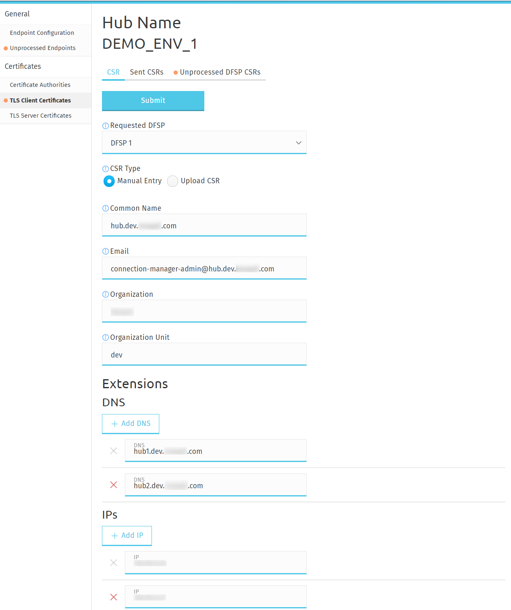

To create a certificate signing request (CSR) for sending to a DFSP, complete the following steps:

1. Go to the **CSR** tab.
1. In the **Requested DFSP** field, select the DFSP that you want to send the CSR to.
1. In the **CSR Type** field, select how you want to create the CSR:
    - To upload a CSR already created:
        1. Select **Upload CSR**.
        1. In the **CSR** field, click **Choose File**, and select the CSR file saved on your computer.

            **NOTE:** If you have accidentally uploaded the wrong CSR, you can re-upload a new CSR and that will replace the old one.
        1. Go to Step 4.
    - To manually create a CSR:
        1. Select **Manual Entry**. Note that this option is only available if you have already set up the Hub CA.
        1. Fill in the fields displayed, they are all mandatory: **Common Name**, **Email**, **Organization**, **Organization Unit**.

            <!-- **NOTE:** Some additional mandatory fields are currently not displayed and hence cannot be specified here, they are: Locality, State, Country. This is a known issue and will be fixed in a future version of the product. -->
        1. Optionally, fill in the **DNS** and **IP** fields under **Extensions**.
        1. Go to Step 4.
1. Click **Submit** to send the CSR to the DFSP.

### Retrieving the Hub's TLS client certificate CSR signed by a DFSP

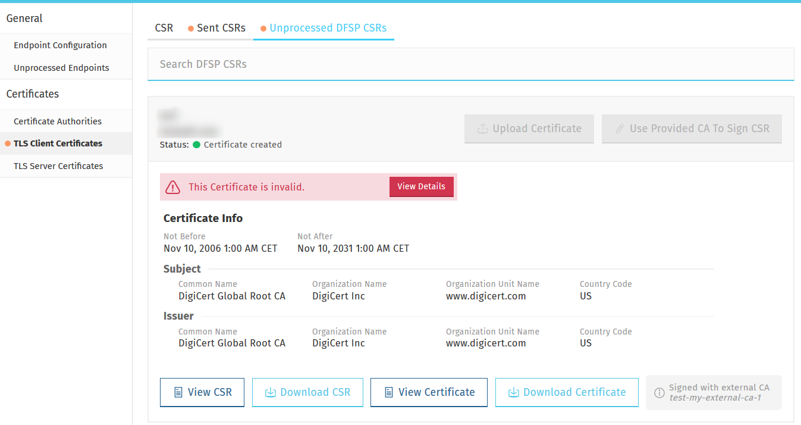

To retrieve a TLS client certificate signed by a DFSP, complete the following steps:

1. Go to the **Sent CSRs** tab. You can search for a sent CSR by typing a keyword (such as the DFSP's name) in the **Search Sent CSRs** search box and pressing **Enter**.

    The **Status** indicator displays the status of your sent CSR. If it says **Certificate created**, then that means that the CSR has been signed by the receiving DFSP.

1. You can click **Validate Certificate** to check the validity of your signed certificate. The following details are validated:
    - The CSR's signature must match the public key.
    - The CSR's signature algorithm must be "sha256WithRSAEncryption". Note that the validation also accepts "sha512WithRSAEncryption".
    - The CSR public key length must be 4096 bits.
    - The CSR and certificate must have the same public key.
    - The CSR and certificate must have the same Subject information.
    - The CSR must have all mandatory Distinguished Name attributes. These are: Common Name (CN), Organizational Unit (OU), Organization (O), Locality (L), State (ST), Country (C), and Email Address (E).
    - The certificate public key must match the private key used to sign the CSR. Only available if the CSR was manually created (MCM has the private key) instead of uploaded.
    - The certificate must be valid at the present time according to the certificate validity period.
    - The certificate's signature algorithm must be "sha256WithRSAEncryption".
    - The certificate must be signed by the DFSP CA.
1. Click **Download Certificate** to download your signed certificate, which is now ready to be installed in the outbound API gateway.

### Signing a DFSP's TLS client certificate CSR

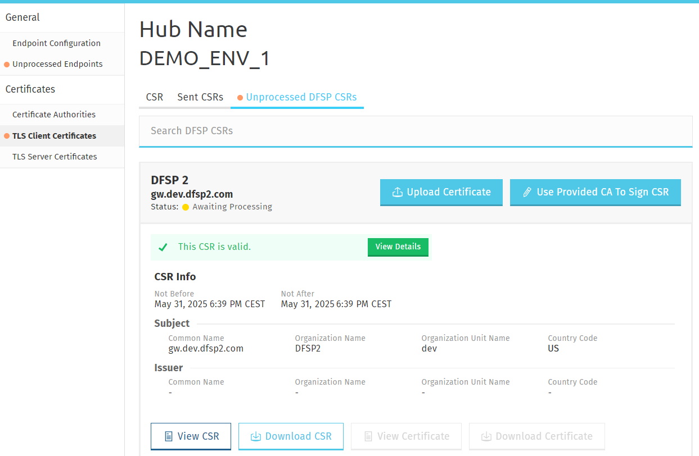

After a DFSP has sent a CSR for their TLS client certificate, you are able to retrieve it for signing. To sign a DFSP's TLS client certificate CSR using the CA set up on the **Certificate Authorities** page, complete the following steps:

1. Go to the **Unprocessed DFSP CSRs** tab. You can search for a sent CSR by typing a keyword in the **Search Sent CSRs** search box and pressing **Enter**.
1. To sign the DFSP's CSR using the embedded CA, click **Use Provided CA To Sign CSR**. This will use the CA set up on the **Certificate Authorities** page to sign the CSR.

    The **Status** indicator will change to **CSR created** to indicate that signing the DFSP's CSR has been successful.

    Information about the validity of the certificate will also be displayed. Click **View Details** for information on possible validity issues. The following details are validated:

    - The CSR's signature algorithm must be sha256WithRSAEncryption. Note that the validation also accepts sha512WithRSAEncryption.
    - The CSR public key length must be 4096 bits.
    - The CSR and certificate must have the same public key.
    - The CSR and certificate must have the same Subject information.
    - The CSR must have all mandatory Distinguished Name attributes. These are: Common Name (CN), Organizational Unit (OU), Organization (O), Locality (L), State (ST), Country (C), and Email Address (E).
    - The certificate public key must match the private key used to sign the CSR. Only available if the CSR was manually created (MCM has the private key) instead of uploaded.

To sign a DFSP's TLS client certificate CSR using an external third-party CA, complete the following steps:

**NOTE:** For this option to work, you must have uploaded external Hub CA certificates through the **Certificate Authorities** page > the **HUB External Certificate Authority** tab.

1. Go to the **Unprocessed DFSP CSRs** tab. You can search for a sent CSR by typing a keyword in the **Search Sent CSRs** search box and pressing **Enter**.
1. To sign the DFSP's CSR using an external CA, click **Upload Certificate**. This will use the external CA recorded on the **Certificate Authorities** page > **HUB External Certificate Authority** tab to sign the CSR.

    The **Upload certificate** pop-up window will be displayed, prompting you to select the CA you want to use to sign the DFSP's CSR.

1. In the **Certificate** field, click **Choose File** and select the relevant external CA. This will fill in the **External CA** field with the name of the CA that you have selected.
1. Click **Choose File** again, and select the root certificate of the CA saved on your computer.

    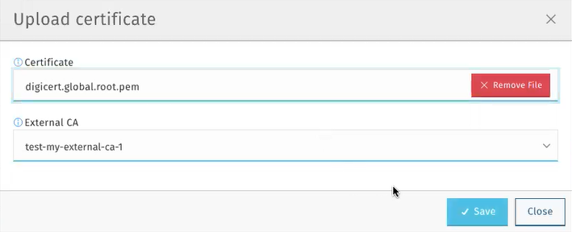

1. Click **Save**.

    The **Status** indicator will change to **CSR created** to indicate that signing the DFSP's CSR has been successful.

    Information about the validity of the certificate will also be displayed. Click **View Details** for information on possible validity issues. The following details are validated:

    - The CSR's signature algorithm must be sha256WithRSAEncryption. Note that the validation also accepts sha512WithRSAEncryption.
    - The CSR public key length must be 4096 bits.
    - The CSR and certificate must have the same public key.
    - The CSR and certificate must have the same Subject information.
    - The CSR must have all mandatory Distinguished Name attributes. These are: Common Name (CN), Organizational Unit (OU), Organization (O), Locality (L), State (ST), Country (C), and Email Address (E).
    - The certificate public key must match the private key used to sign the CSR. Only available if the CSR was manually created (MCM has the private key) instead of uploaded.

You can also download the signed certificate for installation in the API gateway trust store. To do that, click **Download Certificate**.

**NOTE:** When downloading an uploaded certificate, the default extension is set to `.csr`. If you wish to download the certificate in another format (for example, `.cer`), in the **Save As** dialog box, edit the file name and the file type so you get the certificate in the required format.

## Managing TLS server certificates

The TLS Server Certificates page allows you to:

- **Server Certificates** tab: Upload the Hub's CA-signed TLS server certificate, as well as the CA's root and intermediate certificates.
- **DFSPs Server Certificates** tab: Retrieve DFSPs' CA-signed TLS server certificates, as well as the CAs' root and intermediate certificates.

### Uploading the Hub's TLS server certificate chain

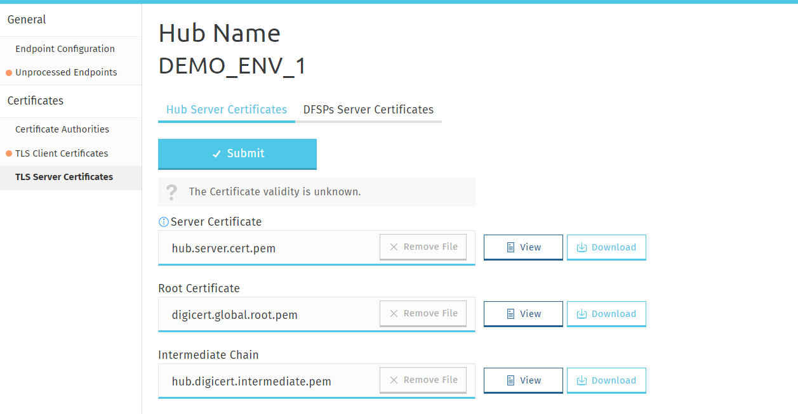

To upload the Hub's CA-signed TLS server certificate chain:

1. Go to the **Hub Server Certificates** tab.
1. Click **Choose File** in the **Server Certificate** field, and select your TLS server certificate signed by your CA saved on your computer.
1. To upload the root certificate of your CA, click **Choose File** in the **Root Certificate** field, and select the root certificate of your CA saved on your computer.
1. To upload the intermediate certificate of your CA, click **Choose File** in the **Intermediate Chain** field, and select the intermediate certificate of your CA saved on your computer.

    **NOTE:** The intermediate chain must be presented as a single file. If your intermediate chain is made up of multiple files, combine them into one file in the following order: host certificate first, then the certificate that signs it, then the certificate that signs the previous certificate, and so on. Go from the most specific certificate to the least specific certificate, with each certificate verifying the previous one.

1. Click **Submit**. On submitting the certificates, they are validated. The following details are validated:

    - The root certificate is a root certificate indeed. It can be self-signed or signed by a global root.
    - The intermediate chain is made up of valid CAs and the top of the chain is signed by the root.
    - The certificate and its chain must form a valid trust chain.
    - The certificate must have the "TLS WWW server authentication" key usage extension.
    - The certificate must be valid at the present time according to the certificate validity period.
    - The certificate key length must be 4096 bits.

**NOTE:** If you have accidentally uploaded the wrong certificate, you can re-upload a new certificate and that will replace the old one.

### Retrieving a DFSP's TLS server certificate chain

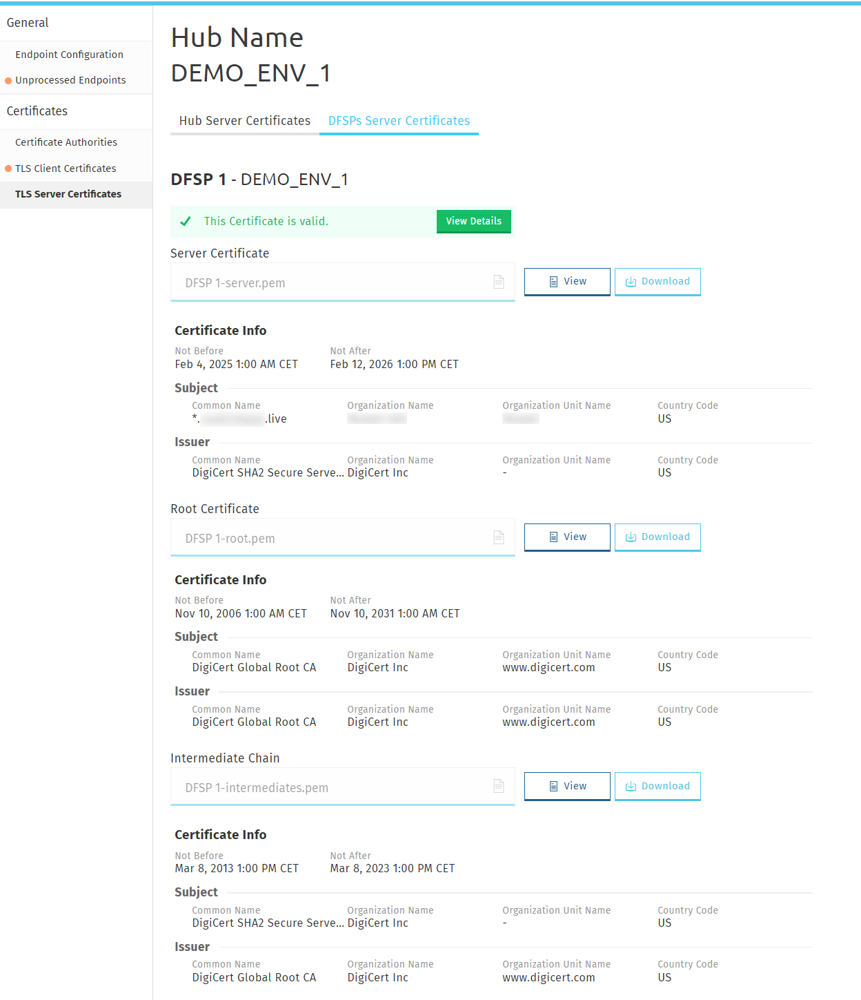

The Hub must obtain the root and intermediate certificates of the DFSP's CA that signed the DFSP TLS server certificate. These need to be installed in the outbound API gateway.

To retrieve a DFSP's TLS server certificate chain after they have uploaded it:

1. Go to the **DFSPs Server Certificates** tab.

    You will see some information displayed about the validity of the server certificate. Click **View Details** for details on validation. The following details are validated:

    - The root certificate is a root certificate indeed. It can be self-signed or signed by a global root.
    - The intermediate chain is made up of valid CAs and the top of the chain is signed by the root.
    - The certificate and its chain must form a valid trust chain.
    - The certificate must have the "TLS WWW server authentication" key usage extension.
    - The certificate must be valid at the present time according to the certificate validity period.
    - The certificate key length must be 4096 bits.

1. Click **Download** for each certificate that you want to download.

## Uploading a Hub JWS certificate

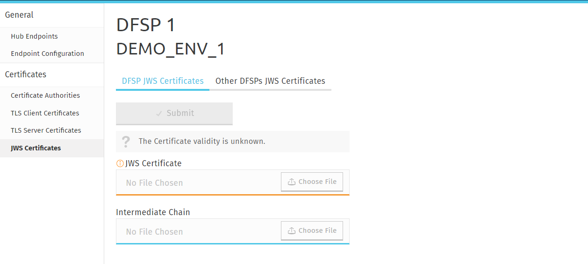

To upload a Hub JWS certificate, complete the following steps.

*Prerequisites:*

- A DFSP account has been created for the Hub specifically for the purposes of uploading the Hub JWS certificate to that. For details on how to add a DFSP account, see [Creating a DFSP account](#creating-a-dfsp-account).
- A "wrapped" public key has been created for uploading. <!-- For details on how this is done, see xref:appendix_create_jws_cert.adoc[Appendix A: Create a JWS certificate]. -->

*Steps:*

1. Log in to MCM using the DFSP account created for JWS certificate upload purposes.
1. Go to the **DFSP JWS Certificates** tab.
1. Click **Choose File** in the **JWS Certificate** field, and select your JWS certificate saved on your computer.

    The **Intermediate Chain** field is optional.

    **NOTE:** The intermediate chain must be presented as a single file. If your intermediate chain is made up of multiple files, combine them into one file in the following order: host certificate first, then the certificate that signs it, then the certificate that signs the previous certificate, and so on. Go from the most specific certificate to the least specific certificate, with each certificate verifying the previous one.

1. Click **Submit**. On submitting the certificate, it is validated. The following details are validated:

    - The certificate must be valid at the present time according to the certificate validity period.
    - The certificate key length must be 2048 bits.

**NOTE:** If you have accidentally uploaded the wrong certificate, you can re-upload a new certificate and that will replace the old one.