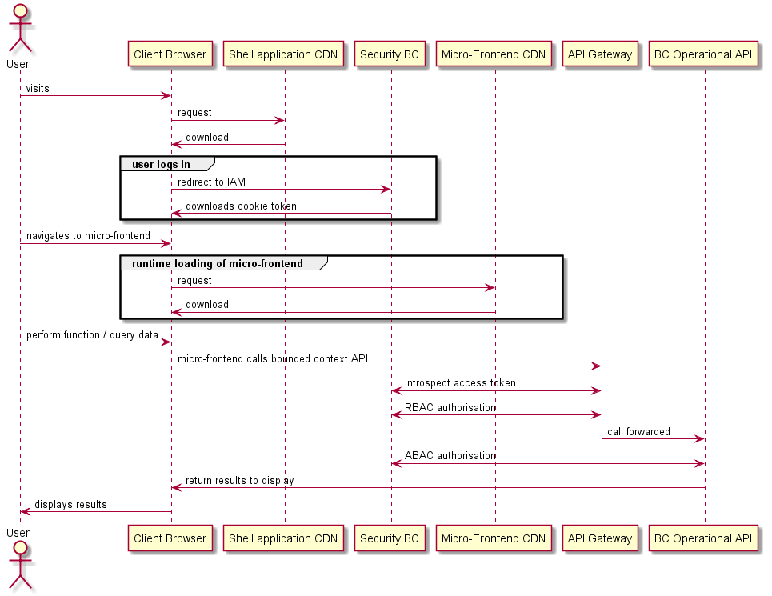
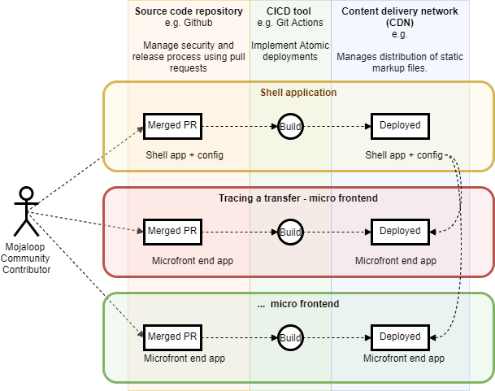

# Micro-frontend - JAMStack design
## Overview
The objective of the micro-frontend - JAMStack design is to create a framework that:

- empowers the community to collaborate easily (by enabling independent development of components)
- makes extensions or customizations easy
- enables community members to contribute back into OSS without branching the whole codebase

### Micro-frontends
The framework uses micro-frontends as a means of decoupling parts of the UI to enable maintainable codebases, autonomous teams, independent releases, and incremental upgrades of parts of the UI. 

### JAMStack
The [JAMStack](https://jamstack.org/) implementation reduces the role of the web server to the distribution static markup files, keeping the functionallity in JavaScript (that is running in the client browser) and in the backend API. 
:::warning JAMStack stands for:
 **J** - JavaScript
 **A** - APIs 
 **M** - Static markup
 :::
This stack implementation is considered best practice as it:
- is much simpler to keep secure
- provides a good customer experience as it has fast web response times
- is inexpensive to host

In addition, the following have also been engineered and are normally part of a JAMStack implementation:
- deployment to a content delivery network (CDN)
- atomic deploys
- uses dynamically loaded micro-frontends, so updating to the latest version is automatic

## Technology stack

1. **React** 
The framework is based on the React library.
This is the most popular Single Page Application (SPA) library in use, and additionally this choice allows us to capitalize on other community efforts facilitating an easy conversion into this library.
It can be enhanced by using state container libraries (Redux, Flux, MobX), however there is no restriction on a specific one to use.
The micro-frontends come with preconfigured, isolated Redux stores.

2. **Webpack 5** 
Webpack 5 is currently the only JavaScript bundler that supports remote build separation. It is done by using the Module Federation Plugin.
It enables runtime composition to provide a smooth and fully transparent user experience to the users, resulting in a traditional Single Page Application.
There are additional benefits over other technologies, all that resulting in a small footprint and overall better experience for users.
Webpack 5 will implement the host / child micro-frontends integration at runtime.

3. **CI/CD and atomic deployments** (for example, Github Actions) 
Each implementation of the Business Operations Framework will need to implement their own atomic deployment solution.
The standard Business Operations project will use Github Actions to perform the task of executing a continuous integration pipeline, running the relevant tests, building the individual micro-frontend and deploying the resulting static files over a CDN and/or creating a Docker image.
Each micro-frontend is released in complete autonomy: the composed application can use the updated versions of each individual micro-frontend automatically, without involving any further coordination.

4. **Running on a CDN**
The micro-frontends can run on a CDN. Individual builds are composed of only static files (HTML, CSS, JavaScript) and can be deployed in different locations / different URLs.
As long as they are available over a secure connection (HTTPS), micro-frontends can be served from any location and also from different CDNs.

5. **Running in Kubernetes** 
The micro-frontends can run in a Kubernetes environment. There are two approaches that can be taken here:
   - The individual micro-frontends and the shell application are containerized (using, for example, Docker) and then hosted in Kubernetes.
The host and the children apps can be deployed on the same cluster or on different clusters as long as they are publicly accessible.
   - Deploy a private CDN into the Kubernetes cluster, and host the static markup files on the CDN.
There are various CDNs available that are compatible with Kubernetes.

## Webpack building

The host and the children apps include scripts to build the distribution artifacts. The build can be done in the developer host machine, in the CI, and in Docker.

## Micro-frontend loading 

The host is responsible for loading the children apps at runtime. It gathers information about the available children at runtime, from either an API or a registry.

The host includes an internal engine responsible for loading only the necessary children when they need to be displayed.

The individual micro-frontends will not be loaded when not necessary (for example, when a specific page is not accessed by the user).

**High-level sequence diagram illustrating how microservices are loaded**


### Repository of micro-frontends
In order to provide a centralized authority responsible for controlling the individual micro-frontends meeting the necessary requirements, it is suggested to build a solution that works as a registry.

The registry would serve the following purposes:

1. allow the community to register the micro-frontends and specify some details
2. expose an API used by the host to retrieve information about the available micro-frontends
3. provide information around the versions of the available micro-frontends

The registry does not exist yet, nor does it make sense to create it at this time. 

## Deployments

The following overview diagram shows the deployment of the micro-frontends to a CDN.
::: tip NOTE
The deployment of the bounded context API is not covered in this diagram.
:::


The micro-frontends use atomic deployments and no full-build is ever required.

Each individual micro-frontend deploys independently from the other ones.

### Continuous Integration / Continuous Delivery (CI/CD)

Each micro-frontend has its own CI/CD set up; there is no requirement to share the same setup or use the same CI tool.

The CI/CD can be configured to support multiple environments, for example, DEV, QA, PROD.

Here is an example file showing a git action workflow.

```yml
# This is a basic workflow to help you get started with Actions

name: CI

# Controls when the action will run. Triggers the workflow on push or pull request
# events but only for the master branch
on:
  push:
    branches: [ master ]
  pull_request:
    branches: [ master ]

# A workflow run is made up of one or more jobs that can run sequentially or in parallel
jobs:
  # This workflow contains a single job called "build"
  build:
    # The type of runner that the job will run on
    runs-on: ubuntu-latest

    strategy:
      matrix:
        node-version: [16.x]


    # Steps represent a sequence of tasks that will be executed as part of the job
    steps:
    # Checks-out your repository under $GITHUB_WORKSPACE, so your job can access it
    - uses: actions/checkout@v2

    # Runs a single command using the runners shell
    - name: Use NodeJS ${{ matrix.node-version }}
      uses: actions/setup-node@v1
      with:
        node-version: ${{ matrix.node-version }}
    - name: Cache node modules
      uses: actions/cache@v2
      env:
        cache-name: cache-node-modules
      with:
        # npm cache files are stored in `~/.npm` on Linux/macOS
        path: '**/node_modules'
        key: ${{ runner.os }}-build-${{ env.cache-name }}-${{ hashFiles('**/yarn.lock') }}
        restore-keys: |
          ${{ runner.os }}-build-${{ env.cache-name }}-
          ${{ runner.os }}-build-
          ${{ runner.os }}-
    - run: yarn install --frozen-lockfile
    - run: yarn lint
    - run: yarn test
    - run: yarn build
#    - name: Slack Notification
#      uses: rtCamp/action-slack-notify@v2.0.2
#      env:
#        SLACK_WEBHOOK: ${{ secrets.SLACK_WEBHOOK }}
```

### CDNs

The resulting SPA is served by a CDN or multiple CDNs. Individual micro-frontends can live in different CDNs.

### Kubernetes

The resulting SPA can run and be served in one or more Kubernetes environments.

### Host application

The host application comes with a pre-configured setup out-of-the-box. It does not need any particular configuration different from a traditional SPA more than the Webpack 5 Module Federation configuration.
It will be acting as the orchestrator, loading the remote micro-frontends and providing them with app-wide functionality, for example, authentication, RBAC, client-side routing.

There is virtually no limit on how the host can grow and how much can be extended.
It is suggested, however, to centralize all the host-child communication and shared components in an external library so that both host and children have the same knowledge and integration will not break.

### Versioning micro-frontends
​The suggested approach is to build a registry where individual apps are registered. The registry would allow to set some configuration on each app and keep track of all the available versions.
​
The registry would then expose an API consumed by the host, providing information around the available micro-frontends, the versions, and the artifact locations.
​
The registry would be administered by a trusted operator through a user interface; it would be the trusted operator's responsibility to decide which version of each individual app would be made public and available to the host to load.
It would also allow to easily test versions and roll back when necessary, all that without needing to rebuild and redeploy the apps.
​
::: tip NOTE
The JS build artifacts created by Webpack do not include the version in the filename. It could be necessary to upgrade the build in order to differentiate versions. A simpler approach that does not require to update the build configuration would be hosting the versions on different URLs.
:::
​
### Upgrading the host
​The host is pretty much self-isolated and the only necessary thing to do proper versioning is to use the built-in command `yarn version`. It will create a new git tag and increment the `package.json` version according to how the command is used (interactive CLI).
​
### Upgrading the remotes
​The remotes are self-isolated and the only necessary thing to do proper versioning is to use the built-in command `yarn version`. It will create a new git tag and increment the `package.json` version according to how the command is used (interactive CLI).

### Menu / App composition
​The host is configured to dynamically build the _Menu_ and the _Pages_ (with react-router) structure. Currently, the _Menu_ component(s) is imported from the `@modusbox/react-components` library.
​
It is not strictly necessary to use such components and the host / remotes could use custom components, as long as they allow dynamic composition and support routing.
​​
## Micro-frontend motivation in more detail

​Building scalable and distributed user interfaces is complicated; logic complexity, testing setups, build and deployment costs increase over time. ​Architectural decisions taken in the initial phase can raise unnecessary complexity and highly affect development costs in later stages.​ Furthermore, a single project does not scale well with distributed teams co-working on the same codebase.​ Switching to a micro-frontend setup can solve all the above issues; it scales well, atomic deployments do not need a full build, and independent teams can use different codebases.​​

### What defines a micro-frontend

​The main rules that can define a micro-frontend setup can be summarized in the following:​

**Single responsibility**
Defined and closed boundaries
Centralized orchestration​
Single responsibility
​Each micro-frontend app should only provide specific business features. A micro-frontend app does not need to know about other aspects of the business and it can scale independently.​

**Defined and closed boundaries**
​Each micro-frontend should be isolated, own its own data, and direct communication between micro-frontends should not be possible.​

**Centralized orchestration**
​Each micro-frontend should be loaded, handled, and controlled by a host. Application-wide features are provided by the host (authentication, routing, and so on).​​

### Types of micro-frontend setups

​There are several ways to implement micro-frontends, to list a few:​
- Iframe composition
- Runtime composition
- Module federation (single framework) composition​

**Iframe composition**
​Iframe composition is possibly the oldest and easiest way to implement micro-frontends, due to old HTML support to iframes and the native context isolation it provides. Communication between the host and the micro-frontends is generally hard to achieve and also does not fit well in modern web.​

**Runtime composition**
​Runtime composition is the idea of dynamically loading JS scripts located over http/https urls and compose the result locally. ​While it allows you to theoretically use independent technologies for each micro-frontend, it is also very hard to maintain due to the differences between the frameworks used in the micro-frontends.​​

**SPA composition**
​Module federation is a technology implemented in Webpack 5 that allows you to dynamically load remote modules at runtime. When combined with a single application framework (for example, React), it allows built applications to be split into multiple micro-frontends without sacrificing the benefits an SPA provides. It also comes with the advantage of smaller build sizes.​​

### The chosen setup

We have chosen to use SPA composition using Webpack 5 and React. It is worth mentioning that in order to build an SPA with multiple micro-frontends, a specific and rigorous contract between the host and the frontends needs to be implemented and respected.​ From now on we will be referring to micro-frontends in the technical form used by Webpack 5: remotes. ​The contract is defined by the following rules:​

- The host retrieves the list of remotes dynamically and asynchronously
- The host is responsible of loading the remotes
- The host shares some context with the remotes (routing, authentication)
- The remotes have unique names
- The remotes are deployed in different urls
- The remotes do not use global CSS rules
- The remotes export themselves as defined by the modules federation rules
- The remotes share the same React (and some library) version​

When these rules are respected, there is virtually no limit to how the SPA can grow.​ Most of the basic dependencies used in each frontend are provided by the host. That makes it easy when they need to be upgraded. ​Each application is built independently from the others; the CI/CD pipeline remains fast, atomic deployments do not require complex setups and each remote is released at its own pace with no need to modify the host in any way.​

### Live example hosted on a CDN

Check out the following live example: [https://microfrontend-shell-boilerplate.vercel.app/](https://microfrontend-shell-boilerplate.vercel.app/)

## Git repositories

Here is a list of Git repositories that are part of this implementation:

 - [Micro frontend-shell-boilerplate](https://github.com/mojaloop/microfrontend-shell-boilerplate)
 - [Micro frontend-boilerplate](https://github.com/mojaloop/microfrontend-boilerplate)
 - [Micro frontend-utils](https://github.com/modusintegration/microfrontend-utils)
Library shared with both the shell application and the micro-frontend.
 - [Reporting-Hub BizOps Role Assignment Micro-frontend](https://github.com/mojaloop/reporting-hub-bop-role-ui)
 - [Reporting-Hub BizOps Transaction Tracing Micro-frontend](https://github.com/mojaloop/reporting-hub-bop-trx-ui)
  
