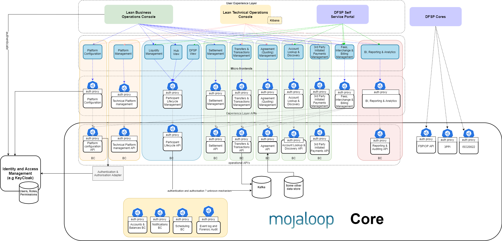

# Introduction

Join the collaboration for building a **“get started quickly”** set of core business processes that are easy to customize, contribute to open source, and follow best practice. 

The Business Operations Framework aims to help Hub Operators in building and deploying business process portals that support their business processes as defined in [Mojaloop business documentation](https://docs.mojaloop.io/mojaloop-business-docs/). The Business Operations Framework supports community collaboration in building a user experience (UX) for a Mojaloop Hub Operator that includes robust APIs, follows best practices, and is secure by design. The aim is to further support adoption and enhance the off-the-shelf value of the Mojaloop solution.

The resulting user interface (UI) is not intended to be comprehensive, but to demonstrate an exemplar web experience that is easy to extend and customize. It is therefore important that Role Based Access Control (RBAC), interfacing with standard Identity Access Management (IAM) systems, API-level security control, micro-frontends and maker-checker workflows are supported. The UX architecture follows a pre-compiled bundle with a backing API pattern that can be deployed on a Content Delivery Network (CDN). 

This document provides a more detailed design, including security aspects, technologies used, and architecture patterns.

The framework:
1. Implements a best practice RBAC and IAM integration/implementation.
2. Includes a deployment plan for including the RBAC and IAM solution into Mojaloop.
3. Includes a deployment plan for the UI portal so that it can be deployed into a CDN network.
4. Uses micro-frontends that are built from different repositories to decouple community efforts and facilitate easy extension and customizations.
5. Provides an audit trail of all activities performed.

Three levels or degrees of control are required when configuring best practice security:
1. Daily access to IAM user interfaces where users are created, suspended, and their roles assigned.
2. Mappings of roles to permissions, which can be edited through a configuration change request.
3. Restrictions on API access on the basis of permissions available to a subject (a user or API client) through their roles.

## Community effort – to-do list
The initial delivery of this framework includes a thin vertical slice to demonstrate the end-to-end functional implementation of the framework. Although this function that is delivered first serves an important puropse, this is not the end objective of this project. The objective is to provide a framework that other community efforts can contribute to. Here is the current to-do list of API backend process support/micro-frontends that are intended to be added to this framework by Mojaloop community implementation efforts:

|Category|Description|Contributing Community Effort|
| --- | --- | --- |
|**Platform configuration**|Process to configure the platform so that it enforces the scheme and the scheme rules.| - |
|**Platform management**|Technical operational management controls for the platform.| Currently performed with Kibana Application Performance Monitoring (APM) and Elasticsearch. No current plan to move to framework. |
|**Liquidity management**|Process support for managing liquidity.|Financial Portal V2 - not yet part of framework.|
|**Participant lifecycle management   (Hub view)**|Manage the onboarding and status transitions of participants.|Financial Portal V2 - not yet part of framework.|
|**Participant lifecycle management   (DFSP view)**|Allow DFSPs to manage their status and interaction with the Hub.| - |
|**Settlement management**|Management interface for settlement.|DFSP reconciliation reports - Myanmar MFI Digitization (MMD) reports are being incorporated into the framework (accessed through an API). Multilateral deferred net settlement - Financal Portal V2 not yet available in framework.|
|**Transfer and transaction management**| Business Operations view of all transactions at the hub. | Financial Portal V2 - being converted into framework with enhancements. Enabling the tracing of a transfer end-to-end. |
|**Agreement (quoting) management**| - | - |
|**Account lookup and discovery management**| - | - |
|**Third-party-initiated payments management**| - | - |
|**Fees (interchange and billing) management**| - | - |
|**Reporting and analytics**| - | - |

## Reference architecture
The reference architecture workstream has - through a collaborative process - designed the future/next version architecture of Mojaloop. The Business Operations Framework is being designed to work on the existing Mojaloop version (core v1.0). The Business Operations Framework must, however, be compatible with the reference architecture, and wherever possible, facilitate the move towards the reference architecture design.

The following elements of the Business Operations framework project are directly contributing to the building of a reference architecture:
1. **Security bounded context**
This workstream RBAC implementation used some of the design ideas and seperations as defined in the reference architecture security bounded context. It didn't implement any of the interfaces what are necessry to consider this a security BC implementation.
2. **Reporting bounded context**
Part of the reporting bounded context is being built in this workstream.

The split of the frontend into micro-frontends that can be built, tested, and released independently; empowering teams that create solutions within each bounded context to independently build API functionality and corresponding UI. Customizations and extensions to each bounded context are also easily supported with this design.

Here is an overall view of how the operational APIs, experience APIs, and micro-frontends can be combined into the parts that form the Business Operations framework.

 

## IaC 4.xx
The next version of the "Infrastrcuture as Code" project plans on using a different set of tools than those currently in use in the Mojaloop Community; i.e. WSO2 with its Identity Server as a Key Manager (IS-KM) and the HAproxy implementations are to be replaced with Keycloak, Ambassador - Envoy tools. This design is compatible with the next IaC version.