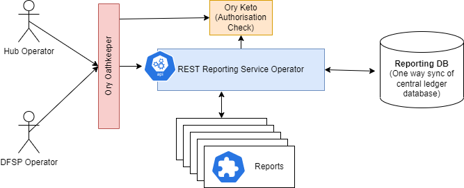

# Report Developer Guide
This is a developer guide to building and deploying reports for the reporting REST service that is part of the deployment at the Hub.

## Architecture

[Here](https://github.com/mojaloop/reporting) is the repository of the reporting service operator.
The reporting service operator has been designed to be accessed by either a hub operator, or a DFSP operator.
Access to the report is controlled through the RBAC integration that is part of the business operations framework. Ory Oathkeeper protects the reporting API end point, and Keto is checked by the reporting service operator for finer grained report specific authorisation.
The report data is queried from the SQL Reporting database which is at the moment a one way sync of the central ledger database.
Each report is installed on the system as a kubernetes custom resource which is a .yaml file of a particular format that is applied to the kubernetes cluster. [Here](https://github.com/mojaloop/reporting-k8s-templates) is the repository of the open sourced report templates. The custom resource definition for a report is defined [here](https://github.com/mojaloop/reporting-k8s-templates/blob/master/crds/reporting-crd.yaml) which describes the format of the custom resource.

## RBAC
Access to the reports are controlled through the RBAC when the service is deployed through the standard IaC configuration.
This means that in order to access a report, a user will need to have the correct authorisation assigned. This is acheived through the assignement of roles to the user, and the assignment of participant access.

The first authorisation check is made by Ory Oathkeeper which has a rule that links the 
```
reportingApi
```
perission to assess to the reporting service API endpoint.

The next authorisation check is made by the reporting service operator. Permission to access the particulat report is checked. The permission that is checked is defined in the custom resource. This permission is optional and will otherwise use the name (metadata) of the report as defined in the customer resource. 
### Requiring DFSP permission
If the report is intended for a particular participant of DFSP, then it is imporant to use the 'dfspId' parameter. This paramter then first check for participant authoriasation before executing and producing the report.
I.e.
``` yaml
 params:
      - name: dfspId
        required: true
```
### Running the report
First you will need to login. The easiest way of doing this is to login to the Financial Portal. This create the authorisation and authentication cookie tokens which the report then uses.
Here is an example of accessing the report directly after loggin. 
```
https://bofportal.YourEnvironment.YourDomain.com/proxy/reports/MyReportPath?ReportParamter=25
```

### report output formats
The report supports multiple output formats. To switch between these use the format paramter in the Rest query.
1. Excel file 
```
&format=xlsx
```
2. Comma seperated values
```
&format=csv
```
3. JSON class format
```
&format=json
```
4. HTML browser format (this is the default format output)
```
&format=html
```

## Kubernetes Custom Resource
All aspects of a report are controlled through the mojaloopreport custome resource file. The definition of that file looks as follows.

### Custom Resource Definition
``` yml
kind: CustomResourceDefinition
apiVersion: apiextensions.k8s.io/v1
metadata:
  name: mojaloopreports.mojaloop.io
spec:
  group: mojaloop.io
  scope: Namespaced
  names:
    plural: mojaloopreports
    singular: mojaloopreport
    shortNames:
      - mlreport
    kind: MojaloopReport
    listKind: MojaloopReportList
  versions:
    - name: v1
      served: true
      storage: true
      schema:
        openAPIV3Schema:
          description: MojaloopReport is the Schema for MojaloopReport API
          type: object
          properties:
            apiVersion:
              description: >-
                APIVersion defines the versioned schema of this representation
                of an object. Servers should convert recognized schemas to the
                latest internal value, and may reject unrecognized values. More
                info:
                https://git.k8s.io/community/contributors/devel/sig-architecture/api-conventions.md#resources
              type: string
            kind:
              description: >-
                Kind is a string value representing the REST resource this
                object represents. Servers may infer this from the endpoint the
                client submits requests to. Cannot be updated. In CamelCase.
                More info:
                https://git.k8s.io/community/contributors/devel/sig-architecture/api-conventions.md#types-kinds
              type: string
            metadata:
              type: object
            spec:
              description: MojaloopReport.spec describes the desired state of my resource
              type: object
              required:
                - endpoint
                - queries
                - template
              properties:
                permission:
                  description: Permission to be needed to access this report. This is optional. If unspecified, the name of the resource will be considered as permission.
                  type: string
                endpoint:
                  description: Reporting endpoint
                  type: object
                  required:
                    - path
                  properties:
                    path:
                      description: Report URL path
                      type: string
                    params:
                      description: Report query params
                      type: array
                      items:
                        description: Query param
                        type: object
                        required:
                          - name
                        properties:
                          name:
                            description: Query param name
                            type: string
                          required:
                            description: Make query param required
                            type: boolean
                          default:
                            description: Default query param value
                            type: string
                queries:
                  description: The list of queries used in ejs reporting template
                  type: array
                  items:
                    description: permission ID.
                    type: object
                    required:
                      - name
                      - query
                    properties:
                      name:
                        description: Variable name that the query result will be assigned to
                        type: string
                      query:
                        description: SQL query
                        type: string
                template:
                  description: ejs reporting template
                  type: string

            status:
              description: The status of this MojaloopReport resource, set by the operator.
              type: object
              properties:
                state:
                  description: The state of the report.
                  type: string
      additionalPrinterColumns:
        - name: endpoint
          type: string
          description: Reporting endpoint
          jsonPath: .spec.endpoint.path
  conversion:
    strategy: None
```
Example of reports that conform to this custom resource can be found [here](https://github.com/mojaloop/reporting-k8s-templates/tree/master/templates).
Please note that these Yaml files also contain **helm directives** in these files denoted by the double curly brackets. 
```
{{ some helm directive / function }}
```
If you intend to manually apply these files to kubernetes, these will need to be removed or replaced.

### Kubectl
You can use the following command to apply a report custom resource to a kubernetes instance.
  ```
  kubectl apply -f resources/examples/participant_list.yaml
  ```

Let's cover some of the details in the custome resource.

### Control how the report is called
The first part of the spec: of the report defines how the report is called.
I.e.
``` yaml
spec:
  permission: report-dfsp-settlement-detail
  endpoint:
    path: /dfspSettlementDetail
    params:
      - name: settlementId
        required: true
      - name: fspid
        required: true
```
- **permission** this is where the RBAC permission tag for this report is defined
- **path** this is the endpoint path for this report
- **params** here the paramters for the report are defined and specified if they are required paramters or not.

### Control where the report gets it data from
``` yaml
queries:
    - name: dfspInfo
      query: |
        SELECT participantId, name FROM participant WHERE name = :fspid AND name != 'Hub'
    - name: report
      query: |
        SELECT
                pCPayer.participantId as payerFspid,
```
In the queries section, any number of queries can be defined that are run against the reporting database and loaded into named json classes.
Input parameters can be used in the queries by using a colon in front of the parameter name. e.g.
```
:paramname
```
### Control how the reports look like
The template part of the custom resource file contains an EJS script that is use to produce the report.
These scripts look like html with styling, but contain code within script blocks
``` ejs
<% ejs script %>
```
The EJS scripts are quite versitile and can be used to change a name text, or  define formatting functions, or loops that loop through data.

## Building your development environment
*(Installation this service locally to aid development.)*
Currently the only way to validate the report design, is to apply the report to the kubernetes that the reporting service is running in. The reporting service will initially validate the report, and then enable the endpoint. The report can be run and checked to see if it meets it's requirements.

This document provides instructions for deploying this service locally, so that a developer can try out their designs before installing the report in a an environment
Since the reporting service follows K8S operator pattern, we need to deploy a mini Kubernetes cluster on our machine and deploy the reporting service along with some dependent services.

### Pre-requisites
- Please make sure that you have the following softwares installed
  - git
  - docker
  - minikube
  - kubectl
  - helm
  - mysql-client

### Install K8S
- Start minikube K8S cluster with the following command
  ```
  minikube start --driver=docker --kubernetes-version=v1.21.5
  ```

### Clone the repository
- Download the repository
  ```
  git clone https://github.com/mojaloop/reporting.git
  cd reporting
  ```

### Deploy helm chart
- Install helm chart using the following commands
  ```
  helm dep up ./resources/test-integration/
  helm install test1 ./resources/test-integration/ --set reporting-legacy-api.image.tag=v11.0.0
  ```
- Wait for all the services to be up
  You can monitor the pods health or use the following commands to wait for the services
  ```
  kubectl -n default rollout status deployment test1-reporting-legacy-api
  kubectl -n default rollout status statefulset mysql
  ```

### Restore mysql database backup
- Port forward the mysql service
  ```
  kubectl port-forward -n default service/mysql 3306:3306
  ```
- Insert sample data into database. You can change the database name and filename in the following command as per your need.
  ```
  mysql -h127.0.0.1 -P3306 -uuser -ppassword default < ./resources/examples/participants_db_dump.sql
  ```

### Load reporting template
- Adding the custom resource using the following command
  ```
  kubectl apply -f resources/examples/participant_list.yaml
  ```

### Get the report
- Port forward the reporting service
  ```
  kubectl port-forward -n default service/test1-reporting-legacy-api 8080:80
  ```
- Get the report by opening the following URL in browser
  ```
  http://localhost/participant-list
  ```

### Cleanup
- Cleanup
  ```
  kubectl delete -f resources/examples/participant_list.yaml
  helm uninstall test1
  minikube stop
  ```

## Deploying to a production environment
There are multiple ways that a report custom resource can be deployed into an environment. The method that has been chosen and built into the IaC offering involves the use of a helm chart. (This aligns well with other Mojaloop components.)

The IaC enables both a public and a private deployment of reports. The process is identical except for the repository being private and residing within organisation's source control.
At a high level the process looks as follows:
1. Branch and commit changes to the repository where the report is deployed from.
2. Create a pull request and merge the changes into the master branch of the repository.
3. Create a new release on the repository. (Depending on configuration this typically kicks off a CICD mechanism that builds and publishes the helm package.)
4. Update the IaC to depoly the new helm release version for the reports.
5. Run the appropriate pipeline to perform the deployment.

