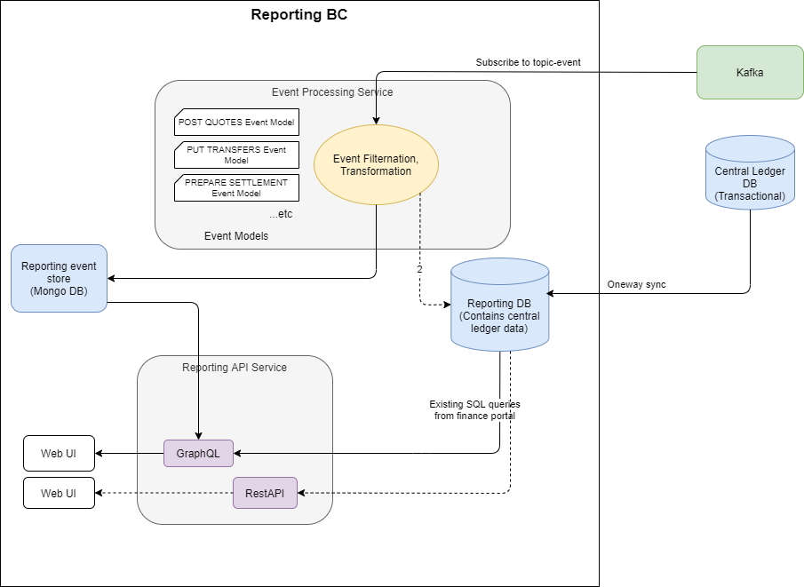
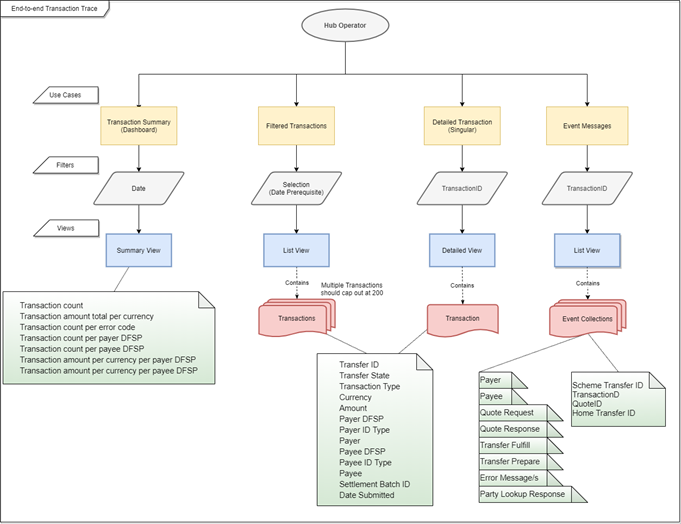

# Reporting bounded context implementation
One of the objectives of this workstream project is to provide the ability to trace a transfer end to end. In order to deliver on this objective, part of the reporting bounded context (BC) is to be built in line with the reference architecture.

## Design overview
Here is the overall architectural design.


In Mojaloop, all the core services are already pushing events to Kafka on a topic (called 'topic-event').

There are two fundamental reporting databases:
1. **Reporting DB** 
The reporting database is a relational database that keeps track of the latest state of the Mojaloop objects and makes them available through an efficent query interface. \
\
In the implementation of this workstream effort, a dedicated replica of the central ledger database will be used for reporting. This does not quite fit the architectural model, as a database owned by the reporting bounded context should not have external depencencies. A central ledger replica database is dependent on the schema of the central ledger and therefore has an external dependency. 
::: warning Technical Debt
This should be recognized as **technical debt** that should be paid as more of the reference architecture is built. 
:::
There are two approaches that can be adopted when paying this technical debt:
  - Changing the replica call to a **one-way data sync** function, which would decouple the schemas of the two databases.
  - Rebuilding a new designed **relational database**, which is updated based on subscribed Kafka topics.

The best approach will depend on the state of the current Mojaloop version at the time that this debt is paid. \
\
2. **Event DB store** 
The event DB store is a capture of the event details that can provide a more detailed reporting view of what happened. 

**Limitations of the event store effort in this workstream**
This design will be implemented on the current Mojaloop version. 

Currently, only the data required to provide end-to-end tracing of a transfer will be collected and made available through the reporting API. Extensions to this offering can easily be added by extending the event processor to process new use case messages and store them in the Mongo DB, and then configure the generic graphQL resource query in order to query the new data stores appropriately.

## Alignment with reference architecture
Although the bounded context refers to reporting and auditing, this project only begins to tackle the reporting part of that definition. The current design is independent from other bounded contexts, which is in line with the reference architecture. 
(There isn't a complete seperation as the current design is using a replica database as the reporting database. The technical debt and next steps to resolve this are described above.)

It is important to consider how this bounded context will change as more of the reference architecture design is implemented.

Bounded contexts will - during the reference architecture implmentation - stop storing data in the central ledger databases.

There are three approaches that can be adopted to accommodate this change. How the reference architecture is built will determine which is the best approach:
1. Modifying the sync functionality to accomodate the bounded context new data store.
2. Extending the message event processor to capture the required information in the reporting database.
3. Calling newly defined bounded context APIs, to retrieve the required data.

## Use cases to support the tracing of a transfer

In order to effectively trace a transfer end to end, four use cases were defined.

### Use case 1: Dashboard view

**As a** Hub Operator Business Operations Specialist,
**I want** a high-level dashboard summary of the transfers moving through the hub, which is derived from a date-time range, 
**So that** I can proactively monitor the health of the ecosystem.

:::::: col-wrapper
| Data returned |
| --- |
| Transfer count |
| Transfer amount total per currency |
| Transfer count per error code  |
| Transfer count per Payer DFSP |
| Transfer count per Payee DFSP |
| Transfer amount per currency per Payer DFSP |
| Transfer amount per currency per Payee DFSP |
:::::::::

### Use case 2: Transfer list view

**As a** Hub Operator Business Operations Specialist,
**I want to** view a list of transfers that can be filtered based on one or more of the following: 
- Always required (must be provided in every call)
   - Date-time range

- Optional filters 
   - A specific Payee DFSP
   - A specific Payee ID type 
   - A specific Payee
   - A specific Payer DFSP
   - A specific Payer ID type
   - A specific Payer
   - State of the transfer
   - Currency

- Nice to have filters (not a strict requirement, but should be provided if the design allows for it)
   - A specific error code
   - Settlement window
   - Settlement batch ID: The unique identifier of the settlement batch in which the transfer was settled. If the transfer has not been settled yet, it is blank.
   - Search string on messages

**So that** I can proactively monitor the health of the ecosystem by having a more detailed view of the transfer data moving through the hub.

:::::: col-wrapper
| Data returned | |
| --- | --- |
| Transfer ID | The unique identifier of the transfer |
| Transfer State | Indicates if the transfer has succeeded, is pending, or an error has occurred |
| Transfer Type | (For example: P2P) |
| Currency | The transfer currency |
| Amount | The transfer amount |
| Payer DFSP  | |
| Payer ID Type  | |
| Payer | |
| Payee DFSP | |
| Payee ID Type | |
| Payee | |
| Settlement Batch ID | The unique identifier of the settlement batch in which the transfer was settled.<br> If the transfer has not been settled yet, it is blank. |
| Date Submitted | The date and time when the transfer was initiated. |
:::::::::

### Use case 3: Transfer detail view

**As a** Hub Operator Business Operations Specialist, 
**I want to** trace a specific transfer from its transfer ID,
**So that** I can identify:

- The timing and current state of the transfer
- Any error information that is associated with that transfer
- The associated quoting information and timing for that transfer
- The associated settlement process status and identifiers

:::::: col-wrapper
| Data returned | |
| --- | --- |
| Transfer ID | The unique identifier of the transfer |
| Transfer State | Indicates if the transfer has succeeded, is pending, or an error has occurred |
| Transfer Type | (For example: P2P) |
| Currency | The transfer currency |
| Amount | The transfer amount |
| Settlement Batch ID | The unique identifier of the settlement batch in which the transfer was settled.<br> If the transfer has not been settled yet, it is blank. |
| Payer |  |
| Payer Details | The unique identifier of the Payer (typically, a MSISDN, that is, a mobile number) |
| Payer DFSP | |
| Payee DFSP | |
| Payee | |
| Payee Details | The unique identifier of the Payee (typically, a MSISDN, that is, a mobile number) |
| Transfer State | Indicates if the transfer has succeeded, is pending, or an error has occurred |
| Date Submitted | The date and time when the transfer was initiated |
:::::::::

### Use case 4: Transfer message view

**As a** Hub Operator Business Operations Specialist, 
**I want to** view the detailed messages from its transfer ID,
**So that** I can investigate any unexpected problem associated with that transfer.

:::::: col-wrapper
| Data returned | |
| --- | --- |
| Scheme Transfer ID | |
| TransferID | |
| QuoteID | |
| Home Transfer ID | |
| Payer and Payee Information | Id Type, Id Value, Display Name, First Name, Middle Name,<br> Last Name, Date of birth, Mechant classification code,<br> FSP Id, Extension List |
| Party Lookup Response | |
| Quote Request | |
| Quote Response | |
| Transfer Prepare | |
| Transfer Fulfill | |
| Error message/s | |
:::::::::

## Business workflow
Here is a business workflow that describes how the use cases are called.


## Tools chosen
### Event Data Store: MongoDB
The MongoDB database was chosen because:
   - MongoDB is currently used and deployed in Mojaloop, and is an excepted open-source tool that optionally has standard companies that can provide enterprise support should it be required.
   - MongoDB will meet our requirements for this project.
   - Other tools were considered but were found not to meet all the requirements for an OSS tool in Mojaloop.
 
### API: GraphQL
In addition to the existing reporting API, a GraphQL API will be deployed too. This new API will have the additional functionality of being able to access the event reporting database as supplementary data or standalone query data. 

The GraphQL API implementation was added for these reasons:
   - A more natural RBAC modelling implementation
   - Easier to mix data from different sources into a single resource
   - Existing reporting solution's implementation resulted in very complex SQL statements that required specialist knowledge to build and maintain. Splitting the data into a more natural resource and subsequent SQL statement simplifies both the SQL statement and the useage of that resource.
   - In the team we had an GraphQL expert who knew the best lib and tools to use.
   - A generic implementation was built so that no special GraphQL knowledge would be required to extend the functionality. 

**Additional advantages of using GraphQL**
   - Reusable resources/associated RBAC permissions between reports
   - Complex queries are simpler to build because resources are modeled 
   - Mixing of data sources in a single query (for example, MySQL with MongoDB)
   - No requirement for nested fetches
   - No requirement for multiple fetches
   - No requirement for API version. API naturally supports backward compatibility between versions. 
   - Self-documenting API

**Introduction of a new technology**
The introduction of a new technology into the community does bring some risk and a requirement to learn and maintain a new technology. An attempt to reduce the impact of this has been made by implementing the API using a generic or template approach, minimizing the GraphQL knowledge requirement to implement. A GraphQL query example has additionally be supplied.

The current GraphQL implementation is developer-friendly.

**Reporting REST implementation**
There is a REST reporting API implementation that has been donated to the Mojaloop community. It is possible to deploy this functionality alongside the GraphQL API implmentation if it becomes neccessary to do so.

### GraphQL API - generic resource implementation explained
At the heart of the implementation of this bounded context is a generic implementation that links a reporting data store and a query to a GraphQL data resource that has its own RBAC authorization. That is, a new customized resource can be added to this API by doing the following:

1. Define the data store type
2. Define the query
3. Define the GraphQL resource names and fields
3. Define the user permission that is linked to this resource

### GraphQL query examples

**Query transfers that are filtered on a specific Payer DFSP**
```GraphQL
query GetTransfers {
  transfers(filter: {
    payer: "payerfsp"
  }) {
    transferId
    createdAt
    payee {
      name
    }
  }
}
```

**Query a summary of the transfers**
```GraphQL
query TransferSumary2021Q1 {
  transferSummary(
    filter: {
        currency: "USD"
        startDate: "2021-01-01"
        endDate: "2021-03-31"
    }) {
        count
        payer
  }
}
```


## Building the event data store
The purpose the event data store is to provide a persistent storage of events of interest that are easily and efficiently found and queried for reporting.

To achieve this with minimal structure changes from the original message, it was decided to process the message into categories and store these categories as additional metadata inside the message, which can be queried later on. Messages that do not fit within these categories are not stored and are therefore filtered out.

Here is an example of the metadata that is added to the JSON message:

```json{7-12}
{
    "event": {
        "id" : {},
        "content" : {},
        "type" : {},
        "metadata" : {}
    },
    "metadata" : {
        "reporting" : {
            "transactionId" : "...",
            "quoteId": "...",
            "eventType" : "Quote"
        }
    }
}
```
Where `"eventType"` can be one of the following:
:::::: col-wrapper
::: col-third
:::

::: col-third
| eventType	|
| ------- |
|Quote |
|Transfer |
|Settlement	|
:::
:::::::::
  
The event stream processor will subscribe to the Kafa topic `'topic-event'`. This message queue contains all the event messages. A sigificant degree of filtering is therefore necessary.

:::tip NOTE
The code delivering this functionality has been structured so that these filters can easily be modified or extended.
The subscribed and classified messages are represented in 'const' files so they can easily be added to or amended without detailed knowledge of the code.
:::

### Storing only 'audit' messages

Only Kafka messages that are of type `'audit'` will be considered for saving, that is, only if:
:::::: col-wrapper
::: col-third
:::
::: col-third
| metadata.event.type |
| ---- |
| audit |
:::
:::::::::

## 'Transfer' messages that are stored
**ml-api-adapter**

:::::: col-wrapper
| metadata.trace.service |
| ---- |
| ml_transfer_prepare |
| ml_transfer_fulfil |
| ml_transfer_abort |
| ml_transfer_getById |
| ml_notification_event |
:::::::::

## 'Quote' messages that are stored
**quoting-service**
:::::: col-wrapper
::: col-third
| metadata.trace.service |
| ---- |
| qs_quote_handleQuoteRequest |
| qs_quote_forwardQuoteRequest |
| qs_quote_forwardQuoteRequestResend |
| qs_quote_handleQuoteUpdate |
| qs_quote_forwardQuoteUpdate |
| qs_quote_forwardQuoteUpdateResend |
| qs_quote_handleQuoteError |
| qs_quote_forwardQuoteGet |
| qs_quote_sendErrorCallback |
:::

::: col-third
| metadata.trace.service |
| ---- |
| qs_bulkquote_forwardBulkQuoteRequest |
| qs_quote_forwardBulkQuoteUpdate |
| qs_quote_forwardBulkQuoteGet |
| qs_quote_forwardBulkQuoteError |
| qs_bulkQuote_sendErrorCallback |
:::

::: col-third
| metadata.trace.service |
| ---- |
| QuotesErrorByIDPut |
| QuotesByIdGet |
| QuotesByIdPut |
| QuotesPost |
| BulkQuotesErrorByIdPut |
| BulkQuotesByIdGet |
| BulkQuotesByIdPut |
| BulkQuotesPost |
:::
:::::::::

## 'Settlement' messages that are stored
**central-settlement**
:::::: col-wrapper
::: col-third
| metadata.trace.service |
| ---- |
| cs_process_transfer_settlement_window |
| cs_close_settlement_window |
| ... |
:::

::: col-third
| metadata.trace.service |
| ---- |
| getSettlementWindowsByParams |
| getSettlementWindowById |
| updateSettlementById |
| getSettlementById |
| createSettlement |
| closeSettlementWindow |
| ... |
:::
:::::::::

## Messages that currently remain unclassified and are filtered out 
**account-lookup-service (not in PI - included as a reference)**
:::::: col-wrapper
::: col-third
| metadata.trace.service |
| ---- | 
| ParticipantsErrorByIDPut |
| ParticipantsByIDPut |
| ParticipantsErrorByTypeAndIDPut |
| ParticipantsErrorBySubIdTypeAndIDPut |
| ParticipantsSubIdByTypeAndIDGet |
| ParticipantsSubIdByTypeAndIDPut |
| ParticipantsSubIdByTypeAndIDPost |
| ParticipantsSubIdByTypeAndIDDelete |
| ParticipantsByTypeAndIDGet |
| ParticipantsByTypeAndIDPut |
| ParticipantsByIDAndTypePost |
| ParticipantsByTypeAndIDDelete |
| ParticipantsPost |
| PartiesByTypeAndIDGet |
| PartiesByTypeAndIDPut |
| PartiesErrorByTypeAndIDPut |
| PartiesBySubIdTypeAndIDGet |
| PartiesSubIdByTypeAndIDPut |
| PartiesErrorBySubIdTypeAndIDPut |
:::

::: col-third
| metadata.trace.service |
| ---- |
| OraclesGet |
| OraclesPost |
| OraclesByIdPut |
| OraclesByIdDelete |
:::

::: col-third
| metadata.trace.service |
| ---- |
| postParticipants |
| getPartiesByTypeAndID |
| ... |
:::
:::::::::

**transaction-requests-service (not in PI - included as a reference)**
:::::: col-wrapper
::: col-third
| metadata.trace.service |
| ----- |
| TransactionRequestsErrorByID |
| TransactionRequestsByID |
| TransactionRequestsByIDPut |
| TransactionRequests |
| AuthorizationsIDResponse |
| AuthorizationsIDPutResponse |
| AuthorizationsErrorByID |
:::

::: col-third
| metadata.trace.service |
| ----- |
| forwardAuthorizationMessage |
| forwardAuthorizationError |
| ... |
:::
:::::::::

### Useful tools

#### Kafka explorer
The [‘kowl’](https://github.com/cloudhut/kowl) software from cloudhut is a useful tool to explore all the Kafka messages in a Mojaloop cluster. We can deploy it in the same namespace as the Mojaloop core services.

The custom values file for the OSS deployment can be found in this [repository](https://github.com/mojaloop/deploy-config/tree/deploy/PI15.2/mojaloop/kowl-kafka-ui).
(This is private repository, you may need permission to access this link.)

**Steps to install**
```
helm repo add cloudhut https://raw.githubusercontent.com/cloudhut/charts/master/archives
helm repo update
helm install kowl cloudhut/kowl -f values-moja2-kowl-values.yaml
```
**Web UI**
Open the URL configured in the `ingress` section in the `values` file.

**Additional customization**
For information on how to add further customization, see the [reference configuration](https://github.com/cloudhut/kowl/blob/master/docs/config/kowl.yaml) provided by cloudhut.

#### TTK golden path
The TTK golden path test cases have been designed to explore all the test outcomes possible when sending transfers. This is therefore an important tool that can be used to test that the functionality caters for all eventualities. That is, we can use the in-built TTK to execute different test-cases such as P2P happy path, negative scenarios, settlement-related use cases, and so on.

## Event processing service

The event processing service is responsible for subscribing to Kafka topics and filtering through the events by event type. The event type further breaks down into several parts depending on which service the events were produced from. The filtered events will then be processed depending on the context of the event structure, and reporting metadata will be created.

Example:

```json
{
    "event": {
        "id" : {},
        "content" : {},
        "type" : {},
        "metadata" : {}
    },
    "metadata" : {
        "reporting" : {
            "transactionId" : "...",
            "quoteId": "...",
            "eventType" : "Quote"
        }
    }
}
```

| eventType	| Event origin |
| ------- | ------- |
|Quote | quoting-service |
|Transfer | ml-api-adapter |
|Settlement	| central-settlement |

The event processing service subscribes to the Kafka event stream to build an event transfer related store that is queryable through the operational API. This is in line with the reference architecture.
