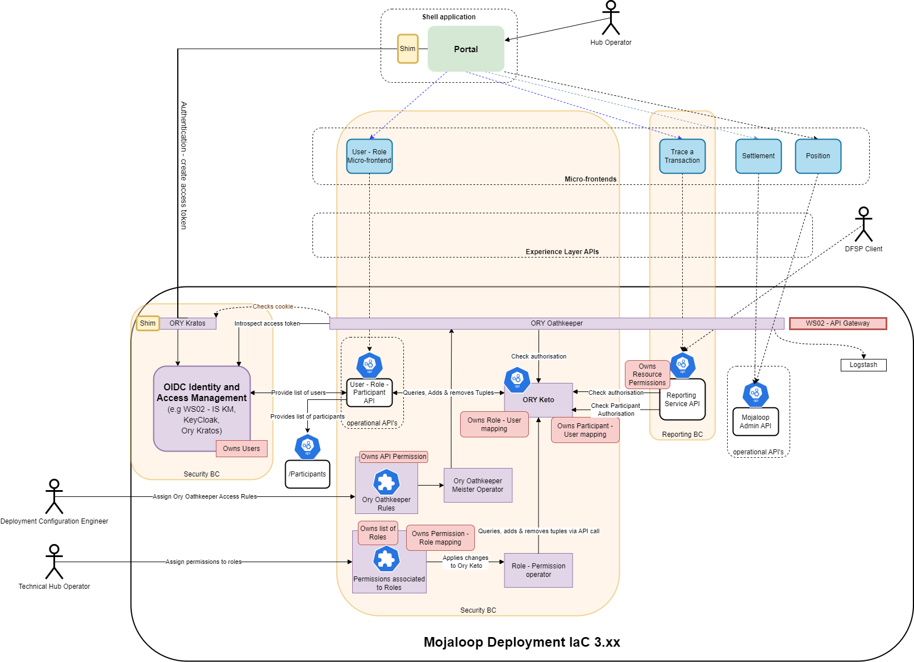
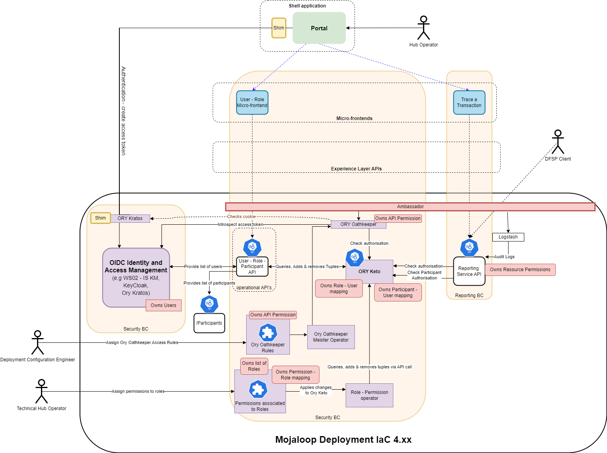
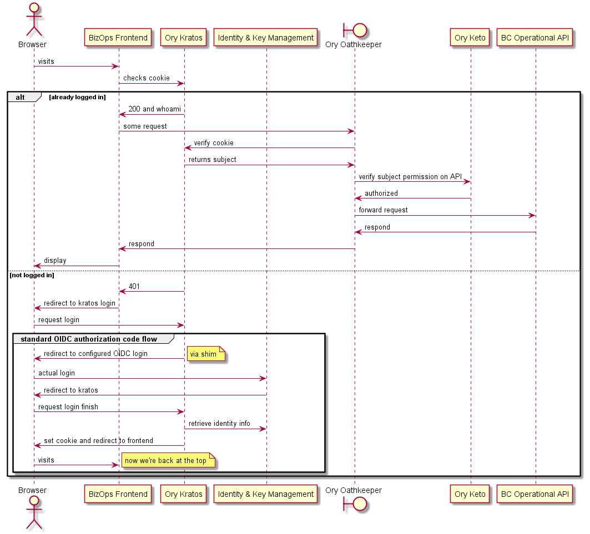
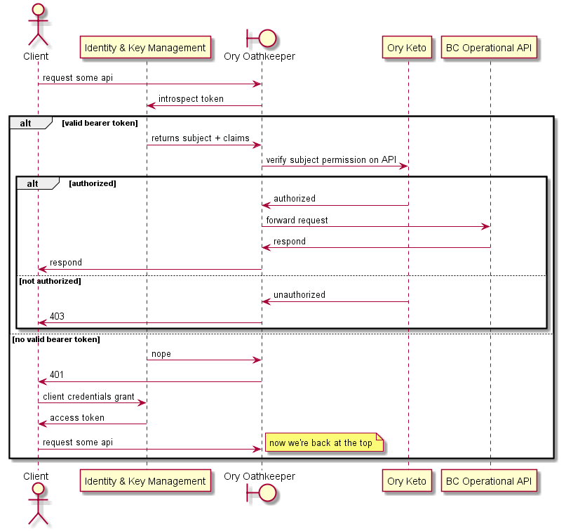
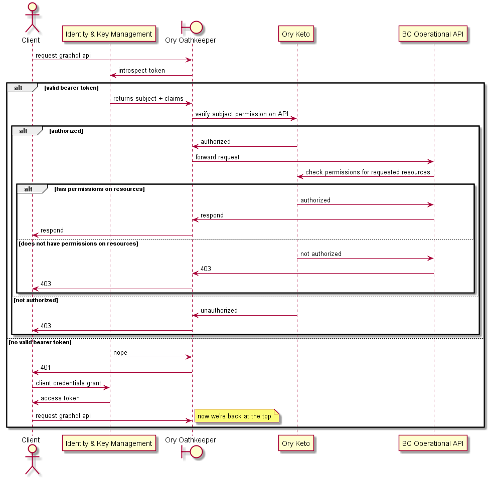
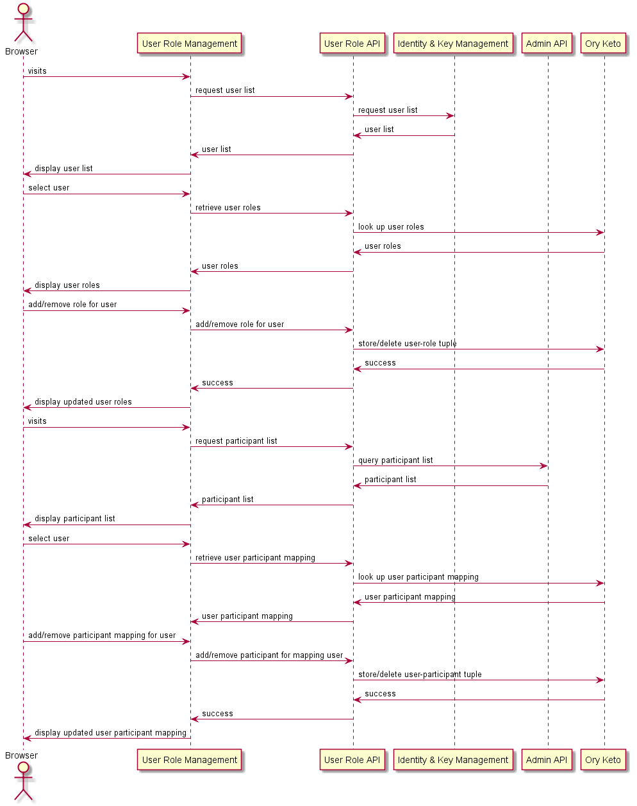
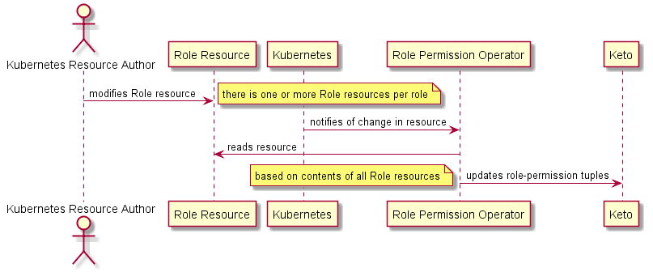

# RBAC Operational API implementation
## Introduction to RBAC Operational API implementation
The objectives of this implementation is to provide an RBAC solution to support hub operations and associated functions. This guide outlines the high-level design and explains the thinking that went into the design.

The security design:
1. implements role based access control to the current Mojaloop version
1. is compatible where possible with the reference architecture and therefore future versions of Mojaloop
1. is compatible with future Infrastructure-as-Code (IaC) deployments
1. provides activity logging that can be used in an audit

## RBAC Implementation details
1. Users are assigned one or more roles. A user may 'take on' multiple roles, subject to defined rules.
1. Roles are assigned Permissions
1. The Identity and Access Proxy (Ory Oathkeeper) enforces access to endpoints based on permission.
1. Backend API can optionally check permissions through Keto API.
1. Mutually exclusive permission sets can be defined in the system to enforce separation of duties. 

## Enforcing Maker-Checker
There are two approaches that can be taken to enforce a maker-checker validation flow.
1. Enforce using roles and mutually exclusive permissions via security policies. I.e. Makers cannot also be checkers
1. Enforce in application layer security rules; i.e. makers cannot also be checkers within the same validation process. This is often implemented in the application layer when assigning makers and/or checkers as defined in a process flow, and by enforcing that a checker cannot be the same person as the maker in a validation flow. I.e. the code that enforces this will exist within each bounded context.


::: tip RBAC responsibility
To support this functionality the RBAC system must provide:
1. the User Identifier to that bounded context.
1. A means for checking authorisation if necessary.
::: 

### Providing the User Identifier
The current configuration provides the User Identifier in the header of the API calls. 
Ory Oathkeeper is configured to use a 'header' mutator. This 'header' mutator will transform the request, allowing you to pass the credentials to the upstream application via the headers. For example the API backends will get the following header in the http requests.
```
X-User: wso2-uuid
```

It is worth pointing out that JWT 'id_token' are also easily supported my modifying the Ory Oathkeeper mutator configuration. The 'id_token' mutator takes the authentication information (e.g. subject) and transforms it to a signed JSON Web Token, and more specifically to an OpenID Connect ID Token. The API backends can verify the token by fetching the (public) key from the /.well-known/jwks.json endpoint provided by the Ory Oathkeeper API.

### Checking authorisation
All authorisation information is maintained within Ory Keto. Ory Keto has a standard API that can be called to check authorisation. 
I.e. It answers the question: *'Does this user identifier token have this permission?'*

## Tools / standards chosen
Here is a list of standard tools that have been chosen to implement the design.
1. **Ory Oathkeeper** 
Will be used as the Identity and Access Proxy (IAP) that will check authentication and authorization before providing access to functional endpoints, that is, it will be used to enforce the access control.
2. **Ory Keto** 
Will check authorization via subject-role and role-permission mappings. It uses a flexible object-, relationship-, and subject structure pioneered at Google that can model many authorization schemes, including Role Based Access Control (RBAC).
3. **Ory Kratos** 
Will use Ory Kratos to create and manage the cookie authorization object.
4. **OpenID Connect** 
Is the standard that has been chosen to interact with an identity management system. This is a widely supported standard, and is compatible with all the tools currently in use in the Mojaloop community, that is, WSO2 Identity Server (IS), Keycloak, and Ory Kratos.

## Architecture overview
Here is a high-level architecture overview of the implementation of this RBAC Operational API onto the current Mojaloop version.



Here is a table of the services and the roles they are playing.
| Service | Owns | Implements |
| --- | --- | --- |
|**WSO2 IS KM**|Users| 1. User login redirection and UI that creates the cookie token <br>2. Standard OpenID Connect (OIDC) authorization code flow |
|**Ory Keto**|1. The roles mapped to users <br> 2. The participant mapped to users| 1. API RBAC authorization check through Ory Oathkeeper<br>2. API RBAC authorization check through operational API call|
|**Ory Oathkeeper**|The permissions related to API access | API gateway for operational APIs with authentication and authorization checks|
|**Ory Kratos**|Nothing|Authentication cookie|
|**BC Operational API**|The permissions related to the operational API calls|Operational API functions|
|**Shim**| nothing | Redirect to configure OIDC|
|**Operator Role**| Nothing | Update Keto to reflect role-permission assignment changes made in the role-resource file|
|**Kubernetes role-resource file**| The roles and the role-permission assignments| Edits of this file are controlled through a version control implementaiton (for example, GitHub or GitLab).|
|**Roles API**|Nothing|1. Role-user API controls <br>(list of users, list of roles, list of roles assigned to users, add role to user, remove role from user)<br> 2. Participant-user API controls <br>(list of users, list of participants, list of participants assigned to user, add participant to user, remove participant from user)|

## How does this design align with the reference architecture?
Let's compare this RBAC Operational API implementation to the security bounded context as defined in the reference architecture. This design differs from the reference architecture in function, purpose and approach, but where appropriate has adopted some of the design ideas. This RBAC implementation's purpose is to adds a layer for security onto the operational API's of the bounded contexts. The Reference Architecture's Security Bounded Context design has been designed to accommodate for the performance requirements of the critical transactional functions of Mojaloop. 
Here are the high level areas where these designs diverge:
1. The authorisation functions are centralised in this RBAC implementation. The reference architecture design requires a distributed authorisation that is implemented in each bounded context independently. This extra level of complexity is unnecessary for the operational API use case.
1. The reference architecture design requires interfaces to other bounded contexts to initiate the distributed authorisation functionality. These have not been built for the reason that there are no components that exist that could consume these interfaces. 
1. The reference architecture requires the security BC to generate it's own security tokens. This RBAC implementation uses the tokens that are generated by the IAM.
1. The reference architecture requires the permissions to be distributed through the JWT to each bounded context. This is possible to configure in the current toolset, but was not. The reason being that some security experts consider this distribution of user permission sets a security vulnerability, and it was not a requirement for this current RBAC implementation.

There are parts of the security bounded context that have been adopted in this RBAC Operational API implementation.
1. Each Bounded context owns it's own set of permissions or privileges
1. The RBAC implementation owns all the associations of privileges to users.
1. The user Role Permissions are structured so that they are easily distributed within a Kubernetes cluster.

## Alignment with IaC 4.xxx
Here is a diagram illustrating how the high-level architecture would look if this RBAC Operational API implementation design was implemented on the next IaC version (IaC 4.xxx version) that uses Keycloak and Ambassador / Envoy amongst other changes.

  

## Performance characterisation of the RBAC implementation
A performance characterisation of the RBAC POC implementation was performed in order to evaluate the extent of the performance overhead that the RBAC security layer has.
::: tip In summary:
The RBAC adds 10ms overhead for each API authorisation check per call. 
If a particular API call requires and additional API based authorisation call, then the overhead is 20ms.

This typically in our test queries amounted to:
1. less than 5% for single authorisation checks (Ory Oathkeeper & Ory Keto), 
1. and less than 10% for double authorisation checks (Ory Oathkeeper & Ory Keto and an additional Ory Keto call).
:::

**Characterisation test setup details**
On the same test infrastructure, identical timed calls were made to the same backend API directly and and through the RBAC implementation.
Below are the results of the test calls made to the role API with and without RBAC, and POST Transfers API with and without RBAC. The Role API has a single authorisation check that is performed through Ory Oathkeeper that calls Ory Keto. The Transfer API is a graph QL API that has an additional RBAC

**Request Statistics**

|Method|	Name|	# Requests|	# Fails|	Average (ms)|	Min (ms)|	Max (ms)|	Average size| (bytes)	RPS|	Failures/s|
| --- | --- | --- | --- | --- | --- | --- | --- | --- | --- |
|GET|	Role API|	321|	0|	248|	221|	499|	604|	9.0|	0.0|
|GET|	Role API RBAC|	320|	0|	262|	232|	418|	604|	8.9|	0.0|
|POST|	Transfers API|	318|	0|	229|	184|	373|	4873|	8.9|	0.0|
|POST|	Transfers API RBAC|	314|	0|	240|	194|	406|	4873|	8.8|	0.0|
| | **Aggregated**|	**1273**|	**0**|	**245**|	**184**|	**499**|	**2723**|	**35.5**|	**0.0**|


**Response Time Statistics**

|Method|	Name|	50%ile (ms)|	60%ile (ms)|	70%ile (ms)|	80%ile (ms)|	90%ile (ms)|	95%ile (ms)|	99%ile (ms)|	100%ile (ms)|
| --- | --- | --- | --- | --- | --- | --- | --- | --- | --- |
|GET|	Role API|	240|	240|	240|	250|	270|	290|	400|	500|
|GET|	Role API RBAC|	250|	260|	260|	270|	290|	320|	410|	420|
|POST|	Transfers API|	220|	220|	240|	250|	290|	330|	360|	370|
|POST|	Transfers API RBAC|	230|	240|	250|	280|	310|	330|	400|	410|
| |**Aggregated**|	**240**|	**250**|	**250**|	**260**|	**290**|	**320**|	**400**|	**500**|

## Logging into the UI
This sequence diagram illustrates the events that occur when a browser attempt to access a backend API. 
- If the browser is already logged in, then the request is forwarded. 
- If the browser is not logged in, then a standard OIDC authorization flow is triggered starting with a redirect.

 

## Querying data using the BC operational API micro-frontend
The following sequence diagram shows more details regarding interactions when:
- the bearer token is valid or invalid
- authorization passes or fails

The micro-frontend is represented as a client.

 

In some cases there might be a requirement for a more detailed authorization check to be performed by the operational API. The next sequence diagram describes how that is implemented.

It is important to note that not all operational APIs will require this level of authorization, and that the Ory Oathkeeper control may or may not be required in this use case.

 

## Enforcing Seperation of Duties
This RBAC implementation supports the enforcement of separation of duties by the enforcement of mutually exclusive permissions sets. The implementation of separation of duty creates tighter security but can lead to complexity for the security administrator and the end users who use the system. Enforcing mutually exclusive permissions can reduce and help manage this complexity.

An example of mutually exclusive permissions might be a user being able to access the Finance Portal and to carry out sensitive functions such as add/withdraw funds. This user should not also have access to audit functions.

### Modelling the exclusion
This implementation models this requirements as a set of mutually exclusive permission - permission exclusions that are enforced globally. These exclusions are defined as two sets of permissions that are mutually exclusive which is intuitive and easy to maintain.

*Justification*
There are three possible ways that this exclusion could have been modelled namely:
1. Permission - Permission exclusions
1. User Role - User Role exclusions
1. User Role - Permission exclusions

Because this functionality has been added to support the segregation/separation of duties, the cleanest way of enforcing this is to have a permission pair exclusion that is globally enforced. With all the other options, there is the possibility that the exclusion can be bypassed with the addition of a new inclusive role. 

### Synthetic Roles Vs Multiple User Roles
This RBAC implementation does not implement synthetic roles, but rather uses multiple functional user roles assignments.

*Justification*
These are two methods that can be used to model RBAC permissions with mutually exclusive permissions.
1. Dynamically building up a synthetic role for each user based on rules associated with the current assigned roles and their permissions and exclusions.
1. Defining roles that are associated with user functions. Each user therefore will need to be assigned more than one role. Roles permissions are less likely to change.

The preference is to implement multiple functional roles. This is because it is much simpler to understand, maintain and support this method. Identifying the cause of a loss of permission in a synthetic role because of multiple role assignments and subsequent rule applications requires a detailed understanding of the process of how the synthetic roles are calculated and implemented. This complexity is avoided with the second option.

### Multiple user role assignments required dynamic checking of exclusions
Allowing the system administrator to assign more than one role to a user is convenient, flexible and limits the number of roles required within the organisation. This also means that it is possible to violate a mutually exclusive permission by assigning users to roles. Checking and enforcing these exclusions therefore need to be dynamic.

There are a number of places that this dynamic check needs to take place.
1. On the assignment of a role to a user
1. On the application of a new role-permission resource definition, or the application of a new security policy that may include a wholesale change of permission and role structures.
::: warning Future extension:
If it is possible that a violation can exist in the system, then each time a permission is checked, exclusion violations should also be checked. Currently this is not designed for as it is assumed that 1 & 2 are sufficiently implemented that a violation cannot exist.
It is recommended that this additional check be roadmapped for future extensions as this would ensure that no back-door override can be made to violate this separation of duties.
:::

::: tip Note: 
The change control release and testing on lower environments may not catch these violations. Testing for these violations cannot be done on lower environments without first making sure that the user access control is identical in the lower environments which is normally not the case.
:::

**Keto relation**
Introduction of a relation that relates two permissions that cannot be held together.
```
“permission:X excludes permission:Y#allowed”
```

**Permission Exclusion Custom Resource Definition**
A permission exclusion custom resources are consumed by the Role Permission Controller, which will upload the  exclusions into Keto using this relation. Each will contain two sets of permissions, and holding any permission in one set will mean no permission in the other set can be held. This allows for many flexible scenarios, and the simplest scenario of “any person who can do this one thing cannot do this other thing, and vice versa” remains simple to express.

**Role Permission Operator API Validation Check**
The Role Permission Resource Controller will provide an API that can be used to check a security permission update’s allowability before it is applied. That API will take a proposed change to a particular Role Permission resource and calculate whether or not any existing users would have mutually exclusive permissions after that change, returning the result. This API will be usable by the administrative UI and CI systems to “preflight” changes for likely problems.

**Role Permission Operator Change Enforcement**
When a role-permission resource is changed, the role-permission operator will first lock the ability to change user role assignments, then perform the same check as the validation API does, and if the resource does not pass the check it will not accept the changes from that resource, instead maintaining the current role permission assignments, and surfacing the issue as an error in the kubernetes API for instrumentation and alerting.

**Conflict Check on User Role Assignment**
When a user is assigned a role, the user role assignment API will validate that the change does not result in the user having two mutually excluded permissions. If it does, the change will be rejected and an error returned.

## Assigning roles and participant access to users
This functionality is implemented in the Roles API service. The following sequence diagram describes how the user role and user participation access is queried and modified through the Roles API. 
 

### Roles API
The following table provides a summary of Roles API resources.

|Category|HTTP method|Endpoint| Description|Error codes|
| --- | --- | --- | --- | --- |
|**HEALTH**| | | | |
| | GET | /health | Used to return the current status of the API | 400, 401, 403, 404, 405, 406, 501, 503 |
| | GET | /metrics | Used to return metrics for the API | 400, 401, 403, 404, 405, 406, 501, 503|
|**PARTICIPANTS**| | | | |
| | GET | /participants | Used to return a list of participant IDs | 400, 401, 403, 404, 405, 406, 501, 503|
|**ROLES**| | | | |
| | GET | /roles | Used to return a list of role IDs |400, 401, 403, 404, 405, 406, 501, 503 |
|**USERS**| | | | |
| | GET | /users | Used to return a list of user IDs | 400, 401, 403, 404, 405, 406, 501, 503|
| | GET | /users/{ID} |  Used to return a specifc user |400, 401, 403, 404, 405, 406, 501, 503 |
| | GET | /users/{ID}/participants | Used to return a list of participants assigned to a user |400, 401, 403, 404, 405, 406, 501, 503|
| | PATCH | /users/{ID}/participants | Used to assign a participant to a user | 400, 401, 403, 404, 405, 406, 501, 503|
| | GET | /users/{ID}/roles | Used to return a list of roles assigned to a user|400, 401, 403, 404, 405, 406, 501, 503 |
| | PATCH | /users/{ID}/roles | Used to assign a role to a user|400, 401, 403, 404, 405, 406, 501, 503 |


The detailed specification of the Roles API can be found [here](https://docs.mojaloop.io/role-assignment-service/
).
The GitHub repository of the role assignment service can be found [here](https://github.com/mojaloop/role-assignment-service).

## Assigning permissions to roles & mutually exclusive permission sets
The permission to role assignment is stored in a `.yml` file that we are calling a role-resource file (`roleresource.yml`). 
Access and changes to these role-resource files will be managed through a hosted version control solution like GitHub or GitLab. This is convenient as this keeps a full history of changes and has configurable automatic and manual control points.
These role-resource files are mapped as Kubernetes custom resource definitions (CRDs) to which a role-permission operator subscribes. Changes to the role-resource files trigger the role-permission operator to update Ory Keto with the corresponding appropriate change. A role can be represented by more than one file if necessary.

There are two types of role resource files, the first contains the role permission assignments and the second the mutually exclusive permission sets.

Here is an example of a permission assignment role-resource file:
```yml
apiVersion: "mojaloop.io/v1"
kind: MojaloopRole
metadata:
  name: arbitrary-name-here
spec:
  # must match what is used in Keto, whatever that is
  role: RoleIdentifier
  permissions:
  - permission_01
  - permission_02
  - permission_03
  - permission_04'
```
The following sequence diagram illustrates how Ory Keto is updated.



## Ory Keto – implementation detail
Ory Keto in this design is the tool that implements the logic of whether a login token has the correct authorization to access an aspect of the system, that is, it is used to enforce RBAC. There are three parts to how this is implemented in Keto:
1. The assignment of roles to users.
This functionality will be maintained and updated from the Roles API module, which will call and update Keto accordingly.
2. The assignment of participant access to a user. 
This refers to the DFSP access reports that must only be provided for the configured participants.
This functionality will also be maintained via the Roles API module, which will call and update Keto accordingly. 
3. The assignment of permissions or privileges to roles. 
This will be controlled through the edits of a GitHub `roleresource.yml` file. The Kubernetes role-permission operator is the service that will monitor these role-resource files, and update Keto to affect the assignments.

### Adding roles and participant access to users in Keto
The user list (which includes both people and service accounts) will be retrieved from WSO2 Identity Server, and the participant list from the existing API for that purpose. In both cases, a durable permanent identifier should be what is then used as part of the Keto calls.

The list of roles will be hardcoded, and every role should be given a unique short identifier that is human readable and writeable, as well as a name. The UI should display both the identifier and the name, since the identifier will be needed for use in the role-permission operator.

There will be two Keto namespaces used for calls: role and participant. The Keto tuples used will be: 
```
role:ROLEID#member@USERID and participant:PARTICIPANTID#member@USERID 
```
(using the notation used for [Keto/Zanzibar](https://www.ory.sh/keto/docs/concepts/relation-tuples)

The reuse of the relation `"member"` is not an issue, each relation is namespace-specific. If there is a preferred term for the participant-user relationship other than `"member"`, that word can be used instead, and should be documented here.

To retrieve the role or participant list for a particular user, the [Query Relation Tuples API](https://www.ory.sh/keto/docs/reference/rest-api#query-relation-tuples) will be used, and the namespace, relation, and subject provided as parameters. This will provide a list of tuples in the response, with a next page token if there are additional results, and the identifiers for the participants or roles can be read from the resulting tuples.

When a role or participant is added or removed for a user, the [create](https://www.ory.sh/keto/docs/reference/rest-api#create-a-relation-tuple) and [delete](https://www.ory.sh/keto/docs/reference/rest-api#delete-a-relation-tuple) relation tuple calls can be used, since only a single tuple is involved at a time. If the call fails, but the failure is not an HTTP 4xx, it should be retried a couple of times.

Here is an example of the Keto API call used to add roles to users.
::: tip Example: Assign role to user in Ory Keto
PATCH /relation-tuples HTTP/1.1
Content-Type: application/json
Accept: application/json
:::

```json 
[
  {
    "action": "insert",
    "relation_tuple": {
    "namespace": "role",
    "object": "RoleIdentifier",
    "relation": "member",
    "subject": "userIdentifier"
    }
  }
]
```
On success, an HTTP 204 message is returned with no content.

::: tip NOTE
We use `"member"` as the `"relation"` in our current implementation.
We use `PATCH` instead of `PUT` since `PATCH` works as a bulk create and/or delete.
:::

### Adding permissions or privileges to roles in Keto
Adding permissions or privileges to roles in KetoThis will be done via a Kubernetes operator for a Custom Resource Definition [(CRD)](https://kubernetes.io/docs/tasks/extend-kubernetes/custom-resources/_print/). The operator could be implemented in most any language. Existing ModusBox operator expertise is mostly based around `kopf`, a Python framework, but there are options in Go and Node as well (and others).

The operator should maintain a memory of all resources it manages, grouped by role. [Kopf's indexing](https://kopf.readthedocs.io/en/latest/indexing/) functionality is ideal for this. 

When a role resource is changed, the list of permissions for that role across all role resources should be compiled, and a change sent through the Keto Patch [Multiple Relation Tuples API](https://www.ory.sh/keto/docs/reference/rest-api#patch-multiple-relation-tuples) using the patch actions `insert` and `delete`. It is necessary to take all role resources into account, because there may be multiple resources for one role, and more than one may include the same permission, so deleting a role resource that maps Role X to Permission P does not necessarily mean that the Keto tuple for that role-permission connection needs to be deleted, since there may still be another role resource mapping Role X to Permission P.

The Keto tuples will be of the form: 
```
permission:PERMISSIONID#granted@role:ROLEID#member
```

The specific operations on resource change are as follows:

1. Retrieve current permissions granted for role using the [Query Relation Tuples API](https://www.ory.sh/keto/docs/reference/rest-api/#query-relation-tuples).
2. Based on stored index of roles to permissions, compute a diff from the retrieved list.
3. Execute patch from diff.
4. If there are problems, throw an exception so the problem will log and a re-sync will be attempted later.


Here is an example of the Keto API call used to add permissions to roles.
::: tip Example: Assign permission/privilege to a role in Ory Keto
PATCH /relation-tuples HTTP/1.1
Content-Type: application/json
Accept: application/json
:::

```json
[
  {
  "action": "insert",
  "relation_tuple": {
    "namespace": "permission",
    "object": "permissionIdentifier",
    "relation": "granted",
    "subject": "role:x#member"
  }
  }
]
```
On success, an HTTP 204 message is returned with no content.

::: tip NOTE
We use `"granted"` as the `"relation"` in our current implementation.
We use `PATCH` instead of `PUT` since `PATCH` works as a bulk create and/or delete.
:::

### Adding mutually exclusive permisions to Keto
The mutually exclusive permission sets are also maintained and modelled in Keto using the 'excludes' relation.
Relation that relates two permissions that cannot be held together are represented with exclusion tuples:
```
“permission:X excludes permission:Y#allowed”
```

::: tip NOTE
We use `"excludes"` as the `"relation"` to define mutually exclusive permissions.
:::

### Calling the standard Keto API to check authorization
Checking to see if a user has authorization for a privilege or permission is managed by th API gateway, and if necessary can be checked by each bounded context.

Here is an example of the Keto API call used to check for a user's authorization based on a permission/privilege.
::: tip Example: Checking for authorization in Ory Keto
POST /check HTTP/1.1
Content-Type: application/json
Accept: application/json
:::
```json
{
  "namespace": "permission",
  "object": "PermissionIdentifier",
  "relation": "granted",
  "subject": "UserIdentifier"
}
```
Here is the response that comes back:
```json
{
"allowed": true/false
}
```
::: tip Note:
Mutally excluded permissions don't need to be check excplicitly through a Keto call because the system is maintained in such a way that role-permission assignments can only be defined if mutually exclusive permission sets are not violated.
:::

## Ory Oathkeeper – implementation detail
### Configuring Ory Oathkeeper for BizOps

[ORY Oathkeeper](https://www.ory.sh/oathkeeper/docs/next/) authorizes incoming HTTP requests. It can be the Policy Enforcement Point in your cloud architecture, that is, a reverse proxy in front of your upstream API or web server that rejects unauthorized requests and forwards authorized ones to your server. If you want to use another API Gateway (Kong, Nginx, Envoy, AWS API Gateway, and so on), Ory Oathkeeper can also plug into that and act as its Policy Decision Point.


The Ory Oathkeeper Helm chart is described at [ORY Oathkeeper Helm Chart | k8s](https://k8s.ory.sh/helm/oathkeeper.html) and defined in [k8s/helm/charts/oathkeeper at master · ory/k8s · GitHub](https://github.com/ory/k8s/tree/master/helm/charts/oathkeeper). The Ory Helm repository is documented at [ORY Helm Charts | k8s](https://k8s.ory.sh/helm/). The Ory Oathkeeper configuration reference is at [Configuration | ORY Oathkeeper](https://www.ory.sh/oathkeeper/docs/reference/configuration) but note that the Helm chart values have different ways of doing certain things. Also, every configuration value can be overridden with environment variables. 


The Ory Oathkeeper Helm chart deploys two key components into Kubernetes: Ory Oathkeeper itself, and the Ory Oathkeeper Maester. Ory Oathkeeper is stateless and config-driven, and seamlessly reloads itself with zero downtime, anytime that config changes. Ory Oathkeeper Maester is a controller for the Rule CRD, and composes the Rule objects in Kubernetes into a single complete rules file that is loaded by Ory Oathkeeper.  By default, that is a ConfigMap that Ory Oathkeeper mounts, but it can also be set to run as a sidecar and use a shared mount.


Ory Oathkeeper exposes two ports as two services. One service is the API service, and the other is the Proxy service. Long-term, we will be using the API service, which will be queried by the next generation API Gateway using the Access Control Decision API  (see [REST API | ORY Oathkeeper](https://www.ory.sh/oathkeeper/docs/reference/api/#access-control-decision-api) ) that Ory Oathkeeper provides, but for now we will be using the Proxy service, and exposing that via Ingress. External URLs to services protected by Ory Oathkeeper will be pointed at the Ory Oathkeeper Proxy ingress, which will then proxy access to the internal services at those URLs and apply access control rules.


Ory Oathkeeper will be configured to generate and sign a JSON Web Token (JWT) containing claims that internal services can check and verify by pointing at the JSON Web Key Set (JWKS) that Ory Oathkeeper will publish (which is part of the configuration) at the well-known URL for JWKS on the API service (see [REST API | ORY Oathkeeper](https://www.ory.sh/oathkeeper/docs/reference/api/#lists-cryptographic-keys) ). If a service does this, then it is operating under a basic zero trust regime, as it will not be possible to call that service except with a token that has been generated by Ory Oathkeeper, and Ory Oathkeeper will only generate a token if the access rules for the given URL allow access.


### Debugging
The responses and logs from Ory Oathkeeper tend to be pretty informative, so start there. Make sure you are looking at the logs for the request that matters. Ory Oathkeeper will also be logging health checks and similar. 


Some possible debugging actions that have been found useful in different circumstances:


* Make a match much more permissive (replacing the entire piece beginning with `<.*>` and then having the minimum currently unique suffix is good).

* Double-check that each internal URL is the proper internal URL by checking it is accessible inside the cluster with curl.

* Look at the identity provider (IdP) logs.

* Make sure that the domains and ports for introspection and the external token endpoint are identical. Keycloak at least does not like it if they are not.

* Point the Ory Oathkeeper rule at https://httpbin.org/, usually the `/anything` path prefix which will reflect back everything it gets, making it easy to see what the service will see.


### Components required in addition to a Helm chart

The following pieces will be needed in addition to the Helm chart:

* a JWKS secret
* annotated Helm values


#### JWKS secret


A secret should be created with key `mutator.id_token.jwks.json` and the value of a JWKS suitable for use with Ory Oathkeeper. An initial one can be generated as described in [Configure and Deploy | ORY Oathkeeper](https://www.ory.sh/oathkeeper/docs/configure-deploy#cryptographic-keys). It will contain both public and private keys.


##### Operating with the JWKS secret


To rotate the secret, apply the following procedure:

0. Note the time.
1. Add a public and private key pair to the beginning of the array in the JWKS (make sure all public JWKs have a specified unique `kid`) in the secret. All keys other than the new keys and the previous first public and private keys can be removed. This is because Ory Oathkeeper always signs with the first key.
2. Wait until all requests that Ory Oathkeeper might have received and authorized would have had their JWT handled by the backend service. The main delay here is the time for the secret update to propagate, comprising the delay of the secret manager to the updated secret and the delay of the secret to the updated volume, which is probably at most a minute or two, so wait that long after the time in step 0.
3. If the old secret is being removed (this is only necessary if a breach is suspected, otherwise step 1 is sufficient for periodic key rotation), remove it now.

#### Annotated Helm values


Several places will need to be changed to the rest-of-deployment-specific URLs or other values. Those places are described in the comments in the example below, as well as other commentary.

How to setup the Proxy ingress is undecided at the time, as it will need to change when the solution is added to the IaC 3.xxx so that area of the config is still unspecified. This leaves the ingress out by default. Changing `ingress.proxy.enabled` to `true` will enable the proxy ingress. See the linked pages at the beginning for options  available for the built-in ingress configuration.

If TLS needs to be terminated at Ory Oathkeeper, see the `tls` sections in the [config documentation](https://www.ory.sh/oathkeeper/docs/reference/configuration), and combine that with secrets and the `deployment.extraVolumes` and `deployment.extraVolumeMounts` values.
Prometheus is at `:9000/metrics` by default, if that is in use.


```yaml

oathkeeper:
  config:
    log:
    # the maximum log level, we'll stick here or maybe debug if this is overwhelming until the config is verified
    # then, we'll determine what log level to set based on needs
    level: trace
    access_rules:
      matching_strategy: regexp
    authenticators:
      cookie_session:
        enabled: true
        config:
          # this should be the internal URL of the public Kratos service's whoami endpoint, which might look like the below
          check_session_url: http://kratos-public/sessions/whoami
          preserve_path: true
          # this means we automatically sweep up all the metadata kratos provides for use
          # in, for example, the JWT, if we ever have more
          extra_from: "@this"
          # kratos will be configured to put the subject from the IdP here
          subject_from: "identity.id"
          only:
          - ory_kratos_session
      oauth2_introspection:
        enabled: true
        config:
          introspection_url: https://whatever/the/wso2/url/is/oauth2/introspect
          introspection_request_headers:
          # see https://is.docs.wso2.com/en/latest/learn/invoke-the-oauth-introspection-endpoint/ for what credentials
          # will need to be configured here
          # also, this does not seem to be settable via environment variable, which means it is 
          authorization: "Basic SOME WORKING AUTH HERE"
          cache:
            # disabled to make debugging easier. enable for caching.
            enabled: false
            ttl: "60s"
    authorizers:
      remote_json:
        enabled: true
        config:
          # the check URL for Keto. This will be POST'd to. See https://www.ory.sh/keto/docs/reference/rest-api#operation/postCheck
          remote: http://internal-keto-url-here/check
    mutators:
      id_token:
        enabled: true
        config:
          # this should be the internal base URL for the API service, which will look something like the below
          issuer_url: http://whatever-oathkeeper-internal-is-api:4456/
    errors:
      fallback:
        - json
      handlers:
        json:
        # this gives API clients pretty error JSON
        enabled: true
        config:
          verbose: true
          redirect:
        enabled: true
        config:
          # set this to whatever the main URL is, it'll ensure that browser errors redirect there
          to: https://whatever-external-main-url-is/
          when:
          - error:
            - unauthorized
            - forbidden
            request: 
            header:
              accept:
              - text/html
secret:
  # without this we would need to put the JWKS in the config, which would mean we couldn't rotate it just by changing the secret
  manage: false
  # change to whatever is used for secret name
  name: oathkeeper-jwks
deployment:
  extraEnv:
    # for whatever reason this environment variable only gets set if the JWKS is in the config even though the rest of the secret mounting
    # and such still happens
    - name: MUTATORS_ID_TOKEN_CONFIG_JWKS_URL
    value: file:///etc/secrets/mutator.id_token.jwks.json


```

### Rules

Rule resources will need to be created in Kubernetes for each backend "match" (URL regex plus HTTP method(s)) protected with a permission. The example provided below provides guidance.


As the flexibility to define third-party services and bounded contexts increases, they can define their own rules (perhaps behind a Helm values flag), which express which permissions should be required for which URLs. 


The biggest potential issue here is that each match MUST be unique. If a request matches multiple, Ory Oathkeeper will complain. Once a general pattern is picked that results in unique regexes, this will not happen except with user error.

```yaml

apiVersion: oathkeeper.ory.sh/v1alpha1
kind: Rule
metadata:
  name: a-unique-name
spec:
  version: v0.36.0-beta.4
  upstream:
    # set to whatever URL this request should be forwarded to
    url: http://internal-url-of-backend-service/
  match:
    # this might need to be http even if external is https, it depends on how ingress does things
    # my recommendation is to have a given prefix, then the "everything else in the domain name" matcher
    # so it doesn't need to be changed when the config is moved between various main domains
    # then whatever is needed for the specific path (this is set to match all subpaths)
    # regexes go in between angle brackets
    url: https://example.<[^/]*>/<.*>
    methods:
    # whatever method(s) this rule applies to
    - GET
  authenticators:
    - handler: oauth2_introspection
    # comment out this second one to not allow browser-cookie access
    - handler: cookie_session
  authorizer:
    handler: remote_json
    config:
      # these will generally be identical for all rules,
      # except "object" will be changed to the permission ID that is relevant for
      # this URL
      payload: |
      {
        "namespace": "permission",
        "object": "PERMISSION IDENTIFIER HERE",
        "relation": "granted",
        "subject_id": "{{ print .Subject }}"
      }
  mutators:
    # change this to an empty array if the id_token isn't needed, if you want
    - handler: id_token

```
### Configure Ory Oathkeeper to use Kratos as its cookie Authenticator
This part of the config above is applicable. Reference documentation for Ory Oathkeeper authenticators is found [here](https://www.ory.sh/oathkeeper/docs/next/pipeline/authn).

```yaml
    authenticators:
      cookie_session:
        enabled: true
        config:
          # this should be the internal URL of the public Kratos service's whoami endpoint, which might look like the below
          check_session_url: http://kratos-public/sessions/whoami
          preserve_path: true
          # this means we automatically sweep up all the metadata kratos provides for use
          # in, for example, the JWT, if we ever have more
          extra_from: "@this"
          # kratos will be configured to put the subject from the IdP here
          subject_from: "identity.id"
          only:
          - ory_kratos_session

```

### Configure Ory Oathkeeper to use WSO2 ISKM for token introspection
Reference documentation is found [here](https://www.ory.sh/oathkeeper/docs/next/pipeline/authn).

```yaml
      oauth2_introspection:
        enabled: true
        config:
          introspection_url: https://whatever/the/wso2/url/is/oauth2/introspect
          introspection_request_headers:
          # see https://is.docs.wso2.com/en/latest/learn/invoke-the-oauth-introspection-endpoint/ for what credentials
          # will need to be configured here
          # also, this does not seem to be settable via environment variable, which means it is 
          authorization: "Basic SOME WORKING AUTH HERE"
          cache:
            # disabled to make debugging easier. enable for caching.
            enabled: false
            ttl: "60s"
```

### Configure Ory Oathkeeper to use Ory Keto as its authorizer
This part of the config above is applicable.
Reference documentation about Ory Oathkeeper authorizers is found [here](https://www.ory.sh/oathkeeper/docs/next/pipeline/authz).

```yaml
    authorizers:
      remote_json:
        enabled: true
        config:
          # the check URL for Keto. This will be POST'd to. See https://www.ory.sh/keto/docs/reference/rest-api#operation/postCheck
          remote: http://internal-keto-url-here/check

```

## Ory Kratos – implementation detail
 
Ory Kratos is the part of the Ory Implementation suite that manages all the authentication flows.
It is highly configurable and can connect to a variety and multiple of authentication systems and flows. The [Kratos Documentation](https://www.ory.sh/kratos/docs/next/) explain the extent of the configuration well. I.e. it is likely to cater for your requirements.
In this workstream project, only the User Login and logout flow are required and implemented. 
It is useful to know that Kratos can also provided flows for: 
- **Self-service Login and Registration:** Allow end-users to create and sign into accounts (we call them identities) using Username / Email and password combinations, Social Sign In ("Sign in with Google, GitHub"), Passwordless flows, and others.
- **Multi-Factor Authentication (MFA/2FA):** Support protocols such as TOTP (RFC 6238 and IETF RFC 4226 - better known as Google Authenticator)
- **Account Verification:** Verify that an E-Mail address, phone number, or physical address actually belong to that identity.
- **Account Recovery:** Recover access using "Forgot Password" flows, Security Codes (in case of MFA device loss), etc.
- **Profile and Account Management:** Update passwords, personal details, email addresses, linked social profiles using secure flows.
- **Admin APIs:** Import, update, delete identities.
... that may become important in future version of the IaC deployment designs.
  

### Deployment details
The Kratos Helm Chart is described at [ORY Kratos Helm Chart | k8s](https://k8s.ory.sh/helm/kratos.html) and defined at [k8s/helm/charts/kratos at master · ory/k8s · GitHub](https://github.com/ory/k8s/tree/master/helm/charts/kratos). Unlike Ory Oathkeeper, it does not have any related Maester handling a CRD. It does, however, need a database (which can be MySQL, PostgreSQL, CockroachDB, or a few others). The Helm repository is the same as for Ory Oathkeeper, and documented at [ORY Helm Charts | k8s](https://k8s.ory.sh/helm/). A configuration reference is at [Configuration | Ory Kratos](https://www.ory.sh/kratos/docs/reference/configuration), but note that the Helm chart works slightly differently.


In addition to a database, the other major difference for Kratos is that it requires a user interface, in the form of a small web application that handles rendering the current stage of what’s happening with Kratos to the browser and also doing the necessary backend communication to make that happen securely. In our case, the UI we’ll use is very simple, and is never actually visible—all it will do is immediately forward to the one OIDC Identity Provider (IdP) we’ll have configured and receive the related callback. This UI application has already been created and open sourced in the `modusbox` repository, and releases public docker images in the GitHub docker registry. The UI can be found at [GitHub - modusbox/kratos-ui-oidcer: A Kratos UI for forwarding immediately to a single configured OIDC provider](https://github.com/modusbox/kratos-ui-oidcer), and is a very minimal Rust application with excellent test coverage and a tiny docker image (about 5 megabytes, https://github.com/modusbox/kratos-ui-oidcer/pkgs/container/oidcer ). It is referred to as 'Shim' in the above design documentation.

For ease of hosting, Kratos and the UI should be mounted on separate paths on the same domain as the main user interface. Alternatively, it is possible to configure them on a different domain and configure Kratos to use cross-domain cookies. This document is written under the assumption the same-domain strategy is chosen.

### Connecting to the Main UI
A client must be created in the IdP that supports OIDC authorization code grants.  This client must be configured to redirect either to any URL under the main UI if it supports wildcards, or the specific URL for the path `/kratos/self-service/methods/oidc/callback/idp` (note that the last segment, `idp`, is the provider ID in the config, so both must change together). This client will be used in the helm chart values config.

In order to connect successfully with Kratos, the Main UI must behave as follows:

1. Make a cookies-included request to `/kratos/sessions/whoami` (documented at [HTTP API Documentation | Ory Kratos](https://www.ory.sh/kratos/docs/reference/api/#operation/toSession) ), which returns a 200 and an object containing user metadata if the user is logged in, or a 401 if they are not.
2. If the user is not logged in, either immediately redirect to or provide a link to `/kratos/self-service/registration/browser`. Note: `registration` in the URL is not a typo. This refers to registration with Kratos, which IdP users will not be initially. If the user already exists, Kratos will automatically follow the login flow instead.
3. To log out, link the user to `/kratos/self-service/browser/flows/logout`

### Annotated Helm Values
This configuration assumes the helm deployment’s name is `kratos` and, that the Kratos service is exposed at `/kratos/` on the same domain as the main UI, and that the Kratos UI is exposed at `/auth/` on the same domain as the main UI.

The Helm chart does support ingress creation, but is not covered in the documentation.

```yaml
deployment:
  extraVolumes:
  - name: extra-config
    configMap:
      name: kratos-extra-config
  extraVolumeMounts:
  - name: extra-config
    mountPath: /etc/config2
    readOnly: true
kratos:
  # NOTE: helm chart deployment does not seem to automatically pick up
  # on changes here
  identitySchemas:
    # TODO note the domain to be replaced in $id, the url doesn't need to resolve
    "identity.schema.json": |
      {
        "$id": "http://REPLACE_THIS_WITH_SOME_MEANINGFUL_DOMAIN/schema/user",
        "$schema": "http://json-schema.org/draft-07/schema#",
        "title": "A user",
        "type": "object",
        "properties": {
          "traits": {
            "type": "object",
            "properties": {
              "email": {
                "title": "E-Mail",
                "type": "string",
                "format": "email"
              },
              "subject": {
                "title": "Subject",
                "type": "string"
              },
              "name": {
                "title": "Name",
                "type": "string"
              }
            }
          }
        }
      }
  config:
    identity:
      default_schema_url: file:///etc/config/identity.schema.json
    courier:
      smtp:
        connection_uri: smtp://unused/
    # TODO the appropriate database DSN needs to go here, or be wired up via a secret and the environment variable `DSN`
    dsn: TODO DATABASE DSN HERE
    hashers:
      argon2:
        parallelism: 1
        iterations: 3
        # add resources and increase this amount,
        # if using passwords (vs oidc) in a production context
        memory: 17000
        salt_length: 16
        key_length: 32
    log:
      # TODO adjust after successful setup, likely down to info
      level: trace
    selfservice:
      flows:
        registration:
          # TODO if the place the UI goes changes, this needs to change
          ui_url: /auth/
          after:
            oidc:
              hooks:
              - hook: session
        logout:
          after:
            # TODO the IdP's logout URL should go here, with a redirect encoded into it if that's supported (might not work the same way, this is just an example)
            default_browser_return_url: https://idp.logout.url.here/logout/path?redirect_uri=https%3A%2F%2Fsomewhere.example.com%2F
      methods:
        oidc:
          enabled: true
          config:
            providers:
            - id: idp
              provider: generic
              # TODO both the client_id and client_secret need to be set appropriately to the client supporting authorization code grants with openid
              # TODO these can alternatively be set via environment variable from a k8s secret
              client_id: TODO
              client_secret: TODO
              mapper_url: file:///etc/config2/oidc.jsonnet
              # TODO this should be the right IdP URL to perform OIDC discovery on
              # If the IdP does not support discovery, auth_url and token_url can be set here instead
              # some IdPs may also need a requested_claims, see Kratos config documentation if there seems to be an issue
              issuer_url: https://some.public.idp.url.supporting.discovery/might/have/path/
              scope:
              # TODO adjust requested scope based on IdP (WSO2) documentation
              - openid
        password:
          enabled: false
      # TODO set this to the base URL of the main UI
      default_browser_return_url: "https://somewhere.example.com/"
    serve:
      public:
        # TODO set this to the base URL of the main UI plus the `/kratos` path, will need to be updated if the same-domain approach is not used
        base_url: "https://somewhere.example.com/kratos"
  autoMigrate: true
```
### JSonnet ConfigMap
In the Kratos Helm values, it references a ConfigMap `kratos-extra-config` that contains JSonnet (a configuration language) referencing how to transform the IdP’s claims into what Kratos stores about the person. That ConfigMap should contain a key `oidc.jsonnet` with the following contents:

```javascript
local claims = std.extVar('claims');

{
  identity: {
    traits: {
      email: claims.email,
      name: claims.name,
      subject: claims.sub
    },
  },
}
```

The email and subject claims will probably never need to change, but with some IdPs, the name might be provided differently, in which case that part of the JSonnet will need to be updated. The keys inside `traits` are basically arbitrary (though `subject` has some dependencies elsewhere that would need to be updated), so long as they’re also updated in the schema in the config, but the values are restricted to the list of likely claims inside an OIDC ID Token, and are described in the Kratos documentation. This will probably not come up.

### UI Deployment & Service
The service will also need to be exposed at an appropriate path, the config assumes `/auth/`, on the same domain as the main UI.

```yaml
---
apiVersion: v1
kind: Service
metadata:
  name: kratos-ui
  labels:
    app: kratos-ui
spec:
  ports:
  - name: http
    port: 80
    targetPort: http
  selector:
    app: kratos-ui

---
apiVersion: apps/v1
kind: Deployment
metadata:
  name: kratos-ui
  labels:
    app: kratos-ui
spec:
  replicas: 1
  selector:
    matchLabels:
      app: kratos-ui
  template:
    metadata:
      labels:
        app: kratos-ui
    spec:
      containers:
      - name: kratos-ui
        image: ghcr.io/modusbox/oidcer:latest
        env:
        - name: ROCKET_PORT
          value: "80"
        - name: ROCKET_REGISTRATION_ENDPOINT
          # TODO if the kratos helm chart is given a different name than kratos,
          # the domain will be different here, it should be the domain of the kratos service
          value: http://kratos-public/self-service/registration/flows
        ports:
        - name: http
          containerPort: 80
        readinessProbe:
          httpGet:
            path: /healthz
            port: 80
```
### Ory reference links
- **Configuring Login Sessions.** [docs here](https://www.ory.sh/kratos/docs/guides/login-session)
- **Configuring Session cookies.** Details of the cookies sessions [docs here](https://www.ory.sh/kratos/docs/guides/configuring-cookies)
- **Configuring Kratos for CORS.** [docs here](https://www.ory.sh/kratos/docs/guides/setting-up-cors)
- **Ory Kratos - Ory Oathkeeper integration (OIDC).** [Kratos docs here](https://www.ory.sh/kratos/docs/guides/zero-trust-iap-proxy-identity-access-proxy)
- **Ory Kratos - WSO2 OIDC integration.** [docs here](https://www.ory.sh/kratos/docs/guides/sign-in-with-github-google-facebook-linkedin)


