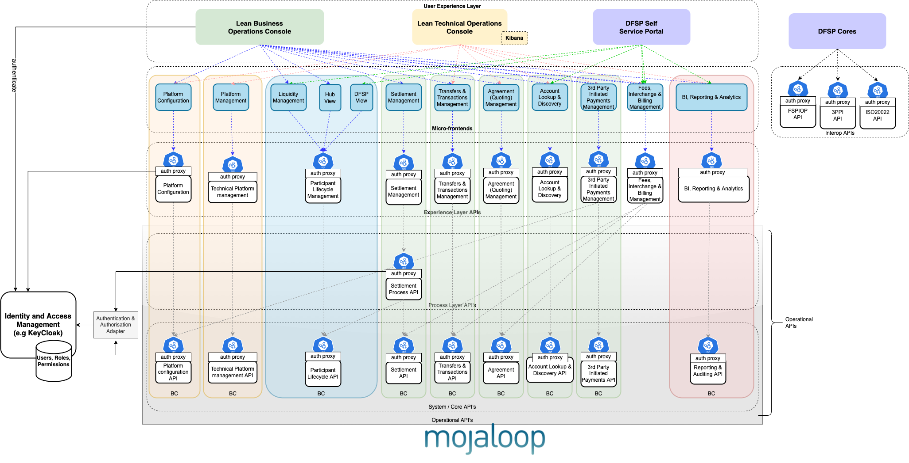
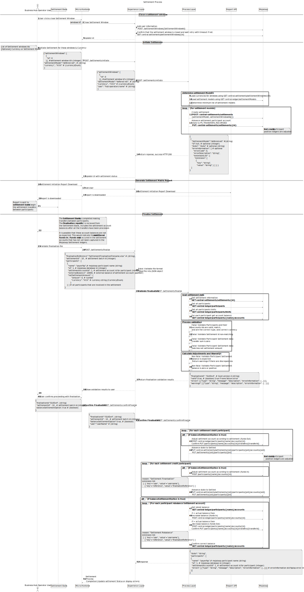
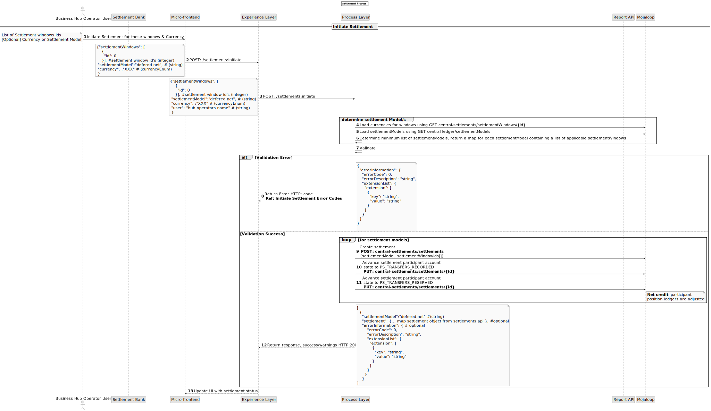
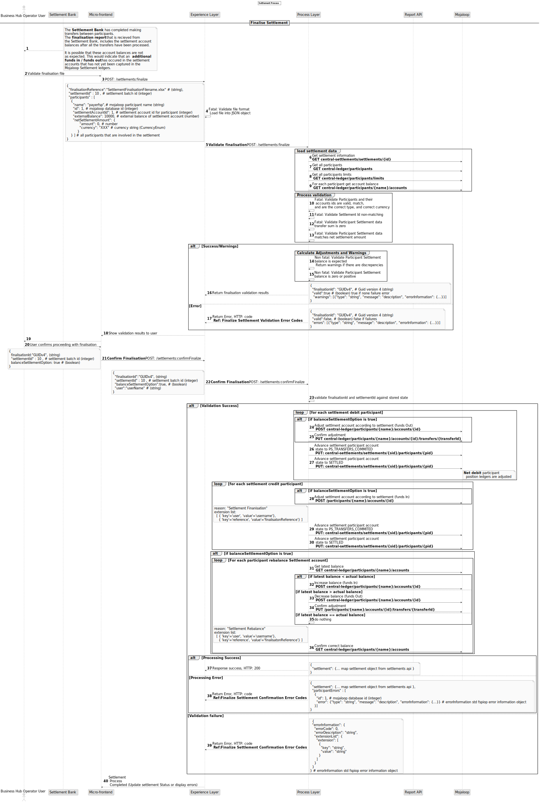

# Settlement Operational Implementation

## Introduction

The objective of this design is to provide a solution that links the business process functions with core-settlement operations on the switch.

This design is an example implementation of a Mojaloop settlement for a specific use case and is not meant to be comprehensive or cover all scenarios. This guide outlines the high-level design and explains the thinking that went into the design for a specific use-case chosen.```
Although a version of this design is built and operational, not everything in this design document has been built. 
This is an example of a settlement implementation design. The benefit of this design & design document is therefore:
- to use for demonstration; 
- to use as an initial version to help 'Getting Started Quickly';
- to use as a starting design on which improvements can be made before adopting;
- to use as a starting point to elaborate on concepts that are discussed in this design that may need to be addressed in another design.

## Core-Settlement Operations

This is the existing Settlement functionality provided by the supporting [Central-Settlement](https://github.com/mojaloop/central-settlement) Mojaloop Core component. Detailed information can be found in the [Mojaloop Technical Overview Documentation](https://github.com/mojaloop/documentation/tree/master/legacy/mojaloop-technical-overview/central-settlements).

The Core-Settlement operations support the following capabilities:

- Create a Settlement Matrix Report based on a list of Settlement-Windows
- Process Settlement Acknowledgements for an existing Settlement Matrix Report
- Manage Settlement-Windows (i.e. Create, Close, etc)
- Queries for Settlement Matrix Reports, Settlement-Windows, etc

The OpenAPI definition is available at the [Mojaloop-Specification repository](https://github.com/mojaloop/mojaloop-specification/tree/master/settlement-api).


## High-level Architecture



### Experience layer

The settlement experience layer is a stateless API that exposes the data to be consumed by its intended audience. Currently it's main function is to add the looked up user information into the API which is injected in the request headers by ORY Oathkeeper proxy. This function is expected to become larger as the product develops.

### Process layer

Process APIs provide a means of combining data and orchestrating multiple System APIs for a specific business purpose. The mojaloop central-settlement, and central-ledger API are being consumed by this process API.

The Settlement Process API should conform to the [Mojaloop naming standards](https://docs.google.com/document/d/1AZbX0UjraytFty0IWOHpyR6z35bh0-MCFG1vGKId_5M/edit?usp=sharing), and as such the following name will be used: `settlement-process-svc`.

## High-level Settlement Business Process

This is a process that relies on the existing core-settlement operations to orchestrate the following capabilities:

1. **Closing a settlement window**
The current settlement window can be closed manually as if there have been transfers linked to the settlement window. The hub operator can select the current open window, and then choose to close the window.
1. **Settlement Initiation**
Settlement Initiation is used by the hub operator to create a settlement batch which controls and drives the settlement process.
To initiate the settlement process, the hub operator selects :
   - a set of settlement windows
   - and optionally a settlement currency or a settlement model. (If a settlement currency is provided, then this is used to determine the settlement model.)
The position ledgers of the net credit participants are adjusted during Settlement Initiation.
**Note:** It is important to create the batch settlement object in the way that the settlement is to be completed and finalized.
1. A **Settlement initiation report**  is generated and used to communicated to the settlement bank the requirements of the settlement.
1. **Settlement Finalization & settlement account re-balancing**
This process needs to occur after the settlement bank has applied the settlement changes. In this step the:
   - settlement process is completed and a settlement finalization report has been received from the settlement bank.
   - the net debit participants in the settlement have their position ledgers adjusted.
   - the settlement ledgers are adjusted for all participants to match the transferred amount for the settlement.
   - the settlement ledgers are checked against the real settlement account balances and adjustments processed to ensure that they are aligned.

### Re-balancing function - is not best practice
It is worth noting that the re-balancing function that is defined in the above settlement finalization process is not the preferred or best-practice approach. 
This approach was chosen because of regulatory requirements and limitations of mechanisms available to implement settlement between participants, i.e. it was designed to work on existing in-place financial solutions. Re-balancing has quite a few drawbacks, and is not considered best practice and should be avoided if possible. 
These drawbacks are:
1. Out of sequence re-balancing results in incorrect results. This vulnerability therefore requires a business process and supportive management to enforce.
1. Reconciliation of the Mojaloop Settlement Account and the settlement bank account is difficult and complicated. This is because the re-balancing may not directly reflect the activity in the settlement bank account. The transfer amounts are linked to the timing of when the re-balancing action is applied, and when the reports and statements are generated.

**Recommended solutions**
There are numerous other approaches to implementing settlement that do follow best practice. Please consult one of the experts in the Mojaloop community if you would like to explore this. If your requirement has similar limitations and creating a new mechanism is not an option, then there is a relatively minor adjustment that can be made to improve this solution and should be considered.
Replacing re-balancing mechanism with an import of a statement from the settlement bank account's transactions would remove the timing and reconciling problems mentioned above.

## Detailed Sequence Diagram


There are a couple of processes in the sequence diagram that are worth elaborating on.

### Determining settlement Model

This need to first determine which currencies are involved in the settlement, and then determine the appropriate list of Settlement Models which should be applied. A Settlement will be created for each of these Settlement Models.

### Validation of the settlement finalization data

The data that is presented as part of the settlement finalization needs a significant amount of validations on the data.
Some validations check integrity of the data, and these check will fail the process if not passed. Other validations do not prevent the process continuing, however will show warnings that need to be presented to the operator.
The continuation of the process is only possible once the operator has accepted the confirmed warnings with their resultant effects, and has provided their selected options for how the process should be applied.
It is for this reason that the validation of the data is a necessary step, and must be referenced when accepting and proceeding with the process.

### Use cases for Finalize Settlement
**Validation scenarios**

| Validation Description                                                                            | Expected behaviour                                                                             |
|---------------------------------------------------------------------------------------------------|------------------------------------------------------------------------------------------------|
| Selected settlement ID does not match report settlement ID                                        | Abort finalization with error                                                                  |
| Sum of transfers in the report is non-zero                                                        | Abort finalization with error                                                                  |
| Transfer amount does not match net settlement amount                                              | Abort finalization with error                                                                  |
| Balance not modified corresponding to transfer amount                                             | Continue --> Adjust Settlement Account Balance to align                                        |
| Balance provided in the report is not a positive value                                            | Continue --> Set settlement balance to zero; set NCD = 0; disable participant POSITION account |
| Accounts in settlement not present in report                                                      | Abort finalization with error                                                                  |
| Accounts in report not present in settlement                                                      | Abort finalization with error                                                                  |
| Participant identifiers do not match - participant ID, account ID and participant name must match | Abort finalization with error                                                                  |
| Account type should be POSITION                                                                   | Abort finalization with error                                                                  |
| New balance amount not valid for currency                                                         | Abort finalization with error                                                                  |
| Transfer amount not valid for currency                                                            | Abort finalization with error                                                                  |
| Account ID does not exist in switch                                                               | Abort finalization with error                                                                  |
| Attempted to finalize an aborted settlement                                                       | Abort finalization with error                                                                  |
| Error processing adjustment for participant                                                       | Continue with other participants - notify user of error                                        |
| Error attempting to set settlement state to PS_TRANSFERS_RECORDED                                 | Continue with other participants - notify user of error                                        |
| Error attempting to set settlement state to PS_TRANSFERS_RESERVED                                 | Continue with other participants - notify user of error                                        |
| Error attempting to set settlement state to PS_TRANSFERS_COMMITTED                                | Continue with other participants - notify user of error                                        |
| Errors attempting to settle accounts                                                              | Continue with other participants - notify user of error                                        |
| Error attempting to set NDC                                                                       | Continue with other participants - notify user of error                                        |
| Error attempting to process funds in/out                                                          | Continue with other participants - notify user of error                                        |
| Balance unchanged after processing funds in/out                                                   | Continue with other participants - notify user of error                                        |
| Incorrect resulting balance after processing funds in/out                                         | Continue with other participants - notify user of error                                        |
| Failed to record settlement participant account state                                             | Continue with other participants - notify user of error                                        |

### Audit information in the current Mojaloop version

The process being performed is captured in the settlement reason field, and is therefore available in the audit reports.
Additionally the user and the references are captured in the extension lists. These too can be queried in the audit reports.

### RBAC

In order to make full use of the RBAC controls, the above four processes will be implemented as separate API endpoint & HTTP method combinations. This is to allow a different permissions to be associated with each process.

## Multi-currency support

Multi-currency settlement execution is determined by two factors:

1. How the Settlement Models are constructed?
  Settlement Models can be linked to a currency or left un-linked and applicable to all currencies.
1. How the settlements are initiated?
  Settlement can be initiated with optionally a currency, or optionally a settlement model.

As it is not easy to separate a settlement once it has been initiated, it is preferable to decide how settlement should be applied, and then design the system accordingly.

---
**NOTE**
Running a single currency multi-lateral deferred net settlement model, and using test currencies to perform regular platform health tests. Would prefer to have all settlements of test currencies to be created separately to the real currency. Would prefer not to have to select a currency or settlement model when initiating a settlement.
This can be achieved by creating separate settlement models I.e. one for each test currency, and one for the real currency.
The default action on initiating the settlement with transaction in both currencies, would be that separate settlements are initiated. (The determine settlement model function would find both settlement models.)
___


## Error Cases 
### Initiate Settlement

**Detailed Initiate Settlement Sequence Diagram**



**Initiate Settlement Error Codes**

| Error Description                                                      | Error Code  |  HTTP Code       | Category                                                  |
|------------------------------------------------------------------------|-------------|------------------|-----------------------------------------------------------|
| Settlement ID not found                                                | 3100        | 400              |  Request Validation Error                                 |
| Currency not valid                                                     | 3100        | 400              |  Request Validation Error                                 |
| SettlementModel not found                                              | 3100        | 400              |  Request Validation Error                                 |
| Not able to create settlement                                          | 2000        | 500              |  Internal Server Error                                    |
| Not able to update settlement state                                    | 2000        | 500              |  Internal Server Error                                    |
| Technical error while communicating with Mojaloop services             | 1000        | 500              |  Technical Error                                          |


### Finalize Settlement

**Detailed Finalize Settlement Sequence Diagram**



**Finalize Settlement Validation Error Codes**

| Error Description                                                      | Error Code  |  HTTP Code       | Category                                                  |
|------------------------------------------------------------------------|-------------|------------------|-----------------------------------------------------------|
| Settlement ID not found                                                | 3100        | 400              |  Request Validation Error                                 |
| Participant IDs not found                                              | 3000        | 400              |  Request Validation Error                                 |
| Participant Account IDs not found                                      | 3000        | 400              |  Request Validation Error                                 |
| Technical error while communicating with Mojaloop services             | 1000        | 500              |  Technical Error                                          |
| Selected settlement ID does not match report settlement ID             | 3100        | 500              |  Process Validation Error                                 |
| Participant IDs in report not matching participant IDs in settlement   | 3000        | 500              |  Process Validation Error                                 |
| Accounts in the report not matching with accounts in the settlement    | 3000        | 500              |  Process Validation Error                                 |
| Sum of transfers in the report is non-zero                             | 3100        | 500              |  Process Validation Error                                 |
| Transfer amount does not match net settlement amount                   | 3100        | 500              |  Process Validation Error                                 |
| New balance amount not valid for currency                              | 3100        | 500              |  Process Validation Error                                 |
| Transfer amount not valid for currency                                 | 3100        | 500              |  Process Validation Error                                 |
| Settlement is in ABORTED or invalid state                              | 3100        | 500              |  Process Validation Error                                 |
| Transfer amount not valid for currency                                 | 3100        | 500              |  Process Validation Error                                 |

**Finalize Settlement Confirmation Error Codes**

| Error Description                                                      | Error Code  |  HTTP Code       | Category                                                  |
|------------------------------------------------------------------------|-------------|------------------|-----------------------------------------------------------|
| Finalisation ID not found                                              | 3100        | 400              |  Request Validation Error                                 |
| Settlement ID not found                                                | 3100        | 400              |  Request Validation Error                                 |
| Technical error while communicating with Mojaloop services             | 1000        | 500              |  Technical Error                                          |
| Error while funds in/out                                               | 2001        | 500              |  Internal Server Error                                    |
| Not able to update settlement state                                    | 2001        | 500              |  Internal Server Error                                    |
| Balances not matching after settlement                                 | 2001        | 500              |  Internal Server Error                                    |
| Balances not matching after re-balancing                               | 2001        | 500              |  Internal Server Error                                    |
