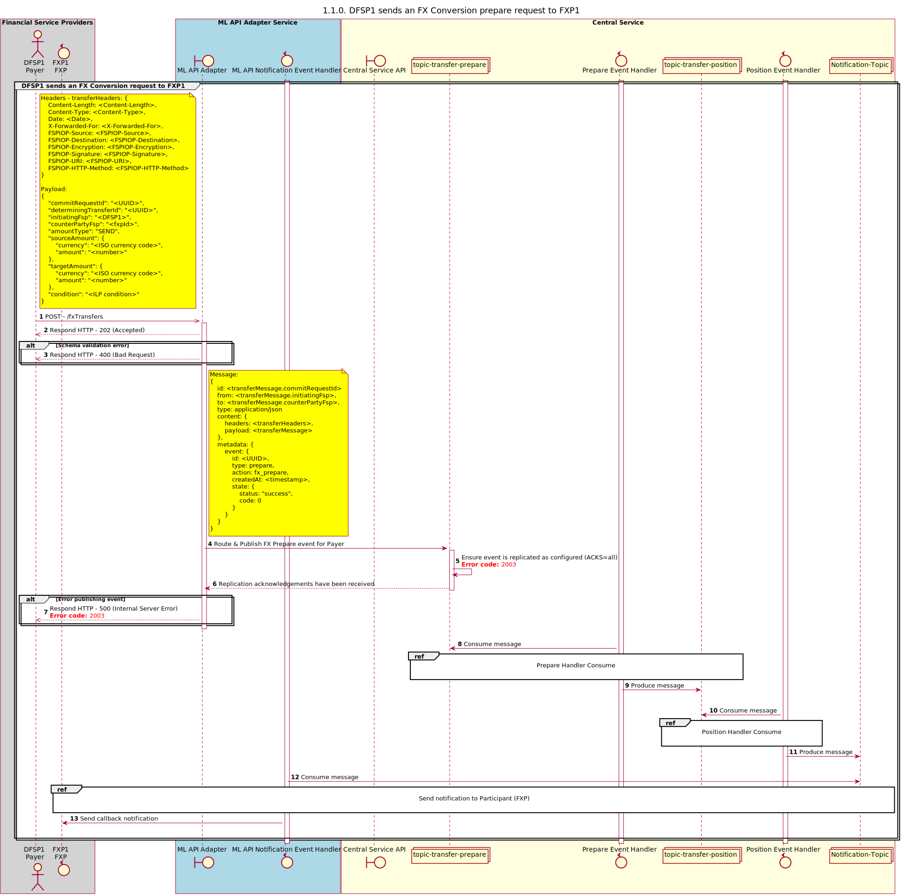

# FX Prepare Transfer Request

Sequence design diagram for FX Prepare Transfer Request process.

## References within Sequence Diagram

* [FX Prepare Handler Consume (1.1.1.a)](1.1.1.a-fx-prepare-handler-consume.md)
* [FX Position Handler Consume (1.1.2.a)](1.1.2.a-fx-position-handler-consume.md)
* [Send notification to Participant (1.1.4.a)](1.1.4.a-send-notification-to-participant-v2.0.md)

## Sequence Diagram

