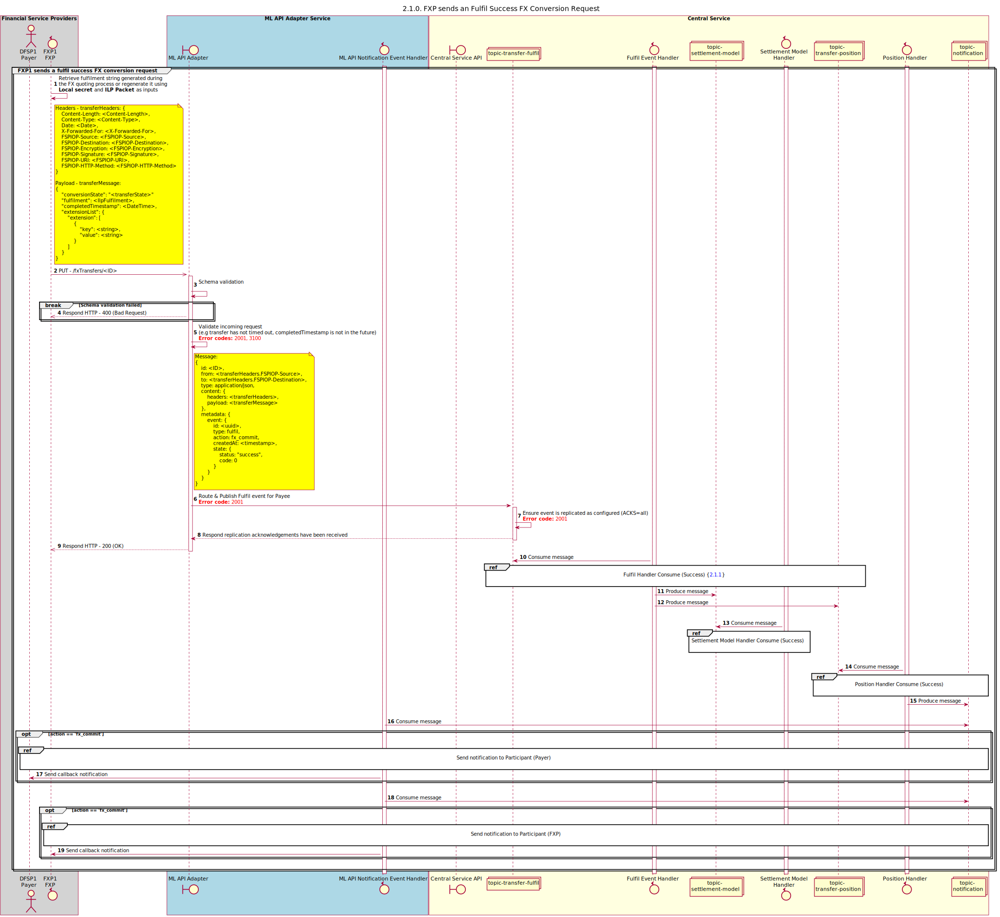

# Fulfil Transfer Request success

Sequence design diagram for the Fulfil Success Transfer request.

## References within Sequence Diagram

<!-- * [Fulfil Handler Consume (Success) (2.1.1)](2.1.1-fulfil-handler-consume.md)
* [Position Handler Consume (Success) (1.3.2)](1.3.2-fulfil-position-handler-consume.md) -->
* [Send Notification to Participant (1.1.4.a)](1.1.4.a-send-notification-to-participant-v2.0.md)

## Sequence Diagram

