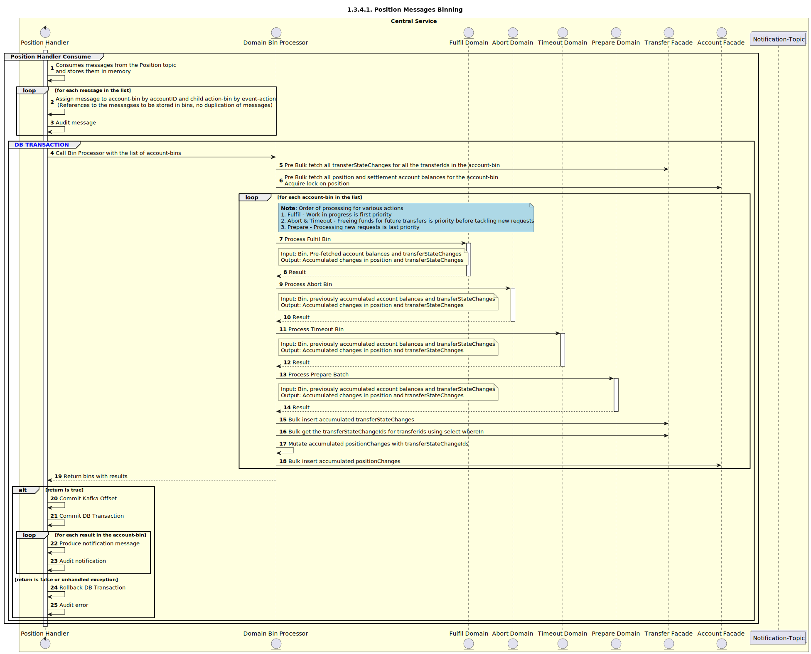

# Position Handler Consume (Batch / Bin support)

Sequence design diagram for Position Handler Consume process.

## Overview

### Algorithm
1. **Binning:**
  - The initial batch size is determined by the `batchSize` configuration
  - The consumed messages will be stored in memory
  - Assign a batch of messages into bins based on the impacted position account ID (Prepare: Payer Position Account, Fulfil: Payee Position Account) and create sub-bins based on `action`
  - Audit each message as it's assigned to a bin.
  - Note: The messages in bins should be references to the message content in memory (No duplication of message content)

2. **Handler:**
   - Start Transaction (TX) on MySQL.
   - For each bin:
     - Call the Bin Processor with the bin and TX.
     - Send and audit notifications based on the transfers result list from the Batch Processor (To Be Confirmed). Note: Batch messages can also be sent to Kafka.
   - Commit the offset.
   - End the TX (Commit TX to MySQL). Rollback is reserved for complete infrastructure failure only.

3. **Bin Processor:**
   - Input: Accepts a bin and TX to be processed
   - Output: Provides a list of transfers in either a reserved or aborted state.
   - Order:
     - Fulfil
     - Aborts and Timeouts
     - Prepare
4. Supports single message processing as well.

### Questions

- **Message Replay Prevention:** How do we ensure that we do not replay messages?

### Issues

- **Locking Issue:** The above high-level algorithm might suffer from long "locks" on the position table when Kafka messages are not pre-partitioned correctly by the position account ID. This issue applies when processing mixed messages or when the number of partitions exceeds consumers.

### Mitigation

- Ensure a sufficient number of consumers, ideally more than partitions.
- Have enough partitions to ensure unique binning (no message key hash conflicts).
- Use the correct message key when producing position events by the position account ID and the scenario (Prepare: Payer Position Account, Fulfil: Payee Position Account).

### Future Enhancements

- **Enhanced Auditing:** Support batch events auditing (e.g., audits for ingress/egress, etc).
- Messages in each bin can be sorted from smallest to largest amount.

## Sequence Diagrams
### Message Consumption and Binning

### Position-Fulfil Domain

### Position-Abort Domain

### Position-Timeout Domain

### Position-Prepare Domain
