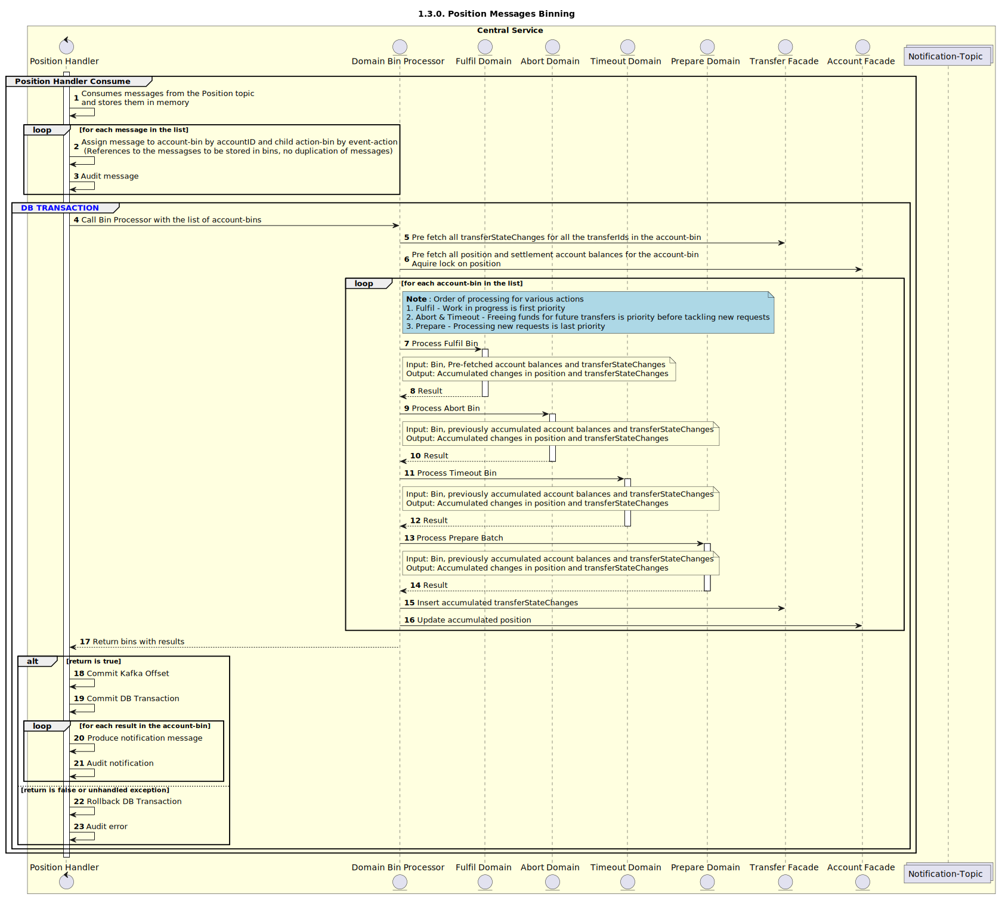

# Position Handler Consume V2 (Batch / Bin support)

Sequence design diagram for Position Handler Consume process.

## Overview

## Position-Prepare Domain

## Position-Fulfil Domain

## Position-Abort Domain

## Position-Timeout Domain
