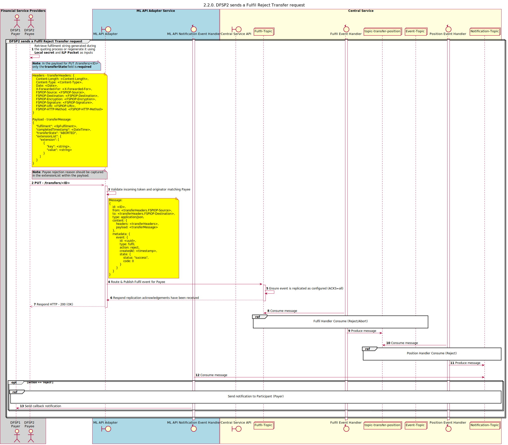

# [Outdated] Payee sends a Fulfil Reject Transfer request

Sequence design diagram for the Fulfil Reject Transfer process.

## References within Sequence Diagram

* [Fulfil Handler Consume (Reject/Abort)(2.2.1)](2.2.1-fulfil-reject-handler.md)
* [Position Handler Consume (Reject)(1.3.3)](1.3.3-abort-position-handler-consume.md)
* [Send Notification to Participant (1.1.4.a)](1.1.4.a-send-notification-to-participant-v1.1.md)

## Sequence Diagram

