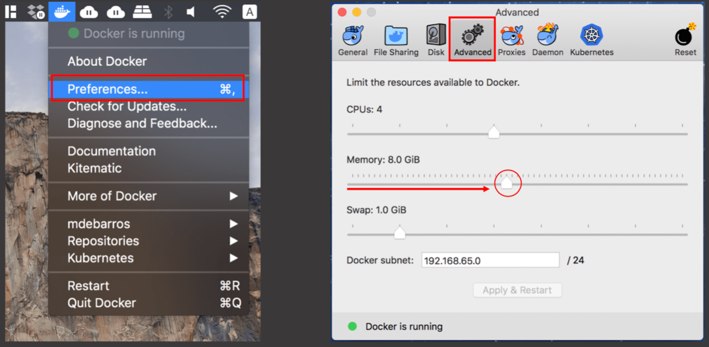
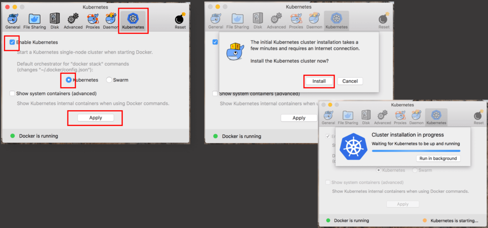

# Mojaloop local environment setup for Mac

Local setup on a Laptop or Desktop to run the Mojaloop project.

## Setup Introduction

This document will provide guidelines to a technical capable resources to setup, deploy and configure the Mojaloop applications on a local environment, utilizing Docker, Kubernetes and HELM charts.

At this point the reader/implementer should be familiar with [Mojaloop's deployment guide](./README.md). Imported information is contained in that document and as such a prerequisite to this document.

- [Mojaloop local environment setup for Mac](#mojaloop-local-environment-setup-for-mac)
  - [Setup Introduction](#setup-introduction)
  - [1. Kubernetes](#1-kubernetes)
    - [1.1. Kubernetes Installation with Docker](#11-kubernetes-installation-with-docker)
  - [2. Continue with Deployment](#2-continue-with-deployment)
  
## 1. Kubernetes

This section will guide the reader through the deployment process to setup Kubernetes within Docker.

> **RECOMMENDATIONS - Updated March 2023**
>
> We recommend installing Kubernetes using either [Minikube](https://minikube.sigs.k8s.io/docs/start) or [Microk8s](https://microk8s.io/docs/install-alternatives) instead, as this will allow you to easily specify your desired Kubernetes version.
>
> Refer to the desired matching version as specified in the [Deployment Guide (1. Pre-requisites)](README.md#1-pre-requisites).
>
> Otherwise determine the specific version of Docker Desktop with the desired target Kubernetes version by examining the [Docker Desktop release-notes](https://docs.docker.com/desktop/release-notes).
>
> **DEPLOYMENT TROUBLESHOOTING - Updated March 2023**
>
> If you plan to install Mojaloop `v13.x` - `v14.0.x` using Docker Desktop, then refer to the [Deployment Troubleshooting - Docker Desktop Kubernetes support for Mojaloop v13.x - v14.0.x](./deployment-troubleshooting.md#13-docker-desktop-kubernetes-support-for-mojaloop-v13x---v140x) known issue for guidance.
>

### 1.1. Kubernetes Installation with Docker

1. Kubectl

  Complete set of **kubectl** installation instruction are available [here](https://kubernetes.io/docs/tasks/tools/install-kubectl/).

  ```bash
  brew install kubernetes-cli
  ```

  To verify if the installation was successful, check the version;

  ```bash
  kubectl version
  ```

2. To install Kubernetes with Docker, follow the steps below;

- Click on the Docker icon on the status bar
  - Select **Preferences**
  - Go to **Advanced**
    - Increase the CPU allocation to at least 4
    - Increase the Memory allocation to at least 8.0 GiB

  

- Go to **Kubernetes**
  - Select **Enable Kubernetes** tick box
  - Make sure **Kubernetes** is selected
  - Click **Apply**
  - Click **Install** on the confirmation tab.
  - The option is available to wait for completion or run as a background task.

  

### 1.2. Kubernetes environment setup

1. List the current Kubernetes context;

  ```bash
  kubectl config get-contexts
  ```

2. Change your Contexts;

  ```bash
  kubectl config use-context docker-desktop
  ```

## 2. Continue with Deployment

1. Continue setup and configuration from the [Mojaloop's deployment guide - 3.1. Kubernetes Ingress Controller](./README.md#31-kubernetes-ingress-controller) document.
