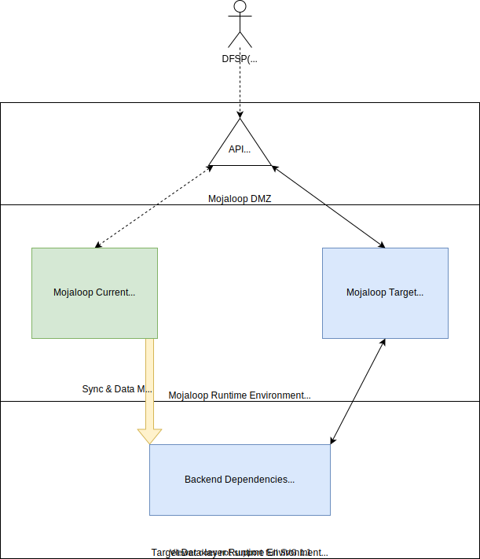

# Upgrade Strategy Guide

This document provides instructions on how to upgrade existing Mojaloop installations. It assumes that Mojaloop is currently installed using Helm, but these strategies can be applied in general.

## Table of Contents

- [Upgrade Strategy Guide](#upgrade-strategy-guide)
  - [Table of Contents](#table-of-contents)
  - [Helm Upgrades](#helm-upgrades)
    - [Non-breaking Releases](#non-breaking-releases)
    - [Breaking Releases](#breaking-releases)
      - [Mojaloop installed without backend dependencies](#mojaloop-installed-without-backend-dependencies)
        - [1. Target version has no datastore breaking changes](#1-target-version-has-no-datastore-breaking-changes)
          - [Example Canary style deployment](#example-canary-style-deployment)
        - [2. Target version has datastore breaking changes](#2-target-version-has-datastore-breaking-changes)
      - [Mojaloop installed with backend dependencies](#mojaloop-installed-with-backend-dependencies)
        - [Example Blue-green style deployment](#example-blue-green-style-deployment)

## Helm Upgrades

This section discusses the strategies of how upgrades could be applied to an existing Mojaloop Helm deployment that uses the [Mojaloop Helm Charts](https://github.com/mojaloop/helm).

The scope of the breaking changes described below are applicable to the Switch Operator's Helm deployment with no direct impact (i.e. no functional changes such as a new Mojaloop API Specification version) to Participants (e.g. Financial Services Providers). Such functional changes may be part of a Helm release, but are out of scope for this section.

Recommendations:

1. All upgrades should be tested and verified in a pre-production (Test or QA) environment
2. Always consult the release notes as there may be some known issues, or useful notes that are applicable when upgrading
3. the [migrate:list command](https://knexjs.org/#Migrations) can be used to list pending datastore changes in the following repositories:
    - <https://github.com/mojaloop/central-ledger>
    - <https://github.com/mojaloop/account-lookup-service>

### Non-breaking Releases

Non-breaking changes will require no additional or special actions (unless otherwise stated in the release notes) to be taken other than running a standard [Helm upgrade](https://helm.sh/docs/helm/helm_upgrade) command.

Be aware of the following optional parameter flag(s) that will be useful when upgrading:

```
   -i, --install                      if a release by this name doesn't already exist, run an install
   --reuse-values                 when upgrading, reuse the last release's values and merge in any overrides from the command line via --set and -f. If '--reset-values' is specified, this is ignored
   --version string               specify a version constraint for the chart version to use. This constraint can be a specific tag (e.g. 1.1.1) or it may reference a valid range (e.g. ^2.0.0). If this is not specified, the latest version is used
```

See the following example of how these parameters can be applied:

```bash
helm --namespace ${NAMESPACE} ${RELEASE_NAME} upgrade --install mojaloop/mojaloop --reuse-values --version ${RELEASE_VERSION}
```

It is possible to rollback using the [Helm rollback](https://helm.sh/docs/helm/helm_rollback/) command if desired.

### Breaking Releases

There are several strategies that can be employed when upgrading between breaking releases depending on the following deployment topologies:

1. Mojaloop installed without backend dependencies (e.g. Kafka, MySQL, MongoDB, etc), with backend dependencies managed separately. This is preferred and will provide the most flexibility in upgrading, especially when there are breaking changes

2. Mojaloop installed with backend dependencies, with backend dependencies tightly coupled to the Helm installation

#### Mojaloop installed without backend dependencies

This is the preferred deployment topology as it will provide the most flexibility when upgrading. By separating out the backend dependencies, it will enable one to deploy the target version of Mojaloop as a new deployment.

This new deployment can either point to the existing backend dependencies or will require new backend dependencies depending on the following:

##### 1. Target version has no datastore breaking changes

In this scenario, we can utilise a Canary style deployment strategy by configuring the new deployment to the existing backend dependencies. The new deployment will by default upgrade the datastore schemas as required by running the `migration` (see [Central-ledger](https://github.com/mojaloop/central-ledger/tree/master/migrations), [Account-lookup-service](https://github.com/mojaloop/account-lookup-service/tree/master/migrations)) scripts. Alternatively, the migration scripts can be disabled (e.g. [central-ledger](https://github.com/mojaloop/helm/blob/master/mojaloop/values.yaml#L147), with Account-lookup-service similarly being configured) if required, and a manual upgrade SQL script can be prepared (see [migrate:list command](https://knexjs.org/#Migrations) to list pending changes) if preferred.

There should be no disruption to the current Mojaloop deployment.

As the backend dependencies are shared between the current and target deployments, it will also be possible to move a sub-set of users to the target Mojaloop deployment allowing for one to validate the new deployment with minimal impact, and also provide the ability for users to easily switch back to the current deployment.

###### Example Canary style deployment


1. Customize the [Mojaloop Chart values.yaml](https://github.com/mojaloop/helm/blob/master/mojaloop/values.yaml) for the desired target Mojaloop release:
   1. Ensure backend-end configurations are set to the existing (shared) deployed Backend dependencies
   2. If applicable, ensure ingress-rules do not overwrite the current deployment configuration
2. Deploy the target Mojaloop release (Blue)
   1. Monitor the migration script logs for any upgrade errors via the `run-migration` containers:
      - `kubectl -n ${NAMESPACE} logs -l app.kubernetes.io/name=centralledger-service -c run-migration`
      - `kubectl -n ${NAMESPACE} logs -l app.kubernetes.io/name=account-lookup-service-admin -c run-migration`
3. Execute sanity tests on the Current Green deployment environment (verify impact of datastore changes, and allow for rollback, or partial switch-over for DFSPs, etc)
4. Execute sanity tests on the Target Blue deployment environment
5. Cut-over API Gateway (or upgrade target Ingress rules) to from Current Green to Target Blue deployment environment

##### 2. Target version has datastore breaking changes

See [Mojaloop installed with backend dependencies](#mojaloop-installed-with-backend-dependencies).

#### Mojaloop installed with backend dependencies

In this scenario, we can utilise a Blue-green style deployment strategy by deploying new backend dependencies, and deploying the target Mojaloop release separately (with the additional benefit of aligning your deployment to the recommending deployment topology).

Manual data migrating from the existing datastores to the new target backend dependencies will be required. It will also be necessary to keep the current and new datastores in sync as long as live transactions are being processed through the existing Mojaloop deployment. A maintenance window need to be scheduled to stop "live" transaction on the current deployment to ensure data consistency, and allow for the switch-over to occur safely. This will cause a disruption, but can be somewhat mitigated by ensuring that the maintenance window is scheduled during the least busiest time.

##### Example Blue-green style deployment



1. Customize the [Mojaloop Chart values.yaml](https://github.com/mojaloop/helm/blob/master/mojaloop/values.yaml) for the desired target Mojaloop release:
   1. Ensure backend-end configurations are set to the target deployed Backend dependencies
   2. If applicable, ensure ingress-rules do not overwrite the current deployment configuration
2. Deploy the target Mojaloop release (Blue)
3. Create Migration process to sync and transform data into target deployed Backend datastore dependencies from Green to Blue
4. Schedule cut-over window
5. Execute cut-over during window
   1. Set current Green Backend datastore dependencies to read-only (where possible)
   2. Drain any remaining connections from Green
   3. Ensure Migration process is fully in-sync from Green to Blue
   4. Execute sanity tests on the Blue Target deployment environment
   5. Cut-over API Gateway (or upgrade target Ingress rules) to from Green Current to Blue Target deployment environment
