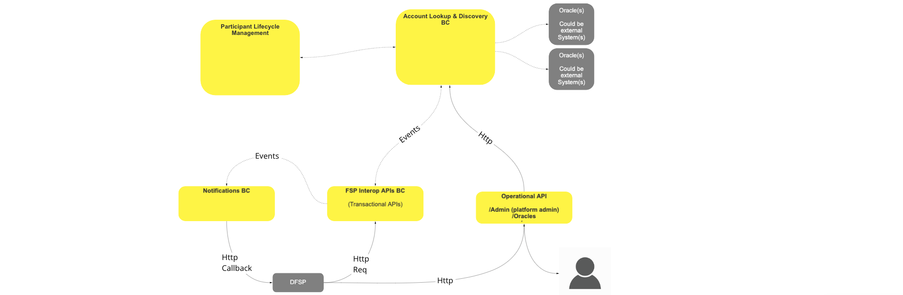
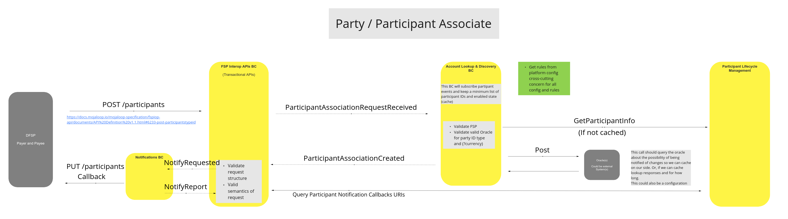
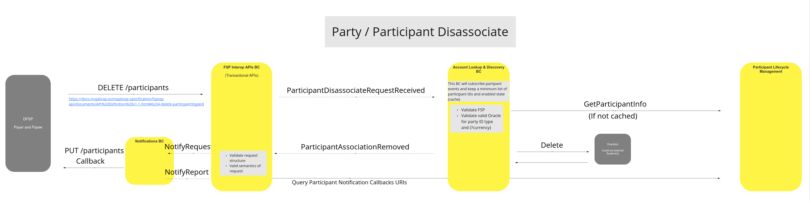
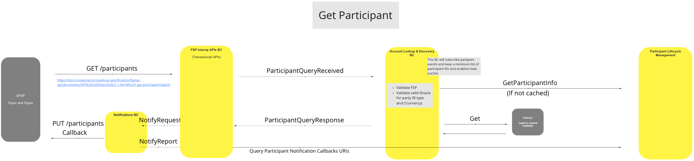
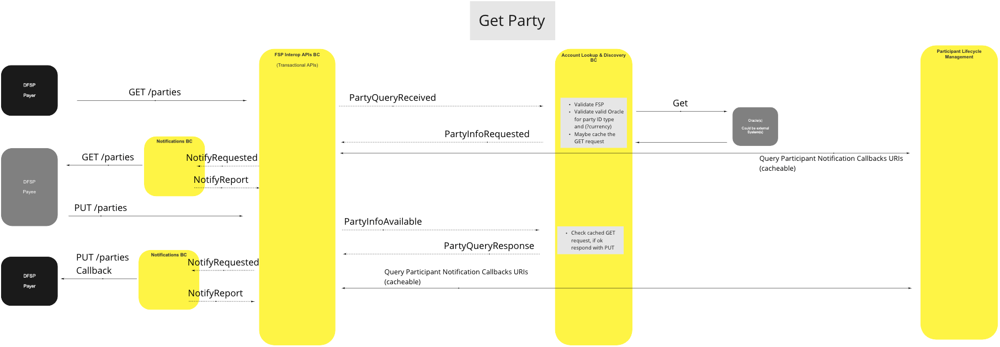

# Account Lookup And Discovery BC

The Accounts Lookup and Discovery BC is responsible for locating and associating participants and parties with party or participant triggered transactions.

## Terms

The following terms are used in this BC, also known as a domain.

| Term | Description |
|---|---|
| **Participant** | Financial Services Provider |
| **Party** | FSP Customer |

## Functional Overview

>BC Functional Diagram: Account Lookup and Discovery Overview

## Use Cases

#### Party/Participant Associate

#### Description

Where a Participant DFSP requests a given Party ID to be associated with a Participant (itself).

***Note:*** *Checks and validations of the KYC (Know You Customer) details are not covered here and are left to processes outside of the Mojaloop API calls and should be covered by the Scheme, to ensure that association (or disassociation) requests are valid.*

#### Flow Diagram

>UC Flow Diagram: Party/Participant Associate

### Party/Participant Disassociate

#### Description

Where a Participant DFSP requests an existing association between a given Party ID and a Participant (itself) to be removed.

#### Flow Diagram

>UC Workflow Diagram: Party/Participant Disassociate

### Get Participant

#### Description

Where a Participant DFSP requests Participant association information based on a Party identifier, this UC is used by the switch to validate the request and provide the requested association data to the requesting DFSP.

#### Flow Diagram

>UC Flow Diagram: Get Participant

### Get Party

#### Description

Where a participant DFSP queries another participant DFSP for the details of a Party which the second DFSP holds, this UC is used to validate the request and provide the requested Party data to the requesting DFSP.

#### Flow Diagram

>UC Flow Diagram: Get Party

<!--## Notes -->
<!-- Footnotes themselves at the bottom. -->

[^1]: Common Interfaces: [Mojaloop Common Interface List](../../commonInterfaces.md)
