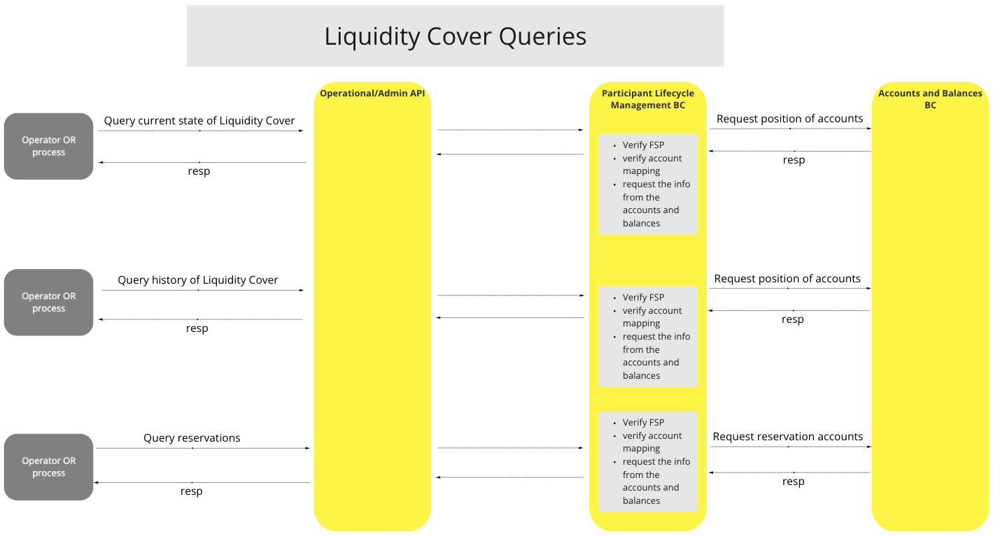

# Accounts and Balances BC

The Accounts and Balances BC acts as the "central ledger" for the system. It interacts primarily with the Settlements BC, Participants Lifecycle BC and Transfers BCs, and is a directed sub-system, which means that it is a dependency of the BCs that use it as a "financial system of record" for the financial accounting.

**Note:**

The Accounts and Balances BC contains a limited amount of logic to ensure that **(a)** the correct relationships are created and maintained between entities when an external BC creates, updates, queries or closes accounts and **(b)** the correct account limits are enforced (i.e. set and not exceeded) when an external BC attempts to create journal entries and **\(c\)** avoids duplicate ledger entries by using *Universal Unique Identifiers (UUID)* for unique journal entry identifiers.

## Terms

Terms with specific and commonly accepted meaning within the Bounded Context in which they are used.

| Term              | Description                                                                                                                                           |
|-------------------|-------------------------------------------------------------------------------------------------------------------------------------------------------|
| **Account**       | Refers to a General Ledger account, a record in an accounting system that records the debit or credit entries that represent a financial transaction. |
| **Journal Entry** | Credit/Debit financial records against Account.                                                                                                       | 
| **Balance**       | The amount available in an account, when the debits and credits have been factored in.                                                                |

## Functional Overview - Accounts and Balances

>BC Functional Diagram: Accounts & Balances Overview

## Use Cases

### Create Account

#### Description

The workflow provided by this UC enables the Switch to create new participant/transfer/settlement accounts in the System Ledger.  (Participant Account creation occurs from both the Participant Lifecycle Management and the Settlement BCs.  Examples of both have been provided in the Flow Diagrams below).

Further, the workflow provides for specification of credit/debit Journal Entry limits, and to ensure that the Account is unique in the System Ledger.

#### Flow Diagram

Account creation from [Participant Lifecycle Management BC](../participantLifecycleManagement/index.md)

<!-- Warning Note to Developers & Editors!!: The following two images are being rendered from the Participant Lifecycle BC. -->

>UC Workflow Diagram: Add Participant Accounts

Account creation from [Settlements BC](../settlements/index.md)

>UC Workflow Diagram: Bootstrap (Startup) Settlement Model via Configuration

### Close Account

#### Description

Close a participant account in the System Ledger and prevent new journal entries from impacting it.  (Still to be determined: Drain collateral CR balances to another account automatically?)

### Query Account

#### Description

Query the status and balance for participant account.

#### Flow Diagram

Query liquidity CR/DR limits from [Participant Lifecycle Management BC](../participantLifecycleManagement/index.md)

<!-- Warning Note to Developers & Editors!!: The following two images are being rendered from the Participant Lifecycle BC. -->

>UC Workflow Diagram: Liquidity Cover Queries

### Query Journal Entries

#### Description

Query Journal debit/credit Entries for an Account.

### Insert Journal Entry

#### Description

Insert a participant journal entry into the System Ledger specifying the debit and credit accounts (There are three ways through which participant journal entries can be made.  See the Flow Diagrams below for a description of each.)
Respond with the updated account balance.

#### Flow Diagram

Journal Entry insertion from [Transfers BC](../transfers/index.md)

>UC Workflow Diagram: Perform Transfer (Universal Mode)

Journal Entry insertion from [Settlements BC](../settlements/index.md) using `Deferred Net Settlement` (DNS) model

>UC Workflow Diagram: Deferred Net Settlement - 19/10/2021

Journal Entry insertion from [Settlements BC](../settlements/index.md) using `Immediate Gross Settlement` (IGS) model

>UC Workflow Diagram: Immediate Gross Settlement

## Canonical Model

- Account
  - accountId
  - ledgerAccountType
  - ledgerAccountState
  - debitLimit
  - creditLimit
  - debitBalance
  - creditBalance
- Journal Entry
  - journalEntryId
  - debitAccountId
  - creditAccountId
  - journalEntryType
  - transferAmount
  - transferTimestamp

<!-- Footnotes themselves at the bottom. -->
<!-- ## Notes -->

[^1]: Common Interfaces: [Mojaloop Common Interface List](../../commonInterfaces.md)
