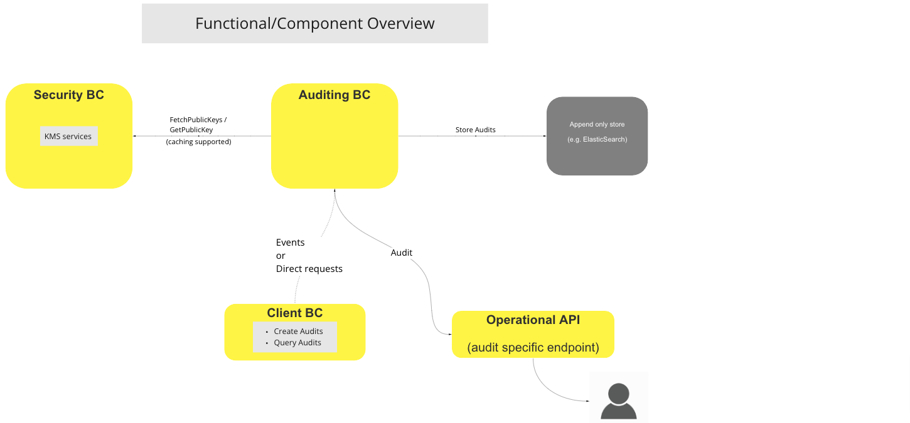
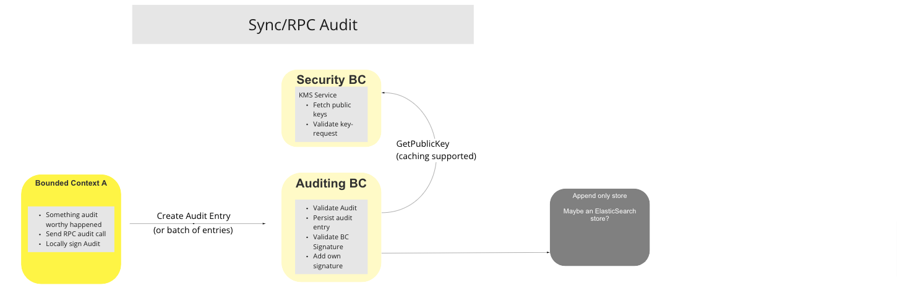
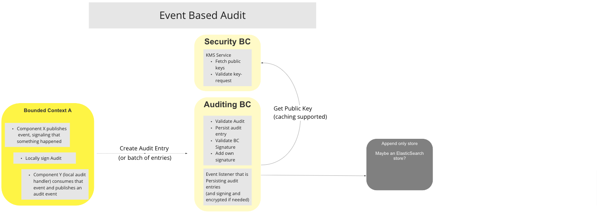

# Auditing BC

The Auditing BC is responsible for maintaining an immutable record of all of the transactions that take place on the Switch.  The Architecture comprises of five main components:

* Central Forensic Logging Service
* Services
* Immutable Datastore
* Key Management System
* Cryptographic[^1] Provider Modular

Authorized users are able to interrogate the Auditing BC via an Operation API exposed for this purpose for details of audit-worthy events.

## Terms

Terms with specific and commonly accepted meaning within the Bounded Context in which they are used.

| Term | Description |
|---|---|
| **KMS** | Key Management System - Provides encryption/decription and Certificate Authority services to the Switch environment (issue, sign, and verification via the Security BC)  |
| **CPM** | Crypto Provider Module - Manages the cryptographic techniques and methodologies employed by the Switch to provide end-to-end encryption and decryption services for any stored or transmitted data. |

## Functional Overview

> BC Functional Diagram: Auditing Systen Functional Overview

## Use Cases

### Auditing BC Startup

#### Description

The Auditing BC Startup UC is triggered during startup (intervals or events) and fetches all of the Public Keys in use by the various Switch Participant BCs from the Security BC that provide KMS services for all of the participant BCs of the Switch.

#### Flow Diagram

> UC Workflow Diagram: Auditing BC Startup

### Sync/RPC Audit

#### Description

The Sync/RPC Audit UC is activated for audit-worthy events triggered during a transaction noted by a participating BC.  The participating BC proceeds to notify the Audit BC via a synchronous RPC audit call.  The Audit entry is locally signed by the notifying BC.  Upon receipt, the Audit BC runs through a number of procedures that include running though a KMS procedure with the Security BC, and persisting the record to an Append-only Store.

#### Flow Diagram

>UC Workflow Diagram: Sync/RPC Audit

### Event Based Audit

#### Description

The Event Based Audit UC is triggered when a participating BC includes local auditing capability, notes an audit-worthy event, and creates a locally signed audit event, which it publishes, and then pushes either a single Event or an Event-batch to the Auditing BC.  The Event is validated during a procedure with the Security BC, and persisted to the Append-Only Store.

#### Flow Diagram

> UC Workflow Diagram: Event Based Audit

<!-- Footnotes themselves at the bottom. -->
## Notes

[^1]: Cryptographic refers to algorithmic techniques and methodologies that are employed by systems to prevent unauthorised systems or persons from accessing, identifying, or using stored data. For further reading please refer to the accompanying Wikipedia article: [Cryptography, From Wikipedia, the free encyclopedia](https://en.wikipedia.org/wiki/Cryptography)

[^2]: Common Interfaces: [Mojaloop Common Interface List](../../refarch/commonInterfaces.md)
