# FSP Interoperability API BC

The FSP Interoperability API Bounded Context provides access to the internal operations and resources that the Mojaloop Ecosystem provides to a given Participant. This Bounded Context is responsible for providing a Participant with interfaces whit which the Participant can perform and execute tasks on Mojaloop. It is also responsible for providing communication back to the Participant regarding different notifications and system messages that a participant should expect to receive.

## Functional Overview

The FSP IOP API interacts with many different bounded contexts and thus the simplified view is provided here, for further reading on the events and connections that the FSP IOP API provides and consumes please review the Mojaloop Common Interfaces [^1]. The bounded contexts that are integrated with the FSP IOP API are:

-   Account Lookup & Discovery Bounded Context [^14]
-   Notifications and Alerts Bounded Context [^27]
-   Participant Lifecycle Management Bounded Context [^26]
-   Quoting\Agreement Bounded Context [^19]
-   Transfers Bounded Context [^22]
-   Settlement Bounded Context [^21]

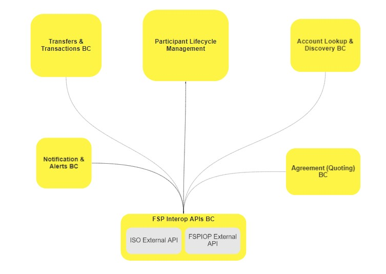

> FSP Interoperability API Functional Overview

## Terms

Terms with specific and commonly accepted meaning within the Bounded Context in which they are used.

| Term        | Description                                                                                                                                                      |
| ----------- | ---------------------------------------------------------------------------------------------------------------------------------------------------------------- |
| **(D)FSP**      | (Digital) Financial Service Provider                                                                                                                             |
| **Participant** | Financial Service Provider (FSP) that has registered on the Mojaloop ecosystem. Allowing said FSP to be able to transact with other Participants                 |
| **FSP IOP API** | Financial Service Provider Interoperability Application Programming Interface, the API that provides access to functions and features of the Mojaloop Ecosystem. |
| **Payer**       | The payer of electronic funds in a payment transaction.                                                                                                          |
| **Payer FSP**   | Payer's Financial Service Provider.                                                                                                                              |
| **Payee**       | The recipient of electronic funds in a payment transaction.                                                                                                      |
| **Payee FSP**   | Payee's Financial Service Provider.                                                                                                                              |

## Use Cases

### Note

Use case definitions stipulated in the Open API for FSP Interoperability Specification [^2] have not been altered, and thus the Reference Architecture has been designed to only change the background orchestration of the internal Mojaloop services and Bounded Contexts.

### Notifications BC - Send Notification

#### Description

Notifications pertain to ALL below use cases as a response to requests received in various forms. While the FSP IOP API is busy processing a request received, it might need to sends a request to the requesting DFSP or any other relevant DFSPs. The FSP IOP API will then query the Participant Lifecycle Management Bounded Context [^26] for the Callback URIs for the given participant that the notification needs to be sent to. The FSP IOP API will then send the notification request to the Notification and Alerts Bounded Context [^27].

#### Flow Chart

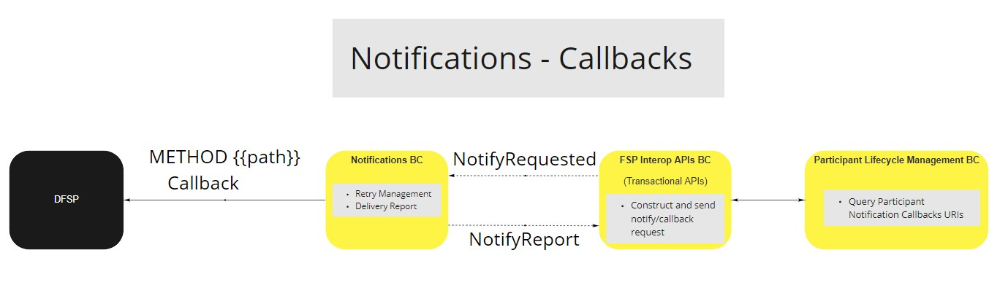

>

## Account Lookup & Discovery BCs

### Party/Participant Associate

#### Description

Associate transfer/s Participant/s and/or parties based on the POST Participant request [^5] (POST /participants/{Type}/{ID}). The FSP IOP API then sends a request to the Account Lookup & Discovery BC [^14] which will process the request and respond with a success event. The FSP IOP API then sends a notification PUT Participant response [^15] (PUT /participants/{Type}/{ID}).

#### Flow Diagram

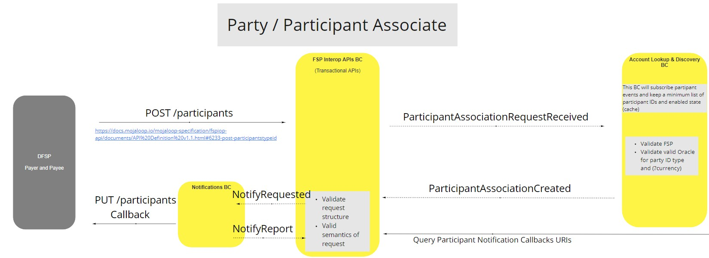

>

### Party/Participant Disassociate

#### Description

Disassociate Participant/s and/or parties based on the DELETE Participant request [^6] (DELETE /participants/{Type}/{ID}). The FSP IOP API sends the request to the Account Lookup & Discovery BC [^14] to disassociate the party. The success response is then received by the FSP IOP API and then responds to the caller by sending a notification PUT Participant response [^15] (PUT /participants/{Type}/{ID}).

#### Flow Diagram

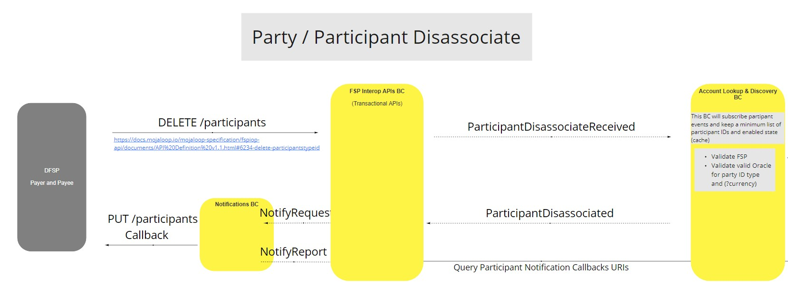

>

### Get Participant

#### Description

Retrieve participant information based on the GET Participant request [^7] (GET /participants/{Type}/{ID}) , which supplies the ID and structure. The FSP IOP API sends the request to the Account Lookup & Discovery BC [^14] to determine whether the desired participant exists. The FSP IOP API then responds to the requestor with a PUT Participant response [^15] (PUT /participants/{Type}/{ID}).

#### Flow Diagram

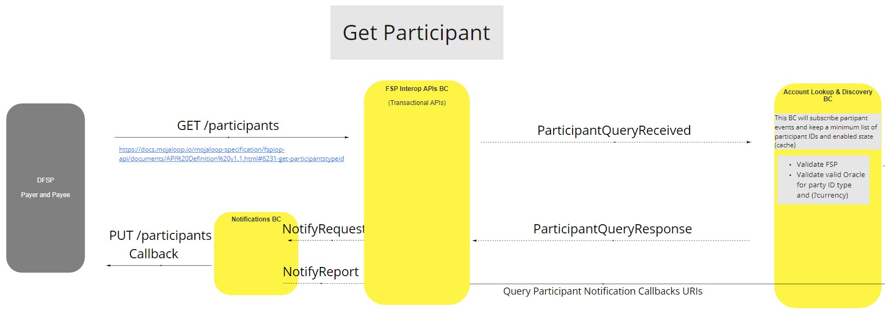

>

### Get Party

#### Description

Retrieve party information based on the ID passed with the GET Party request [^8] (GET /parties/{Type}/{ID}). The FSP IOP API then sends a request to the Account Lookup & Discovery BC [^14] to determine the target FSP to forward the GET request to. The target FSP then responds with a PUT parties request. The information is then sent to the Account Lookup & Discovery BC to be cached before the PUT Party response [^17] (PUT /parties/{Type}/{ID}) is sent to the original sender of the GET request.

#### Flow Diagram

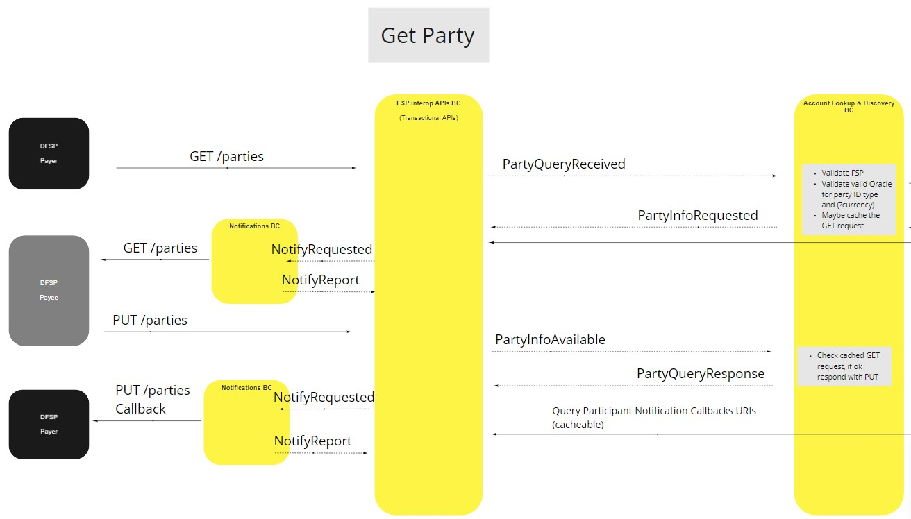

>

## Agreement (Quoting) BC

### Calculate Quote - Happy Path

#### Description

When a quote is sent using the POST Quote request [^3] (POST /quotes), the FSP IOP API will sends the request to the Quoting/Agreement BC [^19] to validate the quote. The FSP IOP API will then send the POST Quote to the Payee FSP, which in turn responds with a PUT Quote response [^18] (PUT /quotes/{ID}) and updated relevant information. The FSP IOP API sends the accepted quote to the The Quoting/Agreement BC [^19] to persist the quote information. The FSP IOP API will then forwards the PUT quote request to the Payer FSP and consider the quote successful.

#### Flow Diagram

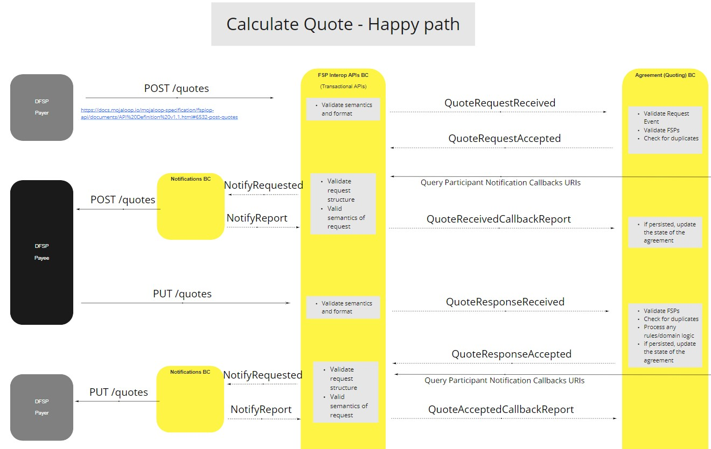

>

### Get Quote - Happy Path

#### Description

This allows a FSP to get quote information of an existing quote. The GET Quote request [^4] (GET /quotes/{ID}) is sent to the FSP IOP API that queries the Quoting/Agreement BC [^19] for existing quotes. When the quote is retrieved the information is send back to the requesting FSP by sending the PUT Quote response [^18] (PUT /quotes/{ID}).

#### Flow Diagram

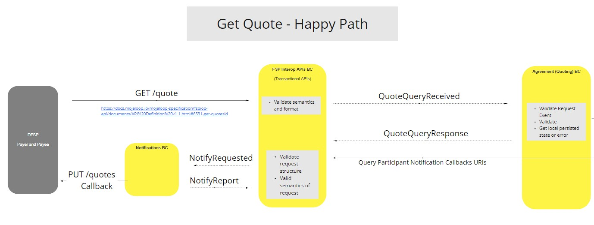

>

### Calculate Quote - Invalid Quote Request

#### Description

When a POST Quote request [^3] (POST /quotes) is , the FSP IOP API sends the request to the Quoting/Agreement BC [^19] for processing. The quote then fails validation the Quoting/Agreement BC [^19] responds with an error response that the FSP IOP API notifies the requesting FSP through the use of the PUT Quote Error response [^20] (PUT /quotes/{ID}/error).

#### Flow Diagram

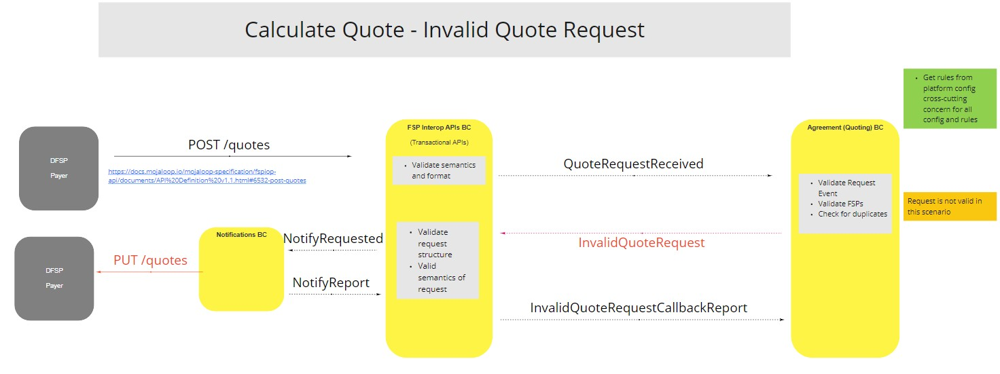

>

### Calculate Quote - Invalid FSPs

#### Description

When a POST Quote request [^3] (POST /quotes) is sent but the FSP IOP API sends the request to the Quoting/Agreement BC [^19] for processing and it cannot determine that both participants are valid FSPs then an error response is then sent to the FSP IOP API. The FSP IOP API then notifies the requesting FSP through the use of the PUT Quote Error response [^20] (PUT /quotes/{ID}/error).

#### Flow Diagram

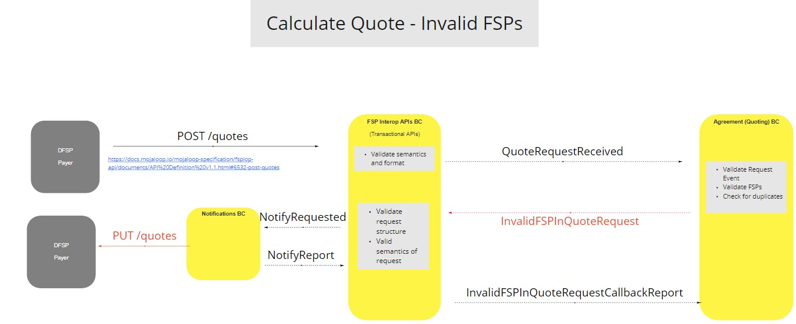

>

### Calculate Quote - Invalid Scheme Rules detected in Request

#### Description

When the Payer FSP sends a POST Quote request [^3] (POST /quotes) the FSP IOP API sends the request to the Quoting/Agreement BC [^19] for processing and the quote does not adhere to the scheme rules defined then an error response is then sent to the FSP IOP API. The FSP IOP API then notifies the Payer FSP through the use of the PUT Quote Error response [^20] (PUT /quotes/{ID}/error)

#### Flow Diagram

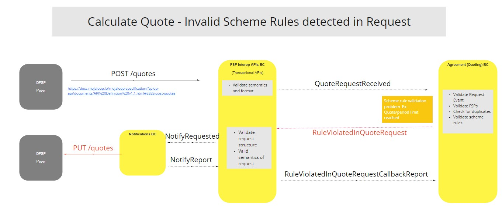

>

### Calculate Quote - Invalid Scheme Rules detected in Response

#### Description

When the Payer FSP sends a POST Quote request [^3] (POST /quotes) the FSP IOP API sends the request to the Quoting/Agreement BC [^19] for processing and it succeeds initial processing. The FSP IOP API sends the request POST quote request to the Payee FSP. The Payee FSP should react with a accepted quote by sending PUT Quote request [^18] (PUT /quotes/{ID}). The response is sent to Quoting/Agreement BC [^19] for further processing and validation. When the Bounded Context detects that the quote does not adhere to the scheme rules defined then an error response is then sent to the FSP IOP API. The FSP IOP API then notifies both the Payer FSP and the Payee FSP through the use of the PUT Quote Error response [^20] (PUT /quotes/{ID}/error).

#### Flow Diagram 

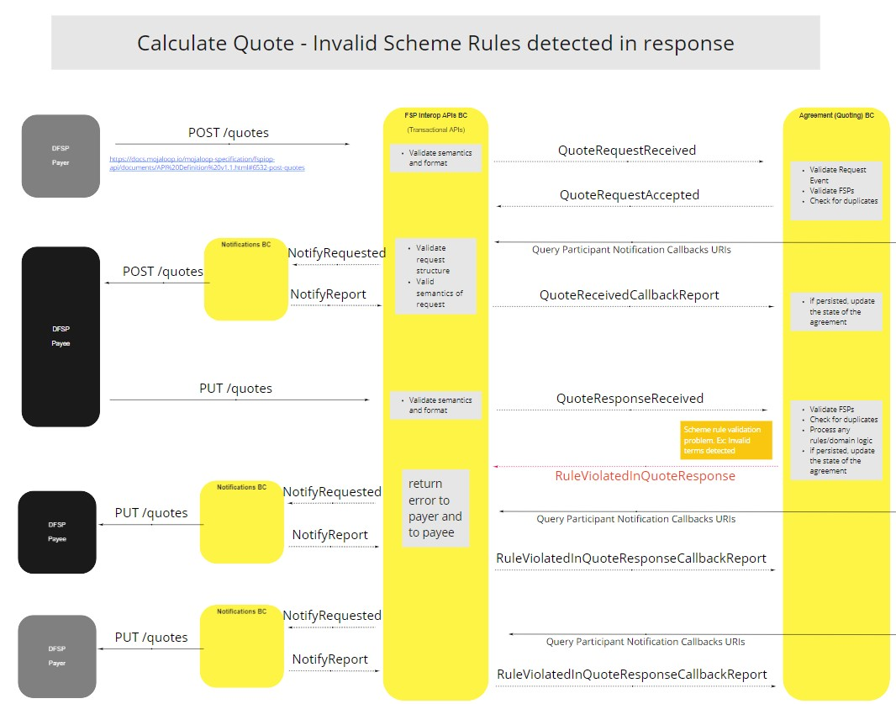

> Agreement BC - Calculate Quote - Invalid Scheme Rules detected in Response

## Transfers BC

### Perform Transfer (Universal Mode)

#### Description

The Payer FSP sends a POST Transfers request [^9] (POST /transfers) to the FSP IOP API. The FSP IOP API then sends an event to the Settlements Bounded Context [^21]. The FSP IOP API waits for an event from the Transfers Bounded Context [^22], to indicate that the transfer has been prepared, to send a POST request to the Payee FSP. The Payee FSP then responds with a PUT Transfers request [^23] (PUT /transfers/{ID}) (transferState = committed) to the FSP IOP API which in turn commits the transfer fulfillment. The PUT transfer is then send to the Payer FSP.

#### Flow Diagram

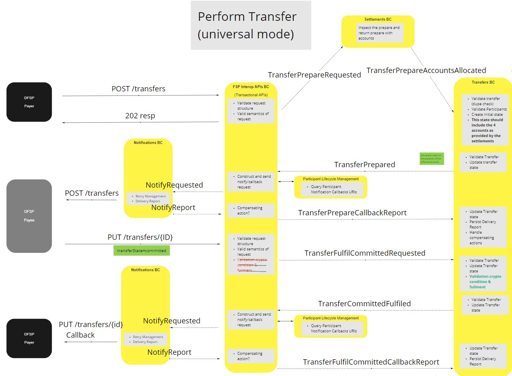

>

### Perform Transfer with Payee Confirmation

#### Description

The Payer FSP sends a POST Transfers request [^9] (POST /transfers) to the FSP IOP API. The FSP IOP API then sends an event to the Settlements Bounded Context [^21]. The FSP IOP API waits for an event from the Transfers Bounded Context [^22], to indicate that the transfer has been prepared, to send a POST request to the Payee FSP. The Payee FSP then responds with a PUT Transfers request [^23] (PUT /transfers/{ID}) (transferState = reserved) to the FSP IOP API which in turn reservers the transfer fulfillment. The PUT transfer is then send to the Payer FSP. The Payee FSP then receives a PATCH Transfers request [^24] (PATCH /transfers/{ID}) to notify the state change of the transfer.

#### Flow Diagram

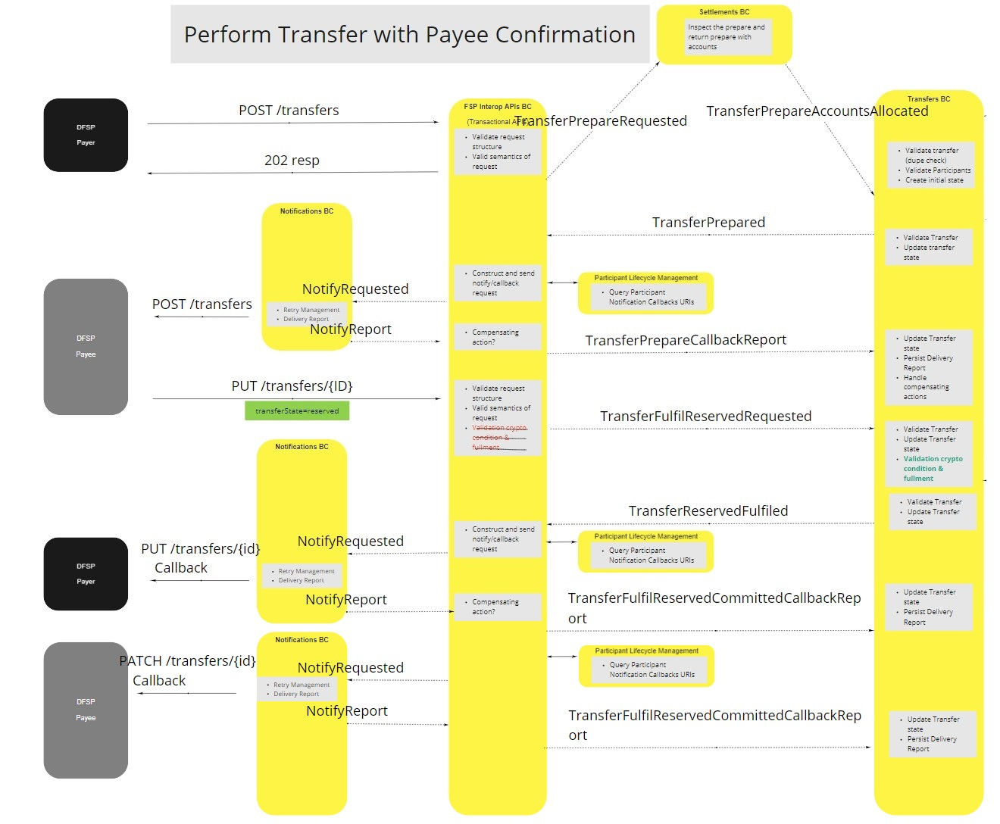

>

### Query Get Transfer

#### Description

Gets the transfer info based on the transfer ID used in GET Transfer request [^11] (GET /transfers/{ID}) and receives a PUT Transfers request [^23] (PUT /transfers/{ID}) to get the relevant information about the transfer.

#### Flow Diagram

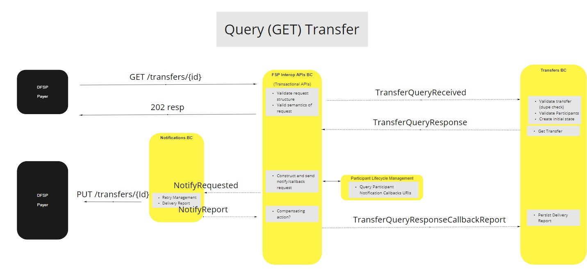

>

### Perform Transfer - Duplicate Post (Resend)

#### Description

POST Transfers request [^9] (POST /transfers) has already been processed and a status report is returned to the Payer FSP by receiving a PUT Transfers request [^23] (PUT /transfers/{ID}).

#### Flow Diagram

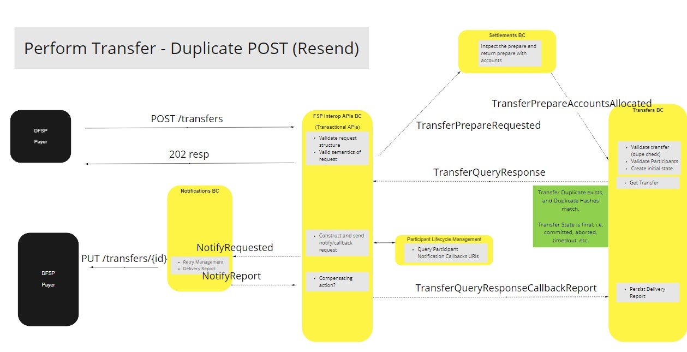

> Transfers BC - Perform Transfer - Duplicate Post (Resend)

### Perform Transfer - Duplicate Post (Ignore)

#### Description

POST Transfers request [^9] (POST /transfers) has already been processed but no response is needed or requested.

#### Flow Diagram

>

### Perform Transfer - Payee DFSP Rejects Transfer

#### Description

The Payer FSP sends a POST Transfers request [^9] (POST /transfers) to the FSP IOP API. The Api then prepares the transfer and then sends the POST request through to the Payee FSP. The Payee FSP then declines the transfer by sending a PUT Transfer error request [^25] (PUT /transfers/{ID}/error) to the FSP IOP API. The FSP IOP API then notifies the Transfers Bounded Context [^22] that the transfer has been rejected and sends a PUT Transfer error request [^25] (PUT /transfers/{ID}/error) to the Payer FSP.

#### Flow Diagram

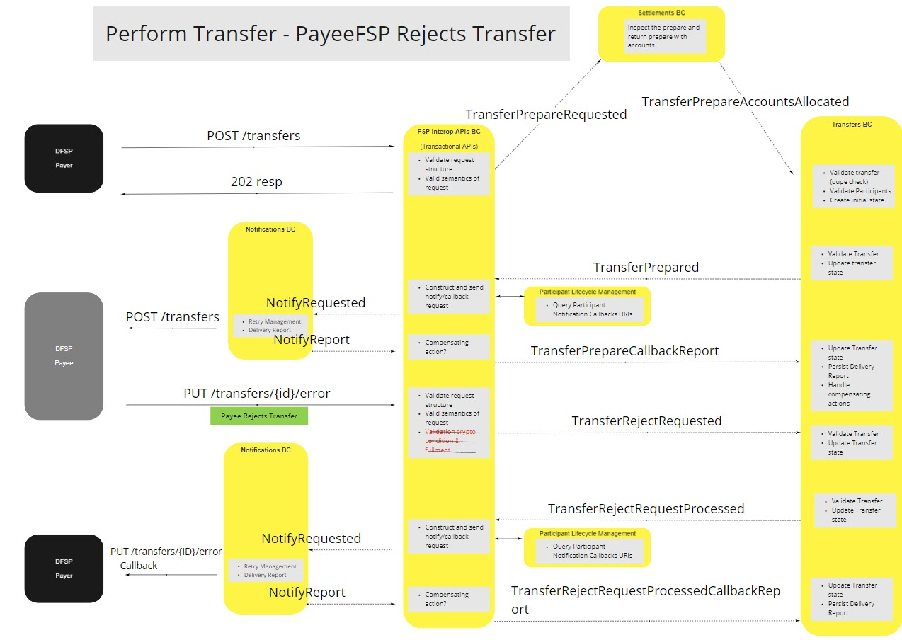

>

### Perform Transfer - Timeout (Prepare)

#### Description

POST Transfers request [^9] (POST /transfers) gets rejected because the transfer timed out [^13] while funds are being prepared. The FSP IOP API sends a PUT Transfer error request [^25] (PUT /transfers/{ID}/error) request to the Payer FSP to notify of the error.

#### Flow Diagram

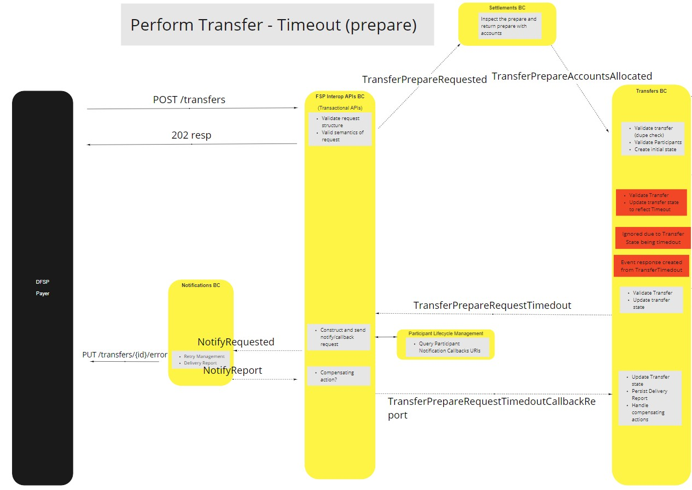

>

### Perform Transfer - Timeout (Pre-Committed)

#### Description

The Payer FSP sends a POST Transfers request [^9] (POST /transfers) to the FSP IOP API. The FSP IOP API then sends an event to the Settlements Bounded Context [^21]. The FSP IOP API waits for an event from the Transfers Bounded Context [^22], to indicate that the transfer has been prepared, to send a POST request to the Payee FSP. The Payee FSP then responds with a PUT Transfers request [^23] (PUT /transfers/{ID}) (transferState = committed) to the FSP IOP API which in turn commits the transfer fulfillment. The transfer times out [^13] while/before the funds are committed and causes the transfer to be rejected. The FSP IOP API then notifies both the Payer and Payee FSPs with a PUT Transfer error request [^25] (PUT /transfers/{ID}/error).

#### Flow Diagram

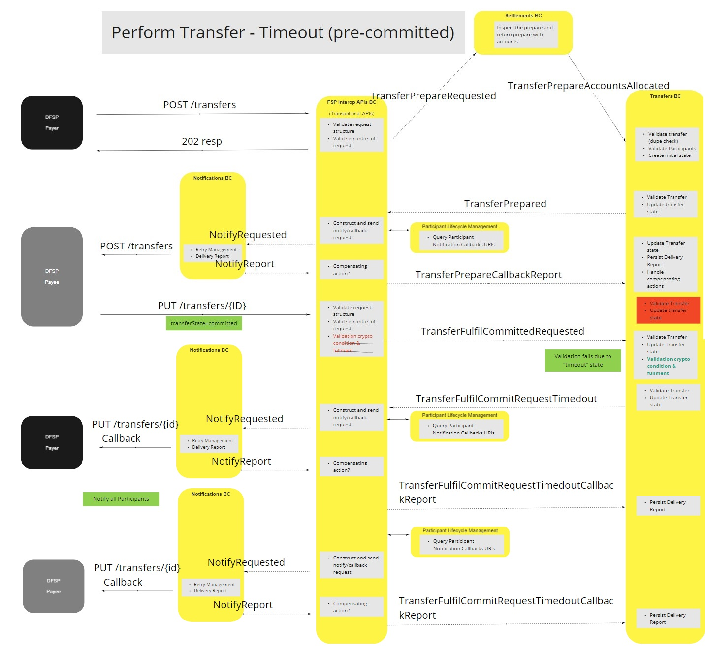

>

### Perform Transfer - Timeout (Post-Committed)

#### Description

The Payer FSP sends a POST Transfers request [^9] (POST /transfers) to the FSP IOP API. The FSP IOP API then sends an event to the Settlements Bounded Context [^21]. The FSP IOP API waits for an event from the Transfers Bounded Context [^22], to indicate that the transfer has been prepared, to send a POST request to the Payee FSP. The Payee FSP then responds with a PUT Transfers request [^23] (PUT /transfers/{ID}) (transferState = committed) to the FSP IOP API which in turn commits the transfer fulfillment. The transfer times out [^13] after the funds are committed and causes the transfer to be rejected.

#### Flow Diagram

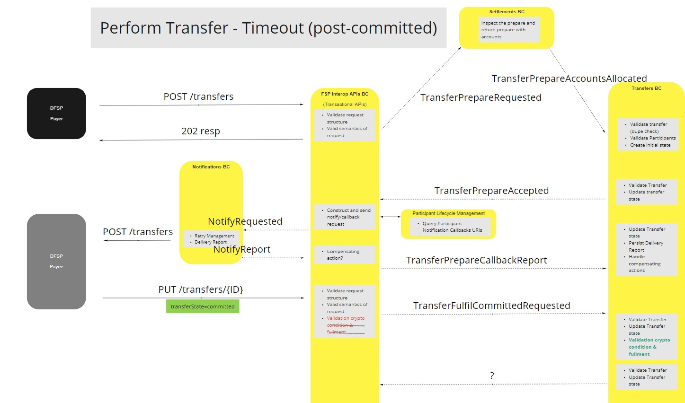

>

### Perform Transfer - Duplicate Post (None Matching)

#### Description

POST Transfers request [^9] (POST /transfers) has already been processed and a status report is returned to the Payer FSP by receiving a PUT Transfer error request [^25] (PUT /transfers/{ID}/error).

#### Flow Diagram

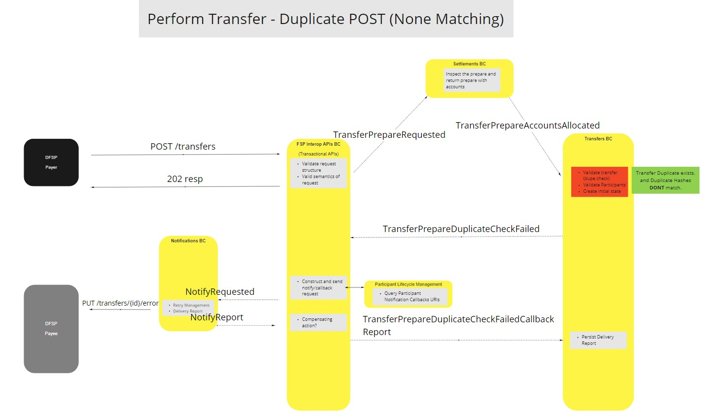

>

### Perform Transfer - Payer FSP Insufficient Liquidity

#### Description

The Payer FSP sends a POST Transfers request [^9] (POST /transfers) to the FSP IOP API. The FSP IOP API then sends an event to the Settlements Bounded Context [^21]. The FSP IOP API waits for an event from the Transfers Bounded Context [^22], to indicate that the transfer has been prepared, but receives a Liquidity check failure for the Payer FSP. The FSP OIP API then sends a PUT [^25] transfers error request to the Payer FSP to notify of the error.

#### Flow Diagram

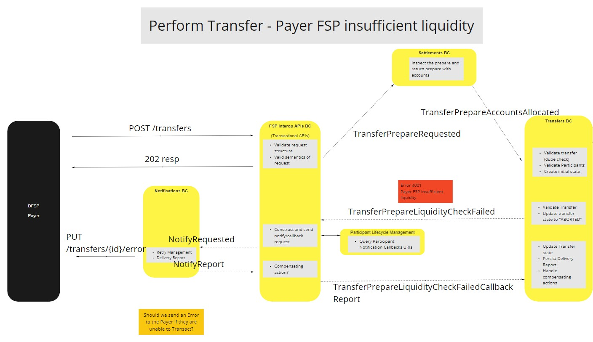

>

### Perform Transfer - Transfer Prepare Rejected

#### Description

The Payer FSP sends a POST Transfers request [^9] (POST /transfers) to the FSP IOP API. The Api then prepares the transfer and then sends the POST request through to the Payee FSP. The Payee FSP then declines the transfer by sending a PUT Transfer error request [^25] (PUT /transfers/{ID}/error) to the FSP IOP API. The FSP IOP API then notifies the Transfers Bounded Context [^22] that the transfer has been rejected and sends a PUT Transfer error request [^25] (PUT /transfers/{ID}/error) to the Payer FSP.

#### Flow Diagram

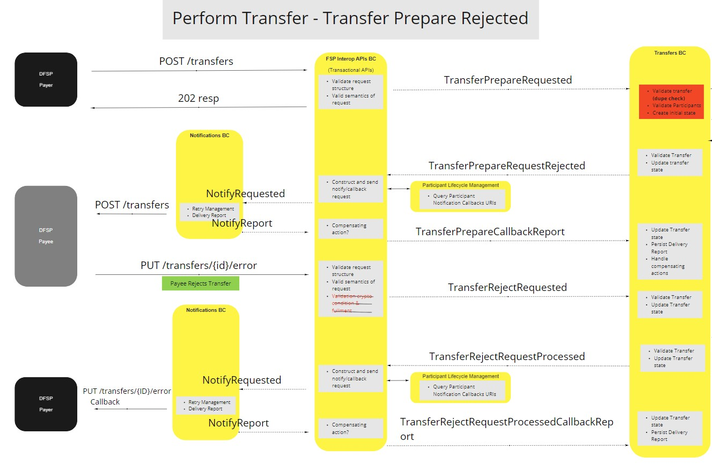

>

### Perform Transfer - Transfer Prepare Validation Failure (Invalid Payer Participant)

#### Description

The Payer FSP sends a POST Transfers request [^9] (POST /transfers) to the FSP IOP API. The Transfers Bounded Context [^22] notifies the FSP IOP API that the Payer FSP is invalid. Depending on the reason for the Payer FSP being invalid the FSP IOP API will send a PUT Transfer error request [^25] (PUT /transfers/{ID}/error) to the Payer FSP.

#### Flow Diagram

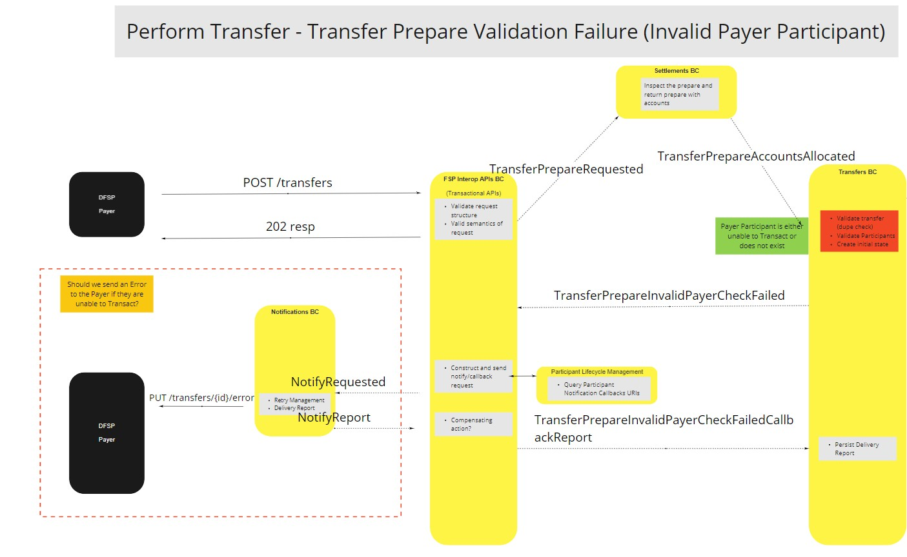

>

### Perform Transfer - Transfer Prepare Validation Failure (Invalid Payee Participant)

#### Description

The Payer FSP sends a POST Transfers request [^9] (POST /transfers) to the FSP IOP API. The Transfers Bounded Context [^22] notifies the FSP IOP API that the Payee FSP is invalid. The FSP IOP API will send a PUT Transfer error request [^25] (PUT /transfers/{ID}/error) to the Payer FSP to notify about the failure.

#### Flow Diagram

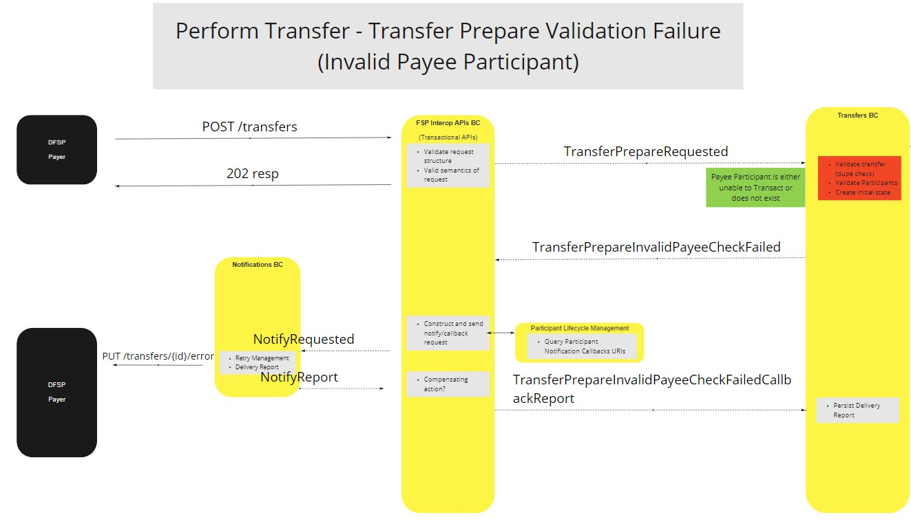

>

## Notes

### Structure validation on internal events

Many use cases stipulate that the request structure and semantics should be validated when receiving a event from an internal Bounded Context. This does not happen on a per request basis but rather is a requirement to be met when the building phase of the Reference Architecture is underway. What we are trying to say by showing that is that internally all events and available resources should be standardized and verified.

[^1]: [Mojaloop Common Interface List](../../commonInterfaces.md)
[^2]: [Open API for FSP Interoperability Specification Documentation](https://docs.mojaloop.io/mojaloop-specification/)
[^3]: [Post Quote - Definition](https://docs.mojaloop.io/mojaloop-specification/fspiop-api/documents/API%20Definition%20v1.1.html#6532-post-quotes)
[^4]: [Get Quote - Definition](https://docs.mojaloop.io/mojaloop-specification/fspiop-api/documents/API%20Definition%20v1.1.html#6531-get-quotesid)
[^5]: [Post Participant - Definition](https://docs.mojaloop.io/mojaloop-specification/fspiop-api/documents/API%20Definition%20v1.1.html#6233-post-participantstypeid)
[^6]: [Delete Participant - Definition](https://docs.mojaloop.io/mojaloop-specification/fspiop-api/documents/API%20Definition%20v1.1.html#6234-delete-participantstypeid)
[^7]: [Get Participant - Definition](https://docs.mojaloop.io/mojaloop-specification/fspiop-api/documents/API%20Definition%20v1.1.html#6231-get-participantstypeid)
[^8]: [Get Parties - Definition](https://docs.mojaloop.io/mojaloop-specification/fspiop-api/documents/API%20Definition%20v1.1.html#6331-get-partiestypeid)
[^9]: [Post Transfers - Definition](https://docs.mojaloop.io/mojaloop-specification/fspiop-api/documents/API%20Definition%20v1.1.html#6732-post-transfers)
[^10]: [Commit Notification - Definition](https://docs.mojaloop.io/mojaloop-specification/fspiop-api/documents/API%20Definition%20v1.1.html#6726-commit-notification)
[^11]: [Get Transfers - Definition](https://docs.mojaloop.io/mojaloop-specification/fspiop-api/documents/API%20Definition%20v1.1.html#6731-get-transfersid)
[^12]: [Transaction Irrevocability - Definition](https://docs.mojaloop.io/mojaloop-specification/fspiop-api/documents/API%20Definition%20v1.1.#6722-transaction-irrevocability)
[^13]: [Transfers Timeout and Expiry - Definition](https://docs.mojaloop.io/mojaloop-specification/fspiop-api/documents/API%20Definition%20v1.1.html#6724-timeout-and-expiry)
[^14]: [Account Lookup and Discovery Bounded Context](../accountLookupAndDiscovery/index.md)
[^15]: [Put Participant - Definition](https://docs.mojaloop.io/mojaloop-specification/fspiop-api/documents/API%20Definition%20v1.1.html#6242-put-participantsid)
[^17]: [Put Party- Definition](https://docs.mojaloop.io/mojaloop-specification/fspiop-api/documents/API%20Definition%20v1.1.html#6341-put-partiestypeid)
[^18]: [Put Quote - Definition](https://docs.mojaloop.io/mojaloop-specification/fspiop-api/documents/API%20Definition%20v1.1.html#6541-put-quotesid)
[^19]: [Quoting\Agreement Bounded Context](../quotingAgreement/index.md)
[^20]: [Put Quote Error - Definition](https://docs.mojmojaloop.io/mojaloop-specification/fspiop-api/documents/API%20Definition%20v1.1.html#6551-put-quotesiderror)
[^21]: [Settlements Bounded Context](../settlements/index.md)
[^22]: [Transfers Bounded Context](../transfers/index.md)
[^23]: [Put Transfers - Definition](https://docs.mojaloop.io/mojaloop-specification/fspiop-api/documents/API%20Definition%20v1.1.html#6741-put-transfersid)
[^24]: [Patch Transfers - Definition](https://docs.mojaloop.io/mojaloop-specification/fspiop-api/documents/API%20Definition%20v1.1.html#6733-patch-transfersid)
[^25]: [Put Transfers Error - Definition](https://docs.mojaloop.io/mojaloop-specification/fspiop-api/documents/API%20Definition%20v1.1.html#6751-put-transfersiderror)
[^26]: [Participant Lifecycle Management Bounded Context](../participantLifecycleManagement/index.md)
[^27]: [Notification and Alerts Bounded Context](../notificationsAndAlerts/index.md)
